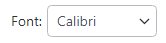

# Combobox

Combobox controls have a drop-down list of items that can be chosen, and can optionally have text entered directly into the control.  A command executes when an item is selected in the drop-down, Enter is pressed, or the text is changed and focus is lost.

> [!NOTE]
> This topic extends the [Control Basics](control-basics.md) topic with additional information specific to the control types described below.  Please refer to the base topic for more generalized concepts that apply to all controls, including this one.

## Control Implementations

There are separate combobox concept control implementations based on the usage context.

### Ribbon and Toolbar Contexts

Use the [BarComboBox](xref:@ActiproUIRoot.Controls.Bars.BarComboBox) control to implement a combobox within a ribbon or toolbar context.

While many other controls in Bars inherit and augment native controls similar to their intended usage, [BarComboBox](xref:@ActiproUIRoot.Controls.Bars.BarComboBox) is different and does not inherit native `ComboBox` in any way.  The reason is that native `ComboBox` is limiting in how it only allows its drop-down items to be displayed in a standard list.  [BarComboBox](xref:@ActiproUIRoot.Controls.Bars.BarComboBox) on the other hand, is a gallery itself and uses an implicitly created menu gallery and optionally other menu items in its drop-down, which allows for advanced UI features and support for live preview.  Being a gallery, [BarComboBox](xref:@ActiproUIRoot.Controls.Bars.BarComboBox) can optionally support preview of gallery items as you type in their text representations.

In summary, a [BarMenuGallery](xref:@ActiproUIRoot.Controls.Bars.BarMenuGallery) works very similarly to a [RibbonGallery](xref:@ActiproUIRoot.Controls.Bars.RibbonGallery) in that both controls inherit [BarMenuGalleryHostBase](xref:@ActiproUIRoot.Controls.Bars.Primitives.BarMenuGalleryHostBase) and can display an implicitly created menu gallery from a drop-down button.  Unlike [RibbonGallery](xref:@ActiproUIRoot.Controls.Bars.RibbonGallery), [BarComboBox](xref:@ActiproUIRoot.Controls.Bars.BarComboBox) does not display any gallery items inline itself and instead shows an optionally editable textbox.  All the [menu gallery features](gallery.md) are fully available on the implicitly created [BarMenuGallery](xref:@ActiproUIRoot.Controls.Bars.BarMenuGallery) hosted in the combobox drop-down.  These features are configured via the numerous [BarComboBox](xref:@ActiproUIRoot.Controls.Bars.BarComboBox) properties with "Menu" in their names.


*A BarComboBox example*

@if (avalonia) {
| Specification | Details |
|-----|-----|
| Base class | [BarMenuGalleryHostBase](xref:@ActiproUIRoot.Controls.Bars.Primitives.BarMenuGalleryHostBase), which indirectly inherits native `Selector`. |
| Has key | Yes, via the [Key](xref:@ActiproUIRoot.Controls.Bars.Primitives.BarGalleryBase.Key) property. |
| Has label | Yes, via the [Label](xref:@ActiproUIRoot.Controls.Bars.Primitives.BarGalleryBase.Label) property.  Auto-generated from the `Key` value if not specified. |
| Has image | Yes, inline via the [InlineIconMemberBinding](xref:@ActiproUIRoot.Controls.Bars.BarComboBox.InlineIconMemberBinding) property or externally via the [SmallIcon](xref:@ActiproUIRoot.Controls.Bars.Primitives.BarGalleryBase.SmallIcon) property. |
| Has popup | Yes, which shows a [BarMenuGallery](xref:@ActiproUIRoot.Controls.Bars.BarMenuGallery) with the same items, and optionally additional menu items. |
| Is checkable | No. |
| Variant sizes | None. |
| Command support | Yes, via the [Command](xref:@ActiproUIRoot.Controls.Bars.Primitives.BarGalleryBase.Command) and [UnmatchedTextCommand](xref:@ActiproUIRoot.Controls.Bars.BarComboBox.UnmatchedTextCommand) properties. |
| Key tip support | Yes, via the [KeyTipText](xref:@ActiproUIRoot.Controls.Bars.BarComboBox.KeyTipText) property.  Auto-generated from the `Label` value if not specified. |
| [Ribbon QAT](../ribbon-features/quick-access-toolbar.md) support | Yes, via the [CanCloneToRibbonQuickAccessToolBar](xref:@ActiproUIRoot.Controls.Bars.Primitives.BarGalleryBase.CanCloneToRibbonQuickAccessToolBar) property. |
| [MVVM Library](../mvvm-support.md) VM | [BarComboBoxViewModel](xref:@ActiproUIRoot.Controls.Bars.Mvvm.BarComboBoxViewModel) class. |
}
@if (wpf) {
| Specification | Details |
|-----|-----|
| Base class | [BarMenuGalleryHostBase](xref:@ActiproUIRoot.Controls.Bars.Primitives.BarMenuGalleryHostBase), which indirectly inherits native `Selector`. |
| Has key | Yes, via the [Key](xref:@ActiproUIRoot.Controls.Bars.Primitives.BarGalleryBase.Key) property. |
| Has label | Yes, via the [Label](xref:@ActiproUIRoot.Controls.Bars.Primitives.BarGalleryBase.Label) property.  Auto-generated from the `Key` value if not specified. |
| Has image | Yes, inline via the [InlineImageSourcePath](xref:@ActiproUIRoot.Controls.Bars.BarComboBox.InlineImageSourcePath) property or externally via the [SmallImageSource](xref:@ActiproUIRoot.Controls.Bars.Primitives.BarGalleryBase.SmallImageSource) property. |
| Has popup | Yes, which shows a [BarMenuGallery](xref:@ActiproUIRoot.Controls.Bars.BarMenuGallery) with the same items, and optionally additional menu items. |
| Is checkable | No. |
| Variant sizes | None. |
| Command support | Yes, via the [Command](xref:@ActiproUIRoot.Controls.Bars.Primitives.BarGalleryBase.Command) and [UnmatchedTextCommand](xref:@ActiproUIRoot.Controls.Bars.BarComboBox.UnmatchedTextCommand) properties. |
| Key tip support | Yes, via the [KeyTipText](xref:@ActiproUIRoot.Controls.Bars.BarComboBox.KeyTipText) property.  Auto-generated from the `Label` value if not specified. |
| [Ribbon QAT](../ribbon-features/quick-access-toolbar.md) support | Yes, via the [CanCloneToRibbonQuickAccessToolBar](xref:@ActiproUIRoot.Controls.Bars.Primitives.BarGalleryBase.CanCloneToRibbonQuickAccessToolBar) property. |
| UI density support | None. |
| [MVVM Library](../mvvm-support.md) VM | [BarComboBoxViewModel](xref:@ActiproUIRoot.Controls.Bars.Mvvm.BarComboBoxViewModel) class. |
}

@if (avalonia) {
```xaml
xmlns:actipro="http://schemas.actiprosoftware.com/avaloniaui"
...
<actipro:StandaloneToolBar>
	<!-- Label is auto-generated from Key -->
	<actipro:BarComboBox
		Key="Employee"
		TextMemberBinding="{Binding Name, x:DataType=local:Employee}"
		IsEditable="True"
		Command="{Binding EmployeeSelectedCommand}"
		UnmatchedTextCommand="{Binding EmployeeUnmatchedTextCommand}"
		ItemTemplate="{StaticResource EmployeeGalleryItemTemplate}"
		ItemContainerTheme="{StaticResource {x:Static actipro:BarsMvvmResourceKeys.BarGalleryItemControlTheme}}"
		ItemsSource="{Binding Employees}">

		<actipro:BarComboBox.BelowMenuItems>
			<actipro:BarMenuItem Label="Manage Employees..." Command="{Binding OpenEmployeesDialogCommand}" />
		</actipro:BarComboBox.BelowMenuItems>
	</actipro:BarComboBox>
	...
</actipro:StandaloneToolBar>
```
}
@if (wpf) {
```xaml
xmlns:bars="http://schemas.actiprosoftware.com/winfx/xaml/bars"
xmlns:themes="http://schemas.actiprosoftware.com/winfx/xaml/themes"
...
<bars:StandaloneToolBar>
	<!-- Label is auto-generated from Key -->
	<bars:BarComboBox
		Key="Employee"
		TextPath="Name"
		IsEditable="True"
		Command="{Binding EmployeeSelectedCommand}"
		UnmatchedTextCommand="{Binding EmployeeUnmatchedTextCommand}"
		ItemTemplate="{StaticResource EmployeeGalleryItemTemplate}"
		IsSynchronizedWithCurrentItem="True"
		ItemContainerStyle="{StaticResource {x:Static themes:BarsMvvmResourceKeys.BarGalleryItemStyle}}"
		ItemsSource="{Binding Employees}">

		<bars:BarComboBox.BelowMenuItems>
			<bars:BarMenuItem Label="Manage Employees..." Command="{Binding OpenEmployeesDialogCommand}" />
		</bars:BarComboBox.BelowMenuItems>
	</bars:BarComboBox>
	...
</bars:StandaloneToolBar>
```
}

> [!IMPORTANT]
> When defining a `BarComboBox` in XAML and binding the items source to instances of [IBarGalleryItemViewModel](xref:@ActiproUIRoot.Controls.Bars.Mvvm.IBarGalleryItemViewModel) from the [MVVM Library](../mvvm-support.md), the @if (avalonia) { `ItemContainerTheme` }@if (wpf) { `ItemContainerStyle` } must be defined as shown in the sample above to establish important bindings between [IBarGalleryItemViewModel](xref:@ActiproUIRoot.Controls.Bars.Mvvm.IBarGalleryItemViewModel) and [BarGalleryItem](xref:@ActiproUIRoot.Controls.Bars.BarGalleryItem).

### Menu Contexts

The [BarComboBox](xref:@ActiproUIRoot.Controls.Bars.BarComboBox) control cannot be used in a menu context, but a [BarMenuItem](xref:@ActiproUIRoot.Controls.Bars.BarMenuItem) that binds its `Items` collection to the same [BarComboBox](xref:@ActiproUIRoot.Controls.Bars.BarComboBox).`Items` collection works great in a menu, effectively providing the same features as a non-editable combobox.  This includes the ability to show a menu gallery in the popup menu.


*A combobox when in a menu*

> [!NOTE]
> See the [Popup Button](popup-button.md) topic for more information on menu contexts since that is the approach used for comboboxes in a menu.

## Appearance

There are several appearance-related properties that determine how the controls render.

### Text

The [Text](xref:@ActiproUIRoot.Controls.Bars.BarComboBox.Text) property gets or sets the text that is displayed within the combobox.

@if (avalonia) {
The [TextMemberBinding](xref:@ActiproUIRoot.Controls.Bars.BarComboBox.TextMemberBinding) property specifies the `IBinding` to a string-based property off the view model gallery item class to display in the combobox when a gallery item is selected.
}
@if (wpf) {
The [TextPath](xref:@ActiproUIRoot.Controls.Bars.BarComboBox.TextPath) property specifies the path to a string-based property off the view model gallery item class to display in the combobox when a gallery item is selected.
}

### Label

The control has a string [Label](xref:@ActiproUIRoot.Controls.Bars.Primitives.BarGalleryBase.Label) that can be set, which is visible in UI.  The label is not rendered by the control itself, but can show externally (such as when in a [RibbonControlGroup](xref:@ActiproUIRoot.Controls.Bars.RibbonControlGroup)), in screen tips, or in customization UI.



*A BarComboBox with an external label*

The `Label` can be auto-generated based on the control's `Key` property.  For instance, a control with `Key` of `"FontSize"` will automatically assign `"Font Size"` as the `Label` value.  The auto-generated default can be overridden by setting the `Label` property.

### Images

An image from the selected gallery item can be displayed inline within the control, before the combobox text.  This image will update when the combobox's selection is changed.

@if (avalonia) {
The [InlineIconMemberBinding](xref:@ActiproUIRoot.Controls.Bars.BarComboBox.InlineIconMemberBinding) property specifies an `IBinding` to an `object`-based property off the view model gallery item class to display in the combobox when a gallery item is selected.

Alternatively, the control can display a static image via [SmallIcon](xref:@ActiproUIRoot.Controls.Bars.Primitives.BarGalleryBase.SmallIcon) that helps identify its function.  The image is not tied to the selected item and is not rendered by the control itself, but can show externally (such as when in a [RibbonControlGroup](xref:@ActiproUIRoot.Controls.Bars.RibbonControlGroup)), or in customization UI.
}
@if (wpf) {
The [InlineImageSourcePath](xref:@ActiproUIRoot.Controls.Bars.BarComboBox.InlineImageSourcePath) property specifies the path to an `ImageSource`-based property off the view model gallery item class to display in the combobox when a gallery item is selected.

Alternatively, the control can display a static image via [SmallImageSource](xref:@ActiproUIRoot.Controls.Bars.Primitives.BarGalleryBase.SmallImageSource) that helps identify its function.  The image is not tied to the selected item and is not rendered by the control itself, but can show externally (such as when in a [RibbonControlGroup](xref:@ActiproUIRoot.Controls.Bars.RibbonControlGroup)), or in customization UI.
}

### Title

An optional string [Title](xref:@ActiproUIRoot.Controls.Bars.Primitives.BarGalleryBase.Title) can be specified, which is intended to override the control's `Label` when displayed in screen tips and customization UI.

### Requested Width and Star Sizing

It is recommended that textbox controls within ribbon and toolbar contexts specify a width.  While the `Width` property can be set directly, it's better to set the [RequestedWidth](xref:@ActiproUIRoot.Controls.Bars.BarComboBox.RequestedWidth) property.  [RequestedWidth](xref:@ActiproUIRoot.Controls.Bars.BarComboBox.RequestedWidth) will ideally measure to the requested width, thereby acting the same as setting `Width`, but can allow other widths such as in situations like star-sizing.  Setting the `Width` property directly will not allow other possible widths, since it is explicitly forcing a width.

Star-sizing is a handy feature when the control is within a [RibbonMultiRowControlGroup](xref:@ActiproUIRoot.Controls.Bars.RibbonMultiRowControlGroup).  If the [BarComboBox](xref:@ActiproUIRoot.Controls.Bars.BarComboBox).[IsStarSizingAllowed](xref:@ActiproUIRoot.Controls.Bars.BarComboBox.IsStarSizingAllowed) property is set to `true` and the row the [BarComboBox](xref:@ActiproUIRoot.Controls.Bars.BarComboBox) is on has some extra width available compared to the other rows, it will expand [BarComboBox](xref:@ActiproUIRoot.Controls.Bars.BarComboBox) to fill that width.  This makes the overall row widths equal for a more professional appearance.  Only one control per row should enable star-sizing.

### Placeholder Text

Placeholder text is a way to prompt the end user for the type of value that should be entered into the control when no value has been set.  For instance, a combobox that lists a set of employees might set the placeholder text to `"(employee)"`.

Placeholder text is faintly rendered when there is no value in the control, and can be designated via the [PlaceholderText](xref:@ActiproUIRoot.Controls.Bars.BarComboBox.PlaceholderText) property.

### Maximum Popup Height

The maximum height of the popup is dynamically calculated to be a majority of the current screen's height.  The maximum popup height may be further restricted by setting the [MaxPopupHeight](xref:@ActiproUIRoot.Controls.Bars.BarComboBox.MaxPopupHeight) property, which is similar to the `MaxDropDownHeight` property on a native `ComboBox` control.

## Editability and Read-Only State

The [IsEditable](xref:@ActiproUIRoot.Controls.Bars.BarComboBox.IsEditable) property determines if the combobox supports typing when it has focus.  This property is `false` by default, which means that clicking on the text portion of the combobox will display the popup.  When the property is `true`, any text value can be typed that may or may not match a combobox item.  See the "Unmatched Text" section below for more information on handling unmatched text values.

The [IsReadOnly](xref:@ActiproUIRoot.Controls.Bars.BarComboBox.IsReadOnly) property determines if the textbox within an editable combobox is read-only.  This property is `false` by default.

## Text Completion

An editable combobox supports text completion where typing text will display the rest of a matching item's text in a selection at the end of what is being typed.  This is very handy for selecting items such as font names.  Type a few characters and press <kbd>Enter</kbd> once the desired font name is completed to commit the full font name.

The text completion feature is enabled by default and can be disabled by setting the [IsTextCompletionEnabled](xref:@ActiproUIRoot.Controls.Bars.BarComboBox.IsTextCompletionEnabled) property to `false`.  A font size combobox is a scenario where text completion should be disabled because it doesn't make sense to suggest a number string like `"12"` when a `"1"` value has been typed by the end user.

## Unmatched Text

The [IsUnmatchedTextAllowed](xref:@ActiproUIRoot.Controls.Bars.BarComboBox.IsUnmatchedTextAllowed) property determines whether text that doesn't match a gallery item is allowed to be committed.  This property is `true` by default, and when unmatched text is encountered, the [UnmatchedTextCommand](xref:@ActiproUIRoot.Controls.Bars.BarComboBox.UnmatchedTextCommand) will be executed.  If that command is not specified or if its can-execute returns `true`, the unmatched text will be committed.  Otherwise, the original text value prior to any changes will be restored.

When the [IsUnmatchedTextAllowed](xref:@ActiproUIRoot.Controls.Bars.BarComboBox.IsUnmatchedTextAllowed) property is set to `false` and unmatched text is encountered, the original text value prior to any changes will always be restored and the [UnmatchedTextCommand](xref:@ActiproUIRoot.Controls.Bars.BarComboBox.UnmatchedTextCommand) will not be examined.

## Previewing Text-Matched Gallery Items

When text is typed in a combobox that matches an item, and if the gallery supports preview features, the matched gallery item will be previewed.  Matched gallery item previews are only supported by default when the combobox's popup is open.

The [IsPreviewEnabledWhenPopupClosed](xref:@ActiproUIRoot.Controls.Bars.BarComboBox.IsPreviewEnabledWhenPopupClosed) property can optionally be set to `true` to allow the combobox to also show matched gallery item previews as text is typed while the combobox's popup is closed.  This feature is handy for comboboxes that contain font names, since the font name can be typed and completed to show a live preview of the font change in a related document without the combobox popup ever showing.

## Key Tips

The controls support key tips.  When a control's key tip is accessed, the control is focused.

The `KeyTipText` can be auto-generated based on the control's `Label` property.  For instance, a control with `Label` of `"Search"` will automatically assign `"S"` as the `KeyTipText` value.  The auto-generated default can be overridden by setting the `KeyTipText` property.

The [KeyTipText](xref:@ActiproUIRoot.Controls.Bars.BarComboBox.KeyTipText) properties designate the key tip text to use for the control.

See the [Key Tips](../ribbon-features/key-tips.md) topic for more information on key tips.

## Commands and Events

A commit is attempted by an editable [BarComboBox](xref:@ActiproUIRoot.Controls.Bars.BarComboBox) when <kbd>Enter</kbd> is pressed while the control is focused, or the control's text changes and then focus is lost.  As long as the `IsTextSearchEnabled` property is `true`, the commit logic will examine the gallery items and will look for an item that matches the typed text.  `IsTextSearchCaseSensitive` determines whether a case-sensitive text search is made.

The attached `TextSearch.Text` property value from the gallery item (if it is a `DependencyObject`) will be examined first when looking for matches.

@if (avalonia) {
If no match is made on that, and the [TextMemberBinding](xref:@ActiproUIRoot.Controls.Bars.BarComboBox.TextMemberBinding) property specifies an `IBinding` to a property on the item to examine, that property on the item will be looked at next for a match.
}
@if (wpf) {
If no match is made on that, and the [TextPath](xref:@ActiproUIRoot.Controls.Bars.BarComboBox.TextPath) property specifies a property name on the item to examine, that property on the item will be looked at next for a match.
}

If a matching gallery item is located, the [Command](xref:@ActiproUIRoot.Controls.Bars.Primitives.BarGalleryBase.Command) is executed and is passed the matching gallery item as a command parameter.

On the other hand, if no matching gallery item is located and the [IsUnmatchedTextAllowed](xref:@ActiproUIRoot.Controls.Bars.BarComboBox.IsUnmatchedTextAllowed) property is `true`, the combobox's [UnmatchedTextCommand](xref:@ActiproUIRoot.Controls.Bars.BarComboBox.UnmatchedTextCommand) is executed with the unmatched text string as the command parameter.  If the command's can-execute returns `false`, the unmatched text will not be accepted and the original text will be restored.

In either case, a [TextCommitted](xref:@ActiproUIRoot.Controls.Bars.BarComboBox.TextCommitted) event is raised whenever this process completes.

The [PopupOpeningCommand](xref:@ActiproUIRoot.Controls.Bars.Primitives.BarMenuGalleryHostBase.PopupOpeningCommand) command, if assigned, is executed prior to the popup opening.  This command can be handled in a view model, allowing for a MVVM way to update the items on the popup prior to display.

See the [Using Commands](using-commands.md) topic for more information on commands.

## Screen Tips

The controls support screen tips, which are formatted tool tips.

The control's `Title` is used as the default screen tip header, falling back to `Label` if no `Title` is available.  The [ScreenTipHeader](xref:@ActiproUIRoot.Controls.Bars.BarComboBox.ScreenTipHeader) property can override the default screen tip header value if desired.

If the control's @if (avalonia) { `ToolTip.Tip` }@if (wpf) { `ToolTip` } property is set to a value that doesn't derive from a native `ToolTip` control, such as a string, the value will be used in the screen tip's content area, with the screen tip header becoming bold.  The screen tip's content area is where extended descriptions are displayed.

If the optional [ScreenTipFooter](xref:@ActiproUIRoot.Controls.Bars.BarComboBox.ScreenTipFooter) property is specified, it will appear in a footer area of the screen tip.

See the [Screen Tips](../ribbon-features/screen-tips.md) topic for more information on screen tips.

## MVVM Support

The optional companion [MVVM Library](../mvvm-support.md) defines a [BarComboBoxViewModel](xref:@ActiproUIRoot.Controls.Bars.Mvvm.BarComboBoxViewModel) class that is intended to be used as a view models for comboboxes.

This view model class maps over to the appropriate view controls described above based on usage context and configure all necessary bindings between the view models and the view controls.

> [!TIP]
> See the [MVVM Support](../mvvm-support.md) topic for more information on how to use the library's view models and view templates to create and manage your application's bars controls with MVVM techniques.

## Gallery Items

Since the [BarComboBox](xref:@ActiproUIRoot.Controls.Bars.BarComboBox) control is a gallery itself and displays an implicitly created [BarMenuGallery](xref:@ActiproUIRoot.Controls.Bars.BarMenuGallery) in its drop-down, all the details related to gallery and gallery item configuration apply to comboboxes as well.

The [BarComboBox](xref:@ActiproUIRoot.Controls.Bars.BarComboBox) control changes the default value of the following inherited gallery property to a common setting for a combobox drop-down appearance:

- [MaxMenuColumnCount](xref:@ActiproUIRoot.Controls.Bars.Primitives.BarMenuGalleryHostBase.MaxMenuColumnCount) = `1` - Uses a single column for gallery items.
- [MenuResizeMode](xref:@ActiproUIRoot.Controls.Bars.Primitives.BarMenuGalleryHostBase.MenuResizeMode) = `Vertical` - Allows vertical gallery resizing and properly supports virtualization of gallery items, which aids in performance with large galleries.

See the [Gallery](gallery.md) topic for more information on galleries.
