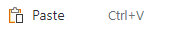
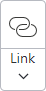
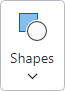
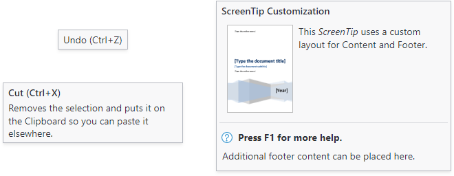

# Control Basics

Many of the controls intended for use within ribbons, toolbars, and menus share some common characteristics and concepts.  This topic reviews some of the core concepts for these controls.

## Key

Each bar control has a string-based `Key` that is used to identify the control and allows it to be associated with other related controls anywhere in Bars control hierarchies.  `Label` is meant for display purposes only and could be repeated on similar controls or even change from region to region when localizing the application, so the `Key` value should always be able to properly identify a control.

> [!TIP]
> It is highly recommended to define all string keys as constants on a static class to ensure compile-time safety. Many of the code samples in this documentation use string keys only to reduce the complexity of the sample.


> [!IMPORTANT]
> If multiple controls have the same `Key` value, they must represent the same operation and be considered interchangeable from one context to another. For example, a button and a menu item that both execute the same paste functionality should use the same `Key` value, like `"Paste"`.

### Examples

Here are several examples of `Key` values that could be used for various usage scenarios.  These are just examples, and you are free to use any unique `Key` that you wish.

| Key | Control Type | Notes |
|-----|-----|-----|
| `"ClipboardGroup"` | [RibbonGroup](xref:@ActiproUIRoot.Controls.Bars.RibbonGroup) | A **Clipboard** group within a ribbon. |
| `"ClipboardGroupLauncher"` | [RibbonGroupLauncherButton](xref:@ActiproUIRoot.Controls.Bars.RibbonGroupLauncherButton) | The **Clipboard** ribbon group's launcher button. |
| `"Paste"` | [BarMenuItem](xref:@ActiproUIRoot.Controls.Bars.BarMenuItem) | Regular clickable menu item that triggers a clipboard paste. |
| `"Paste"` | [BarButton](xref:@ActiproUIRoot.Controls.Bars.BarButton) | Regular button in a toolbar or ribbon that triggers a clipboard paste.  Uses the same `Key` as the menu item since it triggers the same command. |
| `"PasteMenu"` | [BarSplitButton](xref:@ActiproUIRoot.Controls.Bars.BarSplitButton) | Split button that executes the same command as the **Paste** button but has other paste-related gallery or menu items in its popup menu. |
| `"PasteGallery"` | [BarMenuGallery](xref:@ActiproUIRoot.Controls.Bars.BarMenuGallery) | A menu gallery of various paste modes (e.g., merge formatting, keep text only, etc.) that can be selected for customized pasting. |

### Usage Scenarios

The `Key` property is critical to supporting the following usage scenarios:
- Adding controls to the [Quick Access Toolbar](../ribbon-features/quick-access-toolbar.md) and detecting if a control has already been added.
- [Serializing and deserializing](../ribbon-features/serialization.md) the controls displayed in the Quick Access Toolbar.
- Explicitly defining control variant sizes [when resizing the ribbon](../ribbon-features/resizing.md).
- Planned future functionality for UI customization.

Additionally, the `Key` property can also be used to optionally support the following features:
- [Automatic generation of label and key tip](auto-generation.md) when localization is not important.
- Automatically associate an image with a view model of the same `Key` [when using MVVM](../mvvm-support.md).

## Appearance

There are several appearance concepts that determine how the controls render.

### Label

A `Label` is a text string that is usually visible within a control's user interface.

For example, a button's `Label` appears in the button's content, while a menu item's `Label` appears in the main text column of the menu item.




*Examples of labels on a button and menu item*

#### Label Auto-Generation

Controls that have both `Key` and `Label` properties will auto-generate a `Label` value based on the `Key` if no other `Label` has been specifically set.

It's recommended to either use "PascalCase" identifiers or hyphenated words when creating `Key` property values.  Both `Key` values `"AlignLeft"` and `"align-left"` will auto-generate a `Label` value `"Align Left"`.

This time-saving feature helps reduce the need to specify many `Label` values, except in scenarios where a customized value is necessary.

See the [Label and Key Tip Generation](auto-generation.md) topic for more information on auto-generated labels.

### Images

Numerous controls display images in their user interface to better identify their function, sometimes without the use of a `Label` when trying to minimize size.

For example, a button's image appears in the button's content, and may be different sizes based on the button's variant size.  A menu item's image appears in the icon column of the menu item.




*Examples of various image sizes used when the control has a different variant size*

#### Image Sizes

Some controls support a single image size, while other controls with variant sizes support multiple image sizes.  These are the common image sizes:

| Name | Size | Description |
|-----|-----|
| Small | 16x16 | All controls that can display images should define a small image because even controls displaying large images will use a small image in the ribbon's [quick access toolbar](../ribbon-features/quick-access-toolbar.md) and overflow menus. |
| Medium | 24x24 | Medium images are only used in [Simplified layout mode](../ribbon-features/layout-and-density.md) for some controls. |
| Large | 32x32 | Large images are used in certain controls when in large variant sizes. |

#### Fallback Label and Images

If an image is not defined and is vital to the normal appearance of the control, a fallback display mechanism can occur, primarily in buttons.

In many cases, a missing image for small and medium variant size buttons will result in the label being displayed instead.

In other cases, such as when the control is within the ribbon's [quick access toolbar](../ribbon-features/quick-access-toolbar.md) or when the control is a collapsed ribbon group, then a default missing fallback image will be used.


*The fallback image*

The following table describes the priority order of properties @if (avalonia) { (e.g., `SmallIcon`, `LargeIcon`) }@if (wpf) { (e.g., `SmallImageSource`, `LargeImageSource`) } used to resolve an image for a desired image size.

| Desired Image Size | Resolution Priority |
|-----|-----|
| Small (16x16) | Small, Large (downscaled), Medium (downscaled), Missing (if no label visible) |
| Medium (24x24) | Medium, Small (centered), Large (downscaled), Missing (if no label visible) |
| Large (32x32) | Large, Medium (centered), Small (centered), Missing |

> [!TIP]
> When using a vector image for a button with the intention of using a single image for all image sizes, it is best to make a single 32x32 size vector image and assign it to the button's @if (avalonia) { `LargeIcon` }@if (wpf) { `LargeImageSource` } property.  Per the table above, a `Large` image can scale down as a fallback for other image sizes.  When using raster images, it is much better to use a distinct image design for the `Large` and `Small` image sizes at a minimum.

@if (avalonia) {
#### Icon Data Template

Since icon properties are defined as `object` value types, a corresponding `IDataTemplate` is typically required to define how the value should be presented.

The individual control themes are configured to use an [Icon Presenter](../../themes/icon-presenter.md) for showing icons.  `IImage` is the most common value type and is supported by default, but custom or third-party value types can also be supported.  See the [Icon Presenter](../../themes/icon-presenter.md) topic for details on how to add support for additional data types.

> [!WARNING]
> Since the same icon property value might need to be used in multiple parts of the UI at the same time, the icon property should never be assigned an instance of a visual.

}

### Title

An optional string `Title` can be specified, which is intended to override the control's `Label` when displayed in screen tips and customization UI.

This is useful when you wish for a control to show a smaller label in UI, but the screen tip or customization UI should show a more verbose header.

### Variant Sizes (Used in Ribbon)

Many controls support multiple variant sizes, where each variant alters the appearance of the control.  As the variant size moves from larger to smaller, the change in appearance generally involves a reduction in the amount of information displayed in the control's content to save on overall space usage.  Variant sizes are primarily utilized when a control is hosted within a ribbon.

As an example, examine a button's common variant size transitions within a Classic ribbon:

| Variant Size | Description |
|-----|-----|
| Large | The button is rendered in a tall height with large image and label underneath. |
| Medium | The button flips to a horizontal orientation, uses a small image, and positions the label to the right of its image. |
| Small | The button removes the label and only shows its image. |




*Several button variant size examples*

Controls that support variant sizes have a `VariantSize` property that indicates the current variant size.

Some controls define a `ToolBarItemVariantBehavior` property that defaults to `AlwaysSmall` and indicates the variant sizes allowed when in a toolbar or Simplified ribbon.  For instance, if a button should show an image and label in a Simplified ribbon when space is available, `ToolBarItemVariantBehavior` should be set to `All`, which allows small and medium variant sizes.

Some controls define a `ToolBarItemOverflowBehavior` property that defaults to `Default` and indicates how the control should handle possible overflow when in a Simplified ribbon.  For instance, if a button should show always be overflowed in a Simplified ribbon, `ToolBarItemOverflowBehavior` should be set to `Always`.

See the [Resizing and Variants](../ribbon-features/resizing.md) topic for more information on variant sizes.

@if (wpf) {
### User Interface Density

Many controls support a user interface density option where values ranging from compact to spacious may be set to designate how much padding is used.  `Compact` is best for more dense user interfaces where there is a need to display many controls at a time.  `Spacious` is better for user interfaces with fewer controls that should be more touch-friendly.  There also is a third option that strikes a balance between the other two.

See the [Layout Modes and Density](../ribbon-features/layout-and-density.md) topic for more information on user interface density.
}

## Key Tips

Key tips are small decorations that pop up over each control indicating a key or series of keys that may be typed to access the control via the keyboard.  When a control's key tip text is typed, the control determines what action to take.  Regular buttons may simulate a click, popup buttons may open a popup, and other controls may simply focus themselves and/or enter a new key tip scope.


*Key tips active for a tab's scope*

Controls that support key tips have a `KeyTipText` property that can be set to the string that should be typed to access the control while key tip mode is active.

See the [Key Tips](../ribbon-features/key-tips.md) topic for more information on key tips.

### Key Tip Auto-Generation

Most controls that have both `Label` and `KeyTipText` properties will auto-generate a `KeyTipText` value based on the `Label` if no other `KeyTipText` has been specifically set.

For example, a popup button's `Label` of `"Table"` will auto-generate a `KeyTipText` of `"T"`, making it unnecessary to specify a `KeyTipText`.

This time-saving feature helps reduce the need to specify many `KeyTipText` values, except in scenarios where a customized value is necessary. Since most controls with a `Key` will auto-generate a `Label`, and `Label` will auto-generate `KeyTipText`, it is often only necessary to specify the `Key` and allow both the `Label` and `KeyTipText` to be auto-generated!

See the [Label and Key Tip Generation](auto-generation.md) topic for more information on auto-generated key tip text.

## Commands and Events

Most controls have command support where the control's primary action executes the `ICommand` set in the control's `Command` property.  Many times, the control will also raise an event when this primary action occurs.

For example, a regular button will execute its command and raise a `Click` event when the button is clicked or its key tip is accessed.

See the [Using Commands](using-commands.md) topic for more information on commands.

## Input Gesture Text

Input gestures are keyboard shortcuts that provide access to a control's command.  For instance, <kbd>Ctrl</kbd>+<kbd>C</kbd> is commonly associated with the clipboard copy command.

Input gesture text is a textual representation of a keyboard shortcut, allowing the end user to learn which keyboard shortcut executes a command.  Input gesture text is shown in screen tip headers and in menu items.

@if (avalonia) {
Controls that support the display of input gesture text have an `InputGesture` property that can be set to strings which parse as a `KeyGesture` (e.g., `"Ctrl+Shift+T"`).  The gesture's string representation will then be used as the input gesture text.
}
@if (wpf) {
Controls that support the display of input gesture text have an `InputGestureText` property that can be set to any string (e.g., `"Ctrl+Shift+T"` or `"Ctrl+V or Shift+Ins"`).  If an `InputGestureText` property value is not specified, screen tips and menu items will attempt to find a `KeyGesture` within the control's command.  The command instance must be derived from `RoutedCommand` and have a `KeyGesture` assigned.  The gesture's string representation will then be used as the input gesture text.
}

### Input Gesture Text Visibility

Sometimes a control's input gesture text may be set to a value, but you don't wish for it to be visible in the user interface.  Set the control's `IsInputGestureTextVisible` property to `false` to prevent it from showing in screen tips and menu items.

## Screen Tips

Screen tips are advanced variations of standard tooltips that can display a header, input gesture text, extended description, complex content, and footer.

Most controls build their screen tip content using these properties:

@if (avalonia) {
- `Label` - Used in the screen tip header.
- `Title` - If specified, overrides the `Label` value displayed in the screen tip header.
- `InputGestureText` - When present, is displayed in the screen tip header, next to the content from `Label` or `Title`.
- `ToolTip.Tip` - If the native `ToolTip.Tip` property is set to a value that doesn't derive from the `ToolTip` class, it is used as the screen tip's extended description.
}
@if (wpf) {
- `Label` - Used in the screen tip header.
- `Title` - If specified, overrides the `Label` value displayed in the screen tip header.
- `InputGestureText` - When present, is displayed in the screen tip header, next to the content from `Label` or `Title`.
- `ToolTip` - If the native `ToolTip` property is set to a value that doesn't derive from the `ToolTip` class, it is used as the screen tip's extended description.
}



*Several screen tip examples*

For other more complex scenarios that need to display additional content, a [ScreenTip](xref:@ActiproUIRoot.Controls.Bars.ScreenTip) instance with its various properties configured can be set to the native @if (avalonia) { `ToolTip.Tip` }@if (wpf) { `ToolTip` } property.  It is generally recommended to use the properties listed above to ensure screen tips for all controls render in a consistent way.

See the [Screen Tips](../ribbon-features/screen-tips.md) topic for more information on screen tips.

## MVVM Support

All of the Bars controls have been built from the ground up to support MVVM usage.  An optional open source companion MVVM library is available that implements view models for each kind of control concept, and contains template selectors that generate the appropriate control view and all the appropriate view model bindings for each usage context.

As an example, when a ribbon configured with the library's template selectors encounters a [BarButtonViewModel](xref:@ActiproUIRoot.Controls.Bars.Mvvm.BarButtonViewModel) object within a ribbon group's items source, it will generate a [BarButton](xref:@ActiproUIRoot.Controls.Bars.BarButton) control that is bound to the view model.  On the other hand, if the [BarButtonViewModel](xref:@ActiproUIRoot.Controls.Bars.Mvvm.BarButtonViewModel) is located within a menu's items source, the template selector will generate a [BarMenuItem](xref:@ActiproUIRoot.Controls.Bars.BarMenuItem) control that is bound to the view model.  This methodology enables the entire ribbon, toolbar, and menu hierarchy to be built and managed with view models.

> [!TIP]
> See the [MVVM Support](../mvvm-support.md) topic for more information on MVVM support and the pre-built MVVM library of view models and template selectors designed for Bars controls.

While the open source companion MVVM library provides the most straightforward way to integrate MVVM concepts into Bars controls, it is not required, as there are no dependencies in Bars to any types in that MVVM library.  If desired, any configuration of custom view models and template selectors can be used instead.

## BarControlService Attached Properties

The [BarControlService](xref:@ActiproUIRoot.Controls.Bars.BarControlService) class defines numerous attached properties that are reused across many of the various Bars controls when appropriate.

Here is a list of common attached properties that are related to concepts described earlier in this topic:

@if (avalonia) {
| Attached Property | Description |
|-----|-----|
| [KeyProperty](xref:@ActiproUIRoot.Controls.Bars.BarControlService.KeyProperty) | String key that identifies the control. |
| [LabelProperty](xref:@ActiproUIRoot.Controls.Bars.BarControlService.LabelProperty) | String label displayed in UI. |
| [SmallIconProperty](xref:@ActiproUIRoot.Controls.Bars.BarControlService.SmallIconProperty) | Small 16x16 size image. |
| [MediumIconProperty](xref:@ActiproUIRoot.Controls.Bars.BarControlService.MediumIconProperty) | Medium 24x24 size image. |
| [LargeIconProperty](xref:@ActiproUIRoot.Controls.Bars.BarControlService.LargeIconProperty) | Large 32x32 size image. |
| [TitleProperty](xref:@ActiproUIRoot.Controls.Bars.BarControlService.TitleProperty) | String title that can override the label in screen tips and customization UI. |
| [VariantSizeProperty](xref:@ActiproUIRoot.Controls.Bars.BarControlService.VariantSizeProperty) | The current variant size of the control.  Unless otherwise indicated, this property should only be manually set when the control is standalone, and not hosted by a bar control. |
| [CanCloneToRibbonQuickAccessToolBarProperty](xref:@ActiproUIRoot.Controls.Bars.BarControlService.CanCloneToRibbonQuickAccessToolBarProperty) | Whether the control can clone to the ribbon [Quick Access Toolbar](../ribbon-features/quick-access-toolbar.md). |
| [HasExternalHeaderProperty](xref:@ActiproUIRoot.Controls.Bars.BarControlService.HasExternalHeaderProperty) | Whether an external header (image/label) should be rendered for the control when in a ribbon control group stack. |}
@if (wpf) {
| Attached Property | Description |
|-----|-----|
| [KeyProperty](xref:@ActiproUIRoot.Controls.Bars.BarControlService.KeyProperty) | String key that identifies the control. |
| [LabelProperty](xref:@ActiproUIRoot.Controls.Bars.BarControlService.LabelProperty) | String label displayed in UI. |
| [SmallImageSourceProperty](xref:@ActiproUIRoot.Controls.Bars.BarControlService.SmallImageSourceProperty) | Small 16x16 size image. |
| [MediumImageSourceProperty](xref:@ActiproUIRoot.Controls.Bars.BarControlService.MediumImageSourceProperty) | Medium 24x24 size image. |
| [LargeImageSourceProperty](xref:@ActiproUIRoot.Controls.Bars.BarControlService.LargeImageSourceProperty) | Large 32x32 size image. |
| [TitleProperty](xref:@ActiproUIRoot.Controls.Bars.BarControlService.TitleProperty) | String title that can override the label in screen tips and customization UI. |
| [VariantSizeProperty](xref:@ActiproUIRoot.Controls.Bars.BarControlService.VariantSizeProperty) | The current variant size of the control.  Unless otherwise indicated, this property should only be manually set when the control is standalone, and not hosted by a bar control. |
| [CanCloneToRibbonQuickAccessToolBarProperty](xref:@ActiproUIRoot.Controls.Bars.BarControlService.CanCloneToRibbonQuickAccessToolBarProperty) | Whether the control can clone to the ribbon [Quick Access Toolbar](../ribbon-features/quick-access-toolbar.md). |
| [HasExternalHeaderProperty](xref:@ActiproUIRoot.Controls.Bars.BarControlService.HasExternalHeaderProperty) | Whether an external header (image/label) should be rendered for the control when in a ribbon control group stack. |
}

### Usage Scenarios

Use of the attached properties can sometimes make property retrieval much more efficient.  Imagine that you wanted to get the `Label` of a control.  You could build a large `if` statement like this:

```csharp
string label = null;
if (control is BarButton barButton)
    label = barButton.Label;
else if (control is BarMenuItem barMenuItem)
    label = barMenuItem.Label;
else if ...  // More tests
```

Or you could use a single line like this:

```csharp
var label = BarControlService.GetLabel(control);
```
