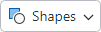
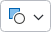
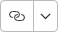

# Overview

Actipro Bars includes a many built-in controls that are designed for use within ribbons, toolbars, and menus.

## Control Basics

Many of the controls share common characteristics and concepts, such as keys, labels, images, titles, variant sizes, key tips, input gesture text, screen tips, and MVVM support.

These subjects and others are discussed in the [Control Basics](control-basics.md) topic, which is essential reading prior to reviewing information on specific controls.

## Built-in Controls

The built-in controls documentation is organized by control concept.  There are often multiple controls that implement a certain concept, one for each context where that control concept should be used.

For instance, a regular button concept described in the [Button](button.md) topic is implemented by a [BarButton](xref:@ActiproUIRoot.Controls.Bars.BarButton) control for use in ribbons and toolbars, and a [BarMenuItem](xref:@ActiproUIRoot.Controls.Bars.BarMenuItem) control for use in menus.  Each topic below explains details on the control classes involved in the implementation of the related control concept.

<table>
<thead>

<tr>
<th>Control Concept</th>
<th>Description</th>
</tr>

</thead>
<tbody>

<tr>
<td>

[Button](button.md)

</td>
<td>

Implemented as a regular button or toggle (checkable) button in ribbons/toolbars, and as a standard menu item in menus.

</td>
</tr>

<tr>
<td>

[Popup Button](popup-button.md)

</td>
<td>

Implemented as a button in ribbons/toolbars that displays a popup when clicked, and as a menu item with a submenu in menus.

</td>
</tr>

<tr>
<td>

[Split Button](split-button.md)

</td>
<td>

Implemented as a button in ribbons/toolbars that has two clickable areas.  The button portion of the split button acts like a normal button or toggle (checkable) button.  The drop-down portion of the split button displays a popup.  A special split menu item with similar capabilities is used in menus.

</td>
</tr>

<tr>
<td>

[Checkbox](checkbox.md)

</td>
<td>

Implemented as a checkbox control in ribbons/toolbars, and as a checkable menu item in menus.

</td>
</tr>

<tr>
<td>

[Gallery](gallery.md)

</td>
<td>

Implemented as graphically-rich list controls whose items are displayed in a scrollable list that supports selection, categorization, filtering, live preview, and much more.  In-ribbon usage shows the gallery inline or within a collapsed button.  Menu usage displays the gallery directly within the menu.

Common usage scenarios for galleries include:
- Selection of colors, text styles, underline styles, bullet kinds, numbering kinds, etc.
- Insertion of shapes, symbols, tables, equations, etc.

</td>
</tr>

<tr>
<td>

[Combobox](combobox.md)

</td>
<td>

Implemented as a combobox control in ribbons/toolbars and as a menu item with a submenu in menus.

</td>
</tr>

<tr>
<td>

[Textbox](textbox.md)

</td>
<td>

Implemented as a textbox control in ribbons/toolbars and wrapped for use in menus.

</td>
</tr>

<tr>
<td>

[Heading](heading.md)

</td>
<td>

Implemented as static heading text when in menus.

</td>
</tr>

<tr>
<td>

[Separator](separator.md)

</td>
<td>

Implemented as a separator bar in ribbons, toolbars, and menus.

</td>
</tr>

</tbody>
</table>

## Using Commands

All interactive controls in this product are designed to work well with MVVM patterns and the @@PlatformTitle command model.

Controls will execute their command when a primary action occurs on the control and use the command's can-execute result to determine if the control is enabled.  Commands can be used to support live preview of gallery items as well.

See the [Using Commands](using-commands.md) topic for more information.

## Using Custom Controls

The wide array of controls described above should cover nearly all the control types needed for use in ribbons, toolbars, and menus.  If the built-in controls don't fully meet your needs, custom controls can also be used.

@if (avalonia) {
An example is where you may wish to host some native editors, like `NumericUpDown` or `CalendarDatePicker`, within bars.
}
@if (wpf) {
An example is where you may wish to host some edit boxes from the [Actipro Editors](../../editors/index.md) product like [Int32EditBox](../../editors/editboxes/int32editbox.md) within bars.  Even though the edit box is an Actipro control, it wasn't made explicitly for use in bars and therefore is treated as a custom control for the purposes of this topic.
}

See the [Using Custom Controls](using-custom-controls.md) topic for more information.

## Label and Key Tip Generation

Many controls have `Key`, `Label`, and `KeyTipText` properties. Since these properties are closely related, controls can auto-generate a `Label` value based on the `Key` if no other `Label` has been explicitly set.  Likewise, a `KeyTipText` value can be auto-generated from a `Label` if no other `KeyTipText` has been expicitly set.

@if (wpf) {
Other contextual values (like certain `ICommand` types) can also be used when auto-generating property values.
}

This time-saving feature helps reduce the need to specify many `Label` and `KeyTipText` values, except in scenarios where a customized value is necessary!

See the [Label and Key Tip Generation](auto-generation.md) topic for more information.