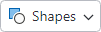
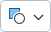

# Popup Button

Popup buttons are controls that can be clicked to show a popup menu.

> [!NOTE]
> This topic extends the [Control Basics](control-basics.md) topic with additional information specific to the control types described below.  Please refer to the base topic for more generalized concepts that apply to all controls, including this one.

## Control Implementations

There are separate popup button concept control implementations based on the usage context.

### Ribbon and Toolbar Contexts

Use the [BarPopupButton](xref:@ActiproUIRoot.Controls.Bars.BarPopupButton) control to implement a popup button within a ribbon or toolbar context.





*BarPopupButton examples in several variant sizes (large, medium, and small)*

@if (avalonia) {
| Specification | Details |
|-----|-----|
| Base class | [BarPopupButtonBase](xref:@ActiproUIRoot.Controls.Bars.Primitives.BarPopupButtonBase), which inherits native `Menu`. |
| Has key | Yes, via the [Key](xref:@ActiproUIRoot.Controls.Bars.BarPopupButton.Key) property. |
| Has label | Yes, via the [Label](xref:@ActiproUIRoot.Controls.Bars.Primitives.BarPopupButtonBase.Label) property.  Auto-generated from the `Key` value if not specified.  |
| Has image | Yes, via the [SmallIcon](xref:@ActiproUIRoot.Controls.Bars.BarPopupButton.SmallIcon), [MediumIcon](xref:@ActiproUIRoot.Controls.Bars.BarPopupButton.MediumIcon), and [LargeIcon](xref:@ActiproUIRoot.Controls.Bars.BarPopupButton.LargeIcon) properties. |
| Has popup | Yes. |
| Is checkable | No. |
| Variant sizes | `Small` (image only), `Medium` (image and label), `Large` (tall size, image and multi-line label). |
| Command support | Yes, via the [PopupOpeningCommand](xref:@ActiproUIRoot.Controls.Bars.Primitives.BarPopupButtonBase.PopupOpeningCommand) property. |
| Key tip support | Yes, via the [KeyTipText](xref:@ActiproUIRoot.Controls.Bars.Primitives.BarPopupButtonBase.KeyTipText) property.  Auto-generated from the `Label` value if not specified. |
| [Ribbon QAT](../ribbon-features/quick-access-toolbar.md) support | Yes, via the [CanCloneToRibbonQuickAccessToolBar](xref:@ActiproUIRoot.Controls.Bars.BarPopupButton.CanCloneToRibbonQuickAccessToolBar) property. |
| [MVVM Library](../mvvm-support.md) VM | [BarPopupButtonViewModel](xref:@ActiproUIRoot.Controls.Bars.Mvvm.BarPopupButtonViewModel) class. |
}
@if (wpf) {
| Specification | Details |
|-----|-----|
| Base class | [BarPopupButtonBase](xref:@ActiproUIRoot.Controls.Bars.Primitives.BarPopupButtonBase), which inherits native `Menu`. |
| Has key | Yes, via the [Key](xref:@ActiproUIRoot.Controls.Bars.BarPopupButton.Key) property. |
| Has label | Yes, via the [Label](xref:@ActiproUIRoot.Controls.Bars.Primitives.BarPopupButtonBase.Label) property.  Auto-generated from the `Key` value if not specified.  |
| Has image | Yes, via the [SmallImageSource](xref:@ActiproUIRoot.Controls.Bars.BarPopupButton.SmallImageSource), [MediumImageSource](xref:@ActiproUIRoot.Controls.Bars.BarPopupButton.MediumImageSource), and [LargeImageSource](xref:@ActiproUIRoot.Controls.Bars.BarPopupButton.LargeImageSource) properties. |
| Has popup | Yes. |
| Is checkable | No. |
| Variant sizes | `Small` (image only), `Medium` (image and label), `Large` (tall size, image and multi-line label). |
| Command support | Yes, via the [PopupOpeningCommand](xref:@ActiproUIRoot.Controls.Bars.Primitives.BarPopupButtonBase.PopupOpeningCommand) property. |
| Key tip support | Yes, via the [KeyTipText](xref:@ActiproUIRoot.Controls.Bars.Primitives.BarPopupButtonBase.KeyTipText) property.  Auto-generated from the `Label` value if not specified. |
| [Ribbon QAT](../ribbon-features/quick-access-toolbar.md) support | Yes, via the [CanCloneToRibbonQuickAccessToolBar](xref:@ActiproUIRoot.Controls.Bars.BarPopupButton.CanCloneToRibbonQuickAccessToolBar) property. |
| UI density support | Yes, via the [UserInterfaceDensity](xref:@ActiproUIRoot.Controls.Bars.BarPopupButton.UserInterfaceDensity) property. |
| [MVVM Library](../mvvm-support.md) VM | [BarPopupButtonViewModel](xref:@ActiproUIRoot.Controls.Bars.Mvvm.BarPopupButtonViewModel) class. |
}

@if (avalonia) {
```xaml
xmlns:actipro="http://schemas.actiprosoftware.com/avaloniaui"
...
<actipro:StandaloneToolBar>
	<!-- Label is auto-generated from Key -->
	<actipro:BarPopupButton
		Key="Shapes"
		SmallIcon="{StaticResource ShapesIcon}">

		<actipro:BarPopupButton.Items>
			<actipro:BarMenuItem
				Key="Rectangle"
				Command="{Binding InsertRectangleCommand}"
				/>
		</actipro:BarPopupButton.Items>
	</actipro:BarPopupButton>
	...
</actipro:StandaloneToolBar>
```
}
@if (wpf) {
```xaml
xmlns:bars="http://schemas.actiprosoftware.com/winfx/xaml/bars"
...
<bars:StandaloneToolBar>
	<!-- Label is auto-generated from Key -->
	<bars:BarPopupButton
		Key="Shapes"
		SmallImageSource="/Images/Shapes16.png">

		<bars:BarPopupButton.Items>
			<bars:BarMenuItem
				Key="Rectangle"
				Command="{Binding InsertRectangleCommand}"
				/>
		</bars:BarPopupButton.Items>
	</bars:BarPopupButton>
	...
</bars:StandaloneToolBar>
```
}

### Menu Contexts

Use the [BarMenuItem](xref:@ActiproUIRoot.Controls.Bars.BarMenuItem) control to implement a popup button concept within a menu context.

@if (avalonia) {


*A BarMenuItem with a child menu*
}
@if (wpf) {


*A BarMenuItem with large size showing a popup menu*
}

@if (avalonia) {
| Specification | Details |
|-----|-----|
| Base class | Native `MenuItem`. |
| Has key | Yes, via the [Key](xref:@ActiproUIRoot.Controls.Bars.BarMenuItem.Key) property. |
| Has label | Yes, via the [Label](xref:@ActiproUIRoot.Controls.Bars.BarMenuItem.Label) property.  Auto-generated from the `Key` value if not specified. |
| Has image | Yes, via the [SmallIcon](xref:@ActiproUIRoot.Controls.Bars.BarMenuItem.SmallIcon) and [LargeIcon](xref:@ActiproUIRoot.Controls.Bars.BarMenuItem.LargeIcon) properties. |
| Has popup | Yes. |
| Is checkable | No. |
| Variant sizes | None, but has a [UseLargeSize](xref:@ActiproUIRoot.Controls.Bars.BarMenuItem.UseLargeSize) property that triggers a large height and displays an extended [Description](xref:@ActiproUIRoot.Controls.Bars.BarMenuItem.Description). |
| Command support | Yes, via the [PopupOpeningCommand](xref:@ActiproUIRoot.Controls.Bars.BarMenuItem.PopupOpeningCommand) property. |
| Key tip support | Yes, via the [KeyTipText](xref:@ActiproUIRoot.Controls.Bars.BarMenuItem.KeyTipText) property.  Auto-generated from the `Label` value if not specified. |
| [Ribbon QAT](../ribbon-features/quick-access-toolbar.md) support | Yes, via the [CanCloneToRibbonQuickAccessToolBar](xref:@ActiproUIRoot.Controls.Bars.BarMenuItem.CanCloneToRibbonQuickAccessToolBar) property. |
| [MVVM Library](../mvvm-support.md) VM | [BarPopupButtonViewModel](xref:@ActiproUIRoot.Controls.Bars.Mvvm.BarPopupButtonViewModel) class. |
}
@if (wpf) {
| Specification | Details |
|-----|-----|
| Base class | Native `MenuItem`. |
| Has key | Yes, via the [Key](xref:@ActiproUIRoot.Controls.Bars.BarMenuItem.Key) property. |
| Has label | Yes, via the [Label](xref:@ActiproUIRoot.Controls.Bars.BarMenuItem.Label) property.  Auto-generated from the `Key` value if not specified. |
| Has image | Yes, via the [SmallImageSource](xref:@ActiproUIRoot.Controls.Bars.BarMenuItem.SmallImageSource) and [LargeImageSource](xref:@ActiproUIRoot.Controls.Bars.BarMenuItem.LargeImageSource) properties. |
| Has popup | Yes. |
| Is checkable | No. |
| Variant sizes | None, but has a [UseLargeSize](xref:@ActiproUIRoot.Controls.Bars.BarMenuItem.UseLargeSize) property that triggers a large height and displays an extended [Description](xref:@ActiproUIRoot.Controls.Bars.BarMenuItem.Description). |
| Command support | Yes, via the [PopupOpeningCommand](xref:@ActiproUIRoot.Controls.Bars.BarMenuItem.PopupOpeningCommand) property. |
| Key tip support | Yes, via the [KeyTipText](xref:@ActiproUIRoot.Controls.Bars.BarMenuItem.KeyTipText) property.  Auto-generated from the `Label` value if not specified. |
| [Ribbon QAT](../ribbon-features/quick-access-toolbar.md) support | Yes, via the [CanCloneToRibbonQuickAccessToolBar](xref:@ActiproUIRoot.Controls.Bars.BarMenuItem.CanCloneToRibbonQuickAccessToolBar) property. |
| UI density support | None. |
| [MVVM Library](../mvvm-support.md) VM | [BarPopupButtonViewModel](xref:@ActiproUIRoot.Controls.Bars.Mvvm.BarPopupButtonViewModel) class. |
}

@if (avalonia) {
```xaml
xmlns:actipro="http://schemas.actiprosoftware.com/avaloniaui"
...
<actipro:BarMenuFlyout>
	<!-- Label is auto-generated from Key -->
	<actipro:BarMenuItem
		Key="Shapes"
		SmallIcon="{StaticResource ShapesIcon}">

		<actipro:BarMenuItem
			Key="Rectangle"
			Command="{Binding InsertRectangleCommand}"
			/>
	</actipro:BarMenuItem>
	...
</actipro:BarMenuFlyout>
```
}
@if (wpf) {
```xaml
xmlns:bars="http://schemas.actiprosoftware.com/winfx/xaml/bars"
...
<bars:BarContextMenu>
	<!-- Label is auto-generated from Key -->
	<bars:BarMenuItem
		Key="Shapes"
		SmallImageSource="/Images/Shapes16.png">

		<bars:BarMenuItem
			Key="Rectangle"
			Command="{Binding InsertRectangleCommand}"
			/>
	</bars:BarMenuItem>
	...
</bars:BarContextMenu>
```
}

## Appearance

There are several appearance-related properties that determine how the controls render.

### Label

The controls have a string `Label` that can be set, which is visible in UI.

The `Label` can be auto-generated based on the control's `Key` property.  For instance, a control with `Key` of `"FormatPainter"` will automatically assign `"Format Painter"` as the `Label` value.  The auto-generated default can be overridden by setting the `Label` property.

The [BarPopupButton](xref:@ActiproUIRoot.Controls.Bars.BarPopupButton).[Label](xref:@ActiproUIRoot.Controls.Bars.Primitives.BarPopupButtonBase.Label) is rendered on the button when it is in a `Medium` or `Large` variant size.  When using a `Large` variant size button, the label will wrap words to two lines to minimize overall width.  In cases where a run of label text should not be broken up into two lines, use a non-breaking space character (ASCII code 160) in place of any whitespace, like this:

@if (avalonia) {
```xaml
xmlns:actipro="http://schemas.actiprosoftware.com/avaloniaui"
...
<actipro:BarPopupButton ... Label="Data&#160;Set" />
```
}
@if (wpf) {
```xaml
xmlns:bars="http://schemas.actiprosoftware.com/winfx/xaml/bars"
...
<bars:BarPopupButton ... Label="Data&#160;Set" />
```
}

The [BarMenuItem](xref:@ActiproUIRoot.Controls.Bars.BarMenuItem).[Label](xref:@ActiproUIRoot.Controls.Bars.BarMenuItem.Label) is rendered on the menu item as its primary content.

### Images

The controls can display images that help identify their function.

@if (avalonia) {
All [BarPopupButton](xref:@ActiproUIRoot.Controls.Bars.BarPopupButton) instances should set a [SmallIcon](xref:@ActiproUIRoot.Controls.Bars.BarPopupButton.SmallIcon) at a minimum, which is generally used for `Small` and `Medium` variants, as well as in the [Ribbon Quick Access Toolbar](../ribbon-features/quick-access-toolbar.md) and if the control overflows to a menu.  If the button supports a `Large` variant size, it should also define a [LargeIcon](xref:@ActiproUIRoot.Controls.Bars.BarPopupButton.LargeIcon).  When the button is located on a ribbon with `Simplified` layout mode, it will try to use [MediumIcon](xref:@ActiproUIRoot.Controls.Bars.BarPopupButton.MediumIcon).

> [!TIP]
> See the [Control Basics](control-basics.md) topic for more detail on the fallback logic and custom data templates for button icons.

[BarMenuItem](xref:@ActiproUIRoot.Controls.Bars.BarMenuItem) instances can optionally define a [SmallIcon](xref:@ActiproUIRoot.Controls.Bars.BarMenuItem.SmallIcon) that appears in the menu's icon column.  When [UseLargeSize](xref:@ActiproUIRoot.Controls.Bars.BarMenuItem.UseLargeSize) is set to create a large menu item, the [LargeIcon](xref:@ActiproUIRoot.Controls.Bars.BarMenuItem.LargeIcon) property is used instead.
}
@if (wpf) {
All [BarPopupButton](xref:@ActiproUIRoot.Controls.Bars.BarPopupButton) instances should set a [SmallImageSource](xref:@ActiproUIRoot.Controls.Bars.BarPopupButton.SmallImageSource) at a minimum, which is generally used for `Small` and `Medium` variants, as well as in the [Ribbon Quick Access Toolbar](../ribbon-features/quick-access-toolbar.md) and if the control overflows to a menu.  If the button supports a `Large` variant size, it should also define a [LargeImageSource](xref:@ActiproUIRoot.Controls.Bars.BarPopupButton.LargeImageSource).  When the button has a `Spacious` UI density, it will try to use [MediumImageSource](xref:@ActiproUIRoot.Controls.Bars.BarPopupButton.MediumImageSource).

> [!TIP]
> See the [Control Basics](control-basics.md) topic for more detail on the fallback logic for button images.

[BarMenuItem](xref:@ActiproUIRoot.Controls.Bars.BarMenuItem) instances can optionally define a [SmallImageSource](xref:@ActiproUIRoot.Controls.Bars.BarMenuItem.SmallImageSource) that appears in the menu's icon column.  When [UseLargeSize](xref:@ActiproUIRoot.Controls.Bars.BarMenuItem.UseLargeSize) is set to create a large menu item, the [LargeImageSource](xref:@ActiproUIRoot.Controls.Bars.BarMenuItem.LargeImageSource) property is used instead.
}

### Description (BarMenuItem only)

When [UseLargeSize](xref:@ActiproUIRoot.Controls.Bars.BarMenuItem.UseLargeSize) is set to create a large menu item, the [Description](xref:@ActiproUIRoot.Controls.Bars.BarMenuItem.Description) property's string value is displayed under the menu item's bold label as an extended description.

### Title

An optional string [BarPopupButton](xref:@ActiproUIRoot.Controls.Bars.BarPopupButton).[Title](xref:@ActiproUIRoot.Controls.Bars.BarPopupButton.Title) and [BarMenuItem](xref:@ActiproUIRoot.Controls.Bars.BarMenuItem).[Title](xref:@ActiproUIRoot.Controls.Bars.BarMenuItem.Title) can be specified, which are intended to override the control's `Label` when displayed in screen tips and customization UI.

### Variant Sizes

[BarPopupButton](xref:@ActiproUIRoot.Controls.Bars.BarPopupButton) supports multiple variant sizes via its [VariantSize](xref:@ActiproUIRoot.Controls.Bars.BarPopupButton.VariantSize) property.  This feature can be used in conjunction with [RibbonControlGroup](xref:@ActiproUIRoot.Controls.Bars.RibbonControlGroup) within a ribbon in `Classic` layout mode to achieve various button layouts as available width changes.

When a ribbon is in `Simplified` layout mode, the [BarPopupButton](xref:@ActiproUIRoot.Controls.Bars.BarPopupButton) control will render in a `Small` variant size by default and will collapse to an overflow menu when necessary.  The [ToolBarItemVariantBehavior](xref:@ActiproUIRoot.Controls.Bars.BarPopupButton.ToolBarItemVariantBehavior) property can be set to `All` to show a label.  Alternatively, the [ToolBarItemCollapseBehavior](xref:@ActiproUIRoot.Controls.Bars.BarPopupButton.ToolBarItemCollapseBehavior) property can be set to `Always` to always have the button in the overflow menu.

While [BarMenuItem](xref:@ActiproUIRoot.Controls.Bars.BarMenuItem) doesn't support variant sizes, it does have a [UseLargeSize](xref:@ActiproUIRoot.Controls.Bars.BarMenuItem.UseLargeSize) property that can be set to show a large version of the menu item.  This large version uses a large image and can display an extended [Description](xref:@ActiproUIRoot.Controls.Bars.BarMenuItem.Description).

See the [Resizing and Variants](../ribbon-features/resizing.md) topic for more information on ribbon's variant sizing features.

@if (wpf) {
### User Interface Density (BarPopupButton only)

The [UserInterfaceDensity](xref:@ActiproUIRoot.Controls.Bars.BarPopupButton.UserInterfaceDensity) property can alter the appearance of the button, such as its size, padding, and image used.  This property is not generally set on the button instance itself, and is instead meant to be set on the root bar control to inherit down, such as with the [Ribbon.UserInterfaceDensity](xref:@ActiproUIRoot.Controls.Bars.Ribbon.UserInterfaceDensity) property.
}

## Key Tips

The controls support key tips.  When a control's key tip is accessed, the popup menu is opened.

The `KeyTipText` can be auto-generated based on the control's `Label` property.  For instance, a control with `Label` of `"Copy"` will automatically assign `"C"` as the `KeyTipText` value.  The auto-generated default can be overridden by setting the `KeyTipText` property.

The [BarPopupButton](xref:@ActiproUIRoot.Controls.Bars.BarPopupButton).[KeyTipText](xref:@ActiproUIRoot.Controls.Bars.Primitives.BarPopupButtonBase.KeyTipText) and [BarMenuItem](xref:@ActiproUIRoot.Controls.Bars.BarMenuItem).[KeyTipText](xref:@ActiproUIRoot.Controls.Bars.BarMenuItem.KeyTipText) properties designate the key tip text to use for the control.

See the [Key Tips](../ribbon-features/key-tips.md) topic for more information on key tips.

## Commands and Events

@if (avalonia) {
The `ICommand` in the [BarPopupButton](xref:@ActiproUIRoot.Controls.Bars.BarPopupButton).[Command](xref:@ActiproUIRoot.Controls.Bars.Primitives.BarPopupButtonBase.Command) property is never executed or used.
}
@if (wpf) {
The `ICommand` in the [BarPopupButton](xref:@ActiproUIRoot.Controls.Bars.BarPopupButton).[Command](xref:@ActiproUIRoot.Controls.Bars.Primitives.BarPopupButtonBase.Command) property is never executed or used other than to possibly initialize a label.
}

The `ICommand` in the [BarPopupButton](xref:@ActiproUIRoot.Controls.Bars.BarPopupButton).[PopupOpeningCommand](xref:@ActiproUIRoot.Controls.Bars.Primitives.BarPopupButtonBase.PopupOpeningCommand) property, and similarly the [BarMenuItem](xref:@ActiproUIRoot.Controls.Bars.BarMenuItem).[PopupOpeningCommand](xref:@ActiproUIRoot.Controls.Bars.BarMenuItem.PopupOpeningCommand), is executed prior to the popup or sub-menu opening.  This command can be handled in a view model, allowing for a MVVM way to update the items on the popup prior to display.

@if (avalonia) {
[BarPopupButton](xref:@ActiproUIRoot.Controls.Bars.BarPopupButton).[Opening](xref:@ActiproUIRoot.Controls.Bars.Primitives.BarPopupButtonBase.Opening) and `MenuBase.Opened` events are raised when the popup is opened.  The former event allows you to customize the popup menu prior to display.
}
@if (wpf) {
[BarPopupButton](xref:@ActiproUIRoot.Controls.Bars.BarPopupButton).[PopupOpening](xref:@ActiproUIRoot.Controls.Bars.Primitives.BarPopupButtonBase.PopupOpening) and [PopupOpened](xref:@ActiproUIRoot.Controls.Bars.Primitives.BarPopupButtonBase.PopupOpened) events are raised when the popup is opened.  The former event allows you to customize the popup menu prior to display.
}

The `PopupOpeningCommand`'s can-execute result determines the enabled state of the control.

See the [Using Commands](using-commands.md) topic for more information on commands.

## Screen Tips

The controls support screen tips, which are formatted tool tips.

The control's `Title` is used as the default screen tip header, falling back to `Label` if no `Title` is available.  The [BarPopupButton](xref:@ActiproUIRoot.Controls.Bars.BarPopupButton).[ScreenTipHeader](xref:@ActiproUIRoot.Controls.Bars.BarPopupButton.ScreenTipHeader) and [BarMenuItem](xref:@ActiproUIRoot.Controls.Bars.BarMenuItem).[ScreenTipHeader](xref:@ActiproUIRoot.Controls.Bars.BarMenuItem.ScreenTipHeader) properties can override the default screen tip header value if desired.

If the control's @if (avalonia) { `ToolTip.Tip` }@if (wpf) { `ToolTip` } property is set to a value that doesn't derive from a native `ToolTip` control, such as a string, the value will be used in the screen tip's content area, with the screen tip header becoming bold.  The screen tip's content area is where extended descriptions are displayed.

If the optional [BarPopupButton](xref:@ActiproUIRoot.Controls.Bars.BarPopupButton).[ScreenTipFooter](xref:@ActiproUIRoot.Controls.Bars.BarPopupButton.ScreenTipFooter) and [BarMenuItem](xref:@ActiproUIRoot.Controls.Bars.BarMenuItem).[ScreenTipFooter](xref:@ActiproUIRoot.Controls.Bars.BarMenuItem.ScreenTipFooter) properties are specified, they will appear in a footer area of the screen tip.

See the [Screen Tips](../ribbon-features/screen-tips.md) topic for more information on screen tips.

## MVVM Support

The optional companion [MVVM Library](../mvvm-support.md) defines a [BarPopupButtonViewModel](xref:@ActiproUIRoot.Controls.Bars.Mvvm.BarPopupButtonViewModel) class that is intended to be used as a view model for popup buttons.

This view model class maps over to the appropriate view controls described above based on usage context and configures all necessary bindings between the view model and the view control.

> [!TIP]
> See the [MVVM Support](../mvvm-support.md) topic for more information on how to use the library's view models and view templates to create and manage your application's bars controls with MVVM techniques.
