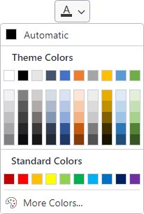

# Overview

Bars comes packed with everything you need to implement advanced ribbons, toolbars, and menus in your applications.

## Ribbon

Ribbon implements an Office-like user interface, complete with dynamic variant sizing, modern themes, fluent animations, and extensive customization capabilities.  Ribbon consolidates all user interface commands into a single location, which is easy to use and scales up and down well, thereby providing fast access to all commands, regardless of window size.

*A ribbon demo showing many complex control layouts that can be achieved, similar to Office*

See the [Ribbon Overview](ribbon-features/index.md) topic for additional information on working with a ribbon.

@if (wpf) {
> [!NOTE]
> The Bars product has no dependency on the older [Ribbon product](../ribbon/index.md).  Bars includes a newer ribbon control implementation with a much-improved design and appearance, and with many of the latest features currently found in Office.  The older Ribbon product [will be deprecated](../conversion/converting-to-v23-1.md) in the future in favor of the ribbon implementation in the Bars product, so it is recommended to implement new ribbons using the Bars product instead.
}

## Standalone Toolbar

A standalone toolbar with built-in overflow support can be used as a window's main toolbar, or within a tool window.  It can complement other controls like a ribbon, and includes support for many of the advanced controls that are typically only found on a ribbon.

*A standalone toolbar is ideal as a main toolbar instead of a ribbon in apps with fewer commands*

See the [Standalone Toolbars](toolbar-features/standalone-toolbars.md) topic for additional information on working with a standalone toolbar.

@if (wpf) {
## Dockable Toolbars

Each dockable toolbar within a dockable toolbar host is a toolbar that can be dragged to any side of the host, or even floated.  Dockable toolbars are very common in IDE applications and can be used in complex line of business applications as well, in scenarios where a ribbon may not be appropriate.

*Multiple dockable toolbars in various placements around their host*

Any toolbar controls, including popup buttons with galleries, can be used on a dockable toolbar.  Variant sizes from medium (showing label) to small (no label) to collapsed (moved to overflow popup) are all supported for each control within the toolbar.  The entire host and its toolbars can be configured via MVVM.

See the [Dockable Toolbars](toolbar-features/dockable-toolbars.md) topic for more information.
}

## Controls

An enormous set of controls intended for use within ribbons, toolbars, and menus is included as well: everything from popup and split buttons to comboboxes and graphically-rich galleries.

*Galleries can be created to provide a visual way of selecting or inserting nearly anything, such as colors, fonts, text styles, and more*

See the [Controls Overview](controls/index.md) topic for additional information on the available controls.

## MVVM Support

The Bars product has been built from the ground up to support MVVM creation of the entire user interface if desired.  An open source companion MVVM library is available that provides a full set of view models and related UI bindings to easily configure and manage your ribbons, toolbars, and menus.

See the [MVVM Support](mvvm-support.md) topic for additional information on using MVVM with Bars controls.