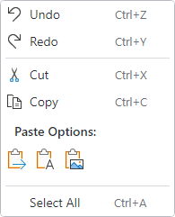

# Context Menus

@if (avalonia) {
The [BarMenuFlyout](xref:@ActiproUIRoot.Controls.Bars.BarMenuFlyout) control implements a `MenuFlyout` that can host any [Bars controls](../controls/index.md) intended for menu contexts, including [split menu items](../controls/split-button.md) or graphically-rich [menu galleries](../controls/gallery.md), and supports other advanced features like MVVM configuration of its items.
}
@if (wpf) {
The [BarContextMenu](xref:@ActiproUIRoot.Controls.Bars.BarContextMenu) control implements a context menu that can host any [Bars controls](../controls/index.md) intended for menu contexts, including [split menu items](../controls/split-button.md) or graphically-rich [menu galleries](../controls/gallery.md), and supports other advanced features like MVVM configuration of its items.
}



*A sample context menu used for an edit control*

@if (avalonia) {
## Native MenuFlyout Compatibility

Since the [BarMenuFlyout](xref:@ActiproUIRoot.Controls.Bars.BarMenuFlyout) class inherits the native `MenuFlyout` class and its features, [BarMenuFlyout](xref:@ActiproUIRoot.Controls.Bars.BarMenuFlyout) may be used anywhere that a regular `MenuFlyout` can be used.
}
@if (wpf) {
## Native ContextMenu Compatibility

Since the [BarContextMenu](xref:@ActiproUIRoot.Controls.Bars.BarContextMenu) class inherits the native `ContextMenu` class and its features, [BarContextMenu](xref:@ActiproUIRoot.Controls.Bars.BarContextMenu) may be used anywhere that a regular `ContextMenu` can be used.
}

## Defining a Context Menu

A context menu is most often assigned to a control via its `ContextFlyout` property.  The control will automatically show the context menu when it is right-clicked or the keyboard's context menu key is pressed.

This sample code shows how to define a context menu for a `TextBox`:

@if (avalonia) {
```xaml
xmlns:actipro="http://schemas.actiprosoftware.com/avaloniaui"
...
<TextBox>
	<TextBox.ContextFlyout>
		<actipro:BarMenuFlyout>
			<!-- Labels are auto-generated from Key -->
			<actipro:BarMenuItem Key="Undo" SmallIcon="{StaticResource UndoIcon}" />
			<actipro:BarMenuItem Key="Redo" SmallIcon="{StaticResource RedoIcon}" />
			<actipro:BarMenuSeparator />
			<actipro:BarMenuItem Key="Cut" SmallIcon="{StaticResource CutIcon}" />
			<actipro:BarMenuItem Key="Copy" SmallIcon="{StaticResource CopyIcon}" />
			<actipro:BarMenuGallery
				Key="PasteOptions"
				AreSurroundingSeparatorsAllowed="False"
				CategoryHeaderTemplate="{StaticResource PasteOptionGalleryCategoryTemplate}"
				Command="{Binding PasteSpecialCommand}"
				IsSelectionSupported="False"
				ItemContainerTheme="{actipro:ControlTheme BarGalleryItem}"
				ItemsSource="{Binding PasteOptions}"
				ItemTemplate="{StaticResource PasteOptionGalleryItemTemplate}"
				MaxColumnCount="6"
				UseMenuItemIndent="True" />
			<actipro:BarMenuSeparator />
			<actipro:BarMenuItem Key="SelectAll" />
		</actipro:BarMenuFlyout>
	</TextBox.ContextFlyout>
</TextBox>
```
}
@if (wpf) {
```xaml
xmlns:bars="http://schemas.actiprosoftware.com/winfx/xaml/bars"
...
<TextBox>
	<TextBox.ContextMenu>
		<bars:BarContextMenu>
			<!-- Labels are auto-generated from Command and Key -->
			<bars:BarMenuItem Command="ApplicationCommands.Undo" SmallImageSource="/Images/Icons/Undo16.png" />
			<bars:BarMenuItem Command="ApplicationCommands.Redo" SmallImageSource="/Images/Icons/Redo16.png" />
			<bars:BarMenuSeparator />
			<bars:BarMenuItem Command="ApplicationCommands.Cut" SmallImageSource="/Images/Icons/Cut16.png" />
			<bars:BarMenuItem Command="ApplicationCommands.Copy" SmallImageSource="/Images/Icons/Copy16.png" />
			<bars:BarMenuGallery
				Key="PasteOptions"
				AreSurroundingSeparatorsAllowed="False"
				CategoryHeaderTemplate="{StaticResource PasteOptionGalleryCategoryTemplate}"
				Command="{Binding PasteSpecialCommand}"
				IsSelectionSupported="False"
				ItemContainerStyle="{StaticResource BarGalleryItemStyle}"
				ItemsSource="{Binding PasteOptions}"
				ItemTemplate="{StaticResource PasteOptionGalleryItemTemplate}"
				MaxColumnCount="6"
				UseMenuItemIndent="True" />
			<bars:BarMenuSeparator />
			<bars:BarMenuItem Command="ApplicationCommands.SelectAll" />
		</bars:BarContextMenu>
	</TextBox.ContextMenu>
</TextBox>
```
}

## Stay Open on Menu Item Click

Each control that derives from native `MenuItem` has a `StaysOpenOnClick` property that governs whether the containing menu closes when the menu item is clicked.

The default value for this property is `false` but can optionally be set to `true` to try and keep the containing menu open following a menu item click.

## Input Gesture Text

Input gestures are keyboard shortcuts that provide access to a control's command.  For instance, <kbd>Ctrl</kbd>+<kbd>C</kbd> is commonly associated with the clipboard copy command.

Input gesture text is a textual representation of a keyboard shortcut, allowing the end user to learn which keyboard shortcut executes a command.  Input gesture text is shown in menu items and can be customized or hidden completely.

See the [Control Basics](../controls/control-basics.md) topic for more information on input gesture text.

## MVVM Support

By setting the @if (avalonia) { [BarMenuFlyout](xref:@ActiproUIRoot.Controls.Bars.BarMenuFlyout).`ItemContainerTemplateSelector` }@if (wpf){ [BarContextMenu](xref:@ActiproUIRoot.Controls.Bars.BarContextMenu).`ItemContainerTemplateSelector` } property to a template selector that can construct controls intended for a menu context, the context menu's `ItemsSource` can be bound to a collection of view-models.

The optional companion [MVVM Library](../mvvm-support.md) includes a [BarControlTemplateSelector](xref:@ActiproUIRoot.Controls.Bars.Mvvm.BarControlTemplateSelector) class that is designed for use with the `ItemContainerTemplateSelector` property, when the control view models from the library are the items being bound via the control's `ItemsSource` property.

@if (avalonia) {
```xaml
xmlns:actipro="http://schemas.actiprosoftware.com/avaloniaui"
...
<TextBox>
	<TextBox.ContextFlyout>
		<actipro:BarContextMenu
			ItemContainerTemplateSelector="{Binding ItemContainerTemplateSelector}"
			ItemsSource="{Binding ContextMenuItems}" />
	</TextBox.ContextFlyout>
</TextBox>
```
}
@if (wpf) {
```xaml
xmlns:bars="http://schemas.actiprosoftware.com/winfx/xaml/bars"
...
<TextBox>
	<TextBox.ContextMenu>
		<bars:BarContextMenu
			ItemContainerTemplateSelector="{Binding ItemContainerTemplateSelector}"
			ItemsSource="{Binding ContextMenuItems}" />
	</TextBox.ContextMenu>
</TextBox>
```
}

> [!TIP]
> See the [MVVM Support](../mvvm-support.md) topic for more information on how to use the library's view models and view templates to create and manage your application's bars controls with MVVM techniques.
