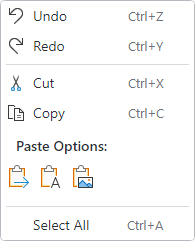

# Overview

Actipro Bars includes features for menus and menu items beyond what the related native controls offer.

## Main Menu

The [BarMainMenu](xref:@ActiproUIRoot.Controls.Bars.BarMainMenu) control is meant to be a replacement for a native `Menu` control.  Its main benefit over a native `Menu` control is that it can be fully configured via MVVM.

See the [Main Menu](main-menu.md) topic for more information.

## Context Menus

@if (avalonia) {
The [BarMenuFlyout](xref:@ActiproUIRoot.Controls.Bars.BarMenuFlyout) control implements a `MenuFlyout` that can host any Bars controls intended for menu contexts, including split menu items or graphically-rich menu galleries, and supports other advanced features like MVVM configuration of its items.
}
@if (wpf) {
The [BarContextMenu](xref:@ActiproUIRoot.Controls.Bars.BarContextMenu) control implements a context menu that can host any Bars controls intended for menu contexts, including split menu items or graphically-rich menu galleries, and supports other advanced features like MVVM configuration of its items.
}

*A sample context menu used for an edit control*

See the [Context Menus](context-menus.md) topic for more information.

## Menu Customization

Bars controls like ribbon and standalone toolbars define built-in menus and/or auto-generated context menus to support the default functionality of the control.  These menus can be easily customized to add, remove, or update the default menu items.

See the [Menu Customization](menu-customization.md) topic for more information.
