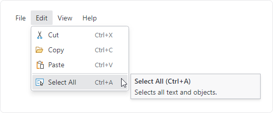

# Overview

The [BarMainMenu](xref:@ActiproUIRoot.Controls.Bars.BarMainMenu) control is meant to be a replacement for a native `Menu` control.  Its main benefit over a native `Menu` control is that it can be fully configured via MVVM.

## Usage Scenarios

### Window Main Menu

@if (avalonia) {
The [BarMainMenu](xref:@ActiproUIRoot.Controls.Bars.BarMainMenu) control usually appears at the top of a `Window`
}
@if (wpf) {
The [BarMainMenu](xref:@ActiproUIRoot.Controls.Bars.BarMainMenu) control usually appears at the top of a `Window` and immediately above any [Dockable Toolbars](../toolbar-features/dockable-toolbars.md) host that is present.
}



*A main menu at the top with one of its menus open*

A main menu can be defined like this in XAML:

@if (avalonia) {
```xaml
xmlns:actipro="http://schemas.actiprosoftware.com/avaloniaui"
...
<actipro:BarMainMenu>
	<actipro:BarMenuItem Label="File">
		<actipro:BarMenuItem Label="New" SmallImageSource="/Images/Icons/New16.png" Command="{Binding NewCommand}" InputGesture="Ctrl+N" />
		<actipro:BarMenuItem Label="Open" SmallImageSource="/Images/Icons/Open16.png" Command="{Binding OpenCommand}" InputGesture="Ctrl+O" />
		<actipro:BarMenuItem Label="Save" SmallImageSource="/Images/Icons/Save16.png" Command="{Binding SaveCommand}" InputGesture="Ctrl+S" />
		<actipro:BarMenuSeparator />
		<actipro:BarMenuItem Label="Exit" Command="{Binding ExitCommand}" />
	</actipro:BarMenuItem>
	<actipro:BarMenuItem Label="Edit">
		...
	</actipro:BarMenuItem>
	<actipro:BarMenuItem Label="View">
		...
	</actipro:BarMenuItem>
	<actipro:BarMenuItem Label="Help">
		...
	</actipro:BarMenuItem>
</actipro:BarMainMenu>
```
}
@if (wpf) {
```xaml
xmlns:bars="http://schemas.actiprosoftware.com/winfx/xaml/bars"
...
<bars:BarMainMenu>
	<bars:BarMenuItem Label="File">
		<bars:BarMenuItem Label="New" SmallImageSource="/Images/Icons/New16.png" Command="{Binding NewCommand}" InputGestureText="Ctrl+N" />
		<bars:BarMenuItem Label="Open" SmallImageSource="/Images/Icons/Open16.png" Command="{Binding OpenCommand}" InputGestureText="Ctrl+O" />
		<bars:BarMenuItem Label="Save" SmallImageSource="/Images/Icons/Save16.png" Command="{Binding SaveCommand}" InputGestureText="Ctrl+S" />
		<bars:BarMenuSeparator />
		<bars:BarMenuItem Label="Exit" Command="{Binding ExitCommand}" />
	</bars:BarMenuItem>
	<bars:BarMenuItem Label="Edit">
		...
	</bars:BarMenuItem>
	<bars:BarMenuItem Label="View">
		...
	</bars:BarMenuItem>
	<bars:BarMenuItem Label="Help">
		...
	</bars:BarMenuItem>
</bars:BarMainMenu>
```
}

## Child Controls

The [BarMainMenu](xref:@ActiproUIRoot.Controls.Bars.BarMainMenu) control expects [BarMenuItem](xref:@ActiproUIRoot.Controls.Bars.BarMenuItem) controls as its direct children.

Those [BarMenuItem](xref:@ActiproUIRoot.Controls.Bars.BarMenuItem) children can themselves host all [Bars controls](../controls/index.md) that are meant for a menu context.  A powerful feature is the ability to use a [popup menu item](../controls/popup-button.md) or [split menu item](../controls/split-button.md) to show a graphically-rich [menu gallery](../controls/gallery.md) in its popup menu.

## Key Tips

Key tips in child controls are supported since [BarMainMenu](xref:@ActiproUIRoot.Controls.Bars.BarMainMenu) is a root key tip scope.  Pressing keys like <kbd>Alt</kbd> will activate key tip mode the same as with a ribbon.

See the [Key Tips](../ribbon-features/key-tips.md) topic for more information on key tips.

## Screen Tips

The child controls of root menu items support screen tips, which are formatted tool tips.  Screen tips attempt to display to the far side of the menu item.

See the [Screen Tips](../ribbon-features/screen-tips.md) topic for more information on screen tips.

## MVVM Support

The optional companion [MVVM Library](../mvvm-support.md) defines a [BarMainMenuViewModel](xref:@ActiproUIRoot.Controls.Bars.Mvvm.BarMainMenuViewModel) class that is intended to be used as a view model for a [BarMainMenu](xref:@ActiproUIRoot.Controls.Bars.BarMainMenu) control.

@if (avalonia) {
If a [BarMainMenuViewModel](xref:@ActiproUIRoot.Controls.Bars.Mvvm.BarMainMenuViewModel) instance is bound to the [BarMainMenu](xref:@ActiproUIRoot.Controls.Bars.BarMainMenu).`DataContext`, a built-in `ControlTheme` with resource key [BarMainMenuControlTheme](xref:@ActiproUIRoot.Themes.Bars.Mvvm.BarsMvvmResourceKeys.BarMainMenuControlTheme) can be applied to configure bindings for all the view model's properties:

```xaml
xmlns:actipro="http://schemas.actiprosoftware.com/avaloniaui"
...
<actipro:BarMainMenu ...
	DataContext="{Binding MainMenu}"
	Theme="{StaticResource {x:Static actipro:BarsMvvmResourceKeys.BarMainMenuControlTheme}}"
	/>
```
}
@if (wpf) {
If a [BarMainMenuViewModel](xref:@ActiproUIRoot.Controls.Bars.Mvvm.BarMainMenuViewModel) instance is bound to the [BarMainMenu](xref:@ActiproUIRoot.Controls.Bars.BarMainMenu).`DataContext`, a built-in `Style` with resource key [BarsMvvmResourceKeys.BarMainMenuStyle](xref:@ActiproUIRoot.Themes.BarsMvvmResourceKeys.BarMainMenuStyle) can be applied to configure bindings for all the view model's properties:

```xaml
xmlns:bars="http://schemas.actiprosoftware.com/winfx/xaml/bars"
xmlns:themes="http://schemas.actiprosoftware.com/winfx/xaml/themes"
...
<bars:BarMainMenu ...
	DataContext="{Binding MainMenu}"
	Style="{StaticResource {x:Static themes:BarsMvvmResourceKeys.BarMainMenuStyle}}"
	/>
```
}

> [!TIP]
> See the [MVVM Support](../mvvm-support.md) topic for more information on how to use the library's view models and view templates to create and manage your application's bars controls with MVVM techniques.
