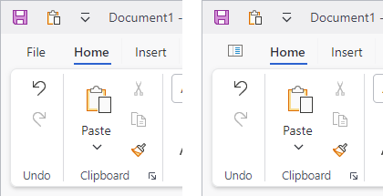
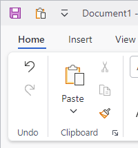

# Application Button

@if (avalonia) {
Ribbon supports an application button that can open a [backstage](backstage.md) when the button is clicked.
}
@if (wpf) {
Ribbon supports an application button that can open a menu that is generally populated by application-wide options such as **New**, **Open**, and **Save**.

Either a traditional [application menu](application-menu.md) or more modern [backstage](backstage.md) can be displayed when the button is clicked.  See the respective topics for more details on configuring each style.
}

The application button can also be hidden if a corresponding menu is not necessary or desired.



*The application button with default and custom content*

## Defining an Application Button

The application button can be defined in XAML or code-behind by assigning a [RibbonApplicationButton](xref:@ActiproUIRoot.Controls.Bars.RibbonApplicationButton) control instance to the [Ribbon](xref:@ActiproUIRoot.Controls.Bars.Ribbon).[ApplicationButtonContent](xref:@ActiproUIRoot.Controls.Bars.Ribbon.ApplicationButtonContent) property.

> [!NOTE]
> See the "MVVM Support" section below for details on alternatively using this property to define the application button via MVVM techniques.

This code sample shows how to define the application button for a ribbon:

@if (avalonia) {
```xaml
xmlns:actipro="http://schemas.actiprosoftware.com/avaloniaui"
...
<actipro:RibbonContainerPanel>
	<actipro:Ribbon>
		<actipro:Ribbon.ApplicationButtonContent>
			<actipro:RibbonApplicationButton />
		</actipro:Ribbon.ApplicationButtonContent>
	</actipro:Ribbon>
</actipro:RibbonContainerPanel>
```
}
@if (wpf) {
```xaml
xmlns:bars="http://schemas.actiprosoftware.com/winfx/xaml/bars"
...
<bars:RibbonContainerPanel>
	<bars:Ribbon>
		<bars:Ribbon.ApplicationButtonContent>
			<bars:RibbonApplicationButton />
		</bars:Ribbon.ApplicationButtonContent>
	</bars:Ribbon>
</bars:RibbonContainerPanel>
```
}

## MVVM Support

The application button may also be defined by setting the [Ribbon](xref:@ActiproUIRoot.Controls.Bars.Ribbon).[ApplicationButtonContent](xref:@ActiproUIRoot.Controls.Bars.Ribbon.ApplicationButtonContent) property to a view model that generates a [RibbonApplicationButton](xref:@ActiproUIRoot.Controls.Bars.RibbonApplicationButton) control via the ribbon's [ItemContainerTemplateSelector](xref:@ActiproUIRoot.Controls.Bars.Ribbon.ItemContainerTemplateSelector).

The optional companion [MVVM Library](../mvvm-support.md) defines a [RibbonApplicationButtonViewModel](xref:@ActiproUIRoot.Controls.Bars.Mvvm.RibbonApplicationButtonViewModel) class that is intended to be used as a view model for a [RibbonApplicationButton](xref:@ActiproUIRoot.Controls.Bars.RibbonApplicationButton) control, and the [BarControlTemplateSelector](xref:@ActiproUIRoot.Controls.Bars.Mvvm.BarControlTemplateSelector) class in the library generates a [RibbonApplicationButton](xref:@ActiproUIRoot.Controls.Bars.RibbonApplicationButton) for that view model.

> [!TIP]
> See the [MVVM Support](../mvvm-support.md) topic for more information on how to use the library's view models and view templates to create and manage your application's bars controls with MVVM techniques.

@if (avalonia) {
## Customizing the Application Button Theme

The [RibbonApplicationButton](xref:@ActiproUIRoot.Controls.Bars.RibbonApplicationButton) instance can be customized by setting a `ControlTheme` to the [Ribbon](xref:@ActiproUIRoot.Controls.Bars.Ribbon).[ApplicationButtonTheme](xref:@ActiproUIRoot.Controls.Bars.Ribbon.ApplicationButtonTheme) property.  This `ControlTheme` is applied to the control when it is added to the ribbon.
}
@if (wpf) {
## Customizing the Application Button Style

The [RibbonApplicationButton](xref:@ActiproUIRoot.Controls.Bars.RibbonApplicationButton) instance can be customized by setting a `Style` to the [Ribbon](xref:@ActiproUIRoot.Controls.Bars.Ribbon).[ApplicationButtonStyle](xref:@ActiproUIRoot.Controls.Bars.Ribbon.ApplicationButtonStyle) property.  This `Style` is applied to the control when it is added to the ribbon.
}

## Customizing Default Text

By default, the application button in ribbon will display with the text `"File"` as its content, which is defined by the string resource `UIApplicationButtonText`.

### String Resource

Changing the `UIApplicationButtonText` string resource will update the default text of all application button instances used in an application.  The [key tip](key-tips.md) for the button is automatically generated from the same string resource, and will typically be the first letter of the text.  This code shows how to set a custom value for the string resource:

```csharp
ActiproSoftware.Products.Bars.SR.SetCustomString(ActiproSoftware.Products.Bars.SRName.UIApplicationButtonText.ToString(), "Home");
```

See the [Customizing String Resources](../../customizing-string-resources.md) topic for additional details.

### Label and KeyTipText Properties

As an alternative to customizing the string resource, the [RibbonApplicationButton](xref:@ActiproUIRoot.Controls.Bars.RibbonApplicationButton).[Label](xref:@ActiproUIRoot.Controls.Bars.Primitives.BarPopupButtonBase.Label) and [RibbonApplicationButton](xref:@ActiproUIRoot.Controls.Bars.RibbonApplicationButton).[KeyTipText](xref:@ActiproUIRoot.Controls.Bars.Primitives.BarPopupButtonBase.KeyTipText) can be set directly to the desired value as illustrated in the following example:

@if (avalonia) {
```xaml
xmlns:actipro="http://schemas.actiprosoftware.com/avaloniaui"
...
<actipro:RibbonContainerPanel>
	<actipro:Ribbon>
		<actipro:Ribbon.ApplicationButtonContent>
			<actipro:RibbonApplicationButton Label="Home" KeyTipText="H" />
		</actipro:Ribbon.ApplicationButtonContent>
	</actipro:Ribbon>
</actipro:RibbonContainerPanel>
```
}
@if (wpf) {
```xaml
xmlns:bars="http://schemas.actiprosoftware.com/winfx/xaml/bars"
...
<bars:RibbonContainerPanel>
	<bars:Ribbon>
		<bars:Ribbon.ApplicationButtonContent>
			<bars:RibbonApplicationButton Label="Home" KeyTipText="H" />
		</bars:Ribbon.ApplicationButtonContent>
	</bars:Ribbon>
</bars:RibbonContainerPanel>
```
}

## Custom Button Content

@if (avalonia) {
The [RibbonApplicationButton](xref:@ActiproUIRoot.Controls.Bars.RibbonApplicationButton).`Content` property can be set to any `Object` which is supported by `ContentPresenter`, so custom content like an image can easily be used instead of text.  The following example shows how to set an image for the content using a [DynamicImage](../../shared/controls/dynamic-image.md):

```xaml
xmlns:actipro="http://schemas.actiprosoftware.com/avaloniaui"
...
<actipro:RibbonContainerPanel>
	<actipro:Ribbon>
		<actipro:Ribbon.ApplicationButtonContent>
			<actipro:RibbonApplicationButton>
				<actipro:RibbonApplicationButton.Content>
					<actipro:DynamicImage Width="16" Height="16" VerticalAlignment="Center"
					                      Stretch="Uniform" StretchDirection="DownOnly"
					                      Source="/Images/SomeImage.png" />
				</actipro:RibbonApplicationButton.Content>
			</actipro:RibbonApplicationButton>
		</actipro:Ribbon.ApplicationButtonContent>
	</actipro:Ribbon>
</actipro:RibbonContainerPanel>
```
}
@if (wpf) {
The [RibbonApplicationButton](xref:@ActiproUIRoot.Controls.Bars.RibbonApplicationButton).[Content](xref:@ActiproUIRoot.Controls.Bars.RibbonApplicationButton.Content) property can be set to any `Object` which is supported by `ContentPresenter`, so custom content like an image can easily be used instead of text.  The following example shows how to set an image for the content using a [DynamicImage](../../shared/windows-controls/dynamicimage.md):

```xaml
xmlns:bars="http://schemas.actiprosoftware.com/winfx/xaml/bars"
xmlns:shared="http://schemas.actiprosoftware.com/winfx/xaml/shared"
...
<bars:RibbonContainerPanel>
	<bars:Ribbon>
		<bars:Ribbon.ApplicationButtonContent>
			<bars:RibbonApplicationButton>
				<bars:RibbonApplicationButton.Content>
					<shared:DynamicImage Width="16" Height="16" VerticalAlignment="Center"
					                     Stretch="Uniform" StretchDirection="DownOnly"
					                     Source="/Images/SomeImage.png" SnapsToDevicePixels="True" />
				</bars:RibbonApplicationButton.Content>
			</bars:RibbonApplicationButton>
		</bars:Ribbon.ApplicationButtonContent>
	</bars:Ribbon>
</bars:RibbonContainerPanel>
```
}

> [!TIP]
> See the "Application Button" Bars Ribbon QuickStart of the Sample Browser application for a full demonstration of setting the button content.

## Hiding the Application Button

If your application does not need @if (wpf) { an [Application Menu](application-menu.md) or } a [Backstage](backstage.md), you may want to hide the application button completely by setting the [Ribbon](xref:@ActiproUIRoot.Controls.Bars.Ribbon).[IsApplicationButtonVisible](xref:@ActiproUIRoot.Controls.Bars.Ribbon.IsApplicationButtonVisible) property to `false`.



*A ribbon with its application button hidden*

When hidden, the tabs slide over to fill the space that was previously occupied by the application button.