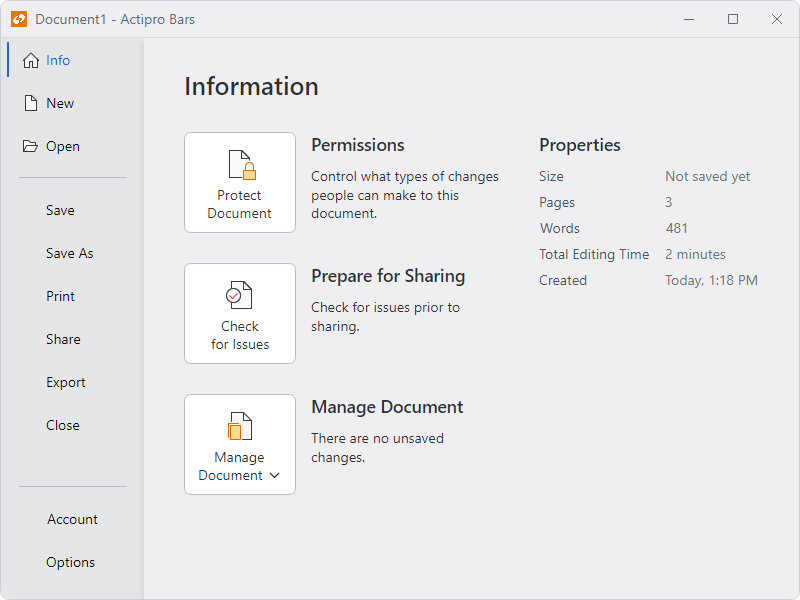
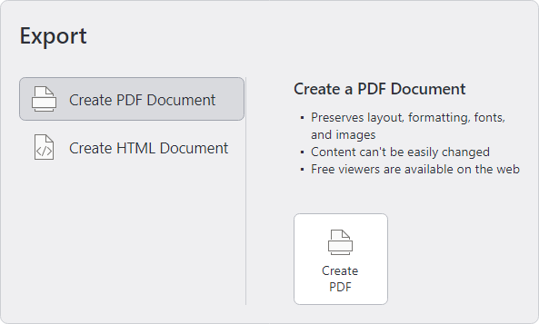

# Backstage

The backstage was introduced in Office 2010 and can be displayed when clicking the [application button](application-button.md).  It is commonly used for file-based actions like **New**, **Open**, and **Save**.  When it is opened, the backstage takes over the entire window.  A subtle animation is used when opening/closing to help provide a smooth transition.



@if (avalonia) {
*A backstage with styled buttons*
}
@if (wpf) {
*A backstage with styled buttons and backdrop effect*
}

The backstage is organized such that buttons and tabs appear on the near side (the header area) and the selected tab's content appears on the far side (the content area).

@if (wpf) {
> [!IMPORTANT]
> A ribbon must be hosted within a [RibbonWindow](ribbon-window.md) and [RibbonContainerPanel](xref:@ActiproUIRoot.Controls.Bars.RibbonContainerPanel) to support the backstage taking over the entire window.

> [!NOTE]
> See the [Application Menu](application-menu.md) topic for details on how to define a more traditional application menu instead of a backstage.
}

## Defining a Backstage

The backstage can be defined in XAML or code-behind by assigning a [RibbonBackstage](xref:@ActiproUIRoot.Controls.Bars.RibbonBackstage) control instance to the [Ribbon](xref:@ActiproUIRoot.Controls.Bars.Ribbon).[BackstageContent](xref:@ActiproUIRoot.Controls.Bars.Ribbon.BackstageContent) property.

> [!NOTE]
> See the "MVVM Support" section below for details on alternatively using this property to define the backstage via MVVM techniques.

This code sample shows how to define a backstage for a ribbon.

@if (avalonia) {
```xaml
xmlns:actipro="http://schemas.actiprosoftware.com/avaloniaui"
...
<actipro:RibbonContainerPanel>
	<actipro:Ribbon>
		<actipro:Ribbon.BackstageContent>
			<actipro:RibbonBackstage>

				<!-- Tabs, buttons and separators go here in any order -->

				<actipro:RibbonBackstageTabItem Key="Info">
					<!-- Tab content goes here -->
				</actipro:RibbonBackstageTabItem>
				<actipro:RibbonBackstageHeaderSeparator />
				<actipro:RibbonBackstageHeaderButton Key="Save" Command="{Binding SaveCommand}" />

				<!-- The following are aligned to the bottom -->
				<actipro:RibbonBackstageHeaderSeparator HeaderAlignment="Bottom" />
				<actipro:RibbonBackstageTabItem Key="Options" HeaderAlignment="Bottom">
					<!-- Tab content goes here -->
				</actipro:RibbonBackstageTabItem>
				<actipro:RibbonBackstageHeaderButton Key="Exit" HeaderAlignment="Bottom" />

			</actipro:RibbonBackstage>
		</actipro:Ribbon.BackstageContent>
	</actipro:Ribbon>

	<!-- Content below the ribbon goes here -->

</actipro:RibbonContainerPanel>
```
}
@if (wpf) {
```xaml
xmlns:bars="http://schemas.actiprosoftware.com/winfx/xaml/bars"
...
<bars:RibbonContainerPanel>
	<bars:Ribbon>
		<bars:Ribbon.BackstageContent>
			<bars:RibbonBackstage>

				<!-- Tabs, buttons and separators go here in any order -->

				<bars:RibbonBackstageTabItem Key="Info">
					<!-- Tab content goes here -->
				</bars:RibbonBackstageTabItem>
				<bars:RibbonBackstageHeaderSeparator />
				<bars:RibbonBackstageHeaderButton Key="Save" Command="ApplicationCommands.Save" />

				<!-- The following are aligned to the bottom -->
				<bars:RibbonBackstageHeaderSeparator HeaderAlignment="Bottom" />
				<bars:RibbonBackstageTabItem Key="Options" HeaderAlignment="Bottom">
					<!-- Tab content goes here -->
				</bars:RibbonBackstageTabItem>
				<bars:RibbonBackstageHeaderButton Key="Exit" HeaderAlignment="Bottom" />

			</bars:RibbonBackstage>
		</bars:Ribbon.BackstageContent>
	</bars:Ribbon>

	<!-- Content below the ribbon goes here -->

</bars:RibbonContainerPanel>
```
}

@if (wpf) {
> [!IMPORTANT]
> The [Ribbon](xref:@ActiproUIRoot.Controls.Bars.Ribbon) that defines a backstage should be a child of a [RibbonContainerPanel](xref:@ActiproUIRoot.Controls.Bars.RibbonContainerPanel) for the backstage to display properly. When a backstage is opened, it will cover the entire area defined by the [RibbonContainerPanel](xref:@ActiproUIRoot.Controls.Bars.RibbonContainerPanel) (with additional support when hosted inside a [RibbonWindow](xref:@ActiproUIRoot.Controls.Bars.RibbonWindow)).  See the [Control Hierarchy](control-hierarchy.md) topic for more information on optionally defining the [Ribbon](xref:@ActiproUIRoot.Controls.Bars.Ribbon) inside a `ContentControl`.
}

@if (wpf) {
## Header Area Transparency

The backstage template is set up to use a transparent background in its tab header area when a system backdrop like Mica (available starting in Windows 11) is enabled on the containing `Window`'s [WindowChrome](../../themes/windowchrome.md).  It is important to use the control hierarchy described above that involves [RibbonContainerPanel](xref:@ActiproUIRoot.Controls.Bars.RibbonContainerPanel), as the panel will hide when backstage is open, allowing the system backdrop background to show through to the backstage header area instead of content like a ribbon control that is underneath the backstage.

In a scenario where there is other content outside of the panel that is showing in the backstage header area when backstage is open, it can be hidden in response to the [RibbonBackstage](xref:@ActiproUIRoot.Controls.Bars.RibbonBackstage).[IsOpenChanged](xref:@ActiproUIRoot.Controls.Bars.RibbonBackstage.IsOpenChanged) event that bubbles up.

When the containing window's chrome is not configured to use a system backdrop, or on pre-Windows 11 systems, the backstage header area will use an opaque background.

See the [WindowChrome](../../themes/windowchrome.md) topic for complete details on the application and operating system requirements necessary to support transparency.
}

## MVVM Support

The backstage may also be defined by setting the [Ribbon](xref:@ActiproUIRoot.Controls.Bars.Ribbon).[BackstageContent](xref:@ActiproUIRoot.Controls.Bars.Ribbon.BackstageContent) property to a view model that generates a [RibbonBackstage](xref:@ActiproUIRoot.Controls.Bars.RibbonBackstage) control via the ribbon's [ItemContainerTemplateSelector](xref:@ActiproUIRoot.Controls.Bars.Ribbon.ItemContainerTemplateSelector).

The optional companion [MVVM Library](../mvvm-support.md) defines a [RibbonBackstageViewModel](xref:@ActiproUIRoot.Controls.Bars.Mvvm.RibbonBackstageViewModel) class that is intended to be used as a view model for a [RibbonBackstage](xref:@ActiproUIRoot.Controls.Bars.RibbonBackstage) control, and the [BarControlTemplateSelector](xref:@ActiproUIRoot.Controls.Bars.Mvvm.BarControlTemplateSelector) class in the library generates a [RibbonBackstage](xref:@ActiproUIRoot.Controls.Bars.RibbonBackstage) for that view model.

> [!TIP]
> See the [MVVM Support](../mvvm-support.md) topic for more information on how to use the library's view models and view templates to create and manage your application's bars controls with MVVM techniques.

@if (avalonia) {
## Customizing the Backstage Theme

The [RibbonBackstage](xref:@ActiproUIRoot.Controls.Bars.RibbonBackstage) instance can be customized by setting a `ControlTheme` to the [Ribbon](xref:@ActiproUIRoot.Controls.Bars.Ribbon).[BackstageTheme](xref:@ActiproUIRoot.Controls.Bars.Ribbon.BackstageTheme) property.  This `ControlTheme` is applied to the control when it is added to the ribbon.
}
@if (wpf) {
## Customizing the Backstage Style

The [RibbonBackstage](xref:@ActiproUIRoot.Controls.Bars.RibbonBackstage) instance can be customized by setting a `Style` to the [Ribbon](xref:@ActiproUIRoot.Controls.Bars.Ribbon).[BackstageStyle](xref:@ActiproUIRoot.Controls.Bars.Ribbon.BackstageStyle) property.  This `Style` is applied to the control when it is added to the ribbon.
}

## Defining Backstage Items

The [RibbonBackstage](xref:@ActiproUIRoot.Controls.Bars.RibbonBackstage) control can contain these types of controls, which appear vertically in its header area: [RibbonBackstageHeaderButton](xref:@ActiproUIRoot.Controls.Bars.RibbonBackstageHeaderButton), [RibbonBackstageTabItem](xref:@ActiproUIRoot.Controls.Bars.RibbonBackstageTabItem), and [RibbonBackstageHeaderSeparator](xref:@ActiproUIRoot.Controls.Bars.RibbonBackstageHeaderSeparator).

Controls with the same header alignment appear in the order in which they are defined in the [RibbonBackstage](xref:@ActiproUIRoot.Controls.Bars.RibbonBackstage).  This allows you to freely intermix the order of buttons, tabs, and any separators. By default, each item is aligned to the top but setting the control's `HeaderAlignment` property to [RibbonBackstageHeaderAlignment](xref:@ActiproUIRoot.Controls.Bars.RibbonBackstageHeaderAlignment).[Bottom](xref:@ActiproUIRoot.Controls.Bars.RibbonBackstageHeaderAlignment.Bottom) will shift the alignment to the bottom.

### Buttons

[RibbonBackstageHeaderButton](xref:@ActiproUIRoot.Controls.Bars.RibbonBackstageHeaderButton) controls generally appear at the top and bottom of the backstage header area.  They are often set to the most common application commands such as **Save**, that can be easily executed with one click.

These buttons will close the ancestor [RibbonBackstage](xref:@ActiproUIRoot.Controls.Bars.RibbonBackstage) when they are clicked.  This behavior can be disabled by setting the button's [CanCloseBackstage](xref:@ActiproUIRoot.Controls.Bars.RibbonBackstageHeaderButton.CanCloseBackstage) property to `false`.

### Tabs

[RibbonBackstageTabItem](xref:@ActiproUIRoot.Controls.Bars.RibbonBackstageTabItem) controls can be added when there are multiple configuration possibilities or there is data that needs to be displayed.  For instance, an **Info** tab may provide information and statistics about the current document.  A **Recent** tab might show a [Recent Documents](recent-documents.md) control (with its [UseLargeSize](xref:@ActiproUIRoot.Controls.Bars.RecentDocumentControl.UseLargeSize) property set to `true`) allowing for recent documents to be selected.  A **New** tab might show multiple options for creating new documents.

@if (avalonia) {
The [Label](xref:@ActiproUIRoot.Controls.Bars.RibbonBackstageTabItem.Label) and optional image ([LargeIcon](xref:@ActiproUIRoot.Controls.Bars.RibbonBackstageTabItem.LargeIcon) or [SmallIcon](xref:@ActiproUIRoot.Controls.Bars.RibbonBackstageTabItem.SmallIcon)) of the [RibbonBackstageTabItem](xref:@ActiproUIRoot.Controls.Bars.RibbonBackstageTabItem) are what is rendered in the backstage header area.  The tab's content is displayed in the backstage content area when the tab is selected.
}
@if (wpf) {
The [Label](xref:@ActiproUIRoot.Controls.Bars.RibbonBackstageTabItem.Label) and optional image ([LargeImageSource](xref:@ActiproUIRoot.Controls.Bars.RibbonBackstageTabItem.LargeImageSource) or [SmallImageSource](xref:@ActiproUIRoot.Controls.Bars.RibbonBackstageTabItem.SmallImageSource)) of the [RibbonBackstageTabItem](xref:@ActiproUIRoot.Controls.Bars.RibbonBackstageTabItem) are what is rendered in the backstage header area.  The tab's content is displayed in the backstage content area when the tab is selected.
}

When there are not many tabs or buttons to display in the backstage, the backstage can look empty.  This is common, for example, when an application is first launched and no document is open.  To help fill the vertical space, the [RibbonBackstageTabItem](xref:@ActiproUIRoot.Controls.Bars.RibbonBackstageTabItem).[VariantSize](xref:@ActiproUIRoot.Controls.Bars.RibbonBackstageTabItem.VariantSize) can be set to `Large` to display tabs that are significantly larger.

> [!NOTE]
> The header of a tab is automatically generated, so any content assigned to the [RibbonBackstageTabItem](xref:@ActiproUIRoot.Controls.Bars.RibbonBackstageTabItem).`Header` property is ignored.

### Separators

[RibbonBackstageHeaderSeparator](xref:@ActiproUIRoot.Controls.Bars.RibbonBackstageHeaderSeparator) can be added to separate buttons or tabs in the header area like separators on a menu.  Use separators to visually group related items.

## Auto-Selecting a Tab When Backstage Opens

The first tab is auto-selected if no tab is currently selected when the backstage opens or when the [RibbonBackstage](xref:@ActiproUIRoot.Controls.Bars.RibbonBackstage).[CanSelectFirstTabOnOpen](xref:@ActiproUIRoot.Controls.Bars.RibbonBackstage.CanSelectFirstTabOnOpen) property is `true`, which is that property's default value.

The [RibbonBackstage](xref:@ActiproUIRoot.Controls.Bars.RibbonBackstage).[IsOpen](xref:@ActiproUIRoot.Controls.Bars.RibbonBackstage.IsOpen) property gets or sets whether the backstage is currently open.  A related [RibbonBackstage](xref:@ActiproUIRoot.Controls.Bars.RibbonBackstage).[IsOpenChanged](xref:@ActiproUIRoot.Controls.Bars.RibbonBackstage.IsOpenChanged) event is raised whenever that property changes.  This is an ideal place to initialize the backstage so that a certain tab is always selected when it opens.

The event handler for the [RibbonBackstage](xref:@ActiproUIRoot.Controls.Bars.RibbonBackstage).[IsOpenChanged](xref:@ActiproUIRoot.Controls.Bars.RibbonBackstage.IsOpenChanged) event can check to see if the backstage is being opened and, if so, ensure the [RibbonBackstage](xref:@ActiproUIRoot.Controls.Bars.RibbonBackstage).`SelectedItem` property is set to the desired tab.

Set the [RibbonBackstage](xref:@ActiproUIRoot.Controls.Bars.RibbonBackstage).[CanSelectFirstTabOnOpen](xref:@ActiproUIRoot.Controls.Bars.RibbonBackstage.CanSelectFirstTabOnOpen) property to `false` if the selected tab will be set programmatically.

## TaskTabControl

The [TaskTabControl](xref:@ActiproUIRoot.Controls.Bars.TaskTabControl) is a styled version of a native `TabControl` that renders its tabs on the left side.  The selected tab's content appears on the right side.  This tab control is ideal for use on a [RibbonBackstageTabItem](xref:@ActiproUIRoot.Controls.Bars.RibbonBackstageTabItem) since it provides a secondary level of tabs.  It can be used externally to backstage as well.



*A TaskTabControl with a styled BarButton on the selected tab*

The items of a [TaskTabControl](xref:@ActiproUIRoot.Controls.Bars.TaskTabControl) can be either [TaskTabItem](xref:@ActiproUIRoot.Controls.Bars.TaskTabItem) or standard `Separator` controls.

@if (avalonia) {
Use the [TaskTabItem](xref:@ActiproUIRoot.Controls.Bars.TaskTabItem).[Label](xref:@ActiproUIRoot.Controls.Bars.TaskTabItem.Label) and [TaskTabItem](xref:@ActiproUIRoot.Controls.Bars.TaskTabItem).[LargeIcon](xref:@ActiproUIRoot.Controls.Bars.TaskTabItem.LargeIcon) properties to define the tab header.
}
@if (wpf) {
Use the [TaskTabItem](xref:@ActiproUIRoot.Controls.Bars.TaskTabItem).[Label](xref:@ActiproUIRoot.Controls.Bars.TaskTabItem.Label) and [TaskTabItem](xref:@ActiproUIRoot.Controls.Bars.TaskTabItem).[LargeImageSource](xref:@ActiproUIRoot.Controls.Bars.TaskTabItem.LargeImageSource) properties to define the tab header.
}

@if (avalonia) {
## Backstage Button Themes

The backstage content area commonly uses large buttons.  The various button controls ([BarButton](xref:@ActiproUIRoot.Controls.Bars.BarButton), [BarToggleButton](xref:@ActiproUIRoot.Controls.Bars.BarToggleButton), [BarPopupButton](xref:@ActiproUIRoot.Controls.Bars.BarPopupButton), [BarSplitButton](xref:@ActiproUIRoot.Controls.Bars.BarSplitButton), and [BarSplitToggleButton](xref:@ActiproUIRoot.Controls.Bars.BarSplitToggleButton)) have special themes that can be applied to display as a large button.}
@if (wpf) {
## Backstage Button Styles

The backstage content area commonly uses large buttons.  Both the [BarButton](xref:@ActiproUIRoot.Controls.Bars.BarButton) and [BarPopupButton](xref:@ActiproUIRoot.Controls.Bars.BarPopupButton) controls have special styles that can be applied to display as a large button.
}

Use of those @if (avalonia) { themes }@if (wpf) { styles } results in buttons with an appearance similar to Office's Backstage, and as seen in the `TaskTabControl` screenshot above. The following example shows how to apply the @if (avalonia) { themes }@if (wpf) { styles }:

@if (avalonia) {
```xaml
xmlns:actipro="http://schemas.actiprosoftware.com/avaloniaui"
...
<actipro:BarButton Theme="{actipro:ControlTheme RibbonBackstageBarButtonOutline}" />
<actipro:BarToggleButton Theme="{actipro:ControlTheme RibbonBackstageBarButtonOutline}" />
<actipro:BarPopupButton Theme="{actipro:ControlTheme RibbonBackstageBarPopupButtonOutline}" />
<actipro:BarSplitButton Theme="{actipro:ControlTheme RibbonBackstageBarSplitButtonOutline}" />
<actipro:BarSplitToggleButton Theme="{actipro:ControlTheme RibbonBackstageBarSplitButtonOutline}" />
```
}
@if (wpf) {
```xaml
xmlns:bars="http://schemas.actiprosoftware.com/winfx/xaml/bars"
xmlns:themes="http://schemas.actiprosoftware.com/winfx/xaml/themes"
...
<bars:BarButton Style="{StaticResource {x:Static themes:BarsResourceKeys.RibbonBackstageButtonStyleKey}}" />
<bars:BarPopupButton Style="{StaticResource {x:Static themes:BarsResourceKeys.RibbonBackstagePopupButtonStyleKey}}" />
```
}

## Preventing Backstage from Closing

The [RibbonBackstage](xref:@ActiproUIRoot.Controls.Bars.RibbonBackstage).[CanClose](xref:@ActiproUIRoot.Controls.Bars.RibbonBackstage.CanClose) property can be set to `false` which prevents the backstage from closing by hiding the close button and ignoring the <kbd>Esc</kbd> key that typically closing backstage.

This is useful in scenarios where you are starting up an application and wish to block end user access to the main window until they create a new document or open a document.  These or other actions can be presented on a non-closable backstage.

> [!TIP]
> See the "Backstage" Bars Ribbon QuickStart of the Sample Browser application for a full demonstration of configuring a backstage.
