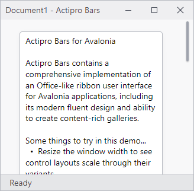

# Collapsing

The ribbon is capable of collapsing when it becomes smaller than a threshold size.  When in a collapsed state, the ribbon (including the [quick access toolbar](quick-access-toolbar.md)) hides since there is not enough space for its interface.

*The ribbon in an expanded normal state*

*The ribbon in a collapsed state*

@if (avalonia) {
> [!TIP]
> The automatic collapsing behavior can be disabled.
}
@if (wpf) {
> [!TIP]
> The automatic collapsing behavior can be disabled, and the threshold size can be configured.
}

> [!IMPORTANT]
> "Minimized" and "Collapsed" are two separate concepts for ribbon that are easy to confuse. "Minimized" indicates only the ribbon tabs are visible whereas "Collapsed" means the entire ribbon is hidden.  See the [Minimization](minimization.md) topic for more details.

## Related Members

The [Ribbon](xref:@ActiproUIRoot.Controls.Bars.Ribbon) defines several members that relate to collapsing.

@if (avalonia) {
| Member | Description |
|-----|-----|
| [IsCollapsed](xref:@ActiproUIRoot.Controls.Bars.Ribbon.IsCollapsed) Property | Gets or sets whether the ribbon is currently collapsed.  This property should not need to be called by your code under normal circumstances. |
| [IsCollapsedChanged](xref:@ActiproUIRoot.Controls.Bars.Ribbon.IsCollapsedChanged) Event | Occurs when the [IsCollapsed](xref:@ActiproUIRoot.Controls.Bars.Ribbon.IsCollapsed) property value has changed. |
| [IsCollapsible](xref:@ActiproUIRoot.Controls.Bars.Ribbon.IsCollapsible) Property | Gets or sets whether the ribbon collapses when it becomes smaller than a minimum threshold. |
}
@if (wpf) {
| Member | Description |
|-----|-----|
| [CollapseThresholdSize](xref:@ActiproUIRoot.Controls.Bars.Ribbon.CollapseThresholdSize) Property | Gets or sets the threshold `Size` that triggers a ribbon collapse if the ribbon is sized smaller than the threshold.  The default threshold size is `270, 170`. |
| [IsCollapsed](xref:@ActiproUIRoot.Controls.Bars.Ribbon.IsCollapsed) Property | Gets or sets whether the ribbon is currently collapsed.  This property should not need to be called by your code under normal circumstances. |
| [IsCollapsedChanged](xref:@ActiproUIRoot.Controls.Bars.Ribbon.IsCollapsedChanged) Event | Occurs when the [IsCollapsed](xref:@ActiproUIRoot.Controls.Bars.Ribbon.IsCollapsed) property value has changed. |
| [IsCollapsible](xref:@ActiproUIRoot.Controls.Bars.Ribbon.IsCollapsible) Property | Gets or sets whether the ribbon collapses when it becomes smaller than a minimum threshold width/height as specified by the [CollapseThresholdSize](xref:@ActiproUIRoot.Controls.Bars.Ribbon.CollapseThresholdSize) property. |
}