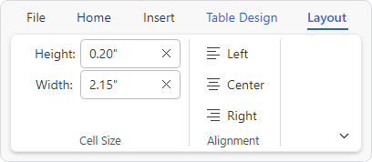

# Contextual Tabs

The controls used most often in an application are always available on the ribbon.  However, sometimes a specific object is selected in a document (such as a picture, table, or chart) that requires additional controls for proper interaction with the object.  This is where contextual tabs come in since they contain the controls that relate to the selected object and are not important enough to display all the time.

Contextual tabs functional the same as standard tabs except that they are associated with a [RibbonContextualTabGroup](xref:@ActiproUIRoot.Controls.Bars.RibbonContextualTabGroup) and are only displayed when the associated [RibbonContextualTabGroup](xref:@ActiproUIRoot.Controls.Bars.RibbonContextualTabGroup) is visible. The tabs also have an alternate appearance to help differentiate them from standard tabs.



*Ribbon with two contextual tabs, one selected*

## Defining Contextual Tabs

Contextual tab groups are defined in the [Ribbon](xref:@ActiproUIRoot.Controls.Bars.Ribbon).[ContextualTabGroups](xref:@ActiproUIRoot.Controls.Bars.Ribbon.ContextualTabGroups) collection.  Each [RibbonContextualTabGroup](xref:@ActiproUIRoot.Controls.Bars.RibbonContextualTabGroup) defines a [Key](xref:@ActiproUIRoot.Controls.Bars.RibbonContextualTabGroup.Key) property that is used to associate one or more contextual [RibbonTabItem](xref:@ActiproUIRoot.Controls.Bars.RibbonTabItem) instances with that group.

Each [RibbonTabItem](xref:@ActiproUIRoot.Controls.Bars.RibbonTabItem) is defined like standard tabs *except* an additional [ContextualTabGroupKey](xref:@ActiproUIRoot.Controls.Bars.RibbonTabItem.ContextualTabGroupKey) property is assigned the same value as the corresponding [RibbonContextualTabGroup](xref:@ActiproUIRoot.Controls.Bars.RibbonContextualTabGroup).[Key](xref:@ActiproUIRoot.Controls.Bars.RibbonContextualTabGroup.Key)

See the [Tabs, Groups, and Control Groups](tabs-groups-controlgroups.md) topic for more details on defining standard tabs.

The following code sample shows how to define two contextual tab groups for a ribbon (`PictureTools` and `TableTools`) and then associate tabs with the corresponding group:

@if (avalonia) {
```xaml
xmlns:actipro="http://schemas.actiprosoftware.com/avaloniaui"
...
<actipro:RibbonContainerPanel>
	<actipro:Ribbon>

		<!-- Define ContextualTabGroups -->
		<actipro:Ribbon.ContextualTabGroups>
			<actipro:RibbonContextualTabGroup Key="PictureTools" />
			<actipro:RibbonContextualTabGroup Key="TableTools" />
		</actipro:Ribbon.ContextualTabGroups>

		<!-- Standard Tabs (Always Visible) -->
		<actipro:RibbonTabItem Key="Home">
			...
		</actipro:RibbonTabItem>

		<!-- Picture Tools Contextual Tabs -->
		<actipro:RibbonTabItem Key="PictureFormat" ContextualTabGroupKey="PictureTools">
			...
		</actipro:RibbonTabItem>

		<!-- Table Tools Contextual Tabs -->
		<actipro:RibbonTabItem Key="TableDesign" ContextualTabGroupKey="TableTools">
			...
		</actipro:RibbonTabItem>
		<actipro:RibbonTabItem Key="Layout" ContextualTabGroupKey="TableTools">
			...
		</actipro:RibbonTabItem>

	</actipro:Ribbon>
</actipro:RibbonContainerPanel>
```
}
@if (wpf) {
```xaml
xmlns:bars="http://schemas.actiprosoftware.com/winfx/xaml/bars"
...
<bars:RibbonContainerPanel>
	<bars:Ribbon>

		<!-- Define ContextualTabGroups -->
		<bars:Ribbon.ContextualTabGroups>
			<bars:RibbonContextualTabGroup Key="PictureTools" />
			<bars:RibbonContextualTabGroup Key="TableTools" />
		</bars:Ribbon.ContextualTabGroups>

		<!-- Standard Tabs (Always Visible) -->
		<bars:RibbonTabItem Key="Home">
			...
		</bars:RibbonTabItem>

		<!-- Picture Tools Contextual Tabs -->
		<bars:RibbonTabItem Key="PictureFormat" ContextualTabGroupKey="PictureTools">
			...
		</bars:RibbonTabItem>

		<!-- Table Tools Contextual Tabs -->
		<bars:RibbonTabItem Key="TableDesign" ContextualTabGroupKey="TableTools">
			...
		</bars:RibbonTabItem>
		<bars:RibbonTabItem Key="Layout" ContextualTabGroupKey="TableTools">
			...
		</bars:RibbonTabItem>

	</bars:Ribbon>
</bars:RibbonContainerPanel>
```
}

## Showing / Hiding a Contextual Tab Group

@if (avalonia) {
The [RibbonContextualTabGroup](xref:@ActiproUIRoot.Controls.Bars.RibbonContextualTabGroup).`IsVisible` property determines the visibility of the associated [tab](tabs-groups-controlgroups.md) controls.

When the [RibbonContextualTabGroup](xref:@ActiproUIRoot.Controls.Bars.RibbonContextualTabGroup).`IsVisible` property is set to `true`, all its associated [tab](tabs-groups-controlgroups.md) controls are displayed.  Likewise, setting the `IsVisible` property to `false` hides all its associated tabs.  Multiple contextual tab groups can be visible at the same time.
}
@if (wpf) {
The [RibbonContextualTabGroup](xref:@ActiproUIRoot.Controls.Bars.RibbonContextualTabGroup).`Visibility` property determines the visibility of the associated [tab](tabs-groups-controlgroups.md) controls.

When the [RibbonContextualTabGroup](xref:@ActiproUIRoot.Controls.Bars.RibbonContextualTabGroup).`Visibility` property is set to `Visible`, all its associated [tab](tabs-groups-controlgroups.md) controls are displayed.  Likewise, setting the `Visibility` property to `Collapsed` hides all its associated tabs.  Multiple contextual tab groups can be visible at the same time.
}

The following code sample demonstrates one way to show all the tabs associated with a [RibbonContextualTabGroup](xref:@ActiproUIRoot.Controls.Bars.RibbonContextualTabGroup):

@if (avalonia) {
```csharp
using ActiproSoftware.UI.Avalonia.Controls.Bars;
using System.Linq;
...
Ribbon ribbon;
...
var pictureToolsGroup = ribbon.ContextualTabGroups
	.OfType<RibbonContextualTabGroup>()
	.FirstOrDefault(group => group.Key == "PictureTools")
if (pictureToolsGroup != null)
	pictureToolsGroup.IsVisible = true;
```
}
@if (wpf) {
```csharp
using ActiproSoftware.Windows.Controls.Bars;
using System.Linq;
...
Ribbon ribbon;
...
var pictureToolsGroup = ribbon.ContextualTabGroups
	.OfType<RibbonContextualTabGroup>()
	.FirstOrDefault(group => group.Key == "PictureTools")
if (pictureToolsGroup != null)
	pictureToolsGroup.Visibility = System.Windows.Visibility.Visible;
```
}

> [!TIP]
> See the "Contextual Tabs" Bars Ribbon QuickStart of the Sample Browser application for a full demonstration of working with contextual tabs.