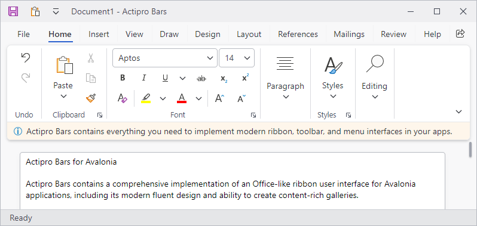

# Footer

Ribbon includes a built-in footer for displaying additional content below the ribbon.  The footer can be set to any content and is a great place to display tips or notifications.



*A ribbon with a footer*

## Defining a Footer

The footer can be defined in XAML or code-behind by assigning a [RibbonFooterControl](xref:@ActiproUIRoot.Controls.Bars.RibbonFooterControl) control instance to the [Ribbon](xref:@ActiproUIRoot.Controls.Bars.Ribbon).[FooterContent](xref:@ActiproUIRoot.Controls.Bars.Ribbon.FooterContent) property.

> [!NOTE]
> See the "MVVM Support" section below for details on alternatively using this property to define the footer via MVVM techniques.

The following example demonstrates defining a footer message with an icon.

@if (avalonia) {
```xaml
xmlns:actipro="http://schemas.actiprosoftware.com/avaloniaui"
...
<actipro:RibbonContainerPanel>
	<actipro:Ribbon>
		<actipro:Ribbon.FooterContent>
			<actipro:RibbonFooterControl>
				<DockPanel>
					<actipro:DynamicImage
						DockPanel.Dock="Left" Width="16" Height="16" Margin="0,0,5,0"
						Stretch="Uniform" StretchDirection="DownOnly" Source="/Images/Info16.png"
						HorizontalAlignment="Center" VerticalAlignment="Center"
						UseLayoutRounding="True" />
					<TextBlock VerticalAlignment="Center" TextWrapping="Wrap" Text="Footer message here."/>
				</DockPanel>
			</actipro:RibbonFooterControl>
		</actipro:Ribbon.FooterContent>
	</actipro:Ribbon>
</actipro:RibbonContainerPanel>
```
}
@if (wpf) {
```xaml
xmlns:bars="http://schemas.actiprosoftware.com/winfx/xaml/bars"
xmlns:shared="http://schemas.actiprosoftware.com/winfx/xaml/shared"
...
<bars:RibbonContainerPanel>
	<bars:Ribbon>
		<bars:Ribbon.FooterContent>
			<bars:RibbonFooterControl>
				<DockPanel>
					<shared:DynamicImage
						DockPanel.Dock="Left" Width="16" Height="16" Margin="0,0,5,0"
						Stretch="Uniform" StretchDirection="DownOnly" Source="/Images/Info16.png"
						HorizontalAlignment="Center" VerticalAlignment="Center"
						SnapsToDevicePixels="True" UseLayoutRounding="True" />
					<TextBlock VerticalAlignment="Center" TextWrapping="Wrap" Text="Footer message here."/>
				</DockPanel>
			</bars:RibbonFooterControl>
		</bars:Ribbon.FooterContent>
	</bars:Ribbon>
</bars:RibbonContainerPanel>
```
}

## MVVM Support

The footer may also be defined by setting the [Ribbon](xref:@ActiproUIRoot.Controls.Bars.Ribbon).[FooterContent](xref:@ActiproUIRoot.Controls.Bars.Ribbon.FooterContent) property to a view model that generates a [RibbonFooterControl](xref:@ActiproUIRoot.Controls.Bars.RibbonFooterControl) control via the ribbon's [ItemContainerTemplateSelector](xref:@ActiproUIRoot.Controls.Bars.Ribbon.ItemContainerTemplateSelector).

The optional companion [MVVM Library](../mvvm-support.md) defines a [RibbonFooterViewModel](xref:@ActiproUIRoot.Controls.Bars.Mvvm.RibbonFooterViewModel) class that is intended to be used as a view model for a [RibbonFooterControl](xref:@ActiproUIRoot.Controls.Bars.RibbonFooterControl) control, and the [BarControlTemplateSelector](xref:@ActiproUIRoot.Controls.Bars.Mvvm.BarControlTemplateSelector) class in the library generates a [RibbonFooterControl](xref:@ActiproUIRoot.Controls.Bars.RibbonFooterControl) for that view model.

### Simple Content

A [RibbonFooterSimpleContentViewModel](xref:@ActiproUIRoot.Controls.Bars.Mvvm.RibbonFooterSimpleContentViewModel) instance may be assigned to the [RibbonFooterViewModel](xref:@ActiproUIRoot.Controls.Bars.Mvvm.RibbonFooterViewModel).[Content](xref:@ActiproUIRoot.Controls.Bars.Mvvm.RibbonFooterViewModel.Content) property.  This simple content view model supports easy definition of an image and text message for the footer.

### InfoBar Content

A [RibbonFooterInfoBarContentViewModel](xref:@ActiproUIRoot.Controls.Bars.Mvvm.RibbonFooterInfoBarContentViewModel) instance may be assigned to the [RibbonFooterViewModel](xref:@ActiproUIRoot.Controls.Bars.Mvvm.RibbonFooterViewModel).[Content](xref:@ActiproUIRoot.Controls.Bars.Mvvm.RibbonFooterViewModel.Content) property.  This view model supports configuring an @if (avalonia) { [InfoBar](../../fundamentals/controls/info-bar.md) }@if (wpf) { [InfoBar](../../shared/windows-controls/info-bar.md) } for the footer.

> [!IMPORTANT]
> The [RibbonFooterViewModel](xref:@ActiproUIRoot.Controls.Bars.Mvvm.RibbonFooterViewModel).[Padding](xref:@ActiproUIRoot.Controls.Bars.Mvvm.RibbonFooterViewModel.Padding) property should be set to `0` when using [RibbonFooterInfoBarContentViewModel](xref:@ActiproUIRoot.Controls.Bars.Mvvm.RibbonFooterInfoBarContentViewModel) as the content so the @if (avalonia) { [InfoBar](../../fundamentals/controls/info-bar.md) }@if (wpf) { [InfoBar](../../shared/windows-controls/info-bar.md) } can render edge-to-edge.

> [!TIP]
> See the [MVVM Support](../mvvm-support.md) topic for more information on how to use the library's view models and view templates to create and manage your application's bars controls with MVVM techniques.

## Showing / Hiding the Footer

The ribbon will display the footer as long as the [Ribbon](xref:@ActiproUIRoot.Controls.Bars.Ribbon).[FooterContent](xref:@ActiproUIRoot.Controls.Bars.Ribbon.FooterContent) property is defined. To show the footer, set the [FooterContent](xref:@ActiproUIRoot.Controls.Bars.Ribbon.FooterContent) property to the desired content. To hide the footer, set the [FooterContent](xref:@ActiproUIRoot.Controls.Bars.Ribbon.FooterContent) property to `null` or invoke the command defined by the [ClearFooterCommand](xref:@ActiproUIRoot.Controls.Bars.Ribbon.ClearFooterCommand) property.

> [!IMPORTANT]
> The ribbon has an altered appearance based on the presence of the footer, so changing the `Visibility` property of a footer control is not sufficient to properly hide the footer.

## Changing the Background Color

By default, the footer background will use a color that is consistent with the ribbon theme, but any brush can be assigned to the [RibbonFooterControl](xref:@ActiproUIRoot.Controls.Bars.RibbonFooterControl).`Background` property to customize the appearance.  For example, a different color might be used to indicate the severity of a message or to simply draw attention to the footer area.

Instead of setting the `Background` property directly, the [RibbonFooterControl](xref:@ActiproUIRoot.Controls.Bars.RibbonFooterControl).[Kind](xref:@ActiproUIRoot.Controls.Bars.RibbonFooterControl.Kind) property can be set one of the [RibbonFooterKind](xref:@ActiproUIRoot.Controls.Bars.RibbonFooterKind) values to trigger a pre-defined background brush. This is the recommended approach for customizing the background since the resulting brush asset will be consistent with the current theme.

See the @if (avalonia) { [Theme Assets](../../themes/theme-assets.md) }@if (wpf) { [Reusable Assets](../../themes/reusable-assets.md) } topic for details on customizing the pre-defined brush assets used by a footer kind.

## Using InfoBar in the Footer

The @if (avalonia) { [InfoBar](../../fundamentals/controls/info-bar.md) }@if (wpf) { [InfoBar](../../shared/windows-controls/info-bar.md) } is specifically designed to display non-intrusive user messages and is a natural fit for use in the footer, but some properties should be changed to optimally display the control.

- **BorderThickness** - Set [InfoBar](xref:@ActiproUIRoot.Controls.InfoBar).`BorderThickness` to `0` since the footer already defines a border.
- **IsAnimationEnabled** - The ribbon already animates when a footer is opened/closed, so set [InfoBar](xref:@ActiproUIRoot.Controls.InfoBar).[IsAnimationEnabled](xref:@ActiproUIRoot.Controls.InfoBar.IsAnimationEnabled) to `false`.

### Padding

Since the @if (avalonia) { [InfoBar](../../fundamentals/controls/info-bar.md) }@if (wpf) { [InfoBar](../../shared/windows-controls/info-bar.md) } should fill the entire area of the footer, it is important to set the [RibbonFooterControl](xref:@ActiproUIRoot.Controls.Bars.RibbonFooterControl).`Padding` to `0`.  Any changes to padding should be assigned to [InfoBar](xref:@ActiproUIRoot.Controls.InfoBar).`Padding`.

### Background Color

The default background color for @if (avalonia) { [InfoBar](../../fundamentals/controls/info-bar.md) }@if (wpf) { [InfoBar](../../shared/windows-controls/info-bar.md) } (at the default [InfoBarSeverity](xref:@ActiproUIRoot.Controls.InfoBarSeverity)) is different than the default footer background color.  It is recommended to apply a `Style` to [InfoBar](xref:@ActiproUIRoot.Controls.InfoBar) that changes the `Background` property to `Transparent` when the default [InfoBarSeverity](xref:@ActiproUIRoot.Controls.InfoBarSeverity) is used as this will allow the footer's own `Background` to be shown.

> [!IMPORTANT]
> Setting the `Background` property directly will prevent the background color from changing to match the current [InfoBarSeverity](xref:@ActiproUIRoot.Controls.InfoBarSeverity).

### Closing

When [InfoBar](xref:@ActiproUIRoot.Controls.InfoBar).[CanClose](xref:@ActiproUIRoot.Controls.InfoBar.CanClose) is set to `true`, a **Close Button** is displayed.  By default, clicking this button will hide the [InfoBar](xref:@ActiproUIRoot.Controls.InfoBar) (i.e., set `Visibility` to `Collapsed`), but hiding the control does not effectively hide the ribbon's footer.  As noted in the "Showing / Hiding the Footer" section above, the footer must be set to `null` to properly hide the footer.

The easiest solution is to bind the [InfoBar](xref:@ActiproUIRoot.Controls.InfoBar).[CloseButtonCommand](xref:@ActiproUIRoot.Controls.InfoBar.CloseButtonCommand) to the ancestor [Ribbon](xref:@ActiproUIRoot.Controls.Bars.Ribbon).[ClearFooterCommand](xref:@ActiproUIRoot.Controls.Bars.Ribbon.ClearFooterCommand) so clicking the **Close Button** will clear the footer.  Otherwise, use a custom command or listen to the [InfoBar](xref:@ActiproUIRoot.Controls.InfoBar).[CloseButtonClick](xref:@ActiproUIRoot.Controls.InfoBar.CloseButtonClick) event and clear the footer as noted in the "Showing / Hiding the Footer" section above.

### Example

The following example fully demonstrates one way to use an @if (avalonia) { [InfoBar](../../fundamentals/controls/info-bar.md) }@if (wpf) { [InfoBar](../../shared/windows-controls/info-bar.md) } on a footer:

@if (avalonia) {
```xaml
xmlns:actipro="http://schemas.actiprosoftware.com/avaloniaui"
...
<actipro:RibbonContainerPanel>
	<actipro:Ribbon>
		<actipro:Ribbon.Styles>

			<!-- Configure implicit style for InfoBar displayed in a Ribbon footer -->
			<Style Selector="actipro|InfoBar">

				<!-- Footer has it's own border, so hide the InfoBar border -->
				<Setter Property="BorderThickness" Value="0" />

				<!-- Ribbon already animates the opening/closing of the footer, so disable the InfoBar animation -->
				<Setter Property="IsAnimationEnabled" Value="False" />

				<!-- By default, closing the InfoBar should clear the ribbon footer -->
				<Setter Property="CloseButtonCommand" Value="{Binding $parent[actipro:Ribbon].ClearFooterCommand}" />

				<Style Selector="^:information">
					<!-- Allow the default footer background to display with the default severity -->
					<Setter Property="Background" Value="Transparent" />
				</Style>

			</Style>

		</actipro:Ribbon.Styles>

		<actipro:Ribbon.FooterContent>

			<!-- Configure individual InfoBar footer -->
			<actipro:RibbonFooterControl Padding="0">
				<actipro:InfoBar
					Title="InfoBar"
					Message="Use an info bar for essential app messages."
					Severity="Success"
					CanClose="True" />
			</actipro:RibbonFooterControl>

		</actipro:Ribbon.FooterContent>
	</actipro:Ribbon>
</actipro:RibbonContainerPanel>
```
}
@if (wpf) {
```xaml
xmlns:bars="http://schemas.actiprosoftware.com/winfx/xaml/bars"
xmlns:shared="http://schemas.actiprosoftware.com/winfx/xaml/shared"
...
<bars:RibbonContainerPanel>
	<bars:Ribbon>
		<bars:Ribbon.Resources>

			<!-- Set defaults for any InfoBar -->
			<Style TargetType="{x:Type shared:InfoBar}" BasedOn="{StaticResource {x:Type shared:InfoBar}}">
				<Setter Property="BorderThickness" Value="0" />
				<Setter Property="IsAnimationEnabled" Value="False" />
				<Setter Property="CloseButtonCommand" Value="{Binding RelativeSource={RelativeSource AncestorType={x:Type bars:Ribbon}}, Path=ClearFooterCommand}" />
				<Style.Triggers>
					<Trigger Property="Severity" Value="Information">
						<Setter Property="Background" Value="Transparent" />
					</Trigger>
				</Style.Triggers>
			</Style>

		</bars:Ribbon.Resources>

		<bars:Ribbon.FooterContent>

			<!-- Configure individual InfoBar footer -->
			<bars:RibbonFooterControl Padding="0">
				<shared:InfoBar
					Title="InfoBar"
					Message="Use an info bar for essential app messages."
					Severity="Success"
					CanClose="True" />
			</bars:RibbonFooterControl>

		</bars:Ribbon.FooterContent>
	</bars:Ribbon>
</bars:RibbonContainerPanel>
```
}

> [!TIP]
> See the "Footer" Bars Ribbon QuickStart of the Sample Browser application for a full demonstration of working with the ribbon footer.