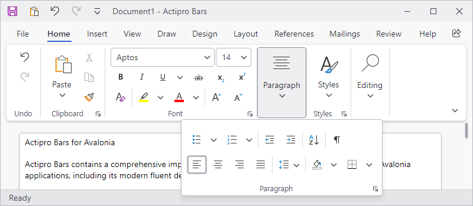

# Overview

A ribbon is an Office-like multi-tabbed user interface for hosting many child controls and can intuitively scale its layout and contents based on available size.  This provides the end user with fast access to all commands, regardless of window size.  A ribbon is very complex and consists of numerous primitive controls that support its expansive feature set.

*A Ribbon demo showing many complex control layouts that can be achieved, similar to Office*

## Control Hierarchy

Ribbon supports many complex scenarios.  This topic provides an overview of how the ribbon is defined, which properties are populated, and which controls are typically used for those properties.  Each type is linked to its corresponding API documentation.  Where applicable, additional topics are cited for a more detailed discussion of a particular feature.

See the [Control Hierarchy](control-hierarchy.md) topic for more information.

## Ribbon Window

Bars includes a `RibbonWindow` class, which is an implementation of the `Window` class and provides a custom window user interface much like that found in Office.

See the [Ribbon Window](ribbon-window.md) topic for more information.

## Layout Modes and Density

Ribbon supports multiple layout modes and user interface densities to easily achieve the desired look and feel for your application.

See the [Layout Modes and Density](layout-and-density.md) topic for more information.

## Tabs, Groups, and Control Groups

Perhaps the most iconic feature of a ribbon is the use of tabs to organize controls, and groups allow for a deeper organization of related controls within a tab.

See the [Tabs, Groups, and Control Groups](tabs-groups-controlgroups.md) topic for more information.

## Resizing and Variants

Ribbon is designed to dynamically adjust the layout of controls based on the available width using techniques optimized for either the Simplified or Classic layout.

Several controls support multiple variant sizes, where each variant alters the appearance of the control. As the variant size moves from larger to smaller, the change in appearance generally involves a reduction in the amount of information displayed in the control's content to save on overall space usage.  For example, a button may display with both an icon and a label when space is available but only display an icon when space is limited.

See the [Resizing and Variants](resizing.md) topic for more information.

## Application Button

@if (avalonia) {
Ribbon supports an application button that can open a [backstage](backstage.md) when the button is clicked.
}
@if (wpf) {
Ribbon supports an application button that can open a menu that is generally populated by application-wide options such as **New**, **Open**, and **Save**.

Either a traditional application menu or more modern backstage can be displayed when the button is clicked.  See the respective topics for more details on configuring each style.
}

The application button can also be hidden if a corresponding menu is not necessary or desired.

See the [Application Button](application-button.md) topic for more information.

@if (wpf) {
## Application Menu

The application menu is a medium-sized popup that can be displayed when clicking the application button and is generally populated by application-wide menu items such as file operations or printing.

A section at the bottom of the application menu is optional and can be used for footer buttons.  Generally, items such as application options and application exiting are displayed there.

Any content can optionally be placed on the far side of the application menu as well.  A list of recent documents is commonly displayed there.

See the [Application Menu](application-menu.md) topic for more information.
}

## Backstage

The backstage was introduced in Office 2010 and can be displayed when clicking the application button.  It is commonly used for file-based actions like **New**, **Open**, and **Save**.  When it is opened, the backstage takes over the entire window.  A subtle animation is used when opening/closing to help provide a smooth transition.

The backstage is organized such that buttons and tabs appear on the near side (the header area) and the selected tab's content appears on the far side (the content area).

See the [Backstage](backstage.md) topic for more information.

## Quick Access Toolbar

The ribbon's Quick Access Toolbar (QAT) can be displayed either above the ribbon (in the window's title bar) or below the ribbon depending on the end user's preference.  It provides quick access to the most commonly used commands in your application.

See the [Quick Access Toolbar](quick-access-toolbar.md) topic for more information.

## Minimization

The ribbon supports minimization, which means that the ribbon may be hidden so that only its tabs appear.  In this state, more screen real estate is available to the client area of the window.  By clicking a tab, the ribbon appears in a popup over the window client area and all its controls are accessible.

See the [Minimization](minimization.md) topic for more information.

## Collapsing

The ribbon is capable of collapsing when it becomes smaller than a threshold size.  When in a collapsed state, the ribbon (including the quick access toolbar) hides since there is not enough space for its interface.

See the [Collapsing](collapsing.md) topic for more information.

## Screen Tips

Bars fully implements screen tips for controls, which are advanced variations of standard tooltips.  They not only display a normal tooltip header but also can contain shortcut keys, longer descriptions, complex content, and footers.

Since the `ScreenTip` class derives from a standard `ToolTip` control, it can be used anywhere a normal `ToolTip` is used.

See the [Screen Tips](screen-tips.md) topic for more information.

## Key Tips

Ribbon supports key tips, which are small decorations that pop up over each control indicating a key or series of keys that may be typed to access each control via the keyboard.

See the [Key Tips](key-tips.md) topic for more information.

## Footer

Ribbon includes a built-in footer for displaying additional content below the ribbon.  The footer can be set to any content and is a great place to display tips or notifications.

See the [Footer](footer.md) topic for more information.

## Contextual Tabs

The controls used most often in an application are always available on the ribbon.  However, sometimes a specific object is selected in a document (such as a picture, table, or chart) that requires additional controls for proper interaction with the object.  This is where contextual tabs come in since they contain the controls that relate to the selected object and are not important enough to display all the time.

See the [Contextual Tabs](contextual-tabs.md) topic for more information.

## Tab Row Toolbar

The ribbon's tab row toolbar is a control that can optionally be displayed on the far-right side of the ribbon, in the same row as the ribbon tabs.  It generally shows common controls that are always available, such as **Sharing** or **Feedback** buttons.

See the [Tab Row Toolbar](tab-row-toolbar.md) topic for more information.

## Options Button

The **Options** button is displayed on the far-bottom corner of the ribbon and is used to show a menu of options to the end-user.

See the [Options Button](options-button.md) topic for more information.

## Recent Documents

@if (avalonia) {
A recent document control is intended to be used within a backstage.
}
@if (wpf) {
A recent document control is intended to be used within a backstage or an application menu.
}

Recently opened documents are listed in a sorted order and can be clicked to open them.  Hovering the mouse over a document provides its full path.

Clicking on a document's **Pin** button will toggle the pinned state of the document.  When pinned, the document will not fall off the list if there are other unpinned documents that have been opened more recently.

See the [Recent Documents](recent-documents.md) topic for more information.

## Serialization

Ribbon provides many options to customize the layout.  When users customize the ribbon in an application, they will expect those customizations to be restored the next time the application is launched.

By using the serialization features, it is easy to save the current layout and restore it later.

Developers have full control over which settings are saved and restored during serialization.  This will ensure that if an application is not designed to support a feature, the serializer will ignore those settings even if they are present in the serialized data.

See the [Serialization](serialization.md) topic for more information.

