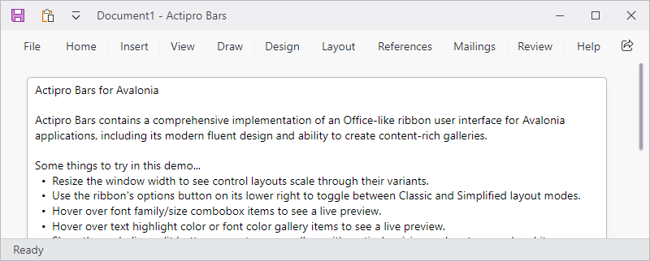
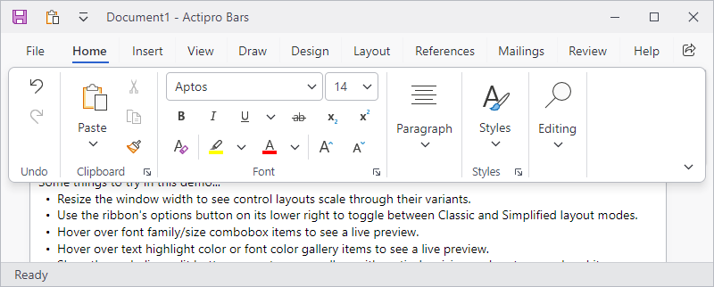

# Minimization

The ribbon supports minimization, which means that the ribbon may be hidden so that only its tabs appear.  In this state, more screen real estate is available to the client area of the window.  By clicking a tab, the ribbon appears in a popup over the window client area and all its controls are accessible.

*The ribbon in a minimized state... note that only the tabs are visible*

*After clicking a tab, a ribbon popup appears over the window client area*

> [!IMPORTANT]
> "Minimized" and "Collapsed" are two separate concepts for ribbon that are easy to confuse. "Minimized" indicates only the ribbon tabs are visible whereas "Collapsed" means the entire ribbon is hidden.  See the [Collapsing](collapsing.md) topic for more details.

## Ways to Minimize the Ribbon

There are several ways the end user can toggle minimization of the ribbon:

- Double-clicking a tab
- Choosing **Collapse the Ribbon** from a context menu
- Choosing **Show Tabs Only** from the [Options Button](options-button.md) menu
- Pressing <kbd>Ctrl</kbd>+<kbd>F1</kbd>

> [!IMPORTANT]
> The default text `"Collapse the Ribbon"` shown on ribbon context menus is consistent with Office applications even though it technically minimizes the ribbon and does not collapse it.  See the [Collapsing](collapsing.md) topic for more details on the collapsed state.

## Related Members

The [Ribbon](xref:@ActiproUIRoot.Controls.Bars.Ribbon) class defines several members that relate to ribbon minimization.

| Member | Description |
|-----|-----|
| [IsMinimizable](xref:@ActiproUIRoot.Controls.Bars.Ribbon.IsMinimizable) Property | Gets or sets whether the ribbon is capable of being minimized by the end user.  If this property is `true`, UI will be added to context menus allowing for the toggling of the [IsMinimized](xref:@ActiproUIRoot.Controls.Bars.Ribbon.IsMinimized) property. |
| [IsMinimized](xref:@ActiproUIRoot.Controls.Bars.Ribbon.IsMinimized) Property | Gets or sets whether the ribbon is currently minimized.  When minimized, the ribbon's groups are not visible until the end user clicks on a tab, at which point they display in a popup.  This saves screen real estate. |
| [IsMinimizedChanged](xref:@ActiproUIRoot.Controls.Bars.Ribbon.IsMinimizedChanged) Event | Occurs when the [IsMinimized](xref:@ActiproUIRoot.Controls.Bars.Ribbon.IsMinimized) property value has changed. |
| [IsMinimizedPopupOpen](xref:@ActiproUIRoot.Controls.Bars.Ribbon.IsMinimizedPopupOpen) Property | Gets whether the ribbon is currently minimized and its minimized popup is open. |