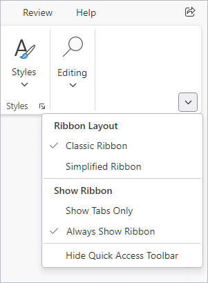

# Options Button

The **Options Button** is displayed on the far-bottom corner of the ribbon and is used to show a menu of options to the end-user.



*The ribbon options button with menu displayed*

## Standard Options

Based on the ribbon configuration, several options are available from the menu.

### Ribbon Layout

The ribbon supports two layout modes: `Classic` and `Simplified`. When enabled, the options menu allows the end-user to toggle between the two layout modes.  The following options are available:

| Option | Description |
| --- | --- |
| Classic Ribbon | Activates the classic layout; [Ribbon](xref:@ActiproUIRoot.Controls.Bars.Ribbon).[LayoutMode](xref:@ActiproUIRoot.Controls.Bars.Ribbon.LayoutMode) = [Classic](xref:@ActiproUIRoot.Controls.Bars.RibbonLayoutMode.Classic) |
| Simplified Ribbon | Activates the simplified layout; [Ribbon](xref:@ActiproUIRoot.Controls.Bars.Ribbon).[LayoutMode](xref:@ActiproUIRoot.Controls.Bars.Ribbon.LayoutMode) = [Simplified](xref:@ActiproUIRoot.Controls.Bars.RibbonLayoutMode.Simplified) |

If only one layout mode is supported, you can prevent these options from being displayed on the menu by setting [Ribbon](xref:@ActiproUIRoot.Controls.Bars.Ribbon).[CanChangeLayoutMode](xref:@ActiproUIRoot.Controls.Bars.Ribbon.CanChangeLayoutMode) = `false`.

See the [Layout Modes and Density](layout-and-density.md) topic for more details on layout modes.

### Show Ribbon

The ribbon can display the full ribbon or only the tabs (i.e., minimized).  When enabled, the options menu allows the end-user to toggle the minimized state.  The following options are available:

| Option | Description |
| --- | --- |
| Show Tabs Only | Minimizes the ribbon to only show tabs; [Ribbon](xref:@ActiproUIRoot.Controls.Bars.Ribbon).[IsMinimized](xref:@ActiproUIRoot.Controls.Bars.Ribbon.IsMinimized) = `true` |
| Always Show Ribbon | Expands the full ribbon; [Ribbon](xref:@ActiproUIRoot.Controls.Bars.Ribbon).[IsMinimized](xref:@ActiproUIRoot.Controls.Bars.Ribbon.IsMinimized) = `false` |

To hide these options from the menu, the feature should be disabled by setting [Ribbon](xref:@ActiproUIRoot.Controls.Bars.Ribbon).[IsMinimizable](xref:@ActiproUIRoot.Controls.Bars.Ribbon.IsMinimizable) = `false`.

See the [Minimization](minimization.md) topic for more details on the feature.

### Quick Access Toolbar

The ribbon supports a quick access toolbar, and the options menu allows the user to toggle the visibility of the toolbar.  The following options are available:

| Option | Description |
| --- | --- |
| Hide Quick Access Toolbar | Hides the toolbar; [Ribbon](xref:@ActiproUIRoot.Controls.Bars.Ribbon).[QuickAccessToolBarMode](xref:@ActiproUIRoot.Controls.Bars.Ribbon.QuickAccessToolBarMode) = [Hidden](xref:@ActiproUIRoot.Controls.Bars.RibbonQuickAccessToolBarMode.Hidden) |
| Show Quick Access Toolbar | Shows the toolbar; [Ribbon](xref:@ActiproUIRoot.Controls.Bars.Ribbon).[QuickAccessToolBarMode](xref:@ActiproUIRoot.Controls.Bars.Ribbon.QuickAccessToolBarMode) = [Visible](xref:@ActiproUIRoot.Controls.Bars.RibbonQuickAccessToolBarMode.Visible) |

To hide these options from the menu, the quick access toolbar should be disabled by setting [Ribbon](xref:@ActiproUIRoot.Controls.Bars.Ribbon).[QuickAccessToolBarMode](xref:@ActiproUIRoot.Controls.Bars.Ribbon.QuickAccessToolBarMode) = [None](xref:@ActiproUIRoot.Controls.Bars.RibbonQuickAccessToolBarMode.None).

## Hiding the Options Button

Depending on the purpose and configuration of the ribbon, it may not make sense to display the **Options Button** at all.  To hide the **Options Button**, set [Ribbon](xref:@ActiproUIRoot.Controls.Bars.Ribbon).[IsOptionsButtonVisible](xref:@ActiproUIRoot.Controls.Bars.Ribbon.IsOptionsButtonVisible) = `false`.

## Save and Restore Options

Users will expect any changes in options to be saved and restored the next time they launch an application.  See the [Serialization](serialization.md) topic for more details on how to save and restore ribbon settings like those available from the **Options Button**.

## Customizing Menu Entries

Ribbon supports dynamic customization of the **Options Button** menu at run-time.

See the [Menu Customization](../menu-features/menu-customization.md) topic for a section with additional details on customizing the default menu.  The **Options Button** menu is identified by [BarMenuKind](xref:@ActiproUIRoot.Controls.Bars.BarMenuKind).[RibbonOptionsButtonMenu](xref:@ActiproUIRoot.Controls.Bars.BarMenuKind.RibbonOptionsButtonMenu).

## Customizing Option Labels

The menu item labels for each option are defined by the following string resources that can be customized:

| Menu Option | String Resource |
| --- | --- |
| Classic Ribbon | `UIRibbonMenuItemClassicRibbonText` |
| Simplified Ribbon | `UIRibbonMenuItemSimplifiedRibbonText` |
| Show Tabs Only | `UIRibbonMenuItemMinimizeText` |
| Always Show Ribbon | `UIRibbonMenuItemAlwaysShowRibbonText` |
| Hide Quick Access Toolbar | `UIRibbonMenuItemHideQatText` |
| Show Quick Access Toolbar | `UIRibbonMenuItemShowQatText` |

The following example demonstrates how to change the `"Always Show Ribbon"` menu item label to `"Show Full Ribbon"`:

@if (avalonia) {
```csharp
ActiproSoftware.Properties.Bars.SR.SetCustomString(ActiproSoftware.Properties.Bars.SRName.UIRibbonMenuItemAlwaysShowRibbonText, "Show Full Ribbon");
```
}
@if (wpf) {
```csharp
ActiproSoftware.Products.Bars.SR.SetCustomString(ActiproSoftware.Products.Bars.SRName.UIRibbonMenuItemAlwaysShowRibbonText.ToString(), "Show Full Ribbon");
```
}

See the [Customizing String Resources](../../customizing-string-resources.md) topic for additional details.