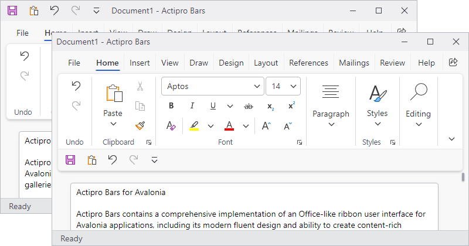

# Quick Access Toolbar

The ribbon's Quick Access Toolbar (QAT) can be displayed either above the ribbon (in the window's title bar) or below the ribbon depending on the end user's preference.  It provides quick access to the most commonly used commands in your application.



*A ribbon quick access toolbar above and below the ribbon*

## Defining a Quick Access Toolbar

The quick access toolbar can be defined in XAML or code-behind by assigning a [RibbonQuickAccessToolBar](xref:@ActiproUIRoot.Controls.Bars.RibbonQuickAccessToolBar) control instance to the [Ribbon](xref:@ActiproUIRoot.Controls.Bars.Ribbon).[QuickAccessToolBarContent](xref:@ActiproUIRoot.Controls.Bars.Ribbon.QuickAccessToolBarContent) property.

> [!NOTE]
> See the "MVVM Support" section below for details on alternatively using this property to define the toolbar via MVVM techniques.

The items to be displayed in the toolbar are assigned to the [RibbonQuickAccessToolBar](xref:@ActiproUIRoot.Controls.Bars.RibbonQuickAccessToolBar).`Items` collection.  Since the control derives from `ItemsControl`, items may alternatively be bound into the controls's `ItemsSource` property.

To make it easy for users to add or remove common items from the toolbar, additional items can be assigned to the [RibbonQuickAccessToolBar](xref:@ActiproUIRoot.Controls.Bars.RibbonQuickAccessToolBar).[CommonItems](xref:@ActiproUIRoot.Controls.Bars.RibbonQuickAccessToolBar.CommonItems) property. These common items can be accessed from a customization menu to add or remove that item from the `Items` collection.

> [!IMPORTANT]
> Only the items in the `Items` collection are displayed in the toolbar.

This code sample shows how to define the quick access toolbar items for a ribbon.

@if (avalonia) {
```xaml
xmlns:actipro="http://schemas.actiprosoftware.com/avaloniaui"
...
<actipro:RibbonContainerPanel>
	<actipro:Ribbon>

		<actipro:Ribbon.QuickAccessToolBarContent>
			<actipro:RibbonQuickAccessToolBar>

				<!-- Common items can be added to the Items collection from a customize menu -->
				<actipro:RibbonQuickAccessToolBar.CommonItems>
					<actipro:BarButton Key="Undo" Command="{Binding UndoCommand}" SmallIcon="{StaticResource UndoIcon}" />
					<actipro:BarButton Key="Redo" Command="{Binding RedoCommand}" SmallIcon="{StaticResource RedoIcon}" />
					<actipro:BarButton Key="Save" Command="{Binding SaveCommand}" SmallIcon="{StaticResource SaveIcon}" />
				</actipro:RibbonQuickAccessToolBar.CommonItems>

				<!-- Only the following items are displayed -->
				<actipro:BarButton Key="Save" Command="{Binding SaveCommand}" SmallIcon="{StaticResource SaveIcon}" />
				<actipro:BarButton Key="Cut" Command="{Binding CutCommand}" SmallIcon="{StaticResource CutIcon}" />
				<actipro:BarButton Key="Copy" Command="{Binding CopyCommand}" SmallIcon="{StaticResource CopyIcon}" />
				<actipro:BarButton Key="Paste" Command="{Binding PasteCommand}" SmallIcon="{StaticResource PasteIcon}" />

			</actipro:RibbonQuickAccessToolBar>
		</actipro:Ribbon.QuickAccessToolBarContent>
		...

	</actipro:Ribbon>
</actipro:RibbonContainerPanel>
```
}
@if (wpf) {
```xaml
xmlns:bars="http://schemas.actiprosoftware.com/winfx/xaml/bars"
...
<bars:RibbonContainerPanel>
	<bars:Ribbon>

		<bars:Ribbon.QuickAccessToolBarContent>
			<bars:RibbonQuickAccessToolBar>

				<!-- Common items can be added to the Items collection from a customize menu -->
				<bars:RibbonQuickAccessToolBar.CommonItems>
					<bars:BarButton Key="Undo" Command="Undo" SmallImageSource="/Images/Undo16.png" />
					<bars:BarButton Key="Redo" Command="Redo" SmallImageSource="/Images/Redo16.png" />
					<bars:BarButton Key="Save" Command="Save" SmallImageSource="/Images/Save16.png" />
				</bars:RibbonQuickAccessToolBar.CommonItems>

				<!-- Only the following items are displayed -->
				<bars:BarButton Key="Save" Command="Save" SmallImageSource="/Images/Save16.png" />
				<bars:BarButton Key="Cut" Command="Cut" SmallImageSource="/Images/Cut16.png" />
				<bars:BarButton Key="Copy" Command="Copy" SmallImageSource="/Images/Copy16.png" />
				<bars:BarButton Key="Paste" Command="Paste" SmallImageSource="/Images/Paste16.png" />

			</bars:RibbonQuickAccessToolBar>
		</bars:Ribbon.QuickAccessToolBarContent>
		...

	</bars:Ribbon>
</bars:RibbonContainerPanel>
```
}

## XAML Support

Defining the quick access toolbar in XAML may require duplicating some control definitions if the same control is defined, by default, in both the quick access toolbar and the ribbon.  Duplication may also be required if a control currently displayed in the quick access toolbar is also included in the common items.

> [!IMPORTANT]
> When more than one control definition exists for what is effectively the same command, it is important that all control definitions are assigned the same value for the `Key` property.

@if (avalonia) {
> [!WARNING]
> By default, users can add controls from the ribbon to the quick access toolbar. This requires cloning the original control since the same control cannot be displayed in two locations at the same time, and cloning has limitations.  Refer to the [XAML vs. MVVM Configuration](../configuration.md) topic for additional details.  Controls can set the attached [BarControlService](xref:@ActiproUIRoot.Controls.Bars.BarControlService).[CanCloneToRibbonQuickAccessToolBarProperty](xref:@ActiproUIRoot.Controls.Bars.BarControlService.CanCloneToRibbonQuickAccessToolBarProperty) to `false` to disable moving the control to the quick access toolbar if cloning is an issue.
}

## MVVM Support

The quick access toolbar may also be defined by setting the [Ribbon](xref:@ActiproUIRoot.Controls.Bars.Ribbon).[QuickAccessToolBarContent](xref:@ActiproUIRoot.Controls.Bars.Ribbon.QuickAccessToolBarContent) property to a view model that generates a [RibbonQuickAccessToolBar](xref:@ActiproUIRoot.Controls.Bars.RibbonQuickAccessToolBar) control via the ribbon's [ItemContainerTemplateSelector](xref:@ActiproUIRoot.Controls.Bars.Ribbon.ItemContainerTemplateSelector).

The optional companion [MVVM Library](../mvvm-support.md) defines a [RibbonQuickAccessToolBarViewModel](xref:@ActiproUIRoot.Controls.Bars.Mvvm.RibbonQuickAccessToolBarViewModel) class that is intended to be used as a view model for a [RibbonQuickAccessToolBar](xref:@ActiproUIRoot.Controls.Bars.RibbonQuickAccessToolBar) control, and the [BarControlTemplateSelector](xref:@ActiproUIRoot.Controls.Bars.Mvvm.BarControlTemplateSelector) class in the library generates a [RibbonQuickAccessToolBar](xref:@ActiproUIRoot.Controls.Bars.RibbonQuickAccessToolBar) for that view model.

> [!TIP]
> See the [MVVM Support](../mvvm-support.md) topic for more information on how to use the library's view models and view templates to create and manage your application's bars controls with MVVM techniques.

@if (avalonia) {
## Customizing the Toolbar Theme

The [RibbonQuickAccessToolBar](xref:@ActiproUIRoot.Controls.Bars.RibbonQuickAccessToolBar) instance can be customized by setting a `ControlTheme` to the [Ribbon](xref:@ActiproUIRoot.Controls.Bars.Ribbon).[QuickAccessToolBarTheme](xref:@ActiproUIRoot.Controls.Bars.Ribbon.QuickAccessToolBarTheme) property.  This `ControlTheme` is applied to the control when it is added to the ribbon.
}
@if (wpf) {
## Customizing the Toolbar Style

The [RibbonQuickAccessToolBar](xref:@ActiproUIRoot.Controls.Bars.RibbonQuickAccessToolBar) instance can be customized by setting a `Style` to the [Ribbon](xref:@ActiproUIRoot.Controls.Bars.Ribbon).[QuickAccessToolBarStyle](xref:@ActiproUIRoot.Controls.Bars.Ribbon.QuickAccessToolBarStyle) property.  This `Style` is applied to the control when it is added to the ribbon.
}

## Quick Access Toolbar Mode

The toolbar visibility can be toggled or completely hidden from the user. The [RibbonQuickAccessToolBarMode](xref:@ActiproUIRoot.Controls.Bars.RibbonQuickAccessToolBarMode) property gets and sets the toolbar mode. It takes an enumeration of type [RibbonQuickAccessToolBarMode](xref:@ActiproUIRoot.Controls.Bars.RibbonQuickAccessToolBarMode).

### Toggle Visibility

Setting the mode to [Visible](xref:@ActiproUIRoot.Controls.Bars.RibbonQuickAccessToolBarMode.Visible) will show the toolbar in the desired location and setting the mode to [Hidden](xref:@ActiproUIRoot.Controls.Bars.RibbonQuickAccessToolBarMode.Hidden) will hide it from the user interface.

The user can toggle visibility from various menus on the ribbon, like the [Options Button](options-button.md).

The [Ribbon](xref:@ActiproUIRoot.Controls.Bars.Ribbon).[QuickAccessToolBarModeChanged](xref:@ActiproUIRoot.Controls.Bars.Ribbon.QuickAccessToolBarModeChanged) event is raised when the mode changes.

### Disabling the Toolbar
By default, all ribbons have a quick access toolbar. If the toolbar will not be used, set the [Ribbon](xref:@ActiproUIRoot.Controls.Bars.Ribbon).[QuickAccessToolBarMode](xref:@ActiproUIRoot.Controls.Bars.Ribbon.QuickAccessToolBarMode) mode to [RibbonQuickAccessToolBarMode](xref:@ActiproUIRoot.Controls.Bars.RibbonQuickAccessToolBarMode).[None](xref:@ActiproUIRoot.Controls.Bars.RibbonQuickAccessToolBarMode.None). This will prevent the toolbar-related commands from appearing in ribbon menus.

## Quick Access Toolbar Location

The toolbar can be located either above or below the ribbon. The [Ribbon](xref:@ActiproUIRoot.Controls.Bars.Ribbon).[QuickAccessToolBarLocation](xref:@ActiproUIRoot.Controls.Bars.Ribbon.QuickAccessToolBarLocation) property gets and sets the location of the toolbar.  It takes an enumeration of type [RibbonQuickAccessToolBarLocation](xref:@ActiproUIRoot.Controls.Bars.RibbonQuickAccessToolBarLocation).

The [Ribbon](xref:@ActiproUIRoot.Controls.Bars.Ribbon).[QuickAccessToolBarLocationChanged](xref:@ActiproUIRoot.Controls.Bars.Ribbon.QuickAccessToolBarLocationChanged) event is raised when the location changes.

> [!NOTE]
> When the ribbon is hosted in a [Ribbon Window](ribbon-window.md) and the location is set to [RibbonQuickAccessToolBarLocation](xref:@ActiproUIRoot.Controls.Bars.RibbonQuickAccessToolBarLocation).[Above](xref:@ActiproUIRoot.Controls.Bars.RibbonQuickAccessToolBarLocation.Above), the toolbar will be displayed within the window title bar.

@if (avalonia) {
### External Host

When the location is set to [RibbonQuickAccessToolBarLocation](xref:@ActiproUIRoot.Controls.Bars.RibbonQuickAccessToolBarLocation).[Above](xref:@ActiproUIRoot.Controls.Bars.RibbonQuickAccessToolBarLocation.Above), most users expect the toolbar to be displayed in a titebar.  The [Ribbon Window](ribbon-window.md) supports this feature automatically.  For custom scenarios when not using [Ribbon Window](ribbon-window.md), the location of the toolbar host can be defined by placing a [RibbonQuickAccessToolBarHost](xref:@ActiproUIRoot.Controls.Bars.Primitives.RibbonQuickAccessToolBarHost) control anywhere within the visual tree of the ribbon's ancestor `TopLevel` and setting the [Ribbon](xref:@ActiproUIRoot.Controls.Bars.Ribbon).[AllowExternalQuickAccessToolBarHost](xref:@ActiproUIRoot.Controls.Bars.Ribbon.AllowExternalQuickAccessToolBarHost) property to `true`.
}

## Hiding the Customize Button

The [RibbonQuickAccessToolBar](xref:@ActiproUIRoot.Controls.Bars.RibbonQuickAccessToolBar).[IsCustomizeButtonVisible](xref:@ActiproUIRoot.Controls.Bars.RibbonQuickAccessToolBar.IsCustomizeButtonVisible) property can be set to `false` to hide the customize button that appears next to the QAT.

## Customizing the Customize Button's Menu

Ribbon supports dynamic customization of the **Customize** button's menu at run-time.

See the [Menu Customization](../menu-features/menu-customization.md) topic for a section with additional details on customizing the default menu.

> [!TIP]
> See the "Customize Built-in Menus" Bars Ribbon QuickStart of the Sample Browser application for a full demonstration of customizing menus.

## Persisting End-User Run-Time Item Customizations

Ribbon includes a very flexible framework for supporting multiple forms of end-user customization.  If end-user customization is allowed, users will expect those customizations to persist between application sessions.

See the [Serialization](serialization.md) topic for details on how to persist the state of the quick access toolbar to be restored later.

@if (wpf) {
## Monochrome Images

Several Actipro themes require the use of white monochrome images in specific portions of the ribbon user interface.  Ribbon has special logic that will automatically convert `BitmapSource` and `DrawingImage` images to a pure white monochrome equivalent for proper display in these scenarios.  This allows you to use a single image set for your entire UI while still supporting modern UI.


*Ribbon in the OfficeColorfulIndigo theme*

When one of the Office Colorful themes is used, such as [OfficeColorfulIndigo](xref:@ActiproUIRoot.Themes.ThemeNames.OfficeColorfulIndigo) above, any button images in the Quick Access Toolbar must be switched over to monochrome variations.  Ribbon has logic in it to automatically perform this conversion on a ribbon button with a supplied normal image.

See the [Themes' Getting Started](../../themes/getting-started.md) topic for a complete list of themes.

### Optimal Image Design

The algorithm that the conversion-to-monochrome logic uses is based on the lightness of each pixel.  Dark and medium lightness pixels will be converted to white, while light pixels will be converted to transparent.

It is best to use Metro-themed images that don't contain gradients as a basis for this feature.

> [!WARNING]
> Be careful of images that were already light/white to begin with, as they may end up appearing completely transparent unless dark colors are used in the image.

### Preventing Portions of a DrawingImage from Converting

In some cases, such as for a vector icon that has a portion showing a selected color, you may not wish to convert the selected color portion to monochrome.  Yet you may wish for the entire rest of the image to be converted.

This can be achieved by setting the attached [ImageProvider](xref:@ActiproUIRoot.Media.ImageProvider).`CanAdapt` property to `false` on the portion for the selected color.  That will tell the converter to skip over converting colors within that portion of the image.

See the [Image Provider](../../themes/image-provider.md) topic for more details on working with image adaptation.
}

## Key Tips

Key tips for controls in the quick access toolbar are auto-generated, beginning with numbers.  In some cases, the numbers might conflict with a ribbon tab that also uses a key tip beginning with a number.  In this scenario, the [KeyTipTextPrefix](xref:@ActiproUIRoot.Controls.Bars.RibbonQuickAccessToolBar.KeyTipTextPrefix) property can be set to an unused character like `'Q'`, which will prefix the auto-generated key tip text, thereby removing the conflict.

See the [Key Tips](key-tips.md) topic for additional details on key tips in general.
