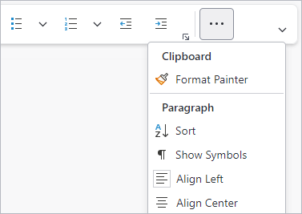
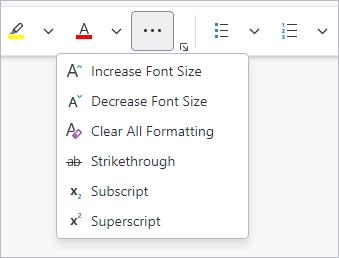
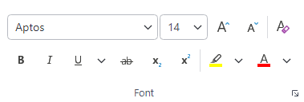
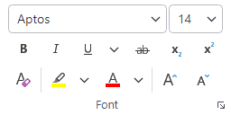

# Resizing and Variants

Ribbon is designed to dynamically adjust the layout of controls based on the available width using techniques optimized for either the `Simplified` or `Classic` layout modes.

Several controls support multiple variant sizes, where each variant alters the appearance of the control. As the variant size moves from larger to smaller, the change in appearance generally involves a reduction in the amount of information displayed in the control's content to save on overall space usage.  For example, a button may display with both an icon and a label when space is available but only display an icon when space is limited.

Each ribbon layout mode uses a different resizing strategy.

See the [Layout Modes and Density](layout-and-density.md) topic for more details on working with layout modes.

## Simplified Layout Strategy

The primary focus of the Simplified layout mode is overflowing controls to a popup menu.



*The tab overflow menu displayed*

When there is not enough room to display all the controls, the **Tab Overflow** button will be displayed, and controls are moved one-by-one to a popup menu displayed when clicking the button.  A header will be displayed in the popup menu that corresponds to the [RibbonGroup](xref:@ActiproUIRoot.Controls.Bars.RibbonGroup).[Label](xref:@ActiproUIRoot.Controls.Bars.RibbonGroup.Label) of the group where the control is defined, so overflowed controls maintain the same level of organization they had on the ribbon.

By default, controls are overflowed starting from the far side of the ribbon.

See the "Explicit Variant Sizing" section below for more details on controlling the order in which items reduce their variant size.

### Group Overflow

An individual group on the ribbon can be configured to define its own **Group Overflow** button instead of using the default **Tab Overflow** button. To enable this functionality, set [RibbonGroup](xref:@ActiproUIRoot.Controls.Bars.RibbonGroup).[ChildOverflowTarget](xref:@ActiproUIRoot.Controls.Bars.RibbonGroup.ChildOverflowTarget) = [RibbonGroupChildOverflowTarget](xref:@ActiproUIRoot.Controls.Bars.RibbonGroupChildOverflowTarget).[Group](xref:@ActiproUIRoot.Controls.Bars.RibbonGroupChildOverflowTarget.Group) as shown in the following example:

@if (avalonia) {
```xaml
xmlns:actipro="http://schemas.actiprosoftware.com/avaloniaui"
...
<actipro:RibbonGroup Key="Clipboard" ... ChildOverflowTarget="Group" />
```
}
@if (wpf) {
```xaml
xmlns:bars="http://schemas.actiprosoftware.com/winfx/xaml/bars"
...
<bars:RibbonGroup Key="Clipboard" ... ChildOverflowTarget="Group" />
```
}

When enabled and controls in a group need to overflow, a **Group Overflow** button will appear as the last item in the group. Overflowed controls will appear in the popup menu just like they appear in the **Tab Overflow** menu except there is no need to display the group's label as a header.



*The group overflow menu displayed*

> [!TIP]
> Use [Group](xref:@ActiproUIRoot.Controls.Bars.RibbonGroupChildOverflowTarget.Group) overflow for important groups where overflowed controls can be kept close to the other controls in the same group.

### Variants

As previously mentioned, several controls support multiple variant sizes, where each variant alters the appearance of the control.  As the variant size moves from larger to smaller, the change in appearance generally involves a reduction in the amount of information displayed in the control's content to save on overall space usage.

The following [VariantSize](xref:@ActiproUIRoot.Controls.Bars.VariantSize) values are supported by the `Simplified` layout mode in order from largest to smallest:

| Variant Size | Description |
| --- | --- |
| `Medium` | Most controls display as an icon with a label. |
| `Small` (Default) | Most controls display only as an icon. |
| `Collapsed` | Controls are moved to the **Overflow** menu. |

A ribbon will always try to display a control at the largest variant size for the available space.

The [VariantSize](xref:@ActiproUIRoot.Controls.Bars.VariantSize).[Large](xref:@ActiproUIRoot.Controls.Bars.VariantSize.Large) value has no effect for a ribbon using the `Simplified` layout mode.

### Variant and Overflow Behaviors

Most controls define a `ToolBarItemVariantBehavior` property (e.g., [BarButton](xref:@ActiproUIRoot.Controls.Bars.BarButton).[ToolBarItemVariantBehavior](xref:@ActiproUIRoot.Controls.Bars.BarButton.ToolBarItemVariantBehavior)) that determines the allowed variant sizes of a control when it is displayed in a ribbon with the `Simplified` layout mode or a toolbar.

Since the default variant behavior is `AlwaysSmall`, most controls will appear without a label.  By setting `ToolBarItemVariantBehavior` = `All`, most controls will use a medium variant to display with a label when space is available and will shrink to a small variant without a label as needed.  Use the `AlwaysMedium` value to require a label and prevent small variant sizes.  Note that large variant sizes are unsupported in toolbars.

Most controls define a `ToolBarItemCollapseBehavior` property (e.g., [BarButton](xref:@ActiproUIRoot.Controls.Bars.BarButton).[ToolBarItemCollapseBehavior](xref:@ActiproUIRoot.Controls.Bars.BarButton.ToolBarItemCollapseBehavior)) that determines how a control is allowed to collapse to an **Overflow** menu when in a ribbon with the `Simplified` layout mode.  The default behavior is to collapse to an **Overflow** menu as needed.  By setting the property to `Always`, a control can be forced to only ever appear on an **Overflow** menu, even if space is available.  By setting the property to `Never`, a control will never collapse to an **Overflow** menu.

The following example shows buttons using the `ToolBarItemVariantBehavior` and `ToolBarItemCollapseBehavior` properties in a ribbon using `Simplified` layout mode:

@if (avalonia) {
```xaml
xmlns:actipro="http://schemas.actiprosoftware.com/avaloniaui"
...

<!-- Will show a label when space is available -->
<actipro:BarSplitButton Key="New" ... ToolBarItemVariantBehavior="All" />

<!-- Will always show a label -->
<actipro:BarButton Key="Open" ... ToolBarItemVariantBehavior="AlwaysMedium" />

<!-- Will never collapse to overflow -->
<actipro:BarToggleButton Key="Bold" ... ToolBarItemCollapseBehavior="Never" />

<!-- Will always collapse to overflow -->
<actipro:BarButton Key="IncreaseFontSize" ... ToolBarItemCollapseBehavior="Always" />
```
}
@if (wpf) {
```xaml
xmlns:bars="http://schemas.actiprosoftware.com/winfx/xaml/bars"
...

<!-- Will show a label when space is available -->
<bars:BarSplitButton Key="New" ... ToolBarItemVariantBehavior="All" />

<!-- Will always show a label -->
<bars:BarButton Key="Open" ... ToolBarItemVariantBehavior="AlwaysMedium" />

<!-- Will never collapse to overflow -->
<bars:BarToggleButton Key="Bold" ... ToolBarItemCollapseBehavior="Never" />

<!-- Will always collapse to overflow -->
<bars:BarButton Key="IncreaseFontSize" ... ToolBarItemCollapseBehavior="Always" />
```
}

## Classic Layout Strategy

In the `Classic` layout mode, controls are generally available in sizes from `Large` to `Small` and will render using the largest size possible for the available width. As the ribbon size changes, controls dynamically adapt to the available space and eventually collapse to a popup menu for each group when space is too limited.

By default, controls are collapsed starting from the far side of the ribbon.  See the "Explicit Variant Sizing" section below for more details on controlling the order in which items reduce their variant size.

### Control Groups

A [RibbonControlGroup](xref:@ActiproUIRoot.Controls.Bars.RibbonControlGroup) is used to group multiple controls and resize them together. By grouping them, multiple controls can be arranged together to produce an ideal layout for a variant size.

For example, a `BarButton` in its `Large` variant size places a large icon over a label. When shifting to the `Medium` variant size, it uses a smaller icon with the label to the right. In most cases, this style is actually wider than the `Large` variant, but the height of each button is greatly reduced. By grouping multiple buttons together in a [RibbonControlGroup](xref:@ActiproUIRoot.Controls.Bars.RibbonControlGroup), two or three shorter buttons can be stacked vertically to reduce the overall width of all the buttons compared to displaying them side-by-side horizontally.

The following defines the layout of a control group at different [VariantSize](xref:@ActiproUIRoot.Controls.Bars.VariantSize) values:

| Variant Size | Description |
| --- | --- |
| `Large` | All controls displayed in their respective `Large` variant style and arranged horizontally. |
| `Medium` | All controls displayed in their respective `Medium` variant style and arranged vertically with up to three controls per vertical stack. |
| `Small` | All controls displayed in their respective `Small` variant style and arranged vertically with up to three controls per vertical stack. |

By default, a control group will attempt all variant sizes from `Large` to `Small`, but the [RibbonControlGroup](xref:@ActiproUIRoot.Controls.Bars.RibbonControlGroup).[ItemVariantBehavior](xref:@ActiproUIRoot.Controls.Bars.RibbonControlGroup.ItemVariantBehavior) property can used to limit the variant sizes which are supported by the group. The following [ItemVariantBehavior](xref:@ActiproUIRoot.Controls.Bars.ItemVariantBehavior) values are available:

| Item Variant Behavior | Description |
| --- | --- |
| `All` | The default behavior allows a group to progress through variant sizes from `Large` to `Medium` to `Small`. |
| `AlwaysLarge` | The group will always display as the `Large` variant size. |
| `AlwaysMedium` | The group will always display as the `Medium` variant size. |
| `AlwaysSmall` | The group will always display as the `Small` variant size. |
| `NeverLarge` | The group supports variant sizes `Medium` to `Small`, skipping the `Large` size.
| `NeverMedium` | The group supports variant sizes `Large` to `Small`, skipping the `Medium` size.
| `NeverSmall` | The group supports variant sizes `Large` to `Medium`, skipping the `Small` size.

The following example defines three buttons that will always appear in a single vertical stack because they are defined in a control group that does not support the `Large` variant size. Labels will be visible when the control group is `Medium`, and only icons will display when the control group is `Small`.

@if (avalonia) {
```xaml
xmlns:actipro="http://schemas.actiprosoftware.com/avaloniaui"
...
<actipro:RibbonGroup ... >
	<actipro:RibbonControlGroup ItemVariantBehavior="NeverLarge">
		<actipro:BarButton Key="Cut" SmallIcon="{StaticResource CutIcon}" />
		<actipro:BarButton Key="Copy" SmallIcon="{StaticResource CopyIcon}" />
		<actipro:BarButton Key="Paste" SmallIcon="{StaticResource PasteIcon}" />
	</actipro:RibbonControlGroup>
	...
</actipro:RibbonGroup>
...
```
}
@if (wpf) {
```xaml
xmlns:bars="http://schemas.actiprosoftware.com/winfx/xaml/bars"
...
<bars:RibbonGroup ... >
	<bars:RibbonControlGroup ItemVariantBehavior="NeverLarge">
		<bars:BarButton Key="Cut" Command="Cut" SmallImageSource="/Images/Cut16.png" />
		<bars:BarButton Key="Copy" Command="Copy" SmallImageSource="/Images/Copy16.png" />
		<bars:BarButton Key="Paste" Command="Paste" SmallImageSource="/Images/Paste16.png" />
	</bars:RibbonControlGroup>
	...
</bars:RibbonGroup>
...
```
}

### Multi-Row Control Groups

The highest density of commands can be achieved using multi-row layouts where a number of controls in a ribbon group are arranged in either two or three rows using the `Small` variant of each control. To enable multi-row layouts, add a [RibbonMultiRowControlGroup](xref:@ActiproUIRoot.Controls.Bars.RibbonMultiRowControlGroup) to the [RibbonGroup](xref:@ActiproUIRoot.Controls.Bars.RibbonGroup).`Items` collection, and add child [RibbonControlGroup](xref:@ActiproUIRoot.Controls.Bars.RibbonControlGroup) or other controls designed for a toolbar context into the [RibbonMultiRowControlGroup](xref:@ActiproUIRoot.Controls.Bars.RibbonMultiRowControlGroup).`Items` collection.

When using multi-row layouts, a [RibbonControlGroup](xref:@ActiproUIRoot.Controls.Bars.RibbonControlGroup) is used to group related controls.  Control groups will be arranged into two rows at the largest size and adjust to three rows when width is limited.




*The same multi-row control group using two rows compared to three rows*

@if (avalonia) {
When arranged in two rows, control groups are sorted in the order they are defined.  In three-row mode, the default behavior will sort groups so each row is as narrow as possible.  When desired, the [RibbonMultiRowControlGroup](xref:@ActiproUIRoot.Controls.Bars.RibbonMultiRowControlGroup).[ThreeRowItemSortOrder](xref:@ActiproUIRoot.Controls.Bars.RibbonMultiRowControlGroup.ThreeRowItemSortOrder) property is used to set an explicit sort order where the zero-based index of each control group is defined by a `List<Int32>` in the preferred sort order.  The following example demonstrates defining a three-row sort order.
}
@if (wpf) {
When arranged in two rows, control groups are sorted in the order they are defined.  In three-row mode, the default behavior will sort groups so each row is as narrow as possible.  When desired, the [RibbonMultiRowControlGroup](xref:@ActiproUIRoot.Controls.Bars.RibbonMultiRowControlGroup).[ThreeRowItemSortOrder](xref:@ActiproUIRoot.Controls.Bars.RibbonMultiRowControlGroup.ThreeRowItemSortOrder) property is used to set an explicit sort order where the zero-based index of each control group is listed in the preferred sort order, separated by spaces (e.g., `"0 1 3 4 2"`).  The following example demonstrates defining a three-row sort order.
}

@if (avalonia) {
```xaml
xmlns:actipro="http://schemas.actiprosoftware.com/avaloniaui"
xmlns:generic="using:System.Collections.Generic"
...
<actipro:RibbonGroup ... >
	<actipro:RibbonMultiRowControlGroup>
		<actipro:RibbonMultiRowControlGroup.ThreeRowItemSortOrder>
			<generic:List x:TypeArguments="x:Int32">
				<x:Int32>0</x:Int32>
				<x:Int32>1</x:Int32>
				<x:Int32>3</x:Int32>
				<x:Int32>4</x:Int32>
				<x:Int32>2</x:Int32>
			</generic:List>
		</actipro:RibbonMultiRowControlGroup.ThreeRowItemSortOrder>

		<actipro:RibbonControlGroup Key="Index0"> ... </actipro:RibbonControlGroup>
		<actipro:RibbonControlGroup Key="Index1"> ... </actipro:RibbonControlGroup>

		<!-- In 3-row layout, this group will sort at the end based on ThreeRowItemSortOrder -->
		<actipro:RibbonControlGroup Key="Index2"> ... </actipro:RibbonControlGroup>

		<actipro:RibbonControlGroup Key="Index3"> ... </actipro:RibbonControlGroup>
		<actipro:RibbonControlGroup Key="Index4"> ... </actipro:RibbonControlGroup>

		...
	</actipro:RibbonMultiRowControlGroup>
</actipro:RibbonGroup>
...
```
}
@if (wpf) {
```xaml
xmlns:bars="http://schemas.actiprosoftware.com/winfx/xaml/bars"
...
<bars:RibbonGroup ... >
	<bars:RibbonMultiRowControlGroup ThreeRowItemSortOrder="0 1 3 4 2">

		<bars:RibbonControlGroup Key="Index0"> ... </bars:RibbonControlGroup>
		<bars:RibbonControlGroup Key="Index1"> ... </bars:RibbonControlGroup>

		<!-- In 3-row layout, this group will sort at the end based on ThreeRowItemSortOrder -->
		<bars:RibbonControlGroup Key="Index2"> ... </bars:RibbonControlGroup>

		<bars:RibbonControlGroup Key="Index3"> ... </bars:RibbonControlGroup>
		<bars:RibbonControlGroup Key="Index4"> ... </bars:RibbonControlGroup>

		...
	</bars:RibbonMultiRowControlGroup>
</bars:RibbonGroup>
...
```
}

### Separators

Separators can be automatically rendered between neighboring [RibbonControlGroup](xref:@ActiproUIRoot.Controls.Bars.RibbonControlGroup) instances based on the current layout of the containing [RibbonGroup](xref:@ActiproUIRoot.Controls.Bars.RibbonGroup) or [RibbonMultiRowControlGroup](xref:@ActiproUIRoot.Controls.Bars.RibbonMultiRowControlGroup).

#### Stacking Layout Separators

By default, separators are not displayed between neighboring control groups in a stacking layout. Some configurations, however, might benefit from displaying separators. For more exact control, the [RibbonControlGroup](xref:@ActiproUIRoot.Controls.Bars.RibbonControlGroup).[SeparatorMode](xref:@ActiproUIRoot.Controls.Bars.RibbonControlGroup.SeparatorMode) property can be set to any of the following [RibbonControlGroupSeparatorMode](xref:@ActiproUIRoot.Controls.Bars.RibbonControlGroupSeparatorMode) values to control when a separator is displayed:

| Separator Mode | Description |
| --- | --- |
| `Default` or `Never` | Never show surrounding separators. |
| `Always` | Always show surrounding separators when there are neighbors that allow them. |
| `StackingNeighborSameVariantSize` | Only show surrounding separators when a neighboring control group has the same variant size. |
| `StackingNeighborDifferentVariantSize` | Only show surrounding separators when a neighboring control group has a different variant size. |

> [!NOTE]
> There are other values defined for the [RibbonControlGroupSeparatorMode](xref:@ActiproUIRoot.Controls.Bars.RibbonControlGroupSeparatorMode) enumeration that do not apply to stacking layouts. If used in a stacking layout, the value will be treated the same as `Default`.

The following example defines four buttons, where the last three are part of a control group. The control group is configured to only show a separator when the group of three buttons is the same variant size as the first button (which, since it is not in a control group, will always be `Large`). A separator will not be displayed if the control group is a `Medium` or `Small` variant size.

@if (avalonia) {
```xaml
xmlns:actipro="http://schemas.actiprosoftware.com/avaloniaui"
...
<actipro:RibbonGroup ... >
	<actipro:BarButton Key="LargeButton" ... />
	<actipro:RibbonControlGroup SeparatorMode="StackingNeighborSameVariantSize">
		<actipro:BarButton Key="VariantButton1" ... />
		<actipro:BarButton Key="VariantButton2" ... />
		<actipro:BarButton Key="VariantButton3" ... />
	</actipro:RibbonControlGroup>
	...
</actipro:RibbonGroup>
```
}
@if (wpf) {
```xaml
xmlns:bars="http://schemas.actiprosoftware.com/winfx/xaml/bars"
...
<bars:RibbonGroup ... >
	<bars:BarButton Key="LargeButton" ... />
	<bars:RibbonControlGroup SeparatorMode="StackingNeighborSameVariantSize">
		<bars:BarButton Key="VariantButton1" ... />
		<bars:BarButton Key="VariantButton2" ... />
		<bars:BarButton Key="VariantButton3" ... />
	</bars:RibbonControlGroup>
	...
</bars:RibbonGroup>
```
}

#### Multi-Row Layout Separators

By default, when using a [RibbonMultiRowControlGroup](xref:@ActiproUIRoot.Controls.Bars.RibbonMultiRowControlGroup), separators are inserted between adjacent control groups on the same row to help visually differentiate the groups. For more exact control, the [RibbonControlGroup](xref:@ActiproUIRoot.Controls.Bars.RibbonControlGroup).[SeparatorMode](xref:@ActiproUIRoot.Controls.Bars.RibbonControlGroup.SeparatorMode) property can be set to any of the following [RibbonControlGroupSeparatorMode](xref:@ActiproUIRoot.Controls.Bars.RibbonControlGroupSeparatorMode) values to control when a separator is displayed:

| Separator Mode | Description |
| --- | --- |
| `Default` or `Always` | Always show surrounding separators when there are neighbors that allow them. |
| `Never` | Never show surrounding separators, which is ideal when the control group contains controls with visible borders such as [combobox](../controls/combobox.md) controls. |
| `MultiRowTwoRowOnly` | Only show surrounding separators when in a [RibbonMultiRowControlGroup](xref:@ActiproUIRoot.Controls.Bars.RibbonMultiRowControlGroup) that currently has a two-row layout. |
| `MultiRowThreeRowOnly` | Only show surrounding separators when in a [RibbonMultiRowControlGroup](xref:@ActiproUIRoot.Controls.Bars.RibbonMultiRowControlGroup) that currently has a three-row layout. |

> [!NOTE]
> There are other values defined for the [RibbonControlGroupSeparatorMode](xref:@ActiproUIRoot.Controls.Bars.RibbonControlGroupSeparatorMode) enumeration that do not apply to multi-row layouts. If used in a multi-row layout, the value will be treated the same as `Default`.

## Explicit Variant Sizing

If you want more control over variant sizing, you can explicitly define the order in which items collapse for both `Simplified` and `Classic` layout modes. Multiple items can even be configured to change their variant size at the same time.

> [!IMPORTANT]
> It is good application design to define a prioritized set of variants so that the least used groups/controls shrink and collapse before the more-often used groups/controls do.  For instance, **Clipboard** groups/controls are most often the last item to collapse on a tab since they are highly used.

### Understanding Variant Collections

When all items cannot be displayed on the ribbon at the same time, the [VariantCollection](xref:@ActiproUIRoot.Controls.Bars.VariantCollection) (when defined) is used to dictate the order in which items will adjust to a smaller variant.  The collection is processed starting with the first defined item and includes both [SizeVariant](xref:@ActiproUIRoot.Controls.Bars.SizeVariant) and/or [VariantSet](xref:@ActiproUIRoot.Controls.Bars.VariantSet) entries.

A [SizeVariant](xref:@ActiproUIRoot.Controls.Bars.SizeVariant) defines a [TargetKey](xref:@ActiproUIRoot.Controls.Bars.SizeVariant.TargetKey) property that identifies the `Key` of the item being affected  and a [Size](xref:@ActiproUIRoot.Controls.Bars.SizeVariant.Size) property that indicates the [VariantSize](xref:@ActiproUIRoot.Controls.Bars.VariantSize) to be applied to the item.  When reducing the size of the ribbon, a [SizeVariant](xref:@ActiproUIRoot.Controls.Bars.SizeVariant) defined directly in the [VariantCollection](xref:@ActiproUIRoot.Controls.Bars.VariantCollection) will be applied to a single item at a time before moving to the next entry in the collection.

A [VariantSet](xref:@ActiproUIRoot.Controls.Bars.VariantSet) is simply a collection of [SizeVariant](xref:@ActiproUIRoot.Controls.Bars.SizeVariant) instances. When reducing the size of the ribbon, a [VariantSet](xref:@ActiproUIRoot.Controls.Bars.VariantSet) will apply each [SizeVariant](xref:@ActiproUIRoot.Controls.Bars.SizeVariant) in the set at the same time before moving on to the next entry in the collection. This allows the size of multiple items to be affected in a single step instead of one-by-one.

### Applying to Simplified Layout Mode

In the Simplified layout mode, a [VariantCollection](xref:@ActiproUIRoot.Controls.Bars.VariantCollection) is assigned to the [RibbonTabItem](xref:@ActiproUIRoot.Controls.Bars.RibbonTabItem).[ControlVariants](xref:@ActiproUIRoot.Controls.Bars.RibbonTabItem.ControlVariants) property. The [SizeVariant](xref:@ActiproUIRoot.Controls.Bars.SizeVariant).[TargetKey](xref:@ActiproUIRoot.Controls.Bars.SizeVariant.TargetKey) should identify the `Key` of a control whose variant size will be applied (e.g., [BarButton](xref:@ActiproUIRoot.Controls.Bars.BarButton).[Key](xref:@ActiproUIRoot.Controls.Bars.BarButton.Key)).

> [!WARNING]
> Be sure to populate the [RibbonTabItem](xref:@ActiproUIRoot.Controls.Bars.RibbonTabItem).[ControlVariants](xref:@ActiproUIRoot.Controls.Bars.RibbonTabItem.ControlVariants) property and *not* the [RibbonTabItem](xref:@ActiproUIRoot.Controls.Bars.RibbonTabItem).[GroupVariants](xref:@ActiproUIRoot.Controls.Bars.RibbonTabItem.GroupVariants) property used by the Classic layout mode.

Normally, items are overflowed one-by-one starting at the far side of the ribbon, but the following sample explicitly defines the order in which items are initially overflowed:

1. Both the `Undo` and `Redo` buttons should collapse first and at the same time.
1. Two of the buttons from the `Font` group (`Subscript` and `Superscript`) will collapse at the same time, leaving `IncreaseFontSize` and `DecreaseFontSize` in that group.
1. All buttons in the `Clipboard` group will collapse at the same time (`FormatPainter`, `Cut`, `Copy`, and `Paste`). Note that the individual controls must be identified by the [SizeVariant](xref:@ActiproUIRoot.Controls.Bars.SizeVariant).[TargetKey](xref:@ActiproUIRoot.Controls.Bars.SizeVariant.TargetKey), not the ribbon group.
1. The `New` button will change size from `Medium` to `Small`. Normally items in the Simplified ribbon start at the `Small` size, but that particular control explicitly set its max size to `Medium`.
1. The remaining buttons from the `Font` group collapse at the same time (`IncreaseFontSize` and `DecreaseFontSize`).
1. Once all explicitly defined [VariantSet](xref:@ActiproUIRoot.Controls.Bars.VariantSet) and [SizeVariant](xref:@ActiproUIRoot.Controls.Bars.SizeVariant) items are processed, the remaining items are implicitly overflowed one-by-one starting at the far side of the ribbon in the following order: `Italic`, `Underline`, `Bold`, `Save`, `Open`, and finally `New`.

> [!NOTE]
> In the Simplified layout mode, [VariantSize](xref:@ActiproUIRoot.Controls.Bars.VariantSize).[Collapsed](xref:@ActiproUIRoot.Controls.Bars.VariantSize.Collapsed) indicates a control should appear on the appropriate **Overflow Menu**.

@if (avalonia) {
```xaml
xmlns:actipro="http://schemas.actiprosoftware.com/avaloniaui"
...
<actipro:RibbonTabItem ... >

	<!-- Define the ControlVariants -->
	<actipro:RibbonTabItem.ControlVariants>
		<actipro:VariantCollection>
			<!-- All controls in the Undo group overflow at the same time -->
			<actipro:VariantSet>
				<actipro:SizeVariant TargetKey="Undo" Size="Collapsed" />
				<actipro:SizeVariant TargetKey="Redo" Size="Collapsed" />
			</actipro:VariantSet>

			<!-- Subscript and Superscript in the Font group overflow at the same time, other Font controls remain -->
			<actipro:VariantSet>
				<actipro:SizeVariant TargetKey="Subscript" Size="Collapsed" />
				<actipro:SizeVariant TargetKey="Superscript" Size="Collapsed" />
			</actipro:VariantSet>

			<!-- All controls in the Clipboard group overflow at the same time -->
			<actipro:VariantSet>
				<actipro:SizeVariant TargetKey="FormatPainter" Size="Collapsed" />
				<actipro:SizeVariant TargetKey="Cut" Size="Collapsed" />
				<actipro:SizeVariant TargetKey="Copy" Size="Collapsed" />
				<actipro:SizeVariant TargetKey="Paste" Size="Collapsed" />
			</actipro:VariantSet>

			<!-- The New button moves from Medium to Small -->
			<actipro:SizeVariant TargetKey="New" Size="Small" />

			<!-- All remaining controls in the Font group overflow at the same time -->
			<actipro:VariantSet>
				<actipro:SizeVariant TargetKey="IncreaseFontSize" Size="Collapsed" />
				<actipro:SizeVariant TargetKey="DecreaseFontSize" Size="Collapsed" />
			</actipro:VariantSet>

			<!-- All remining controls (those in File and Format groups) will implicitly overflow one-by-one from far side of the ribbon -->

		</actipro:VariantCollection>
	</actipro:RibbonTabItem.ControlVariants>

	<!-- Define Groups/Controls -->
	<actipro:RibbonGroup Label="Undo">
		<actipro:BarButton Key="Undo" ... />
		<actipro:BarButton Key="Redo" ... />
	</actipro:RibbonGroup>
	<actipro:RibbonGroup Label="File">
		<actipro:BarButton Key="New" ... ToolBarItemVariantBehavior="All" />
		<actipro:BarButton Key="Open" ... />
		<actipro:BarButton Key="Save" ... />
	</actipro:RibbonGroup>
	<actipro:RibbonGroup Label="Clipboard" ChildOverflowTarget="Group">
		<actipro:RibbonControlGroup>
			<actipro:BarButton Key="Cut" ... />
			<actipro:BarButton Key="Copy" ... />
			<actipro:BarButton Key="Paste" ... />
			<actipro:BarButton Key="FormatPainter" ... />
		</actipro:RibbonControlGroup>
	</actipro:RibbonGroup>
	<actipro:RibbonGroup Label="Format">
		<actipro:BarButton Key="Bold" ... />
		<actipro:BarButton Key="Underline" ... />
		<actipro:BarButton Key="Italic" ... />
	</actipro:RibbonGroup>
	<actipro:RibbonGroup Label="Font">
		<actipro:BarButton Key="IncreaseFontSize" ... />
		<actipro:BarButton Key="DecreaseFontSize" ... />
		<actipro:BarButton Key="Subscript" ... />
		<actipro:BarButton Key="Superscript" ... />
	</actipro:RibbonGroup>

</actipro:RibbonTabItem>
...
```
}
@if (wpf) {
```xaml
xmlns:bars="http://schemas.actiprosoftware.com/winfx/xaml/bars"
...
<bars:RibbonTabItem ... >

	<!-- Define the ControlVariants -->
	<bars:RibbonTabItem.ControlVariants>
		<bars:VariantCollection>
			<!-- All controls in the Undo group overflow at the same time -->
			<bars:VariantSet>
				<bars:SizeVariant TargetKey="Undo" Size="Collapsed" />
				<bars:SizeVariant TargetKey="Redo" Size="Collapsed" />
			</bars:VariantSet>

			<!-- Subscript and Superscript in the Font group overflow at the same time, other Font controls remain -->
			<bars:VariantSet>
				<bars:SizeVariant TargetKey="Subscript" Size="Collapsed" />
				<bars:SizeVariant TargetKey="Superscript" Size="Collapsed" />
			</bars:VariantSet>

			<!-- All controls in the Clipboard group overflow at the same time -->
			<bars:VariantSet>
				<bars:SizeVariant TargetKey="FormatPainter" Size="Collapsed" />
				<bars:SizeVariant TargetKey="Cut" Size="Collapsed" />
				<bars:SizeVariant TargetKey="Copy" Size="Collapsed" />
				<bars:SizeVariant TargetKey="Paste" Size="Collapsed" />
			</bars:VariantSet>

			<!-- The New button moves from Medium to Small -->
			<bars:SizeVariant TargetKey="New" Size="Small" />

			<!-- All remaining controls in the Font group overflow at the same time -->
			<bars:VariantSet>
				<bars:SizeVariant TargetKey="IncreaseFontSize" Size="Collapsed" />
				<bars:SizeVariant TargetKey="DecreaseFontSize" Size="Collapsed" />
			</bars:VariantSet>

			<!-- All remining controls (those in File and Format groups) will implicitly overflow one-by-one from far side of the ribbon -->

		</bars:VariantCollection>
	</bars:RibbonTabItem.ControlVariants>

	<!-- Define Groups/Controls -->
	<bars:RibbonGroup Label="Undo">
		<bars:BarButton Key="Undo" ... />
		<bars:BarButton Key="Redo" ... />
	</bars:RibbonGroup>
	<bars:RibbonGroup Label="File">
		<bars:BarButton Key="New" ... ToolBarItemVariantBehavior="All" />
		<bars:BarButton Key="Open" ... />
		<bars:BarButton Key="Save" ... />
	</bars:RibbonGroup>
	<bars:RibbonGroup Label="Clipboard" ChildOverflowTarget="Group">
		<bars:RibbonControlGroup>
			<bars:BarButton Key="Cut" ... />
			<bars:BarButton Key="Copy" ... />
			<bars:BarButton Key="Paste" ... />
			<bars:BarButton Key="FormatPainter" ... />
		</bars:RibbonControlGroup>
	</bars:RibbonGroup>
	<bars:RibbonGroup Label="Format">
		<bars:BarButton Key="Bold" ... />
		<bars:BarButton Key="Underline" ... />
		<bars:BarButton Key="Italic" ... />
	</bars:RibbonGroup>
	<bars:RibbonGroup Label="Font">
		<bars:BarButton Key="IncreaseFontSize" ... />
		<bars:BarButton Key="DecreaseFontSize" ... />
		<bars:BarButton Key="Subscript" ... />
		<bars:BarButton Key="Superscript" ... />
	</bars:RibbonGroup>

</bars:RibbonTabItem>
...
```
}

### Applying to Classic Layout Mode

In the `Classic` layout mode, a [VariantCollection](xref:@ActiproUIRoot.Controls.Bars.VariantCollection) is assigned to the [RibbonTabItem](xref:@ActiproUIRoot.Controls.Bars.RibbonTabItem).[GroupVariants](xref:@ActiproUIRoot.Controls.Bars.RibbonTabItem.GroupVariants) property.  The [SizeVariant](xref:@ActiproUIRoot.Controls.Bars.SizeVariant).[TargetKey](xref:@ActiproUIRoot.Controls.Bars.SizeVariant.TargetKey) should identify the [RibbonGroup](xref:@ActiproUIRoot.Controls.Bars.RibbonGroup).[Key](xref:@ActiproUIRoot.Controls.Bars.RibbonGroup.Key) of the group whose variant size will be applied.

> [!WARNING]
> Be sure to populate the [RibbonTabItem](xref:@ActiproUIRoot.Controls.Bars.RibbonTabItem).[GroupVariants](xref:@ActiproUIRoot.Controls.Bars.RibbonTabItem.GroupVariants) property and *not* the [RibbonTabItem](xref:@ActiproUIRoot.Controls.Bars.RibbonTabItem).[ControlVariants](xref:@ActiproUIRoot.Controls.Bars.RibbonTabItem.ControlVariants) property used by the Simplified layout mode.

Normally, group sizes are reduced from `Large` to `Small` before collapsing and the variants are applied to groups one-by-one from the far side of the ribbon.  The following sample defines a ribbon tab with explicit sizing applied to multiple groups in the tab for complete control over the order in which variant sizes are reduced:

1. `GroupA1` and `GroupA2` both move from `Large` to `Medium` at the same time.
1. `GroupB1` moves immediately from `Large` to `Collapsed`.
1. `GroupC` moves from `Large` to `Small`, skipping `Medium`.
1. `GroupA1` and `GroupA2` both move from `Medium` to `Small` at the same time.
1. `GroupA1` and `GroupA2` both move from `Small` to `Collapsed` at the same time.
1. `GroupC` moves from `Small` to `Collapsed`.
1. Once all explicitly defined [VariantSet](xref:@ActiproUIRoot.Controls.Bars.VariantSet) and [SizeVariant](xref:@ActiproUIRoot.Controls.Bars.SizeVariant) items are processed, the remaining groups are implicitly processed one-by-one starting at the far side of the ribbon in the following order:
   a. `GroupE` moves from `Large` to `Medium`.
   a. `GroupD` moves from `Large` to `Medium`.
   a. `GroupE` moves from `Medium` to `Small`.
   a. `GroupD` moves from `Medium` to `Small`.
   a. `GroupE` moves from `Small` to `Collapsed`.
   a. `GroupD` moves from `Small` to `Collapsed`.

@if (avalonia) {
```xaml
xmlns:actipro="http://schemas.actiprosoftware.com/avaloniaui"
...
<actipro:RibbonTabItem ... >

	<!-- Define the Group Variants -->
	<actipro:RibbonTabItem.GroupVariants>
		<actipro:VariantCollection>

			<!-- Both GroupA1 and GroupA2 move to the Medium size at the same time -->
			<actipro:VariantSet>
				<actipro:SizeVariant TargetKey="GroupA1" Size="Medium" />
				<actipro:SizeVariant TargetKey="GroupA2" Size="Medium" />
			</actipro:VariantSet>

			<!-- GroupB collapses -->
			<actipro:SizeVariant TargetKey="GroupB" Size="Collapsed" />

			<!-- GroupC moves to the Small size -->
			<actipro:SizeVariant TargetKey="GroupC" Size="Small" />

			<!-- Both GroupA1 and GroupA2 move to the Small size at the same time -->
			<actipro:VariantSet>
				<actipro:SizeVariant TargetKey="GroupA1" Size="Small" />
				<actipro:SizeVariant TargetKey="GroupA2" Size="Small" />
			</actipro:VariantSet>

			<!-- Both GroupA1 and GroupA2 collapse at the same time -->
			<actipro:VariantSet>
				<actipro:SizeVariant TargetKey="GroupA1" Size="Collapsed" />
				<actipro:SizeVariant TargetKey="GroupA2" Size="Collapsed" />
			</actipro:VariantSet>

			<!-- GroupC collapses -->
			<actipro:SizeVariant TargetKey="GroupC" Size="Collapsed" />

			<!-- All remaining groups (GroupD and GroupE) will implicitly collapse -->

		</actipro:VariantCollection>
	</actipro:RibbonTabItem.GroupVariants>

	<!-- Define the Groups -->
	<actipro:RibbonGroup Key="GroupA1" ... > ... </actipro:RibbonGroup>
	<actipro:RibbonGroup Key="GroupA2" ... > ... </actipro:RibbonGroup>
	<actipro:RibbonGroup Key="GroupB" ... > ... </actipro:RibbonGroup>
	<actipro:RibbonGroup Key="GroupC" ... > ... </actipro:RibbonGroup>
	<actipro:RibbonGroup Key="GroupD" ... > ... </actipro:RibbonGroup>
	<actipro:RibbonGroup Key="GroupE" ... > ... </actipro:RibbonGroup>

</actipro:RibbonTabItem>
...
```
}
@if (wpf) {
```xaml
xmlns:bars="http://schemas.actiprosoftware.com/winfx/xaml/bars"
...
<bars:RibbonTabItem ... >

	<!-- Define the Group Variants -->
	<bars:RibbonTabItem.GroupVariants>
		<bars:VariantCollection>

			<!-- Both GroupA1 and GroupA2 move to the Medium size at the same time -->
			<bars:VariantSet>
				<bars:SizeVariant TargetKey="GroupA1" Size="Medium" />
				<bars:SizeVariant TargetKey="GroupA2" Size="Medium" />
			</bars:VariantSet>

			<!-- GroupB collapses -->
			<bars:SizeVariant TargetKey="GroupB" Size="Collapsed" />

			<!-- GroupC moves to the Small size -->
			<bars:SizeVariant TargetKey="GroupC" Size="Small" />

			<!-- Both GroupA1 and GroupA2 move to the Small size at the same time -->
			<bars:VariantSet>
				<bars:SizeVariant TargetKey="GroupA1" Size="Small" />
				<bars:SizeVariant TargetKey="GroupA2" Size="Small" />
			</bars:VariantSet>

			<!-- Both GroupA1 and GroupA2 collapse at the same time -->
			<bars:VariantSet>
				<bars:SizeVariant TargetKey="GroupA1" Size="Collapsed" />
				<bars:SizeVariant TargetKey="GroupA2" Size="Collapsed" />
			</bars:VariantSet>

			<!-- GroupC collapses -->
			<bars:SizeVariant TargetKey="GroupC" Size="Collapsed" />

			<!-- All remaining groups (GroupD and GroupE) will implicitly collapse -->

		</bars:VariantCollection>
	</bars:RibbonTabItem.GroupVariants>

	<!-- Define the Groups -->
	<bars:RibbonGroup Key="GroupA1" ... > ... </bars:RibbonGroup>
	<bars:RibbonGroup Key="GroupA2" ... > ... </bars:RibbonGroup>
	<bars:RibbonGroup Key="GroupB" ... > ... </bars:RibbonGroup>
	<bars:RibbonGroup Key="GroupC" ... > ... </bars:RibbonGroup>
	<bars:RibbonGroup Key="GroupD" ... > ... </bars:RibbonGroup>
	<bars:RibbonGroup Key="GroupE" ... > ... </bars:RibbonGroup>

</bars:RibbonTabItem>
...
```
}

### Implicit Sizing Fallback

The [VariantCollection](xref:@ActiproUIRoot.Controls.Bars.VariantCollection) does not have to define sizing for all items. Any item whose key *is not* explicitly defined by at least one [SizeVariant](xref:@ActiproUIRoot.Controls.Bars.SizeVariant).[TargetKey](xref:@ActiproUIRoot.Controls.Bars.SizeVariant.TargetKey) entry will implicitly reduce in size using the default logic (e.g., `Large` to `Medium` to `Small` before collapsing/overflowing).

Any item that *is* explicitly defined by at least one [SizeVariant](xref:@ActiproUIRoot.Controls.Bars.SizeVariant).[TargetKey](xref:@ActiproUIRoot.Controls.Bars.SizeVariant.TargetKey) entry will still implicitly collapse as the next stage (skipping all other variant sizes) even if a `Collapsed` variant size was not explicitly set.  In the `Classic` layout mode only, this implicit auto-collapse behavior can be prevented by setting [RibbonGroup](xref:@ActiproUIRoot.Controls.Bars.RibbonGroup).[CanAutoCollapse](xref:@ActiproUIRoot.Controls.Bars.RibbonGroup.CanAutoCollapse) = `false`.

## RibbonGallery

The [RibbonGallery](xref:@ActiproUIRoot.Controls.Bars.RibbonGallery) control will, by default, collapse to a popup button when the parent group's [VariantSize](xref:@ActiproUIRoot.Controls.Bars.VariantSize) is `Small`.  It will expand to show a range of items depending on space when the parent group's [VariantSize](xref:@ActiproUIRoot.Controls.Bars.VariantSize) is `Medium`.  Finally, when the parent group's [VariantSize](xref:@ActiproUIRoot.Controls.Bars.VariantSize) is `Large`, it will expand to fill all remaining space in the tab.  All this behavior is completely configurable.

See the [Gallery](../controls/gallery.md) topic for more details on how to define variant behavior.

> [!TIP]
> See the "Variant Sizing" Bars Ribbon QuickStart of the Sample Browser application for a full demonstration of working with variant sizing.