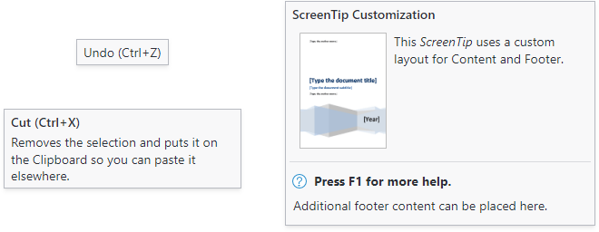

# Screen Tips

Bars fully implements screen tips for controls, which are advanced variations of standard tooltips.  They not only display a normal tooltip header but also can contain shortcut keys, longer descriptions, complex content, and footers.

Since the [ScreenTip](xref:@ActiproUIRoot.Controls.Bars.ScreenTip) class derives from a standard `ToolTip` control, it can be used anywhere a normal `ToolTip` is used.



*Several varieties of screen tips*

## Screen Tip Infrastructure

For Bars controls that do not explicitly assign the @if (avalonia) { `ToolTip.Tip` }@if (wpf) { `ToolTip` } property to an instance of a `ToolTip` control (or a control that derives from `ToolTip`, like [ScreenTip](xref:@ActiproUIRoot.Controls.Bars.ScreenTip)), a [ScreenTip](xref:@ActiproUIRoot.Controls.Bars.ScreenTip) will be coerced based on the available data.

A [ScreenTip](xref:@ActiproUIRoot.Controls.Bars.ScreenTip) is composed of three areas: [Header](xref:@ActiproUIRoot.Controls.Bars.ScreenTip.Header), `Content`, and [Footer](xref:@ActiproUIRoot.Controls.Bars.ScreenTip.Footer).

### Screen Tip Header

The base `Header` content is defined by the control's `ScreenTipHeader` property (e.g., [BarButton](xref:@ActiproUIRoot.Controls.Bars.BarButton).[ScreenTipHeader](xref:@ActiproUIRoot.Controls.Bars.BarButton.ScreenTipHeader)). Most controls are configured with a default @if (avalonia) { theme }@if (wpf) { style } that binds the `ScreenTipHeader` property to a `Title` property (e.g., [BarButton](xref:@ActiproUIRoot.Controls.Bars.BarButton).[Title](xref:@ActiproUIRoot.Controls.Bars.BarButton.Title)) on the same control.

The screen tip `Header` can be set to any object supported by `ContentPresenter`.

If the `ScreenTipHeader` property is undefined, the control's `Label` property (e.g., [BarButton](xref:@ActiproUIRoot.Controls.Bars.BarButton).[Label](xref:@ActiproUIRoot.Controls.Bars.BarButton.Label)) will be converted to the base `Header` content.  Any `Label` value that ends with ellipses (e.g., `"Print..."`) will trim the trailing ellipsis from the base `Header` content.

Finally, if the base `Header` content is a `string` and the control defines an @if (avalonia) { `InputGesture` property (e.g., [BarButton](xref:@ActiproUIRoot.Controls.Bars.BarButton).[InputGesture](xref:@ActiproUIRoot.Controls.Bars.BarButton.InputGesture)) }@if (wpf) { `InputGestureText` property (e.g., [BarButton](xref:@ActiproUIRoot.Controls.Bars.BarButton).[InputGestureText](xref:@ActiproUIRoot.Controls.Bars.BarButton.InputGestureText)) }, that gesture text will optionally be appended within parenthesis to the end of the `Header` content (e.g., `"Copy (Ctrl+C)"`).  Appending the gesture text can be disabled by setting the `IsInputGestureTextVisible` property (e.g., [BarButton](xref:@ActiproUIRoot.Controls.Bars.BarButton).[IsInputGestureTextVisible](xref:@ActiproUIRoot.Controls.Bars.BarButton.IsInputGestureTextVisible)) to `false`.

> [!NOTE]
> If only the `Header` is defined for a screen tip (no other `Content` or `Footer`) then the screen tip will appear like a normal `ToolTip`.

### Screen Tip Content

The body of a control's @if (avalonia) { `ToolTip.Tip` }@if (wpf) { `ToolTip` } property defines the `Content` of a screen tip *unless* the property is set to a `ToolTip` control (or a control that derives from `ToolTip`, like [ScreenTip](xref:@ActiproUIRoot.Controls.Bars.ScreenTip)).

The screen tip `Content` can be set to any object supported by `ContentPresenter` and enables the display of complex layouts within a screen tip.

### Screen Tip Footer

The `Footer` content is defined by the control's `ScreenTipFooter` property (e.g., [BarButton](xref:@ActiproUIRoot.Controls.Bars.BarButton).[ScreenTipFooter](xref:@ActiproUIRoot.Controls.Bars.BarButton.ScreenTipFooter)). By default, no other properties are bound to this property or used to coerce the `Footer` content.

The screen tip `Footer` can be set to any object supported by `ContentPresenter`.

## Common Examples

Most Bars controls that do not explicitly assign the @if (avalonia) { `ToolTip.Tip` }@if (wpf) { `ToolTip` } property a value will display a basic screen tip with text automatically generated from the control's `Title` or `Label` with optional @if (avalonia) { `InputGesture` }@if (wpf) { `InputGestureText` }.  The following are examples with the resulting screen tip defined by the comment above each sample:

@if (avalonia) {
```xaml
xmlns:actipro="http://schemas.actiprosoftware.com/avaloniaui"
...

<!-- Copy to Clipboard (Ctrl+C) -->
<actipro:BarButton Title="Copy to Clipboard" Label="Copy" Command="{Binding CopyCommand}" InputGesture="Ctrl+C" />

<!-- Copy (Ctrl+C) -->
<actipro:BarButton Label="Copy" Command="{Binding CopyCommand}" InputGesture="Ctrl+C" />

<!-- Copy to Clipboard -->
<actipro:BarButton Title="Copy to Clipboard" IsInputGestureTextVisible="False" Command="{Binding CopyCommand}" InputGesture="Ctrl+C" />
```
}
@if (wpf) {
```xaml
xmlns:bars="http://schemas.actiprosoftware.com/winfx/xaml/bars"
...

<!-- Copy to Clipboard (Ctrl+C) -->
<bars:BarButton Title="Copy to Clipboard" Label="Copy" Command="ApplicationCommands.Copy" />

<!-- Copy (Ctrl+C) -->
<bars:BarButton Label="Copy" Command="ApplicationCommands.Copy" />

<!-- Copy to Clipboard -->
<bars:BarButton Title="Copy to Clipboard" IsInputGestureTextVisible="False" Command="ApplicationCommands.Copy" />
```
}

By setting the @if (avalonia) { `ToolTip.Tip` }@if (wpf) { `ToolTip` } property to a string value, the basic screen tip like that from the previous example will display an additional description for the content. The following example would display a screen tip with the header `"Copy to Clipboard (Ctrl+C)"` and text content of `"Copies the selection to the clipboard"`.

@if (avalonia) {
```xaml
xmlns:actipro="http://schemas.actiprosoftware.com/avaloniaui"
...
<actipro:BarButton Title="Copy to Clipboard" Command="{Binding CopyCommand}" InputGesture="Ctrl+C" ToolTip.Tip="Copies the selection to the clipboard" />
```
}
@if (wpf) {
```xaml
xmlns:bars="http://schemas.actiprosoftware.com/winfx/xaml/bars"
...
<bars:BarButton Title="Copy to Clipboard" Command="ApplicationCommands.Copy" ToolTip="Copies the selection to the clipboard" />
```
}

## Explicitly Defining a Screen Tip

Since a [ScreenTip](xref:@ActiproUIRoot.Controls.Bars.ScreenTip) derives from a standard `ToolTip`, you can define it like a standard `ToolTip` as well.  The following example shows explicitly defining a [ScreenTip](xref:@ActiproUIRoot.Controls.Bars.ScreenTip):

@if (avalonia) {
```xaml
xmlns:actipro="http://schemas.actiprosoftware.com/avaloniaui"
...
<actipro:BarButton Command="{Binding CopyCommand}">
	<ToolTip.Tip>
		<actipro:ScreenTip>
			<actipro:ScreenTip.Header>
				<!-- Insert any header here -->
			</actipro:ScreenTip.Header>
			<actipro:ScreenTip.Content>
				<!-- Insert any content here -->
			</actipro:ScreenTip.Content>
			<actipro:ScreenTip.Footer>
				<!-- Insert any footer here -->
			</actipro:ScreenTip.Footer>
		</actipro:ScreenTip>
	</ToolTip.Tip>
</bars:BarButton>
```
}
@if (wpf) {
```xaml
xmlns:bars="http://schemas.actiprosoftware.com/winfx/xaml/bars"
...
<bars:BarButton Command="ApplicationCommands.Copy">
	<bars:BarButton.ToolTip>
		<bars:ScreenTip>
			<bars:ScreenTip.Header>
				<!-- Insert any header here -->
			</bars:ScreenTip.Header>
			<bars:ScreenTip.Content>
				<!-- Insert any content here -->
			</bars:ScreenTip.Content>
			<bars:ScreenTip.Footer>
				<!-- Insert any footer here -->
			</bars:ScreenTip.Footer>
		</bars:ScreenTip>
	</bars:BarButton.ToolTip>
</bars:BarButton>
```
}

## Use Screen Tip Anywhere

Yes, [ScreenTip](xref:@ActiproUIRoot.Controls.Bars.ScreenTip) can really be used on any control! The following example shows a standard `TextBox` control configured with a `ScreenTip`:

@if (avalonia) {
```xaml
xmlns:actipro="http://schemas.actiprosoftware.com/avaloniaui"
...
<TextBox x:Name="username">
	<ToolTip.Tip>
		<actipro:ScreenTip Header="Username">
			Screen tips can be used with any control to enhance the user experience.
		</actipro:ScreenTip>
	</ToolTip.Tip>
</TextBox>
```
}
@if (wpf) {
```xaml
xmlns:bars="http://schemas.actiprosoftware.com/winfx/xaml/bars"
...
<TextBox x:Name="username">
	<TextBox.ToolTip>
		<bars:ScreenTip Header="Username">
			Screen tips can be used with any control to enhance the user experience.
		</bars:ScreenTip>
	</TextBox.ToolTip>
</TextBox>
```
}

## ScreenTipService

The [ScreenTipService](xref:@ActiproUIRoot.Controls.Bars.ScreenTipService) provides numerous attached properties and events for working with screen tips and manages screen tip display and behavior.

It has these important properties:

| Member | Description |
|-----|-----|
| [Current](xref:@ActiproUIRoot.Controls.Bars.ScreenTipService.Current) Property | Gets the current instance of [ScreenTipService](xref:@ActiproUIRoot.Controls.Bars.ScreenTipService) for accessing instance properties and events. |
| [CurrentScreenTip](xref:@ActiproUIRoot.Controls.Bars.ScreenTipService.CurrentScreenTip) Property | Gets the [ScreenTip](xref:@ActiproUIRoot.Controls.Bars.ScreenTip) that is currently visible, if any. |
| [ScreenTipFooterProperty](xref:@ActiproUIRoot.Controls.Bars.ScreenTipService.ScreenTipFooterProperty) Attached Property | When specified, the content is displayed under a horizontal separator at the bottom of the screen tip.  Footers are most often used to provide extended state information about a control.  It is of type `object` meaning that you can specify plain text or can insert any type of control.  Each control's local `ScreenTipFooter` property is mapped to this property. |
| [ScreenTipHeaderProperty](xref:@ActiproUIRoot.Controls.Bars.ScreenTipService.ScreenTipHeaderProperty) Attached Property | When specified, the content is displayed in bold above the rest of the screen tip content.  It is of type `object` meaning that you can specify plain text or can insert any type of control.  Each control's local `ScreenTipHeader` property is mapped to this property. |
| [ScreenTipOpening](xref:@ActiproUIRoot.Controls.Bars.ScreenTipService.ScreenTipOpening) Event | Raised before the screen tip is displayed, allowing you to customize the screen tip properties. |

Most of the screen tip content properties are of type object, allowing you to pass a string of text or any control supported by `ContentPresenter`.  This allows for great flexibility in what you can display on the screen tip.

## Dynamically Generating Screen Tip Content

Screen tip content can be dynamically generated.  This allows you to modify the screen tip data on demand to best reflect the current state of the control.

To do this, listen to the [ScreenTipService](xref:@ActiproUIRoot.Controls.Bars.ScreenTipService).[ScreenTipOpening](xref:@ActiproUIRoot.Controls.Bars.ScreenTipService.ScreenTipOpening) event available as `ScreenTipService.Current.ScreenTipOpening`.  That event is raised before a screen tip is about to display for a control.  In the event handler, you may change the screen tip before it is rendered to the end user.

@if (wpf) {
> [!IMPORTANT]
> By default, only Bars controls are configured to raise the `ScreenTipOpening` event.  Custom controls that want to utilize the same event system should call [ScreenTipService](xref:@ActiproUIRoot.Controls.Bars.ScreenTipService).[NotifyToolTipOpening](xref:@ActiproUIRoot.Controls.Bars.ScreenTipService.NotifyToolTipOpening*) from their own `ToolTipOpening` event handler.
}

## Complex Content Width

By default, screen tips are relatively narrow and work well for text-based content. When more complex content is used (such as images), the default width may be too narrow.  To allow wider screen tips, set the [ScreenTip](xref:@ActiproUIRoot.Controls.Bars.ScreenTip).[ComplexContentWidth](xref:@ActiproUIRoot.Controls.Bars.ScreenTip.ComplexContentWidth) property to a more appropriate value.

When a [ScreenTip](xref:@ActiproUIRoot.Controls.Bars.ScreenTip) is explicitly defined, this property can be set directly on the control.  In other scenarios, listen to the [ScreenTipService](xref:@ActiproUIRoot.Controls.Bars.ScreenTipService).[ScreenTipOpening](xref:@ActiproUIRoot.Controls.Bars.ScreenTipService.ScreenTipOpening) event and alter the [ComplexContentWidth](xref:@ActiproUIRoot.Controls.Bars.ScreenTip.ComplexContentWidth) property before a screen tip is displayed.

@if (wpf) {
## Context-Sensitive Help Implementation

The [ScreenTip](xref:@ActiproUIRoot.Controls.Bars.ScreenTip).[Footer](xref:@ActiproUIRoot.Controls.Bars.ScreenTip.Footer) is a great place to prompt the user about context-sensitive help.  For instance, an icon could be displayed along with a message to "Press F1 for more information".

To handle this, simply process an `Execute` handler for the standard `ApplicationCommands.Help` command.  Then in that code, check the [ScreenTipService](xref:@ActiproUIRoot.Controls.Bars.ScreenTipService).[CurrentScreenTip](xref:@ActiproUIRoot.Controls.Bars.ScreenTipService.CurrentScreenTip) property to see if there is a [ScreenTip](xref:@ActiproUIRoot.Controls.Bars.ScreenTip) currently visible.  If there is, show the appropriate topic in your help file.  The [ScreenTip](xref:@ActiproUIRoot.Controls.Bars.ScreenTip).`Tag` property is a convenient location to store data related to context-sensitive help.
}

@if (avalonia) {
> [!TIP]
> See the "Screen Tips" Bars Ribbon QuickStart of the Sample Browser application for a full demonstration of multiple screen tip concepts and on-demand content.
}
@if (wpf) {
> [!TIP]
> See the "Screen Tips" Bars Ribbon QuickStart of the Sample Browser application for a full demonstration of multiple screen tip concepts, on-demand content, and handling context-sensitive help.
}