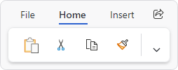

# Tab Row Toolbar

The ribbon's tab row toolbar is a control that can optionally be displayed on the far side of the ribbon, in the same row as the ribbon tabs.  It generally shows common controls that are always available, such as `Sharing` or `Feedback` buttons.



*A Share button in the ribbon tab row toolbar*

## Defining a Tab Row Toolbar

The tab row toolbar can be defined in XAML or code-behind by assigning a [RibbonTabRowToolBar](xref:@ActiproUIRoot.Controls.Bars.RibbonTabRowToolBar) control instance to the [Ribbon](xref:@ActiproUIRoot.Controls.Bars.Ribbon).[TabRowToolBarContent](xref:@ActiproUIRoot.Controls.Bars.Ribbon.TabRowToolBarContent) property.

> [!NOTE]
> See the "MVVM Support" section below for details on alternatively using this property to define the toolbar via MVVM techniques.

The items to be displayed in the toolbar are assigned to the [RibbonTabRowToolBar](xref:@ActiproUIRoot.Controls.Bars.RibbonTabRowToolBar).`Items` collection.  Since the control derives from `ItemsControl`, items may alternatively be bound into the controls's `ItemsSource` property.

This code sample shows how to define the tab row toolbar items for a ribbon.

@if (avalonia) {
```xaml
xmlns:actipro="http://schemas.actiprosoftware.com/avaloniaui"
...
<actipro:RibbonContainerPanel>
	<actipro:Ribbon>

		<actipro:Ribbon.TabRowToolBarContent>
			<actipro:RibbonTabRowToolBar>
				<actipro:BarButton Key="Share" Command="{Binding ShareCommand}" SmallIcon="{StaticResource ShareIcon}" />
			</actipro:RibbonTabRowToolBar>
		</actipro:Ribbon.TabRowToolBarContent>

		...
	</actipro:Ribbon>
</actipro:RibbonContainerPanel>
```
}
@if (wpf) {
```xaml
xmlns:bars="http://schemas.actiprosoftware.com/winfx/xaml/bars"
...
<bars:RibbonContainerPanel>
	<bars:Ribbon>

		<bars:Ribbon.TabRowToolBarContent>
			<bars:RibbonTabRowToolBar>
				<bars:BarButton Key="Share" Command="{Binding ShareCommand}" SmallImageSource="/Images/Share16.png" />
			</bars:RibbonTabRowToolBar>
		</bars:Ribbon.TabRowToolBarContent>

		...
	</bars:Ribbon>
</bars:RibbonContainerPanel>
```
}

## MVVM Support

The tab row toolbar may also be defined by setting the [Ribbon](xref:@ActiproUIRoot.Controls.Bars.Ribbon).[TabRowToolBarContent](xref:@ActiproUIRoot.Controls.Bars.Ribbon.TabRowToolBarContent) property to a view model that generates a [RibbonTabRowToolBar](xref:@ActiproUIRoot.Controls.Bars.RibbonTabRowToolBar) control via the ribbon's [ItemContainerTemplateSelector](xref:@ActiproUIRoot.Controls.Bars.Ribbon.ItemContainerTemplateSelector).

The optional companion [MVVM Library](../mvvm-support.md) defines a [RibbonTabRowToolBarViewModel](xref:@ActiproUIRoot.Controls.Bars.Mvvm.RibbonTabRowToolBarViewModel) class that is intended to be used as a view model for a [RibbonTabRowToolBar](xref:@ActiproUIRoot.Controls.Bars.RibbonTabRowToolBar) control, and the [BarControlTemplateSelector](xref:@ActiproUIRoot.Controls.Bars.Mvvm.BarControlTemplateSelector) class in the library generates a [RibbonTabRowToolBar](xref:@ActiproUIRoot.Controls.Bars.RibbonTabRowToolBar) for that view model.

> [!TIP]
> See the [MVVM Support](../mvvm-support.md) topic for more information on how to use the library's view models and view templates to create and manage your application's bars controls with MVVM techniques.

@if (avalonia) {
## Customizing the Toolbar Theme

The [RibbonTabRowToolBar](xref:@ActiproUIRoot.Controls.Bars.RibbonTabRowToolBar) instance can be customized by setting a `ControlTheme` to the [Ribbon](xref:@ActiproUIRoot.Controls.Bars.Ribbon).[TabRowToolBarTheme](xref:@ActiproUIRoot.Controls.Bars.Ribbon.TabRowToolBarTheme) property.  This `ControlTheme` is applied to the control when it is added to the ribbon.
}
@if (wpf) {
## Customizing the Toolbar Style

The [RibbonTabRowToolBar](xref:@ActiproUIRoot.Controls.Bars.RibbonTabRowToolBar) instance can be customized by setting a `Style` to the [Ribbon](xref:@ActiproUIRoot.Controls.Bars.Ribbon).[TabRowToolBarStyle](xref:@ActiproUIRoot.Controls.Bars.Ribbon.TabRowToolBarStyle) property.  This `Style` is applied to the control when it is added to the ribbon.
}

@if (avalonia) {
> [!TIP]
> See the "Tab Row Toolbar" Bars Ribbon QuickStart of the Sample Browser application for a full demonstration of working with tab row toolbar.
}