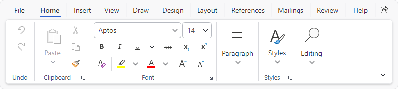
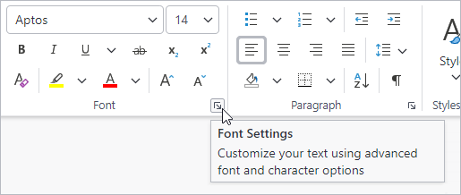

# Tabs, Groups, and Control Groups

Perhaps the most iconic feature of a ribbon is the use of tabs to organize controls that are further organized by groups within a tab.



*Ribbon tabs, groups, and control groups*

## Tabs

The [Ribbon](xref:@ActiproUIRoot.Controls.Bars.Ribbon) is an `ItemsControl` whose item containers are instances of [RibbonTabItem](xref:@ActiproUIRoot.Controls.Bars.RibbonTabItem).  The label of each tab is displayed along the top of the ribbon, and selecting a tab will display the groups of controls configured for that tab.

### Label

Tabs have a string [Label](xref:@ActiproUIRoot.Controls.Bars.RibbonTabItem.Label) that can be set, which is visible in UI as the header for the tab.

The [Label](xref:@ActiproUIRoot.Controls.Bars.RibbonTabItem.Label) can be auto-generated based on the tab's [Key](xref:@ActiproUIRoot.Controls.Bars.RibbonTabItem.Key) property.  For instance, a tab with [Key](xref:@ActiproUIRoot.Controls.Bars.RibbonTabItem.Key) of `"TableDesign"` will automatically assign `"Table Design"` as the [Label](xref:@ActiproUIRoot.Controls.Bars.RibbonTabItem.Label) value.  The auto-generated default can be overridden by setting the [Label](xref:@ActiproUIRoot.Controls.Bars.RibbonTabItem.Label) property.

See the [Label and Key Tip Generation](../controls/auto-generation.md) topic for more information on auto-generated labels.

### Key Tips

Tabs support key tips.  When a tab's key tip is accessed, the tab is selected and its child key tip scope is activated to further access controls contained within the tab.

The [RibbonTabItem](xref:@ActiproUIRoot.Controls.Bars.RibbonTabItem).[KeyTipText](xref:@ActiproUIRoot.Controls.Bars.RibbonTabItem.KeyTipText) can be auto-generated based on the tab's [Label](xref:@ActiproUIRoot.Controls.Bars.RibbonTabItem.Label) property.  For instance, a tab with [Label](xref:@ActiproUIRoot.Controls.Bars.RibbonTabItem.Label) of `"Home"` will automatically assign `"H"` as the [KeyTipText](xref:@ActiproUIRoot.Controls.Bars.RibbonTabItem.KeyTipText) value.  The auto-generated default can be overridden by setting the [KeyTipText](xref:@ActiproUIRoot.Controls.Bars.RibbonTabItem.KeyTipText) property.

> [!TIP]
> Since the [Key](xref:@ActiproUIRoot.Controls.Bars.RibbonTabItem.Key) will auto-generate a [Label](xref:@ActiproUIRoot.Controls.Bars.RibbonTabItem.Label), and [Label](xref:@ActiproUIRoot.Controls.Bars.RibbonTabItem.Label) will auto-generate [KeyTipText](xref:@ActiproUIRoot.Controls.Bars.RibbonTabItem.KeyTipText), it is often only necessary to specify the [Key](xref:@ActiproUIRoot.Controls.Bars.RibbonTabItem.Key) and allow both the [Label](xref:@ActiproUIRoot.Controls.Bars.RibbonTabItem.Label) and [KeyTipText](xref:@ActiproUIRoot.Controls.Bars.RibbonTabItem.KeyTipText) to be auto-generated!

See the [Key Tips](../ribbon-features/key-tips.md) topic for more information on key tips.

### Defining Tabs

The following sample shows a ribbon with **Home** and **View** tabs defined using labels and key tips that are auto-generated from the defined key:

@if (avalonia) {
```xaml
xmlns:actipro="http://schemas.actiprosoftware.com/avaloniaui"
...
<actipro:RibbonContainerPanel>
	<actipro:Ribbon>

		<!-- Other ribbon configuration here -->

		<!-- Define tabs -->
		<actipro:RibbonTabItem Key="Home" ... >
			<!-- Tab groups here -->
		</actipro:RibbonTabItem>
		<actipro:RibbonTabItem Key="View" ... >
			<!-- Tab groups here -->
		</actipro:RibbonTabItem>
		...

	</actipro:Ribbon>
</actipro:RibbonContainerPanel>
```
}
@if (wpf) {
```xaml
xmlns:bars="http://schemas.actiprosoftware.com/winfx/xaml/bars"
...
<bars:RibbonContainerPanel>
	<bars:Ribbon>

		<!-- Other ribbon configuration here -->

		<!-- Define tabs -->
		<bars:RibbonTabItem Key="Home" ... >
			<!-- Tab groups here -->
		</bars:RibbonTabItem>
		<bars:RibbonTabItem Key="View" ... >
			<!-- Tab groups here -->
		</bars:RibbonTabItem>
		...

	</bars:Ribbon>
</bars:RibbonContainerPanel>
```
}

See the "MVVM Support" section below for details on alternatively binding the items using MVVM techniques.

### MVVM Support

The tabs may also be defined by setting the [Ribbon](xref:@ActiproUIRoot.Controls.Bars.Ribbon).`ItemsSource` property to an enumerable of view models that generate [RibbonTabItem](xref:@ActiproUIRoot.Controls.Bars.RibbonTabItem) controls via the ribbon's [ItemContainerTemplateSelector](xref:@ActiproUIRoot.Controls.Bars.Ribbon.ItemContainerTemplateSelector).

The optional companion [MVVM Library](../mvvm-support.md) defines a [RibbonTabViewModel](xref:@ActiproUIRoot.Controls.Bars.Mvvm.RibbonTabViewModel) class that is intended to be used as a view model for a [RibbonTabItem](xref:@ActiproUIRoot.Controls.Bars.RibbonTabItem) control, and the [BarControlTemplateSelector](xref:@ActiproUIRoot.Controls.Bars.Mvvm.BarControlTemplateSelector) class in the library generates a [RibbonTabItem](xref:@ActiproUIRoot.Controls.Bars.RibbonTabItem) for that view model.

> [!TIP]
> See the [MVVM Support](../mvvm-support.md) topic for more information on how to use the library's view models and view templates to create and manage your application's bars controls with MVVM techniques.

### Contextual Tabs

Most ribbon tabs are always visible, but some tabs are only relevant when the application is in a specific state. These are called "contextual tabs".

See the [Contextual Tabs](contextual-tabs.md) topic for more details on that feature.

### Hiding Tabs

Some applications with only one ribbon tab may wish to hide the tab row entirely, so that a minimal ribbon is presented.  This appearance can be achieved by setting these [Ribbon](xref:@ActiproUIRoot.Controls.Bars.Ribbon) properties:
- [AreTabsVisible](xref:@ActiproUIRoot.Controls.Bars.Ribbon.AreTabsVisible) = `false`
- [IsApplicationButtonVisible](xref:@ActiproUIRoot.Controls.Bars.Ribbon.IsApplicationButtonVisible) = `false`
- [TabRowToolBarContent](xref:@ActiproUIRoot.Controls.Bars.Ribbon.TabRowToolBarContent) = `null`

## Groups

Groups are used to organize related controls within a tab and can have a different effect based on the ribbon's layout mode.

### Classic Layout Mode

In the `Classic` layout mode, groups are prominently displayed in the UI with separators between each group and the label at the bottom.  When there is not enough space to display all of the controls in a ribbon, a group may collapse to a single button that will display the group's controls in a popup when accessed.

See the [Resizing and Variants](resizing.md) topic for more details on how groups impact resizing and how to prevent a group from collapsing.

See the [Layout Modes and Density](layout-and-density.md) topic for more details on `Classic` mode.

### Simplified Layout Mode

In the `Simplified` layout mode, controls still visible in the ribbon will render a separator between groups. Any controls that have moved to the **Tab Overflow** menu will be organized under a header based on the containing group's label.  Groups can optionally be configured to overflow to their own menu instead of the common **Tab Overflow** menu.

See the [Resizing and Variants](resizing.md) topic for more details on how groups impact resizing and how to configure a **Group Overflow** menu.

See the [Layout Modes and Density](layout-and-density.md) topic for more details on `Simplified` mode.

### Label

Groups have a string [Label](xref:@ActiproUIRoot.Controls.Bars.RibbonGroup.Label) that can be set, which is visible in UI below the group (`Classic` layout mode) or in the **Tab Overflow** menu (`Simplified` layout mode).

The [Label](xref:@ActiproUIRoot.Controls.Bars.RibbonGroup.Label) can be auto-generated based on the group's [Key](xref:@ActiproUIRoot.Controls.Bars.RibbonGroup.Key) property.  For instance, a group with [Key](xref:@ActiproUIRoot.Controls.Bars.RibbonGroup.Key) of `"FontSettings"` will automatically assign `"Font Settings"` as the [Label](xref:@ActiproUIRoot.Controls.Bars.RibbonGroup.Label) value.  The auto-generated default can be overridden by setting the [Label](xref:@ActiproUIRoot.Controls.Bars.RibbonGroup.Label) property.

See the [Label and Key Tip Generation](../controls/auto-generation.md) topic for more information on auto-generated labels.

### Label Mode

Group labels only show by default on the ribbon when in `Classic` layout mode.  In scenarios where a ribbon in `Simplified` layout mode should also show group labels, set the [Ribbon](xref:@ActiproUIRoot.Controls.Bars.Ribbon).[GroupLabelMode](xref:@ActiproUIRoot.Controls.Bars.Ribbon.GroupLabelMode) property to [Always](xref:@ActiproUIRoot.Controls.Bars.RibbonGroupLabelMode.Always) instead of its default value of [Default](xref:@ActiproUIRoot.Controls.Bars.RibbonGroupLabelMode.Default).

### Collapsed Button Key Tip (Classic layout mode only)

When a group in the `Classic` layout mode is collapsed to a button, the collapsed button supports key tips.  When the key tip of a group's collapsed button is accessed, the content of the group is displayed in a popup.

> [!NOTE]
> A convention used by Office applications is for the key tip of collapsed groups to use two-letter tips that start with `"Z"`. For example, `"ZF"` might be the key tip for the collapsed button of a **Font** group.

The [RibbonGroup](xref:@ActiproUIRoot.Controls.Bars.RibbonGroup).[KeyTipText](xref:@ActiproUIRoot.Controls.Bars.RibbonGroup.CollapsedButtonKeyTipText) can be auto-generated based on the group's [Label](xref:@ActiproUIRoot.Controls.Bars.RibbonGroup.Label) property.  Based on the convention noted above, the auto-generated key tip will be prefixed with `"Z"` to match the convention.  For instance, a group with [Label](xref:@ActiproUIRoot.Controls.Bars.RibbonGroup.Label) of `"Font"` will automatically assign `"ZF"` as the [CollapsedButtonKeyTipText](xref:@ActiproUIRoot.Controls.Bars.RibbonGroup.CollapsedButtonKeyTipText) value.  The auto-generated default can be overridden by setting the [CollapsedButtonKeyTipText](xref:@ActiproUIRoot.Controls.Bars.RibbonGroup.CollapsedButtonKeyTipText) property.

> [!TIP]
> Since the [Key](xref:@ActiproUIRoot.Controls.Bars.RibbonGroup.Key) will auto-generate a [Label](xref:@ActiproUIRoot.Controls.Bars.RibbonGroup.Label), and [Label](xref:@ActiproUIRoot.Controls.Bars.RibbonGroup.Label) will auto-generate [CollapsedButtonKeyTipText](xref:@ActiproUIRoot.Controls.Bars.RibbonGroup.CollapsedButtonKeyTipText), it is often only necessary to specify the [Key](xref:@ActiproUIRoot.Controls.Bars.RibbonGroup.Key) and allow both the [Label](xref:@ActiproUIRoot.Controls.Bars.RibbonGroup.Label) and [CollapsedButtonKeyTipText](xref:@ActiproUIRoot.Controls.Bars.RibbonGroup.CollapsedButtonKeyTipText) to be auto-generated!

See the [Key Tips](../ribbon-features/key-tips.md) topic for more information on key tips.

### Launcher Button

A [RibbonGroup](xref:@ActiproUIRoot.Controls.Bars.RibbonGroup) can display a launcher button on the far-bottom corner of the group.  This button is defined by assigning an object to the [RibbonGroup](xref:@ActiproUIRoot.Controls.Bars.RibbonGroup).[LauncherButtonContent](xref:@ActiproUIRoot.Controls.Bars.RibbonGroup.LauncherButtonContent) property. Typically, this property is set to an instance of [RibbonGroupLauncherButton](xref:@ActiproUIRoot.Controls.Bars.RibbonGroupLauncherButton), but can alternatively use a view model as described in "MVVM Support" section below.



*A ribbon group's launcher button*

Launcher buttons should be used to display additional UI (e.g., a dialog window or control panel) that contains advanced functionality related to the group that is not available within the ribbon control.  For instance, a **Font** group in the ribbon might display basic controls to select font family and size, but the launcher button could open a dialog with even more font options.

The launcher button is configured in a manner consistent with other Bars button controls including support for common properties like `Command`, [Key](xref:@ActiproUIRoot.Controls.Bars.RibbonGroupLauncherButton.Key), [Label](xref:@ActiproUIRoot.Controls.Bars.RibbonGroupLauncherButton.Label) (with support to auto-generate from `Key`), and [KeyTipText](xref:@ActiproUIRoot.Controls.Bars.RibbonGroupLauncherButton.KeyTipText) (with support to auto-generate from `Label`).  [Screen Tips](screen-tips.md) are also supported.

Unlike other buttons, however, the @if (avalonia) { [SmallIcon](xref:@ActiproUIRoot.Controls.Bars.RibbonGroupLauncherButton.SmallIcon) }@if (wpf) { [SmallImageSource](xref:@ActiproUIRoot.Controls.Bars.RibbonGroupLauncherButton.SmallImageSource) } property does not define the button content.  Instead, this image is *only* displayed when the ribbon is using the `Simplified` layout mode and the launcher button has been moved to an overflow menu. In the overflow menu, the icon will be displayed in the icon column consistent with other menu items.

### Defining Groups

The following XAML sample demonstrates how to define a [RibbonGroup](xref:@ActiproUIRoot.Controls.Bars.RibbonGroup) using labels and key tips that are auto-generated from the defined key:

@if (avalonia) {
```xaml
xmlns:actipro="http://schemas.actiprosoftware.com/avaloniaui"
...
<actipro:RibbonTabItem Key="Home" ... >

	<!-- Tab groups here -->
	<actipro:RibbonGroup Key="FontSettings">

		<!-- Launcher button -->
		<actipro:RibbonGroup.LauncherButtonContent>
			<actipro:RibbonGroupLauncherButton
				Key="FontSettingsLauncher"
				Label="Font Settings"
				KeyTipText="FN"
				ToolTip.Tip="Customize your text to give it the exact look you want."
				Command="{Binding OpenFontSettingsCommand}" />
		</actipro:RibbonGroup.LauncherButtonContent>

		<!-- Define controls and/or control groups here -->
		<actipro:BarButton Key="IncreaseFontSize" ... />
		...

	</actipro:RibbonGroup>
</actipro:RibbonTabItem>
...
```
}
@if (wpf) {
```xaml
xmlns:bars="http://schemas.actiprosoftware.com/winfx/xaml/bars"
...
<bars:RibbonTabItem Key="Home" ... >

	<!-- Tab groups here -->
	<bars:RibbonGroup Key="FontSettings">

		<!-- Launcher button -->
		<bars:RibbonGroup.LauncherButtonContent>
			<bars:RibbonGroupLauncherButton
				Key="FontSettingsLauncher"
				Label="Font Settings"
				KeyTipText="FN"
				ToolTip="Customize your text to give it the exact look you want."
				Command="{Binding OpenFontSettingsCommand}" />
		</bars:RibbonGroup.LauncherButtonContent>

		<!-- Define controls and/or control groups here -->
		<bars:BarButton Key="IncreaseFontSize" ... />
		...

	</bars:RibbonGroup>
</bars:RibbonTabItem>
...
```
}

See the "MVVM Support" section below for details on alternatively binding the items using MVVM techniques.

### MVVM Support

The groups may also be defined by setting the [RibbonTabItem](xref:@ActiproUIRoot.Controls.Bars.RibbonTabItem).`ItemsSource` property to an enumerable of view models that generate [RibbonGroup](xref:@ActiproUIRoot.Controls.Bars.RibbonGroup) controls via the ribbon's [ItemContainerTemplateSelector](xref:@ActiproUIRoot.Controls.Bars.Ribbon.ItemContainerTemplateSelector).

A group's launcher button may be defined by setting the [RibbonGroup](xref:@ActiproUIRoot.Controls.Bars.RibbonGroup).[LauncherButtonContent](xref:@ActiproUIRoot.Controls.Bars.RibbonGroup.LauncherButtonContent) property to a view model that generates a [RibbonGroupLauncherButton](xref:@ActiproUIRoot.Controls.Bars.RibbonGroupLauncherButton) control via the ribbon's [ItemContainerTemplateSelector](xref:@ActiproUIRoot.Controls.Bars.Ribbon.ItemContainerTemplateSelector).

The optional companion [MVVM Library](../mvvm-support.md) defines a [RibbonGroupViewModel](xref:@ActiproUIRoot.Controls.Bars.Mvvm.RibbonGroupViewModel) class that is intended to be used as a view model for a [RibbonGroup](xref:@ActiproUIRoot.Controls.Bars.RibbonGroup) control, and the [BarControlTemplateSelector](xref:@ActiproUIRoot.Controls.Bars.Mvvm.BarControlTemplateSelector) class in the library generates a [RibbonGroup](xref:@ActiproUIRoot.Controls.Bars.RibbonGroup) for that view model.  The library also defines a [RibbonGroupLauncherButtonViewModel](xref:@ActiproUIRoot.Controls.Bars.Mvvm.RibbonGroupLauncherButtonViewModel) class that is intended to be used as a view model for a [RibbonGroupLauncherButton](xref:@ActiproUIRoot.Controls.Bars.RibbonGroupLauncherButton) control.

> [!TIP]
> See the [MVVM Support](../mvvm-support.md) topic for more information on how to use the library's view models and view templates to create and manage your application's bars controls with MVVM techniques.

## Control Groups (Classic layout mode only)

A [RibbonControlGroup](xref:@ActiproUIRoot.Controls.Bars.RibbonControlGroup) is only relevant when a ribbon is using the `Classic` layout mode and can be omitted if only the `Simplified` layout mode is to be supported.

The primary purpose of a [RibbonControlGroup](xref:@ActiproUIRoot.Controls.Bars.RibbonControlGroup) is to enable variant sizing of the controls within the group.  See the [Resizing and Variants](resizing.md) topic for more details on resizing.

### Defining Control Groups

The following XAML demonstrates how a control group might be used to achieve a result similar to Office's **Clipboard** group where the **Paste** control is always a large button and the related **Cut**, **Copy**, and **Format Painter** controls are stacked vertically in a group that never uses the [Large](xref:@ActiproUIRoot.Controls.Bars.VariantSize.Large) variant size:

@if (avalonia) {
```xaml
xmlns:actipro="http://schemas.actiprosoftware.com/avaloniaui"
...
<actipro:RibbonTabItem Key="Home" ... >

	<actipro:RibbonGroup Key="Clipboard">

		<!-- Large Paste control -->
		<actipro:BarSplitButton Key="Paste" ... > ... </actipro:BarSplitButton>

		<!-- Group of other clipboard controls -->
		<actipro:RibbonControlGroup ItemVariantBehavior="NeverLarge">
			<actipro:BarButton Key="Cut" Command="{Binding CutCommand}" SmallIcon="{StaticResource CutIcon}" />
			<actipro:BarButton Key="Copy" Command="{Binding CopyCommand}" SmallIcon="{StaticResource CopyIcon}" />
			<actipro:BarButton Key="FormatPainter" Command="{Binding FormatPainterCommand}" SmallIcon="{StaticResource FormatPainterIcon}" />
		</actipro:RibbonControlGroup>

	</actipro:RibbonGroup>
	...

</actipro:RibbonTabItem>
...
```
}
@if (wpf) {
```xaml
xmlns:bars="http://schemas.actiprosoftware.com/winfx/xaml/bars"
...
<bars:RibbonTabItem Key="Home" ... >

	<bars:RibbonGroup Key="Clipboard">

		<!-- Large Paste control -->
		<bars:BarSplitButton Key="Paste" ... > ... </bars:BarSplitButton>

		<!-- Group of other clipboard controls -->
		<bars:RibbonControlGroup ItemVariantBehavior="NeverLarge">
			<bars:BarButton Key="Cut" Command="Cut" SmallImageSource="/Images/Cut16.png" />
			<bars:BarButton Key="Copy" Command="Copy" SmallImageSource="/Images/Copy16.png" />
			<bars:BarButton Key="FormatPainter" Command="{Binding FormatPainterCommand}" SmallImageSource="/Images/FormatPainter16.png" />
		</bars:RibbonControlGroup>

	</bars:RibbonGroup>
	...

</bars:RibbonTabItem>
...
```
}

See the "MVVM Support" section below for details on alternatively binding the items using MVVM techniques.

### MVVM Support

The control groups may also be defined by setting the [RibbonGroup](xref:@ActiproUIRoot.Controls.Bars.RibbonGroup).`ItemsSource` property to an enumerable of view models that generate [RibbonControlGroup](xref:@ActiproUIRoot.Controls.Bars.RibbonControlGroup) controls via the ribbon's [ItemContainerTemplateSelector](xref:@ActiproUIRoot.Controls.Bars.Ribbon.ItemContainerTemplateSelector).

The optional companion [MVVM Library](../mvvm-support.md) defines a [RibbonControlGroupViewModel](xref:@ActiproUIRoot.Controls.Bars.Mvvm.RibbonControlGroupViewModel) class that is intended to be used as a view model for a [RibbonControlGroup](xref:@ActiproUIRoot.Controls.Bars.RibbonControlGroup) control, and the [BarControlTemplateSelector](xref:@ActiproUIRoot.Controls.Bars.Mvvm.BarControlTemplateSelector) class in the library generates a [RibbonControlGroup](xref:@ActiproUIRoot.Controls.Bars.RibbonControlGroup) for that view model.

> [!TIP]
> See the [MVVM Support](../mvvm-support.md) topic for more information on how to use the library's view models and view templates to create and manage your application's bars controls with MVVM techniques.

### Horizontal Alignment

When a [RibbonControlGroup](xref:@ActiproUIRoot.Controls.Bars.RibbonControlGroup) is within a [RibbonGroup](xref:@ActiproUIRoot.Controls.Bars.RibbonGroup) and is vertically stacking its items (`Medium` or `Small` variant sizes), the [RibbonControlGroup](xref:@ActiproUIRoot.Controls.Bars.RibbonControlGroup).`HorizontalContentAlignment` property determines how the items are horizontally aligned.  The default value is `Left`.

In some cases, such as when using [ItemVariantBehavior](xref:@ActiproUIRoot.Controls.Bars.ItemVariantBehavior).[AlwaysMedium](xref:@ActiproUIRoot.Controls.Bars.ItemVariantBehavior.AlwaysMedium) for a set of buttons, it may be preferred to ensure all items are the same width by using the `HorizontalAlignment.Stretch` option.  This can be particularly useful when the items are [popup buttons](../controls/popup-button.md) or [split buttons](../controls/split-button.md) since the dropdown arrows will align on the right, even though the buttons have different label lengths.

## Multi-Row Control Groups (Classic layout mode only)

A [RibbonMultiRowControlGroup](xref:@ActiproUIRoot.Controls.Bars.RibbonMultiRowControlGroup) is only relevant when a ribbon is using the `Classic` layout mode and can be omitted if only the `Simplified` layout mode is to be supported.

The primary purpose of a [RibbonMultiRowControlGroup](xref:@ActiproUIRoot.Controls.Bars.RibbonMultiRowControlGroup) is to display contained controls in two or three rows within the parent ribbon group.  See the [Resizing and Variants](resizing.md) topic for more details on resizing.

### Defining Multi-Row Control Groups

The following XAML demonstrates how a multi-row control group might be used to display a set of controls that show in two or three rows, depending on available space:

@if (avalonia) {
```xaml
xmlns:actipro="http://schemas.actiprosoftware.com/avaloniaui"
...
<actipro:RibbonTabItem Key="Home" ... >

	<actipro:RibbonGroup Key="FontGroup" Label="Font">

		<actipro:RibbonMultiRowControlGroup>

			<!-- Don't render separators next to this set of comboboxes -->
			<actipro:RibbonControlGroup SeparatorMode="Never">
				<actipro:BarComboBox x:Name="fontFamilyComboBox"
					IsStarSizingAllowed="True"
					KeyTipText="FF"
					MenuResizeMode="Vertical"
					RequestedWidth="115"
					TextMemberBinding="{Binding Label, x:DataType=actipro:IBarGalleryItemViewModel}"
					UseMenuItemAppearance="True"
					/>
				<actipro:BarComboBox x:Name="fontSizeComboBox"
					RequestedWidth="40"
					KeyTipText="FS"
					MenuResizeMode="Vertical"
					TextMemberBinding="{Binding Label, x:DataType=actipro:IBarGalleryItemViewModel}"
					UseMenuItemAppearance="True"
					/>
			</actipro:RibbonControlGroup>

			<!-- Larger and smaller font size buttons -->
			<actipro:RibbonControlGroup>
				<actipro:BarButton Key="Larger" SmallIcon="{StaticResource GrowFontIcon}" KeyTipText="FG" />
				<actipro:BarButton Key="Smaller" SmallIcon="{StaticResource ShrinkFontIcon}" KeyTipText="FK" />
			</actipro:RibbonControlGroup>

			<!-- Bold, italic, and underline buttons -->
			<actipro:RibbonControlGroup>
				<actipro:BarButton Key="Bold" SmallIcon="{StaticResource BoldIcon}" KeyTipText="B" />
				<actipro:BarButton Key="Italic" SmallIcon="{StaticResource ItalicIcon}" KeyTipText="I" />
				<actipro:BarButton Key="Underline" SmallIcon="{StaticResource UnderlineIcon}" KeyTipText="U" />
			</actipro:RibbonControlGroup>

		</actipro:RibbonMultiRowControlGroup>

	</actipro:RibbonGroup>
	...

</actipro:RibbonTabItem>
...
```
}
@if (wpf) {
```xaml
xmlns:bars="http://schemas.actiprosoftware.com/winfx/xaml/bars"
...
<bars:RibbonTabItem Key="Home" ... >

	<bars:RibbonGroup Key="FontGroup" Label="Font">

		<bars:RibbonMultiRowControlGroup>

			<!-- Don't render separators next to this set of comboboxes -->
			<bars:RibbonControlGroup SeparatorMode="Never">
				<bars:BarComboBox
					x:Name="fontFamilyComboBox"
					IsStarSizingAllowed="True"
					KeyTipText="FF"
					MenuResizeMode="Vertical"
					RequestedWidth="115"
					SelectedValuePath="Value"
					TextPath="Label"
					UseMenuItemAppearance="True"
					/>
				<bars:BarComboBox
					x:Name="fontSizeComboBox"
					KeyTipText="FS"
					MenuResizeMode="Vertical"
					RequestedWidth="40"
					SelectedValuePath="Value"
					TextPath="Label"
					UseMenuItemAppearance="True"
					/>
			</bars:RibbonControlGroup>

			<!-- Larger and smaller font size buttons -->
			<bars:RibbonControlGroup>
				<bars:BarButton Key="Larger" SmallImageSource="/Images/GrowFont16.png" KeyTipText="FG" />
				<bars:BarButton Key="Smaller" SmallImageSource="/Images/ShrinkFont16.png" KeyTipText="FK" />
			</bars:RibbonControlGroup>

			<!-- Bold, italic, and underline buttons -->
			<bars:RibbonControlGroup>
				<bars:BarButton Key="Bold" SmallImageSource="/Images/Bold16.png" KeyTipText="B" />
				<bars:BarButton Key="Italic" SmallImageSource="/Images/Italic16.png" KeyTipText="I" />
				<bars:BarButton Key="Underline" SmallImageSource="/Images/Underline16.png" KeyTipText="U" />
			</bars:RibbonControlGroup>

		</bars:RibbonMultiRowControlGroup>

	</bars:RibbonGroup>
	...

</bars:RibbonTabItem>
...
```
}

See the "MVVM Support" section below for details on alternatively binding the items using MVVM techniques.

### MVVM Support

A multi-row control group may also be defined by setting the [RibbonGroup](xref:@ActiproUIRoot.Controls.Bars.RibbonGroup).`ItemsSource` property to an enumerable of view models, one of which generates a [RibbonMultiRowControlGroup](xref:@ActiproUIRoot.Controls.Bars.RibbonMultiRowControlGroup) control via the ribbon's [ItemContainerTemplateSelector](xref:@ActiproUIRoot.Controls.Bars.Ribbon.ItemContainerTemplateSelector).

The optional companion [MVVM Library](../mvvm-support.md) defines a [RibbonMultiRowControlGroupViewModel](xref:@ActiproUIRoot.Controls.Bars.Mvvm.RibbonMultiRowControlGroupViewModel) class that is intended to be used as a view model for a [RibbonMultiRowControlGroup](xref:@ActiproUIRoot.Controls.Bars.RibbonMultiRowControlGroup) control, and the [BarControlTemplateSelector](xref:@ActiproUIRoot.Controls.Bars.Mvvm.BarControlTemplateSelector) class in the library generates a [RibbonMultiRowControlGroup](xref:@ActiproUIRoot.Controls.Bars.RibbonMultiRowControlGroup) for that view model.

> [!TIP]
> See the [MVVM Support](../mvvm-support.md) topic for more information on how to use the library's view models and view templates to create and manage your application's bars controls with MVVM techniques.
