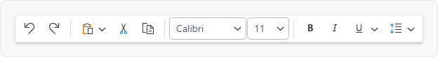
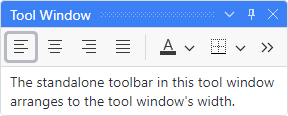
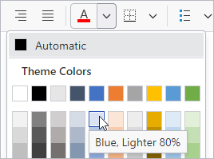

# Overview

The [StandaloneToolBar](xref:@ActiproUIRoot.Controls.Bars.StandaloneToolBar) control is meant to be a replacement for a native `ToolBar` control.  It supports horizontal and vertical orientation, can make use of all the [Bars controls](../controls/index.md) and their features (including menu galleries), and overflows items to a popup.  As with the other root bar controls, it can be fully configured via MVVM.

## Usage Scenarios

### Main Toolbar

The [StandaloneToolBar](xref:@ActiproUIRoot.Controls.Bars.StandaloneToolBar) control can be made to render similar to a ribbon in [Simplified layout mode](../ribbon-features/layout-and-density.md) where there is a single row of child controls.  @if (wpf) { This appearance is great when the main window has system backdrop enabled and there is a single primary toolbar. }



*A standalone toolbar is ideal as a main toolbar instead of a ribbon in apps with fewer commands*

The main difference between the toolbar and a Simplified ribbon is in how overflow is achieved.  The toolbar does not alter variant sizes of child controls and will overflow its items to a chevron popup when necessary.  Whereas a Simplified ribbon can alter variant sizes of child controls when width is changed and overflows its items to popup menus when necessary.

@if (avalonia) {
The toolbar's `Background`, `BorderBrush`, `BorderThickness`, `CornerRadius`, [HasShadow](xref:@ActiproUIRoot.Controls.Bars.StandaloneToolBar.HasShadow), `ItemSpacing`, and `Padding` properties can be set to achieve an appearance like above.
}
@if (wpf) {
The toolbar's `Background`, `BorderBrush`, `BorderThickness`, [CornerRadius](xref:@ActiproUIRoot.Controls.Bars.StandaloneToolBar.CornerRadius), [HasShadow](xref:@ActiproUIRoot.Controls.Bars.StandaloneToolBar.HasShadow), `ItemSpacing`, `Padding`, and [UserInterfaceDensity](xref:@ActiproUIRoot.Controls.Bars.StandaloneToolBar.UserInterfaceDensity) properties can be set to achieve an appearance like above.
}

### Tool Window Toolbar

[StandaloneToolBar](xref:@ActiproUIRoot.Controls.Bars.StandaloneToolBar) also works great out-of-the-box as a toolbar that can be placed in another container, such as within a tool window from the [Actipro Docking/MDI product](../../docking/index.md).



*A standalone toolbar in a tool window*

In this usage scenario, it's generally better to use the default appearance that is more compact.

@if (avalonia) {
```xaml
xmlns:actipro="http://schemas.actiprosoftware.com/avaloniaui"
...
<DockPanel>

	<!-- Dock a toolbar to the top of a panel -->
	<actipro:StandaloneToolBar DockPanel.Dock="Top"
		Background="{actipro:ThemeResource Container2BackgroundBrush}"
		BorderBrush="{actipro:ThemeResource Container2BorderBrush}"
		BorderThickness="0,0,0,1"
		CornerRadius="0"
		ItemSpacing="0"
		Theme="{StaticResource {x:Static actipro:BarsMvvmResourceKeys.StandaloneToolBarControlTheme}}"
		/>

	...

</DockPanel>
```
}
@if (wpf) {
```xaml
xmlns:bars="http://schemas.actiprosoftware.com/winfx/xaml/bars"
xmlns:docking="http://schemas.actiprosoftware.com/winfx/xaml/docking"
xmlns:themes="http://schemas.actiprosoftware.com/winfx/xaml/themes"
...
<docking:DockSite>
	<docking:SplitContainer>
		<docking:Workspace />
		<docking:ToolWindowContainer>
			<docking:ToolWindow Title="Tool Window">
				<DockPanel>
					<bars:StandaloneToolBar
						DockPanel.Dock="Top"
						Background="{DynamicResource {x:Static themes:AssetResourceKeys.ContainerBackgroundLowBrushKey}}"
						BorderThickness="0">

						<!-- Labels are auto-generated from Key -->
						<bars:BarButton Key="Undo" SmallImageSource="/Images/Undo16.png" Command="{Binding UndoCommand}" />
						<bars:BarButton Key="Redo" SmallImageSource="/Images/Redo16.png" Command="{Binding RedoCommand}" />
						<bars:BarSeparator />
						<bars:BarButton Key="Cut" SmallImageSource="/Images/Cut16.png" Command="{Binding CutCommand}" />
						<bars:BarButton Key="Copy" SmallImageSource="/Images/Copy16.png" Command="{Binding CopyCommand}" />
						<bars:BarButton Key="Paste" SmallImageSource="/Images/Paste16.png" Command="{Binding PasteCommand}" />
						...
					</bars:StandaloneToolBar>
					...
				</DockPanel>
			</docking:ToolWindow>
		</docking:ToolWindowContainer>
	</docking:SplitContainer>
</docking:DockSite>
```
}

## Orientation

The toolbar can arrange its child controls either horizontally (default) or vertically by setting the [Orientation](xref:@ActiproUIRoot.Controls.Bars.StandaloneToolBar.Orientation) property.

## Overflow Behavior

The [StandaloneToolBar](xref:@ActiproUIRoot.Controls.Bars.StandaloneToolBar) control will not alter the variant size of child controls as available size changes.  If a child control is unable to fit in the available space, it will be overflowed to a chevron popup menu from where it can be fully accessed.

The [IsOverflowed](xref:@ActiproUIRoot.Controls.Bars.StandaloneToolBar.IsOverflowed) property returns whether the toolbar is currently in an overflowed state.

## Child Controls

The toolbar can host all [Bars controls](../controls/index.md) that are meant for a toolbar context.  A powerful feature is the ability to use a [popup button](../controls/popup-button.md) or [split button](../controls/split-button.md) to show a graphically-rich [menu gallery](../controls/gallery.md) in its popup menu.



*A standalone toolbar with a gallery open*

Most controls define a `ToolBarItemVariantBehavior` property (e.g., [BarButton](xref:@ActiproUIRoot.Controls.Bars.BarButton).[ToolBarItemVariantBehavior](xref:@ActiproUIRoot.Controls.Bars.BarButton.ToolBarItemVariantBehavior)) that determines the allowed variant sizes of a control when it is displayed in a toolbar.  The property defaults to `AlwaysSmall`, causing controls to display in a `Small` variant, which often means icon only.

Since the standalone toolbar doesn't dynamically adjust child control variants as space decreases like a ribbon in `Simplified` layout mode does, it only uses each child's `ToolBarItemVariantBehavior` property as a guideline for what single variant size to support for that child.  Therefore as an example, to display an icon and label for a particular button, set the [BarButton](xref:@ActiproUIRoot.Controls.Bars.BarButton).[ToolBarItemVariantBehavior](xref:@ActiproUIRoot.Controls.Bars.BarButton.ToolBarItemVariantBehavior) property to `AlwaysMedium`.

## Key Tips

Key tips in child controls are supported, but are not active by default and must be enabled by setting the attached [BarControlService](xref:@ActiproUIRoot.Controls.Bars.KeyTipService.IsRootKeyTipScopeProperty) property to `true`.

@if (avalonia) {
```xaml
xmlns:actipro="http://schemas.actiprosoftware.com/avaloniaui"
...
<actipro:StandaloneToolBar ... actipro:KeyTipService.IsRootKeyTipScope="True">
	...
</actipro:StandaloneToolBar>
```
}
@if (wpf) {
```xaml
xmlns:bars="http://schemas.actiprosoftware.com/winfx/xaml/bars"
...
<bars:StandaloneToolBar ... bars:KeyTipService.IsRootKeyTipScope="True">
	...
</bars:StandaloneToolBar>
```
}

After the toolbar is marked as a root key tip scope, pressing keys like <kbd>Alt</kbd> will activate key tip mode the same as with a ribbon.

See the [Key Tips](../ribbon-features/key-tips.md) topic for more information on key tips.

## Screen Tips

The child controls support screen tips, which are formatted tool tips.  Screen tips attempt to display below the [StandaloneToolBar](xref:@ActiproUIRoot.Controls.Bars.StandaloneToolBar) when horizontally oriented or to the far side when vertically oriented.

See the [Screen Tips](../ribbon-features/screen-tips.md) topic for more information on screen tips.

## MVVM Support

The optional companion [MVVM Library](../mvvm-support.md) defines a [StandaloneToolBarViewModel](xref:@ActiproUIRoot.Controls.Bars.Mvvm.StandaloneToolBarViewModel) class that is intended to be used as a view model for a [StandaloneToolBar](xref:@ActiproUIRoot.Controls.Bars.StandaloneToolBar) control.

@if (avalonia) {
If a [StandaloneToolBarViewModel](xref:@ActiproUIRoot.Controls.Bars.Mvvm.StandaloneToolBarViewModel) instance is bound to the [StandaloneToolBar](xref:@ActiproUIRoot.Controls.Bars.StandaloneToolBar).`DataContext`, a built-in `ControlTheme` with resource key [StandaloneToolBarControlTheme](xref:@ActiproUIRoot.Themes.Bars.Mvvm.BarsMvvmResourceKeys.StandaloneToolBarControlTheme) can be applied to configure bindings for all the view model's properties:

```xaml
xmlns:actipro="http://schemas.actiprosoftware.com/avaloniaui"
...
<actipro:StandaloneToolBar ...
	DataContext="{Binding ToolBar}"
	Theme="{StaticResource {x:Static themes:BarsMvvmResourceKeys.StandaloneToolBarControlTheme}}"
	>
	...
</actipro:StandaloneToolBar>
```
}
@if (wpf) {
If a [StandaloneToolBarViewModel](xref:@ActiproUIRoot.Controls.Bars.Mvvm.StandaloneToolBarViewModel) instance is bound to the [StandaloneToolBar](xref:@ActiproUIRoot.Controls.Bars.StandaloneToolBar).`DataContext`, a built-in `Style` with resource key [BarsMvvmResourceKeys.StandaloneToolBarStyle](xref:@ActiproUIRoot.Themes.BarsMvvmResourceKeys.StandaloneToolBarStyle) can be applied to configure bindings for all the view model's properties:

```xaml
xmlns:bars="http://schemas.actiprosoftware.com/winfx/xaml/bars"
xmlns:themes="http://schemas.actiprosoftware.com/winfx/xaml/themes"
...
<bars:StandaloneToolBar ...
	DataContext="{Binding ToolBar}"
	Style="{StaticResource {x:Static themes:BarsMvvmResourceKeys.StandaloneToolBarStyle}}"
	>
	...
</bars:StandaloneToolBar>
```
}

> [!TIP]
> See the [MVVM Support](../mvvm-support.md) topic for more information on how to use the library's view models and view templates to create and manage your application's bars controls with MVVM techniques.
