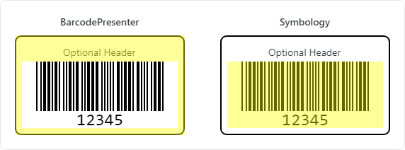

# Getting Started with Barcodes

This topic walks through adding a barcode into an application UI with the [BarcodePresenter](xref:@ActiproUIRoot.Controls.Barcodes.BarcodePresenter) control.

## Basic Setup

A minimal barcode needs:

1. A [BarcodePresenter](xref:@ActiproUIRoot.Controls.Barcodes.BarcodePresenter) control instance.
2. A symbology object, such as [Code128Symbology](xref:@ActiproUIRoot.Controls.Barcodes.Code128Symbology).
3. The [BarcodePresenter.Value](xref:@ActiproUIRoot.Controls.Barcodes.BarcodePresenter.Value) property set to the data to encode.

```xaml
xmlns:actipro="http://schemas.actiprosoftware.com/avaloniaui"
...
<UserControl>
	<UserControl.Resources>
		<actipro:Code128Symbology x:Key="Code128Symbology" />
	</UserControl.Resources>

	<actipro:BarcodePresenter
		Symbology="{StaticResource Code128Symbology}"
		Value="HELLO123"
		/>
</UserControl>
```

## Presenter and Symbology Responsibilities



*Sample barcodes highlighting which parts are defined by BarcodePresenter compared to the Symbology*

There are two key components to defining a barcode:

- Symbology classes encode values and expose format-specific options.
- The [BarcodePresenter](xref:@ActiproUIRoot.Controls.Barcodes.BarcodePresenter) control handles display and presentation settings, including brushes, gradients, value appearance, and any styling accents supported by the symbology in use.


*QR Codes support the standard appearance as well as optional stylistic variations*

For example, [QrCodeSymbology](xref:@ActiproUIRoot.Controls.Barcodes.QrCodeSymbology) has options for error correction, version, finder shapes, etc. While linear symbologies share options from [LinearBarcodeSymbologyBase](xref:@ActiproUIRoot.Controls.Barcodes.LinearBarcodeSymbologyBase) and have their own options per symbology.

## Reuse Symbology Instances

Symbologies are stateless and designed to be reused across multiple presenters.

```xaml
xmlns:actipro="http://schemas.actiprosoftware.com/avaloniaui"
...
<!-- Code128Symbology defined in XAML resources elsewhere -->
<StackPanel Spacing="20">
	<actipro:BarcodePresenter Value="CODE001" Symbology="{StaticResource Code128Symbology}" />
	<actipro:BarcodePresenter Value="CODE002" Symbology="{StaticResource Code128Symbology}" />
	<actipro:BarcodePresenter Value="CODE003" Symbology="{StaticResource Code128Symbology}" />
</StackPanel>
```

> [!TIP]
> Reusing a single symbology instance prevents duplication of the work needed to create that symbology's encoding tables. It also means a single instance of those tables will be stored.

## Setting Properties

Set presentation-related properties on [BarcodePresenter](xref:@ActiproUIRoot.Controls.Barcodes.BarcodePresenter):

```xaml
xmlns:actipro="http://schemas.actiprosoftware.com/avaloniaui"
...
<actipro:BarcodePresenter
	Symbology="{StaticResource Code128Symbology}"
	Value="SAMPLE123"
	Header="Product Code"
	ZoomLevel="2"
	/>
```

See the [Presenter Customization](presenter-customization.md) topic for additional details and examples.

> [!TIP]
> When displayed on screen, a [ZoomLevel](xref:@ActiproUIRoot.Controls.Barcodes.BarcodePresenter.ZoomLevel) of `2` or higher is recommended for optimal decoding by a reader, especially when DPI settings could cause anti-aliasing near pixel boundaries.
>
> A [Header](xref:@ActiproUIRoot.Controls.Barcodes.BarcodePresenter.Header) is completely optional.

Set encoding-related properties on the symbology object:

```xaml
xmlns:actipro="http://schemas.actiprosoftware.com/avaloniaui"
...
<Application.Resources>
	<actipro:Code128Symbology x:Key="Code128Symbology" BarHeight="30" />
</Application.Resources>
```

```xaml
xmlns:actipro="http://schemas.actiprosoftware.com/avaloniaui"
...
<Application.Resources>
	<actipro:QrCodeSymbology x:Key="QrSymbology" ErrorCorrectionLevel="Medium" Version="Auto" />
</Application.Resources>
```

See the various symbology topics such as [QR Code Symbologies](qr-code-symbologies.md) and [Linear Symbologies](linear-symbologies.md) for details on properties supported by each symbology.

## Value and Supplement Value

Use [BarcodePresenter.Value](xref:@ActiproUIRoot.Controls.Barcodes.BarcodePresenter.Value) for the primary value.

```xaml
xmlns:actipro="http://schemas.actiprosoftware.com/avaloniaui"
...
<actipro:BarcodePresenter Symbology="{StaticResource Code128Symbology}" Value="123456789" />
```

Some symbologies like the EAN and UPC variations support [BarcodePresenter.SupplementValue](xref:@ActiproUIRoot.Controls.Barcodes.BarcodePresenter.SupplementValue):

```xaml
xmlns:actipro="http://schemas.actiprosoftware.com/avaloniaui"
...
<actipro:BarcodePresenter
	Symbology="{StaticResource Ean13Symbology}"
	Value="9780134685991"
	SupplementValue="01"
	/>
```
