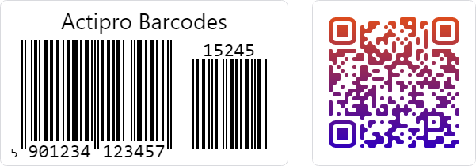

# Barcodes

Barcode rendering is provided by the [BarcodePresenter](xref:@ActiproUIRoot.Controls.Barcodes.BarcodePresenter) control, which works with symbology objects to encode and display barcode formats. In addition to standard barcode presentation features, barcodes can be styled with custom brushes, gradients, and QR Code-specific shape customization.



*Some of the barcodes provided by this product*

## How It Works

The barcode architecture uses a two-part model:

- [BarcodePresenter](xref:@ActiproUIRoot.Controls.Barcodes.BarcodePresenter) control - Displays the barcode and exposes presentation settings.
- Symbology objects - Encode values and expose symbology-specific properties.

## Key Concepts

### Reusing Symbologies

For optimal memory usage, create one symbology instance and reuse it across multiple [BarcodePresenter](xref:@ActiproUIRoot.Controls.Barcodes.BarcodePresenter) controls.

The symbology instances could be declared in XAML resources and referenced with `StaticResource`, referenced using a binding to a view model (example below), etc.

```xaml
xmlns:actipro="http://schemas.actiprosoftware.com/avaloniaui"
...
<!-- SharedSymbology defined in XAML resources elsewhere -->
<StackPanel Spacing="20">
	<actipro:BarcodePresenter Value="ABC123" Symbology="{Binding SharedSymbology}" />
	<actipro:BarcodePresenter Value="XYZ789" Symbology="{Binding SharedSymbology}" />
</StackPanel>
```

### Symbology-Specific Properties

Each symbology type has its own set of configurable properties. Set these properties on the symbology object, not on [BarcodePresenter](xref:@ActiproUIRoot.Controls.Barcodes.BarcodePresenter) control.

### Presentation and Styling

Use [BarcodePresenter](xref:@ActiproUIRoot.Controls.Barcodes.BarcodePresenter) for presentation-related settings such as header content, theme-aware colors, foreground and background brushes, along with module styling and accent brushes for QR Code and Micro QR Code.

See [Presenter Customization](presenter-customization.md) for details on using custom brushes, gradients, and module shapes.

## Available Symbologies

- 2D Symbologies
  - [QR Code and Micro QR Code](qr-code-symbologies.md)
- [Linear (1D) Symbologies](linear-symbologies.md)
  - EAN-13 and EAN-8, both with supplements
  - UPC-A and UPC-E, both with supplements
  - Code 128 and GS1-128
  - Code 39 and Extended variation
  - Code 93 and Extended variation
  - Interleaved 2 of 5 and ITF-14
  - Codabar

## Getting Started with Barcodes

- Refer to the [Getting Started](../getting-started.md) topic for the Data Visualization product to ensure your project is properly configured.
- See the [Barcode Basics](barcode-basics.md) topic for an introduction on how to create your first barcode.