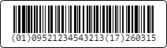
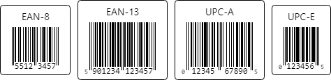
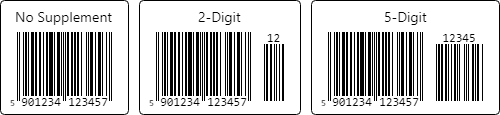
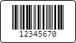
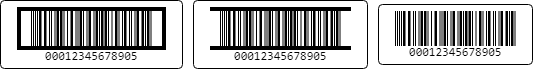
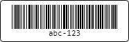
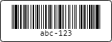
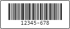

# Linear Symbologies

This topic covers supported 1D symbologies and their configurable properties.

## Symbology List

The following list is ordered by common usage prominence in business applications.

| Symbology | Class | Typical Use |
|-----------|-------|-------------|
| Code 128 | [Code128Symbology](xref:@ActiproUIRoot.Controls.Barcodes.Code128Symbology) | General shipping and inventory |
| GS1-128 | [GS1128Symbology](xref:@ActiproUIRoot.Controls.Barcodes.GS1128Symbology) | GS1 logistics labels |
| EAN-13 | [Ean13Symbology](xref:@ActiproUIRoot.Controls.Barcodes.Ean13Symbology) | Retail product labels |
| EAN-8 | [Ean8Symbology](xref:@ActiproUIRoot.Controls.Barcodes.Ean8Symbology) | Compact retail labels |
| UPC-A | [UpcASymbology](xref:@ActiproUIRoot.Controls.Barcodes.UpcASymbology) | North American retail |
| UPC-E | [UpcESymbology](xref:@ActiproUIRoot.Controls.Barcodes.UpcESymbology) | Compressed UPC |
| Interleaved 2 of 5 | [Interleaved2of5Symbology](xref:@ActiproUIRoot.Controls.Barcodes.Interleaved2of5Symbology) | Industrial inventory |
| ITF-14 | [Itf14Symbology](xref:@ActiproUIRoot.Controls.Barcodes.Itf14Symbology) | Shipping containers |
| Code 39 | [Code39Symbology](xref:@ActiproUIRoot.Controls.Barcodes.Code39Symbology) | Legacy industrial systems |
| Code 39 Extended | [Code39ExtendedSymbology](xref:@ActiproUIRoot.Controls.Barcodes.Code39ExtendedSymbology) | Full ASCII Code 39 variant |
| Code 93 | [Code93Symbology](xref:@ActiproUIRoot.Controls.Barcodes.Code93Symbology) | Compact Code 39 alternative |
| Code 93 Extended | [Code93ExtendedSymbology](xref:@ActiproUIRoot.Controls.Barcodes.Code93ExtendedSymbology) | Full ASCII Code 93 variant |
| Codabar | [CodabarSymbology](xref:@ActiproUIRoot.Controls.Barcodes.CodabarSymbology) | Legacy healthcare and library workflows |

## Common Options

All linear symbologies inherit shared options from [LinearBarcodeSymbologyBase](xref:@ActiproUIRoot.Controls.Barcodes.LinearBarcodeSymbologyBase).

```xaml
xmlns:actipro="http://schemas.actiprosoftware.com/avaloniaui"
...
<UserControl.Resources>
	<actipro:Code128Symbology
		x:Key="Code128Symbology"
		BarHeight="40"
		MinHeightToWidthRatio="0.2"
		QuietZoneThickness="10"
		ValueAlignment="CharactersAlignedWithBars"
		/>
</UserControl.Resources>
```

### Bar Height

The [BarHeight](xref:@ActiproUIRoot.Controls.Barcodes.LinearBarcodeSymbologyBase.BarHeight) property controls the minimum target bar height. Increase it when barcodes are scanned at distance or printed larger. Decrease it only when space is constrained and scan testing confirms reliability.

### Minimum Height-to-Width Ratio

The [MinHeightToWidthRatio](xref:@ActiproUIRoot.Controls.Barcodes.LinearBarcodeSymbologyBase.MinHeightToWidthRatio) property is a safety floor that keeps height proportional to barcode width. If [BarHeight](xref:@ActiproUIRoot.Controls.Barcodes.LinearBarcodeSymbologyBase.BarHeight) is too small for a wide value, this ratio increases the effective height automatically.

### Quiet Zone Thickness

The [QuietZoneThickness](xref:@ActiproUIRoot.Controls.Barcodes.LinearBarcodeSymbologyBase.QuietZoneThickness) property sets whitespace margins around the encoded bars. Quiet zones are required for scanners to detect start/end boundaries correctly, so this should generally be increased rather than reduced.

### Value Alignment

The [ValueAlignment](xref:@ActiproUIRoot.Controls.Barcodes.LinearBarcodeSymbologyBase.ValueAlignment) property controls how the human-readable value is rendered. Multiple [LinearBarcodeValueAlignment](xref:@ActiproUIRoot.Controls.Barcodes.LinearBarcodeValueAlignment) enumeration options are available for linear barcodes:

- [None](xref:@ActiproUIRoot.Controls.Barcodes.LinearBarcodeValueAlignment.None) - Does not render the human-readable value.
- [Center](xref:@ActiproUIRoot.Controls.Barcodes.LinearBarcodeValueAlignment.Center) (general default) - Centers the value under the barcode.
- [Left](xref:@ActiproUIRoot.Controls.Barcodes.LinearBarcodeValueAlignment.Left) - Left aligns the value under the barcode.
- [Right](xref:@ActiproUIRoot.Controls.Barcodes.LinearBarcodeValueAlignment.Right) - Right aligns the value under the barcode.
- [EanUpc](xref:@ActiproUIRoot.Controls.Barcodes.LinearBarcodeValueAlignment.EanUpc) (EAN/UPC default) - Positions value characters in a specialized way that conforms with EAN/UPC standards.
- [CharactersAlignedWithBars](xref:@ActiproUIRoot.Controls.Barcodes.LinearBarcodeValueAlignment.CharactersAlignedWithBars) - Aligns value characters under the bars that represent them.

## Code 128 and GS1-128



*GS1-128 symbology barcode*

These are high-density general-purpose logistics symbologies. Use Code 128 for broad ASCII support in internal workflows and GS1-128 when values must encode GS1 application identifiers for standards-compliant supply chain labels.

- [Code128Symbology](xref:@ActiproUIRoot.Controls.Barcodes.Code128Symbology) - Code 128
- [GS1128Symbology](xref:@ActiproUIRoot.Controls.Barcodes.GS1128Symbology) - GS1-128, inherits [Code128Symbology](xref:@ActiproUIRoot.Controls.Barcodes.Code128Symbology) and its options

## EAN and UPC Variants



*Common EAN/UPC symbology barcodes*

EAN/UPC symbologies are the most common retail formats. They are optimized for product identifiers, include strict check-digit semantics, and support optional 2-digit and 5-digit add-on supplements for periodicals and books.

- [Ean13Symbology](xref:@ActiproUIRoot.Controls.Barcodes.Ean13Symbology) - EAN-13
- [Ean8Symbology](xref:@ActiproUIRoot.Controls.Barcodes.Ean8Symbology) - EAN-8
- [UpcASymbology](xref:@ActiproUIRoot.Controls.Barcodes.UpcASymbology) - UPC-A
- [UpcESymbology](xref:@ActiproUIRoot.Controls.Barcodes.UpcESymbology) - UPC-E

### Supplements



*EAN-13 symbology barcodes with none, two-digit, and five-digit supplements*

Set [BarcodePresenter.SupplementValue](xref:@ActiproUIRoot.Controls.Barcodes.BarcodePresenter.SupplementValue) to supply 2-digit or 5-digit supplements.

```xaml
xmlns:actipro="http://schemas.actiprosoftware.com/avaloniaui"
...
<UserControl.Resources>
	<actipro:Ean13Symbology x:Key="Ean13Symbology" />
</UserControl.Resources>
...
<actipro:BarcodePresenter
	Symbology="{StaticResource Ean13Symbology}"
	Value="9780134685991"
	SupplementValue="01"
	/>
```

## ITF-14 and Interleaved 2 of 5



*Interleaved 2 of 5 symbology barcode*

Use these numeric-only symbologies in packaging, warehouse, and carton-label scenarios. ITF-14 is the GS1-defined carton format built on Interleaved 2 of 5, while Interleaved 2 of 5 is a more general industrial symbology.

- [Interleaved2of5Symbology](xref:@ActiproUIRoot.Controls.Barcodes.Interleaved2of5Symbology) - Interleaved 2 of 5
- [Itf14Symbology](xref:@ActiproUIRoot.Controls.Barcodes.Itf14Symbology) - ITF-14, inherits [Interleaved2of5Symbology](xref:@ActiproUIRoot.Controls.Barcodes.Interleaved2of5Symbology) and its options

### Bearer Bars



*ITF-14 symbology barcode with rectangular, horizontal (top/bottom), and no bearer bars*

The [BearerBarKind](xref:@ActiproUIRoot.Controls.Barcodes.Interleaved2of5Symbology.BearerBarKind) and [BearerBarWidth](xref:@ActiproUIRoot.Controls.Barcodes.Interleaved2of5Symbology.BearerBarWidth) properties are used to add top/bottom or rectangular bearer bars to reduce partial scans and improve print robustness in carton workflows.

ITF-14 uses rectangular bearer bars by default, whereas Interleaved 2 of 5 does not.

### Checksum

The [IsChecksumEnabled](xref:@ActiproUIRoot.Controls.Barcodes.Interleaved2of5Symbology.IsChecksumEnabled) property indicates whether an optional modulo-10 checksum digit should be appended.

ITF-14 enables checksums by default, whereas Interleaved 2 of 5 does not.

### Wide-to-Narrow Ratio

The [WideToNarrowRatio](xref:@ActiproUIRoot.Controls.Barcodes.Interleaved2of5Symbology.WideToNarrowRatio) property controls bar width contrast and should be coordinated with printer resolution and scanner tolerances.

## Code 39 Variants



*Code 39 Extended symbology barcode*

Code 39 is common in legacy industrial, automotive, and government workflows where broad scanner compatibility matters more than density. Code 39 Extended expands coverage to full ASCII by mapping values into Code 39-compatible sequences.

- [Code39Symbology](xref:@ActiproUIRoot.Controls.Barcodes.Code39Symbology) - Code 39
- [Code39ExtendedSymbology](xref:@ActiproUIRoot.Controls.Barcodes.Code39ExtendedSymbology) - Code 39 Extended, inherits [Code39Symbology](xref:@ActiproUIRoot.Controls.Barcodes.Code39Symbology) and its options

### Start/Stop Character Visibility

Use [AreStartStopCharactersVisible](xref:@ActiproUIRoot.Controls.Barcodes.Code39Symbology.AreStartStopCharactersVisible) when operators need the start/stop markers shown in human-readable text for verification.

### Checksum

Enable [IsChecksumEnabled](xref:@ActiproUIRoot.Controls.Barcodes.Code39Symbology.IsChecksumEnabled) when mod-43 check character output is required by downstream systems.

### Wide-to-Narrow Ratio

The [WideToNarrowRatio](xref:@ActiproUIRoot.Controls.Barcodes.Code39Symbology.WideToNarrowRatio) property controls bar width contrast and should be coordinated with printer resolution and scanner tolerances.

## Code 93 Variants



*Code 93 Extended symbology barcode*

Code 93 is a denser alternative to Code 39 and is useful when labels are space-constrained, but linear barcode compatibility is still required. Code 93 Extended adds full ASCII support through shift-sequence encoding.

- [Code93Symbology](xref:@ActiproUIRoot.Controls.Barcodes.Code93Symbology) - Code 93
- [Code93ExtendedSymbology](xref:@ActiproUIRoot.Controls.Barcodes.Code93ExtendedSymbology) - Code 93 Extended, inherits [Code93Symbology](xref:@ActiproUIRoot.Controls.Barcodes.Code93Symbology) and its options

### Start/Stop Character Visibility

Use [AreStartStopCharactersVisible](xref:@ActiproUIRoot.Controls.Barcodes.Code93Symbology.AreStartStopCharactersVisible) when operators need the start/stop markers shown in human-readable text for verification.

## Codabar



*Codabar symbology barcode*

Codabar is primarily used in legacy healthcare, library, and tracking systems where its historical compatibility is still needed.

- [CodabarSymbology](xref:@ActiproUIRoot.Controls.Barcodes.CodabarSymbology) - Codabar

### Start/Stop Characters

Use [StartCharacter](xref:@ActiproUIRoot.Controls.Barcodes.CodabarSymbology.StartCharacter) and [StopCharacter](xref:@ActiproUIRoot.Controls.Barcodes.CodabarSymbology.StopCharacter) to designate the start/stop characters, when needing to meet system-specific framing requirements.

### Start/Stop Character Visibility

Use [AreStartStopCharactersVisible](xref:@ActiproUIRoot.Controls.Barcodes.CodabarSymbology.AreStartStopCharactersVisible) when operators need the start/stop markers shown in human-readable text for verification.

### Checksum

Enable [IsChecksumEnabled](xref:@ActiproUIRoot.Controls.Barcodes.CodabarSymbology.IsChecksumEnabled) when integrations require an additional check character.

### Wide-to-Narrow Ratio

The [WideToNarrowRatio](xref:@ActiproUIRoot.Controls.Barcodes.CodabarSymbology.WideToNarrowRatio) property controls bar width contrast and should be coordinated with printer resolution and scanner tolerances.
