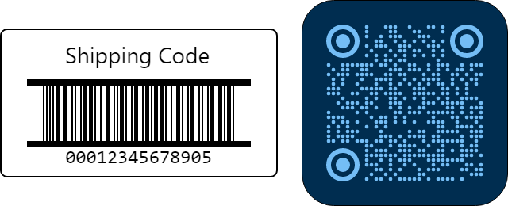
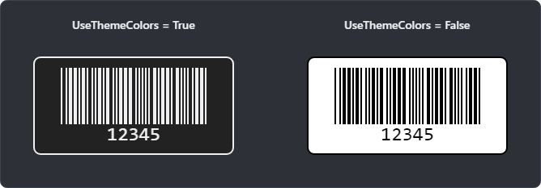
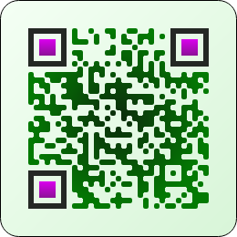
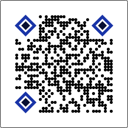

# Customizing the Barcode Presenter

The [BarcodePresenter](xref:@ActiproUIRoot.Controls.Barcodes.BarcodePresenter) control renders a barcode and its appearance can be customized in multiple ways, from simple headers and theme-aware colors to advanced QR Code and Micro QR Code styling with custom module shapes, accent brushes, and gradients.



*Use available presenter and symbology options to customize a barcode's appearance*

## Zoom Level

The [ZoomLevel](xref:@ActiproUIRoot.Controls.Barcodes.BarcodePresenter.ZoomLevel) property provides a quick way to set the scale factor of the entire barcode presenter, including its rendered barcode, header, border, etc.  Use integer zoom level values for best results on most monitors.

```xaml
xmlns:actipro="http://schemas.actiprosoftware.com/avaloniaui"
...
<actipro:BarcodePresenter
	Symbology="{StaticResource Code128Symbology}"
	Value="ABC123"
	ZoomLevel="3"
	/>
```

> [!TIP]
> When displayed on screen, a [ZoomLevel](xref:@ActiproUIRoot.Controls.Barcodes.BarcodePresenter.ZoomLevel) of `2` or higher is recommended for optimal decoding by a reader, especially when DPI settings could cause anti-aliasing near pixel boundaries.

## Header

The [BarcodePresenter](xref:@ActiproUIRoot.Controls.Barcodes.BarcodePresenter) control displays optional header content above the barcode using a standard `ContentPresenter`.  The header is often set to a string title but can be completely customized.

- [Header](xref:@ActiproUIRoot.Controls.Barcodes.BarcodePresenter.Header) - The header content to display.  If not specified, no header will display.
- [HeaderTemplate](xref:@ActiproUIRoot.Controls.Barcodes.BarcodePresenter.HeaderTemplate) - When the header content is not `Control`-based, the `DataTemplate` for the header will render, using the header content as the data context.

This sample code shows how to create a custom  header using a [HeaderTemplate](xref:@ActiproUIRoot.Controls.Barcodes.BarcodePresenter.HeaderTemplate):

```xaml
xmlns:actipro="http://schemas.actiprosoftware.com/avaloniaui"
...
<actipro:BarcodePresenter
	Header="Product Code"
	Symbology="{StaticResource Code128Symbology}"
	Value="12345678"
	>
	<actipro:BarcodePresenter.HeaderTemplate>
		<DataTemplate>
			<TextBlock Text="{Binding}"
				FontSize="8"
				FontWeight="Bold"
				Foreground="{actipro:ThemeResource ControlForegroundBrushOutlineAccent}"
				/>
		</DataTemplate>
	</actipro:BarcodePresenter.HeaderTemplate>
</actipro:BarcodePresenter>
```

## Border and Padding

These properties manage the appearance of the presenter around the header and actual rendered barcode:

- `BorderThickness` - The `Thickness` of the outer border around the presenter.  The border thickness is `0` by default.
- `CornerRadius` - The `CornerRadius` of the outer border.  The corner radius is `0` by default.
- `Padding` - The `Thickness` of the padding between the presenter's outer border and its content.  The padding thickness is `0` by default.

> [!TIP]
> A symbology can also have its own [QuietZoneThickness](xref:@ActiproUIRoot.Controls.Barcodes.BarcodeSymbologyBase.QuietZoneThickness) that adds additional whitespace around the symbology to ensure consistent scanning.

## Theme Colors

The [UseThemeColors](xref:@ActiproUIRoot.Controls.Barcodes.BarcodePresenter.UseThemeColors) property determines whether the presenter uses theme-aware foreground and background colors, or always uses black on white.  The default value is `false`, meaning always black on white.



*Barcodes in a dark theme where one uses theme colors and the other does not*

```xaml
xmlns:actipro="http://schemas.actiprosoftware.com/avaloniaui"
...
<actipro:BarcodePresenter
	Symbology="{StaticResource Code128Symbology}"
	Value="ABC123"
	UseThemeColors="True"
	/>
```

> [!CAUTION]
> Not all scanners may support reading inverted barcodes.  If setting the property to `true` and intending barcodes to use theme colors and invert in dark themes, be sure to test all usage scenarios before rolling that feature into production.

## Value Display

Many symbologies have the ability to render the encoded value text underneath the barcode.  These properties determine the appearance of that value.

- [ValueFontFamily](xref:@ActiproUIRoot.Controls.Barcodes.BarcodePresenter.ValueFontFamily) - The font family for the value.
- [ValueFontSize](xref:@ActiproUIRoot.Controls.Barcodes.BarcodePresenter.ValueFontSize) - The font size for the value.
- [ValueForeground](xref:@ActiproUIRoot.Controls.Barcodes.BarcodePresenter.ValueForeground) - The foreground for the value.  When `null` (the default), the value will use same `Foreground` as the presenter.

```xaml
xmlns:actipro="http://schemas.actiprosoftware.com/avaloniaui"
...
<actipro:BarcodePresenter
	Symbology="{StaticResource Code128Symbology}"
	Value="123456"
	ValueFontFamily="Consolas"
	ValueFontSize="12"
	ValueForeground="#808080"
	/>
```

> [!NOTE]
> Symbologies that support rendering the encoded value text may have options on the symbology itself that alter the value display.

## Brushes

These brush properties govern overall appearance of the presenter and its contents:

- `Background` - The background of the presenter, which is everything inside of the outer border.
- `Foreground` - The primary brush that renders the barcode itself.
- [ValueForeground](xref:@ActiproUIRoot.Controls.Barcodes.BarcodePresenter.ValueForeground) - The foreground brush to render any displayed value.
- [PrimaryAccent](xref:@ActiproUIRoot.Controls.Barcodes.BarcodePresenter.PrimaryAccent) - The brush for a primary accent in symbologies that support accents, such as the outer finder patterns in QR Code and Micro QR Code.
- [SecondaryAccent](xref:@ActiproUIRoot.Controls.Barcodes.BarcodePresenter.SecondaryAccent) - The brush for a secondary accent in symbologies that support accents, such as the inner finder patterns in QR Code and Micro QR Code.

> [!TIP]
> The [ValueForeground](xref:@ActiproUIRoot.Controls.Barcodes.BarcodePresenter.ValueForeground), [PrimaryAccent](xref:@ActiproUIRoot.Controls.Barcodes.BarcodePresenter.PrimaryAccent), and [SecondaryAccent](xref:@ActiproUIRoot.Controls.Barcodes.BarcodePresenter.SecondaryAccent) brushes are optional and, when not specified, the corresponding elements will use the same `Foreground` brush as the barcode itself.

Common Avalonia brush types can be used, including solid, linear gradient, and radial gradient brushes.



*A QR Code that use a mixture of gradient and solid color brushes*

```xaml
xmlns:actipro="http://schemas.actiprosoftware.com/avaloniaui"
...
<actipro:BarcodePresenter
	Value="Styled QR Code"
	ModuleShapeKind="RoundedRectangle"
	PrimaryAccent="#242824"
	CornerRadius="20"
	>
	<actipro:BarcodePresenter.Foreground>
		<RadialGradientBrush>
			<GradientStop Offset="0" Color="#0c2b0c" />
			<GradientStop Offset="1" Color="#037a03" />
		</RadialGradientBrush>
	</actipro:BarcodePresenter.Foreground>
	<actipro:BarcodePresenter.Background>
		<LinearGradientBrush EndPoint="100%,100%">
			<GradientStop Offset="0" Color="#f4fff4" />
			<GradientStop Offset="1" Color="#d8f5d8" />
		</LinearGradientBrush>
	</actipro:BarcodePresenter.Background>
	<actipro:BarcodePresenter.SecondaryAccent>
		<LinearGradientBrush EndPoint="0%,100%">
			<GradientStop Offset="0" Color="#da00ee" />
			<GradientStop Offset="1" Color="#8c1197" />
		</LinearGradientBrush>
	</actipro:BarcodePresenter.SecondaryAccent>
	<actipro:QrCodeSymbology Version="Version4" ModuleScale="6" />
</actipro:BarcodePresenter>
```

When using decorative brushes, maintain strong contrast between foreground and background and test the final result with the scanners and camera workflows your application targets.

> [!TIP]
> See the "Header" topic above for an example of how to change the header foreground.

## Module Shapes

The [ModuleShapeKind](xref:@ActiproUIRoot.Controls.Barcodes.BarcodePresenter.ModuleShapeKind) property can alter the shape of modules in some symbologies.  This feature is primarily intended for [QR Code and Micro QR Code](qr-code-symbologies.md) usage, and does not affect linear barcodes, which always use rectangular modules.

Supported [BarcodeShapeKind](xref:@ActiproUIRoot.Controls.Barcodes.BarcodeShapeKind) values include [Default](xref:@ActiproUIRoot.Controls.Barcodes.BarcodeShapeKind.Default) (rectangle), [Circle](xref:@ActiproUIRoot.Controls.Barcodes.BarcodeShapeKind.Circle), [RoundedRectangle](xref:@ActiproUIRoot.Controls.Barcodes.BarcodeShapeKind.RoundedRectangle), [Diamond](xref:@ActiproUIRoot.Controls.Barcodes.BarcodeShapeKind.Diamond), and more.



*A QR Code with circular modules and diamond-shaped finder patterns.*

```xaml
xmlns:actipro="http://schemas.actiprosoftware.com/avaloniaui"
...
<actipro:BarcodePresenter
	Value="Customize QR Code module shapes"
	ModuleShapeKind="Circle"
	PrimaryAccent="#1934a7"
	SecondaryAccent="#081033"
	>
	<actipro:QrCodeSymbology
		Version="Version4"
		ModuleScale="6"
		FinderPatternOuterShapeKind="Diamond"
		FinderPatternInnerShapeKind="Diamond"
		/>
</actipro:BarcodePresenter>
```
