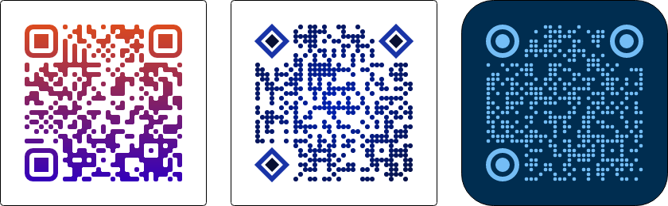
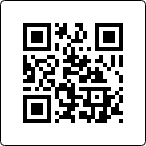
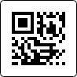
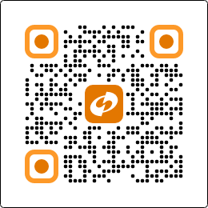

# QR Code Symbologies

This topic covers both the standard QR Code and Micro QR Code symbologies.

## QR Code

QR Code is a versatile 2D matrix barcode capable of encoding text, URLs, or binary data, featuring robust error-correction levels for fast, dependable scanning across devices. It is readable by most mobile devices with cameras and can be used to display text to a user, compose a message, and much more.

QR Code encoding is implemented in the [QrCodeSymbology](xref:@ActiproUIRoot.Controls.Barcodes.QrCodeSymbology) class. In addition to standards-compliant encoding options, QR Codes support extensive appearance customization through a combination of [QrCodeSymbology](xref:@ActiproUIRoot.Controls.Barcodes.QrCodeSymbology) and [BarcodePresenter](xref:@ActiproUIRoot.Controls.Barcodes.BarcodePresenter) properties.



*QR Codes in this product offer extensive appearance customization features*

### Basic Usage



*A simple QR Code example with default appearance*

```xaml
xmlns:actipro="http://schemas.actiprosoftware.com/avaloniaui"
...
<UserControl.Resources>
	<actipro:QrCodeSymbology x:Key="QrCodeSymbology" />
</UserControl.Resources>
...
<actipro:BarcodePresenter Symbology="{StaticResource QrCodeSymbology}" Value="This is an example QR Code" />
```

### Encoding Options

#### Error Correction Level

The [ErrorCorrectionLevel](xref:@ActiproUIRoot.Controls.Barcodes.QrCodeSymbology.ErrorCorrectionLevel) property defines how much redundant data is added to the QR Code so it can still be read if parts of the symbol are damaged or obscured. Higher levels increase resilience but also increase the resulting QR Code size.

The [QrErrorCorrectionLevel](xref:@ActiproUIRoot.Controls.Barcodes.QrErrorCorrectionLevel) enumeration options are:

- [ErrorDetectionOnly](xref:@ActiproUIRoot.Controls.Barcodes.QrErrorCorrectionLevel.ErrorDetectionOnly) - Not supported by QR Code.
- [Low](xref:@ActiproUIRoot.Controls.Barcodes.QrErrorCorrectionLevel.Low) - 7% recovery capacity.
- [Medium](xref:@ActiproUIRoot.Controls.Barcodes.QrErrorCorrectionLevel.Medium) (default) - 15% recovery capacity.
- [Quartile](xref:@ActiproUIRoot.Controls.Barcodes.QrErrorCorrectionLevel.Quartile) - 25% recovery capacity.
- [High](xref:@ActiproUIRoot.Controls.Barcodes.QrErrorCorrectionLevel.High) - 30% recovery capacity.

```xaml
<actipro:QrCodeSymbology ErrorCorrectionLevel="High" />
```

#### Version

The [Version](xref:@ActiproUIRoot.Controls.Barcodes.QrCodeSymbology.Version) property specifies the structural size of the QR Code, from Version 1 (21x21 modules) up to Version 40 (177x177 modules). Larger versions hold more data but produce a physically bigger and denser symbol.

When set to [Auto](xref:@ActiproUIRoot.Controls.Barcodes.QrCodeVersion.Auto), the encoder selects the smallest version that fits the content and error correction level. Use a specific version instead when wanting size consistency when using various lengths of encoded data.

The [QrCodeVersion](xref:@ActiproUIRoot.Controls.Barcodes.QrCodeVersion) enumeration options are:

- [Auto](xref:@ActiproUIRoot.Controls.Barcodes.QrCodeVersion.Auto) (default)
- [Version1](xref:@ActiproUIRoot.Controls.Barcodes.QrCodeVersion.Version1)
- [Version2](xref:@ActiproUIRoot.Controls.Barcodes.QrCodeVersion.Version2)
- ...
- [Version40](xref:@ActiproUIRoot.Controls.Barcodes.QrCodeVersion.Version40)

```xaml
<actipro:QrCodeSymbology Version="Version10" />
```

#### ECI Mode

The [EciMode](xref:@ActiproUIRoot.Controls.Barcodes.QrCodeSymbology.EciMode) property indicates the character encoding used for `Byte` mode segments. This ensures scanners interpret the data correctly across different languages and systems. If not set, QR Codes default to `ISO-8859-1`, which may not represent all characters accurately.

The [EciMode](xref:@ActiproUIRoot.Controls.Barcodes.EciMode) enumeration options are:

- [Auto](xref:@ActiproUIRoot.Controls.Barcodes.EciMode.Auto) (default) - Defaults to `ISO-8859-1` but may switch to `UTF-8` if necessary to encode characters.
- [Iso88591](xref:@ActiproUIRoot.Controls.Barcodes.EciMode.Iso88591) - `ISO-8859-1` mode.
- [Utf8](xref:@ActiproUIRoot.Controls.Barcodes.EciMode.Utf8) - `UTF-8` mode.

```xaml
<actipro:QrCodeSymbology EciMode="Utf8" />
```

## Micro QR Code

Micro QR Code is a compact variant of QR Code designed for space-constrained applications such as small PCBs, medical devices, and product labels. It uses a single finder pattern and supports versions M1 through M4, resulting in smaller symbols that encode less data than a full QR Code.

Micro QR Code encoding is implemented in the [MicroQrCodeSymbology](xref:@ActiproUIRoot.Controls.Barcodes.MicroQrCodeSymbology) class.



*A simple Micro QR Code example*

### Basic Usage

```xaml
xmlns:actipro="http://schemas.actiprosoftware.com/avaloniaui"
...
<UserControl.Resources>
	<actipro:MicroQrCodeSymbology x:Key="MicroQrCodeSymbology" />
</UserControl.Resources>
...
<actipro:BarcodePresenter Symbology="{StaticResource MicroQrCodeSymbology}" Value="Micro QR Code" />
```

### Encoding Options

#### Error Correction Level

The [ErrorCorrectionLevel](xref:@ActiproUIRoot.Controls.Barcodes.MicroQrCodeSymbology.ErrorCorrectionLevel) property defines the error correction capability. Micro QR Code supports fewer levels than standard QR Code, and the available levels depend on the version.

The [QrErrorCorrectionLevel](xref:@ActiproUIRoot.Controls.Barcodes.QrErrorCorrectionLevel) enumeration options are:

- [ErrorDetectionOnly](xref:@ActiproUIRoot.Controls.Barcodes.QrErrorCorrectionLevel.ErrorDetectionOnly) - Error detection only, no correction. Only available for version M1.
- [Low](xref:@ActiproUIRoot.Controls.Barcodes.QrErrorCorrectionLevel.Low) (default) - 7% recovery capacity. Available for versions M2-M4.
- [Medium](xref:@ActiproUIRoot.Controls.Barcodes.QrErrorCorrectionLevel.Medium) - 15% recovery capacity. Available for versions M2-M4.
- [Quartile](xref:@ActiproUIRoot.Controls.Barcodes.QrErrorCorrectionLevel.Quartile) - 25% recovery capacity. Only available for version M4.
- [High](xref:@ActiproUIRoot.Controls.Barcodes.QrErrorCorrectionLevel.High) - Not supported by Micro QR Code.

```xaml
<actipro:MicroQrCodeSymbology ErrorCorrectionLevel="Medium" />
```

> [!NOTE]
> Micro QR Code does not support the `High` error correction level. Version M1 only supports `ErrorDetectionOnly`, version M2 supports `Low` and `Medium`, and versions M3/M4 support `Low`, `Medium`, and `Quartile`.

#### Version

The [Version](xref:@ActiproUIRoot.Controls.Barcodes.MicroQrCodeSymbology.Version) property specifies the structural size of the Micro QR Code, from M1 (11x11 modules) up to M4 (17x17 modules).

When set to [Auto](xref:@ActiproUIRoot.Controls.Barcodes.MicroQrCodeVersion.Auto), the encoder selects the smallest version that fits the content and error correction level.

The [MicroQrCodeVersion](xref:@ActiproUIRoot.Controls.Barcodes.MicroQrCodeVersion) enumeration options are:

- [Auto](xref:@ActiproUIRoot.Controls.Barcodes.MicroQrCodeVersion.Auto) (default)
- [VersionM1](xref:@ActiproUIRoot.Controls.Barcodes.MicroQrCodeVersion.VersionM1) - 11x11 modules, numeric only.
- [VersionM2](xref:@ActiproUIRoot.Controls.Barcodes.MicroQrCodeVersion.VersionM2) - 13x13 modules, numeric and alphanumeric.
- [VersionM3](xref:@ActiproUIRoot.Controls.Barcodes.MicroQrCodeVersion.VersionM3) - 15x15 modules, numeric, alphanumeric, and byte.
- [VersionM4](xref:@ActiproUIRoot.Controls.Barcodes.MicroQrCodeVersion.VersionM4) - 17x17 modules, numeric, alphanumeric, byte, and kanji.

```xaml
<actipro:MicroQrCodeSymbology Version="VersionM3" />
```

> [!NOTE]
> Micro QR Code does not support ECI mode. If you need to encode extended character sets, use the standard [QrCodeSymbology](xref:@ActiproUIRoot.Controls.Barcodes.QrCodeSymbology) instead.

## Presentation Options

The following presentation options apply to both QR Code and Micro QR Code symbologies.

### Module Scale

The [ModuleScale](xref:@ActiproUIRoot.Controls.Barcodes.QrCodeSymbologyBase.ModuleScale) property allows scaling so that multiple device units (i.e., pixels) can be used for each module. The default value is `4`.

```xaml
<actipro:QrCodeSymbology ModuleScale="6" />
```

### Quiet Zone Thickness

The [QuietZoneThickness](xref:@ActiproUIRoot.Controls.Barcodes.QrCodeSymbology.QuietZoneThickness) property defines the required blank margin surrounding the barcode. This area must contain no marks so scanners can reliably detect the symbol's boundaries. Increasing the quiet zone improves readability but enlarges the overall footprint of the barcode.

```xaml
xmlns:actipro="http://schemas.actiprosoftware.com/avaloniaui"
...
<actipro:QrCodeSymbology QuietZoneThickness="8" />
```

### Finder Pattern Shapes

The [FinderPatternOuterShapeKind](xref:@ActiproUIRoot.Controls.Barcodes.QrCodeSymbologyBase.FinderPatternOuterShapeKind) and [FinderPatternInnerShapeKind](xref:@ActiproUIRoot.Controls.Barcodes.QrCodeSymbologyBase.FinderPatternInnerShapeKind) properties customize the shape of finder patterns. QR Code has three finder patterns while Micro QR Code has one.

Use these properties when the default square finder appearance does not match your design goals. The finder shapes work especially well when combined with [BarcodePresenter.PrimaryAccent](xref:@ActiproUIRoot.Controls.Barcodes.BarcodePresenter.PrimaryAccent) (outer finder brush) and [BarcodePresenter.SecondaryAccent](xref:@ActiproUIRoot.Controls.Barcodes.BarcodePresenter.SecondaryAccent) (inner finder brush).

```xaml
<actipro:QrCodeSymbology
	FinderPatternOuterShapeKind="RoundedRectangle"
	FinderPatternInnerShapeKind="Circle"
	/>
```

### Styling with BarcodePresenter

Use the [BarcodePresenter](xref:@ActiproUIRoot.Controls.Barcodes.BarcodePresenter) control to apply overall styling to both QR Code and Micro QR Code:

- [ModuleShapeKind](xref:@ActiproUIRoot.Controls.Barcodes.BarcodePresenter.ModuleShapeKind) customizes the shape of rendered modules.
- `Foreground` and `Background` define the main brushes and can use gradients.
- [PrimaryAccent](xref:@ActiproUIRoot.Controls.Barcodes.BarcodePresenter.PrimaryAccent) and [SecondaryAccent](xref:@ActiproUIRoot.Controls.Barcodes.BarcodePresenter.SecondaryAccent) apply alternate brushes to the outer and inner finder patterns respectively.

```xaml
xmlns:actipro="http://schemas.actiprosoftware.com/avaloniaui"
...
<actipro:BarcodePresenter
	Value="QR Codes can be styled"
	ModuleShapeKind="InsetCircle"
	PrimaryAccent="#fd9929"
	SecondaryAccent="#e37700"
	>
	<actipro:BarcodePresenter.Foreground>
		<LinearGradientBrush EndPoint="0%,100%">
			<GradientStop Offset="0" Color="#dc4b1e" />
			<GradientStop Offset="0.5" Color="#811f68" />
			<GradientStop Offset="1" Color="#3300bb" />
		</LinearGradientBrush>
	</actipro:BarcodePresenter.Foreground>
	<actipro:QrCodeSymbology
		ErrorCorrectionLevel="Quartile"
		Version="Version4"
		ModuleScale="6"
		FinderPatternOuterShapeKind="RoundedRectangle"
		FinderPatternInnerShapeKind="Circle"
		/>
</actipro:BarcodePresenter>
```

### Centering a Logo (QR Code Only)

When higher levels of error correction are enabled through the [ErrorCorrectionLevel](xref:@ActiproUIRoot.Controls.Barcodes.QrCodeSymbology.ErrorCorrectionLevel) property, a logo can be optionally be centered over a QR Code. The logo obscures the central portion of the QR Code, but the code remains scannable due to the data redundancy built into error correction.



*With high levels of error correction enabled, a logo can be centered over a QR Code*

```xaml
xmlns:actipro="http://schemas.actiprosoftware.com/avaloniaui"
...
<Panel>
	<actipro:BarcodePresenter
		Value="Add a logo and module dots for a clean look."
		ModuleShapeKind="InsetCircle"
		PrimaryAccent="#fd9929"
		SecondaryAccent="#e37700"
		>
		<actipro:QrCodeSymbology
			ErrorCorrectionLevel="Quartile"
			Version="Version4"
			ModuleScale="6"
			FinderPatternOuterShapeKind="RoundedRectangle"
			FinderPatternInnerShapeKind="Circle"
			/>
	</actipro:BarcodePresenter>

	<Border Width="54" Height="54" Background="{Binding #logoPresenter.Background}" HorizontalAlignment="Center" VerticalAlignment="Center">
		<Border Margin="3" CornerRadius="10">
			<Image actipro:BorderChildClipConverter.ClipToContainingBorder="True">
				<Image.Source>
					<!-- Your logo image source here -->
				</Image.Source>
			</Image>
		</Border>
	</Border>
</Panel>
```

> [!IMPORTANT]
> If a QR Code uses aggressive styling or overlays content such as a centered logo, it is recommended to increase the [ErrorCorrectionLevel](xref:@ActiproUIRoot.Controls.Barcodes.QrCodeSymbology.ErrorCorrectionLevel), possibly increase [ModuleScale](xref:@ActiproUIRoot.Controls.Barcodes.QrCodeSymbologyBase.ModuleScale), and verify the final result with the scanners your application targets.

> [!WARNING]
> Centering a logo is not recommended for Micro QR Code due to its small size and limited error correction capacity.

## Trademark

QR Code is a registered trademark of DENSO WAVE INCORPORATED. The trademark only applies to the word "QR Code", and not for any QR Code pattern (image).
