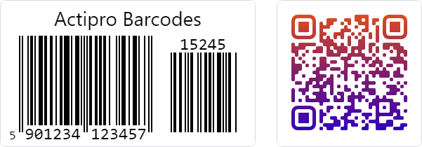

# Actipro Data Visualization

Actipro Data Visualization provides powerful, high-performance controls for displaying and encoding visual data in your applications.

*Example barcodes provided by this product*

## Barcodes

Barcode controls enable you to display and work with various barcode symbologies in your application. Support includes 2D symbologies like QR Code, along with 1D linear symbologies like Code 128, EAN/UPC variants, and many more.

See the [Barcodes](barcodes/index.md) section for details on working with barcode controls.
