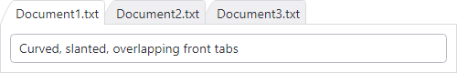

# AdvancedTabControl

Docking & MDI includes a very full-featured tab control named [AdvancedTabControl](xref:@ActiproUIRoot.Controls.Docking.AdvancedTabControl) that is extremely customizable and can be used independently of docking windows in your apps. [AdvancedTabControl](xref:@ActiproUIRoot.Controls.Docking.AdvancedTabControl) inherits the native @@PlatformName `TabControl` and extends it with many helpful features.



*An AdvancedTabControl with curved, slanted, overlapping tabs*

The type of item for the [AdvancedTabControl](xref:@ActiproUIRoot.Controls.Docking.AdvancedTabControl) is [AdvancedTabItem](xref:@ActiproUIRoot.Controls.Docking.AdvancedTabItem).  Make sure to use that type or a derived class whenever specifying tab items.

## Selection

Just like with standard `ItemsControl` and `Selector` controls, the `SelectedItem` property specifies the item that is currently selected in the tab control.  Note that in MVVM scenarios, this will return the item that is selected and not the [AdvancedTabItem](xref:@ActiproUIRoot.Controls.Docking.AdvancedTabItem) container.

## Tab Layout Kinds

Tabs can be displayed in three layout kinds within the tab control: pinned, normal, and preview.  Each tab's layout kind is set via the [AdvancedTabItem](xref:@ActiproUIRoot.Controls.Docking.AdvancedTabItem).[LayoutKind](xref:@ActiproUIRoot.Controls.Docking.AdvancedTabItem.LayoutKind) property, which defaults to [Normal](xref:@ActiproUIRoot.Controls.Docking.TabLayoutKind.Normal).

Normal tabs appear normally and left-aligned within the tab strip.  If the [AdvancedTabControl](xref:@ActiproUIRoot.Controls.Docking.AdvancedTabControl).[CanTabsPin](xref:@ActiproUIRoot.Controls.Docking.AdvancedTabControl.CanTabsPin) is `true` they will show a pin button that allows them to change to the [Pinned](xref:@ActiproUIRoot.Controls.Docking.TabLayoutKind.Pinned) layout kind when clicked.

Pinned tabs always appear to the left of all normal tabs.  They always show an unpin button that, when clicked, will return them to [Normal](xref:@ActiproUIRoot.Controls.Docking.TabLayoutKind.Normal) layout kind.

Preview tabs show up right-aligned in the tab strip.  They are meant to show temporary contextual information.  As long as the [AdvancedTabControl](xref:@ActiproUIRoot.Controls.Docking.AdvancedTabControl).[CanTabsPromote](xref:@ActiproUIRoot.Controls.Docking.AdvancedTabControl.CanTabsPromote) property remains its default `true` value, preview tabs will have a button on them that, when clicked, will change the tab to a [Normal](xref:@ActiproUIRoot.Controls.Docking.TabLayoutKind.Normal) layout kind.

## Tab Images

@if (avalonia) {
Tabs can show images on them if the [AdvancedTabControl](xref:@ActiproUIRoot.Controls.Docking.AdvancedTabControl).[HasTabIcons](xref:@ActiproUIRoot.Controls.Docking.AdvancedTabControl.HasTabIcons) property is set to `true` and the [AdvancedTabItem](xref:@ActiproUIRoot.Controls.Docking.AdvancedTabItem).[Icon](xref:@ActiproUIRoot.Controls.Docking.AdvancedTabItem.Icon) property is set to a valid object.

Any content supported by [Icon Presenter](../themes/icon-presenter.md) can be used (like `IImage` data, `PathIcon` control, or [DynamicImage](../shared/controls/dynamic-image.md) control)
}
@if (wpf) {
Tabs can show images on them if the [AdvancedTabControl](xref:@ActiproUIRoot.Controls.Docking.AdvancedTabControl).[HasTabImages](xref:@ActiproUIRoot.Controls.Docking.AdvancedTabControl.HasTabImages) property is set to `true` and the [AdvancedTabItem](xref:@ActiproUIRoot.Controls.Docking.AdvancedTabItem).[ImageSource](xref:@ActiproUIRoot.Controls.Docking.AdvancedTabItem.ImageSource) property is set to a valid `ImageSource`.
}

## Tab Overflow Behavior

There are numerous options from the [TabOverflowBehavior](xref:@ActiproUIRoot.Controls.Docking.TabOverflowBehavior) enumeration for selecting what happens when the tabs overflow the available tab strip space.

By default, the tabs shrink to fit within the available tab strip space.  This can be changed via the [AdvancedTabControl](xref:@ActiproUIRoot.Controls.Docking.AdvancedTabControl).[TabOverflowBehavior](xref:@ActiproUIRoot.Controls.Docking.AdvancedTabControl.TabOverflowBehavior) property.

## Tab Strip Placement

The tab strip can be located on any side (left, top, right, bottom) of the tab control.  Use the `TabStripPlacement` property to adjust the side as needed.

## Tab Content Orientation

Tabs will normally always display their content in a horizontal orientation, even when the tab strip placement is on the left or right.

Tab content can be rotated to a vertical orientation by setting the [AdvancedTabControl](xref:@ActiproUIRoot.Controls.Docking.AdvancedTabControl).[IsTabContentHorizontal](xref:@ActiproUIRoot.Controls.Docking.AdvancedTabControl.IsTabContentHorizontal) property to `false`.

## Tab Control Appearance

The tab control has several properties that adjust its own appearance.

### Tab Strip Visibility

The tab strip can be hidden by setting the [AdvancedTabControl](xref:@ActiproUIRoot.Controls.Docking.AdvancedTabControl).[IsTabStripVisible](xref:@ActiproUIRoot.Controls.Docking.AdvancedTabControl.IsTabStripVisible) property to `false`.

### Highlight

@if (avalonia) {
The tab strip can display an optional highlight border around its outside.  The border thickness is set by the [AdvancedTabControl](xref:@ActiproUIRoot.Controls.Docking.AdvancedTabControl).[HighlightThickness](xref:@ActiproUIRoot.Controls.Docking.AdvancedTabControl.HighlightThickness) property and the brush is specified by the [HighlightBrush](xref:@ActiproUIRoot.Controls.Docking.AdvancedTabControl.HighlightBrush) property.  When set to `null`, the [HighlightBrush](xref:@ActiproUIRoot.Controls.Docking.AdvancedTabControl.HighlightBrush) property is coerced to the `BorderBrush` property of the selected [AdvancedTabItem](xref:@ActiproUIRoot.Controls.Docking.AdvancedTabItem).
}
@if (wpf) {
The tab strip can display an optional highlight border around its outside.  The border thickness is set by the [AdvancedTabControl](xref:@ActiproUIRoot.Controls.Docking.AdvancedTabControl).[HighlightThickness](xref:@ActiproUIRoot.Controls.Docking.AdvancedTabControl.HighlightThickness) property and the brushes used to render the highlight are specified via the [HighlightBrushInactive](xref:@ActiproUIRoot.Controls.Docking.AdvancedTabControl.HighlightBrushInactive) and [HighlightBrushActive](xref:@ActiproUIRoot.Controls.Docking.AdvancedTabControl.HighlightBrushActive) properties.  Which one is used depends on if the tab control is marked active.
}

### Flagging as Active

The [AdvancedTabControl](xref:@ActiproUIRoot.Controls.Docking.AdvancedTabControl).[IsActive](xref:@ActiproUIRoot.Controls.Docking.AdvancedTabControl.IsActive) property flags the tab control as whether it is currently active or not.  This flag is generally set to `true` when the focus moves within the tab control.  The active setting affects which brushes are used for highlight effects and tab rendering.

## Tab Appearance

Numerous properties allow you to completely customize the appearance of tabs in the tab control.

### Background, Border, and Foreground

@if (avalonia) {
There are numerous variations of properties for [AdvancedTabItem](xref:@ActiproUIRoot.Controls.Docking.AdvancedTabItem).`Background` (i.e., [BackgroundActiveSelected](xref:@ActiproUIRoot.Controls.Docking.AdvancedTabItem.BackgroundActiveSelected), [BackgroundPointerOver](xref:@ActiproUIRoot.Controls.Docking.AdvancedTabItem.BackgroundPointerOver), etc.) that determine the background brush used to render tabs in various layout kinds and states.

Likewise, similar sets of layout kind and state properties are available for `BorderBrush` and `Foreground`.

These properties are assigned using the [AdvancedTabControl](xref:@ActiproUIRoot.Controls.Docking.AdvancedTabControl).`ItemContainerTheme` which, by default, is assigned a `ControlTheme` based on the [AdvancedTabItem](xref:@ActiproUIRoot.Controls.Docking.AdvancedTabItem) `Type`.  To customize these properties, assign a new `ControlTheme` that is based on the default theme and set the corresponding values as shown in the following example:
```xaml
xmlns:actipro="http://schemas.actiprosoftware.com/avaloniaui"
...
<actipro:AdvancedTabControl ... >
	<actipro.AdvancedTabControl.ItemContainerTheme>
		<ControlTheme TargetType="actipro:AdvancedTabItem" BasedOn="{StaticResource {x:Type actipro:AdvancedTabItem}}">
			<Setter Property="Background" Value="Purple" />
			<Setter Property="BorderBrush" Value="Fuchsia" />
			<Setter Property="Foreground" Value="Pink" />
		</ControlTheme>
	</actipro.AdvancedTabControl.ItemContainerTheme>
</actipro:AdvancedTabControl>
```
}
@if (wpf) {
There are numerous variations of properties like [AdvancedTabControl](xref:@ActiproUIRoot.Controls.Docking.AdvancedTabControl).[TabBackground](xref:@ActiproUIRoot.Controls.Docking.AdvancedTabControl.TabBackground), such as [TabBackgroundPointerOver](xref:@ActiproUIRoot.Controls.Docking.AdvancedTabControl.TabBackgroundPointerOver), etc. that determine the background brush used to render tabs in various layout kinds and states.

Likewise, similar sets of layout kind and state properties are available for [TabBorderBrush](xref:@ActiproUIRoot.Controls.Docking.AdvancedTabControl.TabBorderBrush) and [TabForeground](xref:@ActiproUIRoot.Controls.Docking.AdvancedTabControl.TabForeground).
}

### Corner Radius

The [AdvancedTabControl](xref:@ActiproUIRoot.Controls.Docking.AdvancedTabControl).[TabCornerRadius](xref:@ActiproUIRoot.Controls.Docking.AdvancedTabControl.TabCornerRadius) property sets the corner radius of tab borders, relative to a top-facing tab.

### Padding

The [AdvancedTabControl](xref:@ActiproUIRoot.Controls.Docking.AdvancedTabControl).[TabPadding](xref:@ActiproUIRoot.Controls.Docking.AdvancedTabControl.TabPadding) property sets the tab padding, relative to a top-facing tab.

### Spacing

The [AdvancedTabControl](xref:@ActiproUIRoot.Controls.Docking.AdvancedTabControl).[TabSpacing](xref:@ActiproUIRoot.Controls.Docking.AdvancedTabControl.TabSpacing) property, which defaults to `0`, determines the amount of space between each tab.  Set it to a negative value to have tabs overlap each other.

### Minimum and Maximum Extents

The [AdvancedTabControl](xref:@ActiproUIRoot.Controls.Docking.AdvancedTabControl).[MinTabExtent](xref:@ActiproUIRoot.Controls.Docking.AdvancedTabControl.MinTabExtent) and [MaxTabExtent](xref:@ActiproUIRoot.Controls.Docking.AdvancedTabControl.MaxTabExtent) properties set the minimum and maximum extent (length) that a tab can be.  Set these properties to the same value to create fixed size tabs.

### Side Slant

The [AdvancedTabControl](xref:@ActiproUIRoot.Controls.Docking.AdvancedTabControl).[TabNearSlantExtent](xref:@ActiproUIRoot.Controls.Docking.AdvancedTabControl.TabNearSlantExtent) and [TabFarSlantExtent](xref:@ActiproUIRoot.Controls.Docking.AdvancedTabControl.TabFarSlantExtent) properties set the amount of slant that tabs have on their near (left) and far (right) sides.

### Highlighting Inactive Tabs on Pointer Over

The [AdvancedTabControl](xref:@ActiproUIRoot.Controls.Docking.AdvancedTabControl).[CanTabsHighlightOnPointerOverWhenInactive](xref:@ActiproUIRoot.Controls.Docking.AdvancedTabControl.CanTabsHighlightOnPointerOverWhenInactive) property sets whether tabs can highlight when the pointer is over inactive ones.  The default value is `false`.

## New Tab Button

A **New Tab** button can be displayed by setting the [AdvancedTabControl](xref:@ActiproUIRoot.Controls.Docking.AdvancedTabControl).[HasNewTabButton](xref:@ActiproUIRoot.Controls.Docking.AdvancedTabControl.HasNewTabButton) property to `true`.  The **New Tab** button appears just to the right of the normal tabs.  It is recommended that one of the shrink-related overflow behaviors is used when a **New Tab** button is present.

@if (avalonia) {
The theme of the button can be set with the [NewTabButtonTheme](xref:@ActiproUIRoot.Controls.Docking.AdvancedTabControl.NewTabButtonTheme) property.
}
@if (wpf) {
The style of the button can be set with the [NewTabButtonStyle](xref:@ActiproUIRoot.Controls.Docking.AdvancedTabControl.NewTabButtonStyle) property.
}

When the button is clicked, the [NewTabRequested](xref:@ActiproUIRoot.Controls.Docking.AdvancedTabControl.NewTabRequested) event is raised.  Handlers of that event should add a new tab to the control in response.

## Embedded Buttons

The tab control and its tabs can embed several buttons.  Tab control embedded buttons generally display in response to the tab overflow behavior setting.  Several tab embedded buttons depend on the tab's layout kind and other options like [AdvancedTabControl](xref:@ActiproUIRoot.Controls.Docking.AdvancedTabControl).[HasTabCloseButtons](xref:@ActiproUIRoot.Controls.Docking.AdvancedTabControl.HasTabCloseButtons).

Some tab embedded buttons are only visible when the tab is selected or in a pointer over state.  The [AdvancedTabControl](xref:@ActiproUIRoot.Controls.Docking.AdvancedTabControl).[AreTabEmbeddedButtonsAlwaysVisible](xref:@ActiproUIRoot.Controls.Docking.AdvancedTabControl.AreTabEmbeddedButtonsAlwaysVisible) property sets whether tab embedded buttons are always visible, even when the tab is unselected.

@if (avalonia) {
The [AdvancedTabControl](xref:@ActiproUIRoot.Controls.Docking.AdvancedTabControl).[EmbeddedButtonTheme](xref:@ActiproUIRoot.Controls.Docking.AdvancedTabControl.EmbeddedButtonTheme) property allows you to customize the `ControlTheme` of tab control embedded buttons, while the [AdvancedTabItem](xref:@ActiproUIRoot.Controls.Docking.AdvancedTabItem).[EmbeddedButtonTheme](xref:@ActiproUIRoot.Controls.Docking.AdvancedTabItem.EmbeddedButtonTheme) property allows you to customize the `ControlTheme` of tab embedded buttons.
}
@if (wpf) {
The [AdvancedTabControl](xref:@ActiproUIRoot.Controls.Docking.AdvancedTabControl).[EmbeddedButtonStyle](xref:@ActiproUIRoot.Controls.Docking.AdvancedTabControl.EmbeddedButtonStyle) property allows you to customize the `Style` of tab control embedded buttons, while the [TabEmbeddedButtonStyle](xref:@ActiproUIRoot.Controls.Docking.AdvancedTabControl.TabEmbeddedButtonStyle) property allows you to customize the `Style` of tab embedded buttons.
}

The [AdvancedTabControl](xref:@ActiproUIRoot.Controls.Docking.AdvancedTabControl).[MenuButtonContentTemplate](xref:@ActiproUIRoot.Controls.Docking.AdvancedTabControl.MenuButtonContentTemplate), [OverflowMenuButtonContentTemplate](xref:@ActiproUIRoot.Controls.Docking.AdvancedTabControl.OverflowMenuButtonContentTemplate), [ScrollBackwardButtonContentTemplate](xref:@ActiproUIRoot.Controls.Docking.AdvancedTabControl.ScrollBackwardButtonContentTemplate), and [ScrollForwardButtonContentTemplate](xref:@ActiproUIRoot.Controls.Docking.AdvancedTabControl.ScrollForwardButtonContentTemplate) properties allow you to customize the @if (avalonia) { `IDataTemplate` }@if (wpf) { `DataTemplate` } of the related tab control embedded buttons.

## Tab Closing

Tabs can close when their embedded close button is clicked or also on middle-click if the [AdvancedTabControl](xref:@ActiproUIRoot.Controls.Docking.AdvancedTabControl).[CanTabsCloseOnMiddleClick](xref:@ActiproUIRoot.Controls.Docking.AdvancedTabControl.CanTabsCloseOnMiddleClick) property is set to `true`.  These features also require that the [AdvancedTabItem](xref:@ActiproUIRoot.Controls.Docking.AdvancedTabItem).[CanClose](xref:@ActiproUIRoot.Controls.Docking.AdvancedTabItem.CanClose) property is `true`.

When a tab is about to close, it raises the [AdvancedTabControl](xref:@ActiproUIRoot.Controls.Docking.AdvancedTabControl).[TabClosing](xref:@ActiproUIRoot.Controls.Docking.AdvancedTabControl.TabClosing) event.  If the `Cancel` flag is set to `true` in the event arguments, the close will not occur.  This event is a good place to prompt the end user about unsaved changes, etc.

## Tab Dragging to Reorder

While tabs do support dragging to reorder themselves, the feature is not enabled by default.  To enable this behavior, set the [AdvancedTabControl](xref:@ActiproUIRoot.Controls.Docking.AdvancedTabControl).[CanTabsDrag](xref:@ActiproUIRoot.Controls.Docking.AdvancedTabControl.CanTabsDrag) property to `true`.

@if (wpf) {

## Tab Selection on System Drag Over

By default, performing a system drag over a tab (e.g., text drag, file drag) will select the tab so that the dragged content can be dropped on a control on the tab's content area.  To disable this feature, set the [AdvancedTabControl](xref:@ActiproUIRoot.Controls.Docking.AdvancedTabControl).[CanTabsSelectOnDragOver](xref:@ActiproUIRoot.Controls.Docking.AdvancedTabControl.CanTabsSelectOnDragOver) property to `false`.

}

## Layout Animation

@if (avalonia) {
By default, animation effects are applied during layout, such as when tabs are added or removed from the tab control.  To disable these animation effects, set the [AdvancedTabControl](xref:@ActiproUIRoot.Controls.Docking.AdvancedTabControl).[IsAnimationEnabled](xref:@ActiproUIRoot.Controls.Docking.AdvancedTabControl.IsAnimationEnabled) property to `false`.
}
@if (wpf) {
By default, animation effects are applied during layout, such as when tabs are added or removed from the tab control.  To disable these animation effects, set the [AdvancedTabControl](xref:@ActiproUIRoot.Controls.Docking.AdvancedTabControl).[IsLayoutAnimationEnabled](xref:@ActiproUIRoot.Controls.Docking.AdvancedTabControl.IsLayoutAnimationEnabled) property to `false`.
}

## Menus

The [AdvancedTabControl](xref:@ActiproUIRoot.Controls.Docking.AdvancedTabControl).[MenuOpening](xref:@ActiproUIRoot.Controls.Docking.AdvancedTabControl.MenuOpening) event is raised before a context or drop-down menu is opened.  Its event arguments specify the related [AdvancedTabItem](xref:@ActiproUIRoot.Controls.Docking.AdvancedTabItem), if any, along with the default menu that will be displayed.  You can fully customize or change the menu to suit your needs.

## Keyboard Shortcuts

When the [AdvancedTabControl](xref:@ActiproUIRoot.Controls.Docking.AdvancedTabControl).[IsTabKeyboardSwitchingEnabled](xref:@ActiproUIRoot.Controls.Docking.AdvancedTabControl.IsTabKeyboardSwitchingEnabled) property is `true` (the default), the <kbd>Ctrl</kbd>+<kbd>Tab</kbd> gesture will switch to the next tab and the <kbd>Ctrl</kbd>+<kbd>Shift</kbd>+<kbd>Tab</kbd> gesture will switch to the previous tab.

@if (avalonia) {
> [!TIP]
> Use the [ActivateNextTabKeyGesture](xref:@ActiproUIRoot.Controls.Docking.AdvancedTabControl.ActivateNextTabKeyGesture) and [ActivatePreviousTabKeyGesture](xref:@ActiproUIRoot.Controls.Docking.AdvancedTabControl.ActivatePreviousTabKeyGesture) properties to customize the key gestures used for tab switching.
}

When the [AdvancedTabControl](xref:@ActiproUIRoot.Controls.Docking.AdvancedTabControl).[IsTabKeyboardAccessEnabled](xref:@ActiproUIRoot.Controls.Docking.AdvancedTabControl.IsTabKeyboardAccessEnabled) property is `true` (the default), keyboard access to directly select a tab is enabled.  The number keys <kbd>1</kbd> through <kbd>8</kbd> identify tab position and are combined with specific modifier keys to distinguish between normal, pinned, or preview tab states.  The number key <kbd>9</kbd> is used to indicate the last tab instead of the ninth tab.


| Key | Description |
|-----|-----|
| <kbd>Ctrl</kbd>+<kbd>1</kbd>&nbsp;through&nbsp;<kbd>8</kbd> | Activate the tabs in a normal state based on position.  For instance, <kbd>Ctrl</kbd>+<kbd>2</kbd> activates the second tab in a normal state. |
| <kbd>Ctrl</kbd>+<kbd>9</kbd> | Activates the last tab in a normal state. |
| <kbd>Ctrl</kbd>+<kbd>Alt</kbd>+<kbd>1</kbd>&nbsp;through&nbsp;<kbd>8</kbd> | Activate the tabs in a pinned state based on position.  For instance, <kbd>Ctrl</kbd>+<kbd>Alt</kbd>+<kbd>2</kbd> activates the second tab in a pinned state. |
| <kbd>Ctrl</kbd>+<kbd>Alt</kbd>+<kbd>9</kbd> | Activates the last tab in a pinned state. |
| <kbd>Ctrl</kbd>+<kbd>Shift</kbd>+<kbd>1</kbd>&nbsp;through&nbsp;<kbd>8</kbd> | Activate the tabs in a preview state based on position.  For instance, <kbd>Ctrl</kbd>+<kbd>Shift</kbd>+<kbd>2</kbd> activates the second tab in a preview state. |
| <kbd>Ctrl</kbd>+<kbd>Shift</kbd>+<kbd>9</kbd> | Activates the last tab in a preview state. |


@if (avalonia) {
> [!TIP]
> Use the [ActivateNormalTabKeyModifiers](xref:@ActiproUIRoot.Controls.Docking.AdvancedTabControl.ActivateNormalTabKeyModifiers), [ActivatePinnedTabKeyModifiers](xref:@ActiproUIRoot.Controls.Docking.AdvancedTabControl.ActivatePinnedTabKeyModifiers), and [ActivatePreviewTabKeyModifiers](xref:@ActiproUIRoot.Controls.Docking.AdvancedTabControl.ActivatePreviewTabKeyModifiers) properties to customize the key modifiers that are used to activate each tab.
}