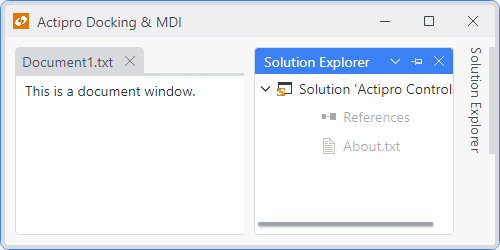

# Auto-Hidden Tool Windows

Tool windows in [auto-hide state](docking-window-states.md) show tabs along a tray area on the side of their dock host.  When a tab is clicked, the related tool window's content is displayed in an animated popup.



*The Solution Explorer tool window in AutoHide state with its popup displayed*

## Allowing Auto-Hide

Only tool windows can be auto-hidden.  A global [DockSite](xref:@ActiproUIRoot.Controls.Docking.DockSite).[CanToolWindowsAutoHide](xref:@ActiproUIRoot.Controls.Docking.DockSite.CanToolWindowsAutoHide) property (defaults to `true`) determines the default value for whether they have that capability, but it can be overridden at an instance-level by setting the [ToolWindow](xref:@ActiproUIRoot.Controls.Docking.ToolWindow).[CanAutoHide](xref:@ActiproUIRoot.Controls.Docking.ToolWindow.CanAutoHide) property.

## Programmatically Auto-Hiding a Tool Window

A tool window can be programmatically auto-hidden by calling the [ToolWindow](xref:@ActiproUIRoot.Controls.Docking.ToolWindow).[AutoHide](xref:@ActiproUIRoot.Controls.Docking.ToolWindow.AutoHide*) method.  An overload of the method allows you to specify the @if (avalonia) { `Dock` side }@if (wpf) { [Side](xref:@ActiproUIRoot.Controls.Side) } against which to auto-hide.

## Behavior and Animation Options

These options control auto-hide functionality behavior and ensuing animation:

<table>
<thead>

<tr>
<th>Member</th>
<th>Description</th>
</tr>

</thead>
<tbody>

<tr>
<td>

[DockSite](xref:@ActiproUIRoot.Controls.Docking.DockSite).[AutoHidePerContainer](xref:@ActiproUIRoot.Controls.Docking.DockSite.AutoHidePerContainer) Property

</td>
<td>

Gets or sets whether auto-hide state toggles affect all the windows in the parent container.  The default value is `true`.

</td>
</tr>

<tr>
<td>

[DockSite](xref:@ActiproUIRoot.Controls.Docking.DockSite).[AutoHidePopupCloseAnimationDuration](xref:@ActiproUIRoot.Controls.Docking.DockSite.AutoHidePopupCloseAnimationDuration) Property

</td>
<td>

Gets or sets the time in milliseconds of the animation that is applied to an auto-hide popup close.  The default value is `150ms`.

</td>
</tr>

<tr>
<td>

[DockSite](xref:@ActiproUIRoot.Controls.Docking.DockSite).[AutoHidePopupCloseDelay](xref:@ActiproUIRoot.Controls.Docking.DockSite.AutoHidePopupCloseDelay) Property

</td>
<td>

Gets or sets the time in milliseconds of the delay between when the pointer leaves an auto-hide popup and when the popup closes if the mouse has not moved back over the popup.  This only applies when [AutoHidePopupOpensOnMouseHover](xref:@ActiproUIRoot.Controls.Docking.DockSite.AutoHidePopupOpensOnMouseHover) is `true`.  The default value is `500ms`.

</td>
</tr>

<tr>
<td>

[DockSite](xref:@ActiproUIRoot.Controls.Docking.DockSite).[AutoHidePopupOpenAnimationDuration](xref:@ActiproUIRoot.Controls.Docking.DockSite.AutoHidePopupOpenAnimationDuration) Property

</td>
<td>

Gets or sets the time in milliseconds of the animation that is applied to an auto-hide popup open.  The default value is `150ms`.

</td>
</tr>

<tr>
<td>

[DockSite](xref:@ActiproUIRoot.Controls.Docking.DockSite).[AutoHidePopupOpenDelay](xref:@ActiproUIRoot.Controls.Docking.DockSite.AutoHidePopupOpenDelay) Property

</td>
<td>

Gets or sets the time in milliseconds of the delay between when the pointer moves over an auto-hide tab item and the auto-hide popup opens to display the tool window represented by the tab item.  This only applies when [AutoHidePopupOpensOnMouseHover](xref:@ActiproUIRoot.Controls.Docking.DockSite.AutoHidePopupOpensOnMouseHover) is `true`.  The default value is `200ms`.

</td>
</tr>

<tr>
<td>

[DockSite](xref:@ActiproUIRoot.Controls.Docking.DockSite).[AutoHidePopupOpensOnMouseHover](xref:@ActiproUIRoot.Controls.Docking.DockSite.AutoHidePopupOpensOnMouseHover) Property

</td>
<td>

Gets or sets whether the auto-hide popup displays when the mouse hovers over an auto-hide tab item.  The default value is `false` for most themes, but may be `true` for some themes.

</td>
</tr>

</tbody>
</table>

## Appearance Options

These options control the appearance of auto-hide tabs:

<table>
<thead>

<tr>
<th>Member</th>
<th>Description</th>
</tr>

</thead>
<tbody>

<tr>
<td>

[ToolWindow](xref:@ActiproUIRoot.Controls.Docking.ToolWindow).[AutoHideTabContextContentTemplate](xref:@ActiproUIRoot.Controls.Docking.ToolWindow.AutoHideTabContextContentTemplate) Property

</td>
<td>

Gets or sets the @if (avalonia) { `IDataTemplate` }@if (wpf) { `DataTemplate` } containing contextual content that should be rendered in an auto-hide tab for this window.

</td>
</tr>

<tr>
<td>

[DockSite](xref:@ActiproUIRoot.Controls.Docking.DockSite).[AutoHideTabItemTemplate](xref:@ActiproUIRoot.Controls.Docking.DockSite.AutoHideTabItemTemplate) Property

</td>
<td>

Gets or sets the @if (avalonia) { `IDataTemplate` }@if (wpf) { `DataTemplate` } to use for rendering the auto-hide tab items.

</td>
</tr>

@if (wpf) {
<tr>
<td>

[DockSite](xref:@ActiproUIRoot.Controls.Docking.DockSite).[AutoHideTabItemTemplateSelector](xref:@ActiproUIRoot.Controls.Docking.DockSite.AutoHideTabItemTemplateSelector) Property

</td>
<td>

Gets or sets the `DataTemplateSelector` to use for rendering the auto-hide tab items.

</td>
</tr>
}

</tbody>
</table>

## Iterating Auto-Hidden Tool Windows

These [DockSite](xref:@ActiproUIRoot.Controls.Docking.DockSite) properties are the four collections of [ToolWindowContainer](xref:@ActiproUIRoot.Controls.Docking.ToolWindowContainer) controls, one collection for each side of the dock site.

- [DockSite](xref:@ActiproUIRoot.Controls.Docking.DockSite).[AutoHideLeftContainers](xref:@ActiproUIRoot.Controls.Docking.DockSite.AutoHideLeftContainers)
- [DockSite](xref:@ActiproUIRoot.Controls.Docking.DockSite).[AutoHideTopContainers](xref:@ActiproUIRoot.Controls.Docking.DockSite.AutoHideTopContainers)
- [DockSite](xref:@ActiproUIRoot.Controls.Docking.DockSite).[AutoHideRightContainers](xref:@ActiproUIRoot.Controls.Docking.DockSite.AutoHideRightContainers)
- [DockSite](xref:@ActiproUIRoot.Controls.Docking.DockSite).[AutoHideBottomContainers](xref:@ActiproUIRoot.Controls.Docking.DockSite.AutoHideBottomContainers)

 Each collection accepts one or more [ToolWindowContainer](xref:@ActiproUIRoot.Controls.Docking.ToolWindowContainer) controls, each of which can contain one or more [ToolWindow](xref:@ActiproUIRoot.Controls.Docking.ToolWindow) controls.

The properties above are simple wrappers for similar properties on the [DockHost](xref:@ActiproUIRoot.Controls.Docking.DockHost) returned by the [DockSite](xref:@ActiproUIRoot.Controls.Docking.DockSite).[PrimaryDockHost](xref:@ActiproUIRoot.Controls.Docking.DockSite.PrimaryDockHost) property.  You can iterate through those collections to see which tool windows are on each side of the primary dock host.

You can also examine each floating [DockHost](xref:@ActiproUIRoot.Controls.Docking.DockHost), if there are any, by iterating the [DockSite](xref:@ActiproUIRoot.Controls.Docking.DockSite).[FloatingDockHosts](xref:@ActiproUIRoot.Controls.Docking.DockSite.FloatingDockHosts) collection and examining the auto-hide container properties on them (e.g.,  [DockHost](xref:@ActiproUIRoot.Controls.Docking.DockHost).[AutoHideLeftContainers](xref:@ActiproUIRoot.Controls.Docking.DockHost.AutoHideLeftContainers)).

## Determining If an Auto-Hide Popup Is Displayed

The [DockHost](xref:@ActiproUIRoot.Controls.Docking.DockHost).[IsAutoHidePopupOpen](xref:@ActiproUIRoot.Controls.Docking.DockHost.IsAutoHidePopupOpen) property returns `true` when there is an auto-hide popup displayed.

The [DockHost](xref:@ActiproUIRoot.Controls.Docking.DockHost).[AutoHidePopupToolWindow](xref:@ActiproUIRoot.Controls.Docking.DockHost.AutoHidePopupToolWindow) property returns the [ToolWindow](xref:@ActiproUIRoot.Controls.Docking.ToolWindow) that is currently open in that popup.  The [ToolWindow](xref:@ActiproUIRoot.Controls.Docking.ToolWindow).[IsAutoHidePopupOpen](xref:@ActiproUIRoot.Controls.Docking.ToolWindow.IsAutoHidePopupOpen) property of that tool window will return `true` while it is open in the popup.

@if (wpf) {
## Preventing an Auto-Hide Popup from Closing

Auto-hide popups will close by default after a brief delay whenever the keyboard focus is moved outside of them.  This can be a problem in scenarios where a dialog `Window` is opened from the tool window displayed in the auto-hide popup.  In that scenario, the keyboard focus moves to the dialog and the auto-hide popup is closed.  However, you may wish to keep the auto-hide popup visible while the dialog is displayed so that focus properly returns to it when the dialog is closed.

This code shows how to display a dialog and keep any current auto-hide popup open:

```csharp
try {
	dockSite.AutoHidePopupClosesOnLostFocus = false;
	window.ShowDialog();
}
finally {
	dockSite.AutoHidePopupClosesOnLostFocus = true;
}
```
}

## Dynamically Altering the Auto-Hide Side

The [WindowsAutoHiding](xref:@ActiproUIRoot.Controls.Docking.DockSite.WindowsAutoHiding) event is raised whenever one or more tool windows are auto-hidden, allowing for the side upon which they are being auto-hidden to be customized.  This is useful in scenarios like when you wish to restrict auto-hiding to only the left/right or top/bottom of a dock host.

The event is passed arguments of type [DockingWindowsAutoHidingEventArgs](xref:@ActiproUIRoot.Controls.Docking.DockingWindowsAutoHidingEventArgs), which has a [Side](xref:@ActiproUIRoot.Controls.Docking.DockingWindowsAutoHidingEventArgs.Side) property.  An event handler can examine the list of windows being auto-hidden and can choose to change the side to another side.

## Auto-Hide Popup Events

The [WindowAutoHidePopupOpened](xref:@ActiproUIRoot.Controls.Docking.DockSite.WindowAutoHidePopupOpened) and [WindowAutoHidePopupClosed](xref:@ActiproUIRoot.Controls.Docking.DockSite.WindowAutoHidePopupClosed) events on [DockSite](xref:@ActiproUIRoot.Controls.Docking.DockSite) are raised whenever the auto-hide popup is opened or closed.  The event arguments specify which tool window was opened or closed.

## Notes on Interop Usage

If you use an interop @if (avalonia) { (e.g., `NativeControlHost`) }@if (wpf) { (WinForms, ActiveX, etc.) } control in your docking windows, auto-hide popups in their default configuration will not appear on top of the interop content due to @@PlatformName airspace issues with interop content in the same `Window`.  By setting the [DockSite](xref:@ActiproUIRoot.Controls.Docking.DockSite).[UseHostedPopups](xref:@ActiproUIRoot.Controls.Docking.DockSite.UseHostedPopups) property to `false`, non-hosted popups will be used to display auto-hide content instead.  This uses a separate `Window` to render the popup and thereby allows @@PlatformName content in the popup to render above the interop content.  The only downside to setting this property is that you lose the popup open/close animation.

See the [Interop Compatibility](../interop-compatibility.md) topic for more information.
