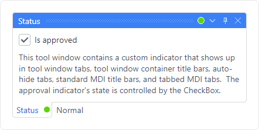

# Contextual Content

Contextual content, such as buttons or status indicators, can be displayed throughout the docking window UI within tabs and title bars.



*A status indicator showing in both the tool window tab and title bar*

## Contextual Content Locations

There are five locations that support contextual content.  Each of the properties below can be assigned @if (avalonia) { an `IDataTemplate` }@if (wpf) { a `DataTemplate` } that specifies the contextual content to use for the related location.

The data context of the @if (avalonia) { `IDataTemplate` }@if (wpf) { `DataTemplate` } will be the `DataContext` of the docking window, unless the `DataContext` is a @if (avalonia) { `Visual`. }@if (wpf) { `UIElement`. }  In that case, no data context is passed since it could otherwise lead to logical tree issues.

<table>
<thead>

<tr>
<th>Member</th>
<th>Description</th>
</tr>

</thead>
<tbody>

<tr>
<td>

[ToolWindow](xref:@ActiproUIRoot.Controls.Docking.ToolWindow).[AutoHideTabContextContentTemplate](xref:@ActiproUIRoot.Controls.Docking.ToolWindow.AutoHideTabContextContentTemplate) Property

</td>
<td>The tab of an auto-hidden tool window.</td>
</tr>

<tr>
<td>

[DockingWindow](xref:@ActiproUIRoot.Controls.Docking.DockingWindow).[StandardMdiTitleBarContextContentTemplate](xref:@ActiproUIRoot.Controls.Docking.DockingWindow.StandardMdiTitleBarContextContentTemplate) Property

</td>
<td>The title bar of a standard MDI document.</td>
</tr>

<tr>
<td>

[DockingWindow](xref:@ActiproUIRoot.Controls.Docking.DockingWindow).[TabbedMdiTabContextContentTemplate](xref:@ActiproUIRoot.Controls.Docking.DockingWindow.TabbedMdiTabContextContentTemplate) Property

</td>
<td>The tab of a tabbed MDI document.</td>
</tr>

<tr>
<td>

[ToolWindow](xref:@ActiproUIRoot.Controls.Docking.ToolWindow).[ToolWindowContainerTabContextContentTemplate](xref:@ActiproUIRoot.Controls.Docking.ToolWindow.ToolWindowContainerTabContextContentTemplate) Property

</td>
<td>The tab of a docked tool window.</td>
</tr>

<tr>
<td>

[ToolWindow](xref:@ActiproUIRoot.Controls.Docking.ToolWindow).[ToolWindowContainerTitleBarContextContentTemplate](xref:@ActiproUIRoot.Controls.Docking.ToolWindow.ToolWindowContainerTitleBarContextContentTemplate) Property

</td>
<td>The title bar of a docked tool window.</td>
</tr>

</tbody>
</table>

## Tool Window Container Title Bar Alignment

The [DockSite](xref:@ActiproUIRoot.Controls.Docking.DockSite).[ToolWindowsTitleBarContextContentAlignment](xref:@ActiproUIRoot.Controls.Docking.DockSite.ToolWindowsTitleBarContextContentAlignment) property can be set to a [ContextContentAlignment](xref:@ActiproUIRoot.Controls.Docking.ContextContentAlignment) that indicates if the context content is aligned to the near (left) side of the title, or to the far (right) side.  The far side is just left of any title bar buttons and is the default alignment.

## Status Indicator Example

Let's see how to reproduce the **Status** tool window in the screenshot above.

This @if (avalonia) { `IDataTemplate` }@if (wpf) { `DataTemplate` } contains an ellipse whose fill color is bound to the value of the docking window's `DataContext`.  A special value converter is used to convert the value to a `Brush`.

See the related QuickStart in the Sample Browser for the full source code.

@if (avalonia) {
```xaml
<DataTemplate x:Key="StatusIconDataTemplate" x:DataType="x:Boolean">
	<Ellipse Margin="2"
		Width="12" Height="12"
		HorizontalAlignment="Center" VerticalAlignment="Center"
		StrokeThickness="1" Stroke="#ffffff"
		Fill="{Binding, Converter={StaticResource StatusLightComparisonConverter}}"
		/>
</DataTemplate>
```
}
@if (wpf) {
```xaml
<DataTemplate x:Key="StatusIconDataTemplate">
	<Ellipse Margin="2"
		Width="12" Height="12"
		HorizontalAlignment="Center" VerticalAlignment="Center"
		StrokeThickness="1" Stroke="#ffffff"
		Fill="{Binding Converter={StaticResource StatusLightConditionalConverter}}"
		/>
</DataTemplate>
```
}

@if (avalonia) {
This XAML within a dock site shows how a tool widnow could be defined to use the `IDataTemplate` above in all possible locations.  Note how its `DataContext` is initialized to a boolean value.

```xaml
<actipro:ToolWindow x:Name="statusToolWindow"
	Title="Status"
	AutoHideTabContextContentTemplate="{StaticResource StatusIconDataTemplate}"
	StandardMdiTitleBarContextContentTemplate="{StaticResource StatusIconDataTemplate}"
	TabbedMdiTabContextContentTemplate="{StaticResource StatusIconDataTemplate}"
	ToolWindowContainerTabContextContentTemplate="{StaticResource StatusIconDataTemplate}"
	ToolWindowContainerTitleBarContextContentTemplate="{StaticResource StatusIconDataTemplate}"
	>
	<actipro:ToolWindow.DataContext>
		<x:False />
	</actipro:ToolWindow.DataContext>
	...
</actipro:ToolWindow>
```
}
@if (wpf) {
This XAML within a dock site shows how a tool widnow could be defined to use the `DataTemplate` above in all possible locations.  Note how its `DataContext` is initialized to a boolean value.

```xaml
<docking:ToolWindow x:Name="statusToolWindow" Title="Status"
	AutoHideTabContextContentTemplate="{StaticResource StatusIconDataTemplate}"
	StandardMdiTitleBarContextContentTemplate="{StaticResource StatusIconDataTemplate}"
	TabbedMdiTabContextContentTemplate="{StaticResource StatusIconDataTemplate}"
	ToolWindowContainerTabContextContentTemplate="{StaticResource StatusIconDataTemplate}"
	ToolWindowContainerTitleBarContextContentTemplate="{StaticResource StatusIconDataTemplate}"
	>
	<docking:ToolWindow.DataContext>
		<system:Boolean>False</system:Boolean>
	</docking:ToolWindow.DataContext>
	...
</docking:ToolWindow>
```
}

## Tool Window Title Bar Buttons

Buttons can be embedded in tool window title bar containers.  To achieve the same appearance as the built-in buttons, define the button with these properties:

@if (avalonia) {
```xaml
<Button Padding="3" x:DataType="x:Object"
	Theme="{actipro:ControlTheme DockingEmbeddedButton}"
	VerticalAlignment="Center"
	>
	<Button.ContentTemplate>
		<DataTemplate>
			<Canvas Width="10" Height="10">
				<Path Width="10" Height="10" StrokeThickness="1"
					Stroke="{Binding RelativeSource={RelativeSource Self}, Path=(TextElement.Foreground)}"
					Data="M 0.5,3.5 A 3,3 90 0 1 3.5,0.5 A 3,3 90 0 1 6.5,3.5 A 3,3 90 0 1 3.5,6.5 A 3,3 90 0 1 0.5,3  M 5.5,6 L 9,9.5 L 9.5,9 L 6,5.5 Z"
					/>
			</Canvas>
		</DataTemplate>
	</Button.ContentTemplate>
</Button>
```
}
@if (wpf) {
```xaml
<Button Padding="2"
	Style="{StaticResource {x:Static themes:SharedResourceKeys.EmbeddedButtonBaseOverrideStyleKey}}"
	VerticalAlignment="Center"
	>
	<Button.ContentTemplate>
		<DataTemplate>
			<Canvas Width="10" Height="10">
				<Path Width="10" Height="10" StrokeThickness="1"
					Stroke="{Binding RelativeSource={RelativeSource Self}, Path=(TextElement.Foreground)}"
					Data="M 0.5,3.5 A 3,3 90 0 1 3.5,0.5 A 3,3 90 0 1 6.5,3.5 A 3,3 90 0 1 3.5,6.5 A 3,3 90 0 1 0.5,3  M 5.5,6 L 9,9.5 L 9.5,9 L 6,5.5 Z"
					/>
			</Canvas>
		</DataTemplate>
	</Button.ContentTemplate>
</Button>
```
}

The sample above produces a button with a search icon.
