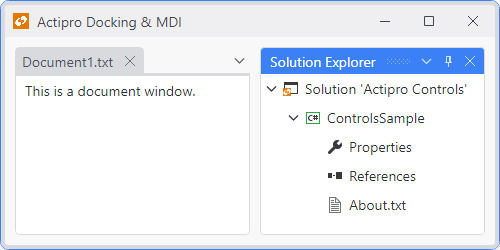
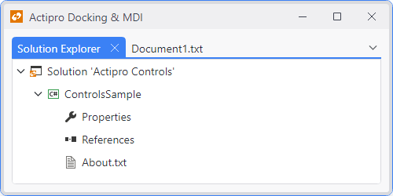
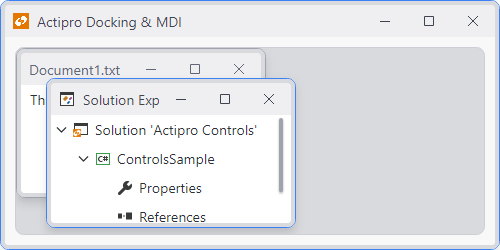

# Docking Window States

There are three states in which docking windows can be: auto-hide, docked, and document.  Docking windows can be in these states even when they are in a floating dock host.  These states are represented by the [DockingWindowState](xref:@ActiproUIRoot.Controls.Docking.DockingWindowState) enumeration.

Document windows can only be in the [Document](xref:@ActiproUIRoot.Controls.Docking.DockingWindowState.Document) state, while tool windows are more flexible and can be in any of the three states.

> [!NOTE]
> See the [Floating Dock Hosts](floating-dock-hosts.md) topic for an explanation of why there is no specific floating state.

## The AutoHide State

A tool window is in auto-hide state when its tab appears along one of four outer edges of a dock host.  Clicking the tab makes the tool window's content slide into view using a quick animation.  The content remains visible while it has focus.  When the focus leaves the content area or when the tab is clicked again, the tool window slides back out of view, while its tab remains visible.

*The Solution Explorer tool window in AutoHide state with its popup displayed*

The [AutoHide](xref:@ActiproUIRoot.Controls.Docking.DockingWindowState.AutoHide) state is only available to tool windows.  Auto-hide is always supported in the primary dock host and is only supported in floating dock hosts that have a workspace visible.

## The Docked State

A tool window is considered [Docked](xref:@ActiproUIRoot.Controls.Docking.DockingWindowState.Docked) when it is within a dock host hierarchy but not in auto-hide and not in MDI (the document area).

*The Solution Explorer tool window in Docked state*

The [Docked](xref:@ActiproUIRoot.Controls.Docking.DockingWindowState.Docked) state is only available to tool windows.  Tool windows that are dragged to float are considered in a [Docked](xref:@ActiproUIRoot.Controls.Docking.DockingWindowState.Docked) state in their containing floating dock host.

## The Document State

A docking window is in [Document](xref:@ActiproUIRoot.Controls.Docking.DockingWindowState.Document) state when it is within the MDI area.  It could be a tab in tabbed MDI or a window in standard MDI.

*The Solution Explorer tool window in Document state (tabbed MDI)*

*The Solution Explorer tool window in Document state (standard MDI)*

The [Document](xref:@ActiproUIRoot.Controls.Docking.DockingWindowState.Document) state is available to both tool and document windows.  Documents that are dragged to float will create an MDI host in their containing floating dock host.

## State Changes

The [DockingWindow](xref:@ActiproUIRoot.Controls.Docking.DockingWindow).[State](xref:@ActiproUIRoot.Controls.Docking.DockingWindow.State) property can be set to alter where the docking window is located.  Note that setting the state will not automatically open the docking window if it is currently closed.  It is designed this way so that the state can be set and other properties configured prior to the open occurring, which can be done by setting the [IsOpen](xref:@ActiproUIRoot.Controls.Docking.DockingWindow.IsOpen) property to `true`, setting the [IsActive](xref:@ActiproUIRoot.Controls.Docking.DockingWindow.IsActive) property to `true`, calling the [Open](xref:@ActiproUIRoot.Controls.Docking.DockingWindow.Open*) method, or calling the [Activate](xref:@ActiproUIRoot.Controls.Docking.DockingWindow.Activate*) method.

The [DockSite](xref:@ActiproUIRoot.Controls.Docking.DockSite).[WindowsStateChanged](xref:@ActiproUIRoot.Controls.Docking.DockSite.WindowsStateChanged) event can be used to detect changes to the [DockingWindow](xref:@ActiproUIRoot.Controls.Docking.DockingWindow).[State](xref:@ActiproUIRoot.Controls.Docking.DockingWindow.State) property of the various registered windows.  This event may be raised once for a group of docking windows that change state together, with the event arguments containing the list of affected docking windows.

Alternatively, the [DockingWindow](xref:@ActiproUIRoot.Controls.Docking.DockingWindow).[OnStateChanged](xref:@ActiproUIRoot.Controls.Docking.DockingWindow.OnStateChanged*) virtual method can be overridden by custom window classes.
