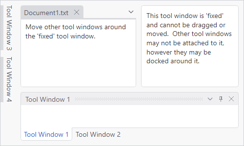

# Fixed Tool Windows

By turning off various options on a specific tool window, you can completely prevent it from being moved and can keep it "fixed" within a tool window layout, while still allowing other tool windows to be docked around it.

*A fixed tool window without a title bar surrounded by the workspace and some other tool windows*

A fixed tool window like the one in the screenshot can be created by setting:

- [ToolWindow](xref:@ActiproUIRoot.Controls.Docking.ToolWindow).[CanAttach](xref:@ActiproUIRoot.Controls.Docking.DockingWindow.CanAttach) = `false`
- [ToolWindow](xref:@ActiproUIRoot.Controls.Docking.ToolWindow).[CanDragTab](xref:@ActiproUIRoot.Controls.Docking.DockingWindow.CanDragTab) = `false`
- [ToolWindow](xref:@ActiproUIRoot.Controls.Docking.ToolWindow).[HasTitleBar](xref:@ActiproUIRoot.Controls.Docking.ToolWindow.HasTitleBar) = `false`

Those settings prevent other tool windows from attaching (creating tabbed groups) to the tool window, being dragged anywhere, and having a title bar.
