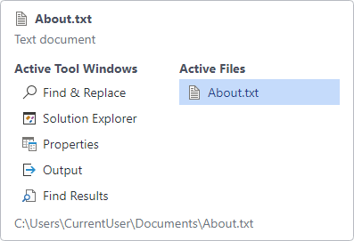

# Switchers

Switchers are used during <kbd>Ctrl</kbd>+<kbd>Tab</kbd>, etc. key presses to easily navigate between open documents and tool windows.



*The standard switcher*

These two built-in switcher options are included with Actipro Docking & MDI:

- Simple
- Standard

## Activation Key Gestures

@if (avalonia) {

If a switcher is available, these key gestures will activate it:

| Key | Description |
|-----|-----|
| <kbd>Ctrl</kbd>+<kbd>Tab</kbd> | Select the next window. |
| <kbd>Ctrl</kbd>+<kbd>Shift</kbd>+<kbd>Tab</kbd> | Select the previous window. |

> [!NOTE]
> Since the default <kbd>Ctrl</kbd>+<kbd>Tab</kbd> and <kbd>Ctrl</kbd>+<kbd>Shift</kbd>+<kbd>Tab</kbd> gestures are typically used by web browsers to change browser tabs, the default key gestures for browsers are replaced with <kbd>Ctrl</kbd>+<kbd>Alt</kbd>+<kbd>PgDn</kbd> (next window) and <kbd>Ctrl</kbd>+<kbd>Alt</kbd>+<kbd>PgUp</kbd> (previous window).

You can customize the key gestures above by changing these properties:

| Member | Description |
|-----|-----|
| [SelectNextWindowKeyGesture](xref:@ActiproUIRoot.Controls.Docking.Primitives.SwitcherBase.SelectNextWindowKeyGesture) Property | Gets or sets the `KeyGesture` that is used to select the next window.  The default value is <kbd>Ctrl</kbd>+<kbd>Tab</kbd> on most platforms and <kbd>Ctrl</kbd>+<kbd>Alt</kbd>+<kbd>PgDn</kbd> on browsers. |
| [SelectPreviousWindowKeyGesture](xref:@ActiproUIRoot.Controls.Docking.Primitives.SwitcherBase.SelectPreviousWindowKeyGesture) Property | Gets or sets the `KeyGesture` that is used to select the previous window.  The default value is <kbd>Ctrl</kbd>+<kbd>Shift</kbd>+<kbd>Tab</kbd> on most platforms and <kbd>Ctrl</kbd>+<kbd>Alt</kbd>+<kbd>PgUp</kbd> on browsers. |

}
@if (wpf) {

If a switcher is available, these key gestures will activate it:

| Key | Description |
|-----|-----|
| <kbd>Ctrl</kbd>+<kbd>Tab</kbd> | Select the next document. |
| <kbd>Alt</kbd>+<kbd>F7</kbd> | Select the next tool window. |
| <kbd>Ctrl</kbd>+<kbd>Shift</kbd>+<kbd>Tab</kbd> | Select the previous document. |
| <kbd>Shift</kbd>+<kbd>Alt</kbd>+<kbd>F7</kbd> | Select the previous tool window. |

You can customize the key gestures above by changing these properties:

| Member | Description |
|-----|-----|
| [SelectNextDocumentKeyGesture](xref:@ActiproUIRoot.Controls.Docking.Primitives.SwitcherBase.SelectNextDocumentKeyGesture) Property | Gets or sets the `KeyGesture` that is used to select the next document.  The default value is <kbd>Ctrl</kbd>+<kbd>Tab</kbd>. |
| [SelectNextToolWindowKeyGesture](xref:@ActiproUIRoot.Controls.Docking.Primitives.SwitcherBase.SelectNextToolWindowKeyGesture) Property | Gets or sets the `KeyGesture` that is used to select the next tool window.  The default value is <kbd>Alt</kbd>+<kbd>F7</kbd>. |
| [SelectPreviousDocumentKeyGesture](xref:@ActiproUIRoot.Controls.Docking.Primitives.SwitcherBase.SelectPreviousDocumentKeyGesture) Property | Gets or sets the `KeyGesture` that is used to select the previous document.  The default value is <kbd>Ctrl</kbd>+<kbd>Shift</kbd>+<kbd>Tab</kbd>. |
| [SelectPreviousToolWindowKeyGesture](xref:@ActiproUIRoot.Controls.Docking.Primitives.SwitcherBase.SelectPreviousToolWindowKeyGesture) Property | Gets or sets the `KeyGesture` that is used to select the previous tool window.  The default value is <kbd>Shift</kbd>+<kbd>Alt</kbd>+<kbd>F7</kbd>. |

}

## Configuration

By default, the [DockSite](xref:@ActiproUIRoot.Controls.Docking.DockSite) is assigned a [StandardSwitcher](xref:@ActiproUIRoot.Controls.Docking.StandardSwitcher) to its [Switcher](xref:@ActiproUIRoot.Controls.Docking.DockSite.Switcher) property.

You can clear the [Switcher](xref:@ActiproUIRoot.Controls.Docking.DockSite.Switcher) property (set it to `"{x:Null}"` in XAML or to a `null` value in code-behind) to not use switchers, or can set that property to another [SwitcherBase](xref:@ActiproUIRoot.Controls.Docking.Primitives.SwitcherBase)-inherited class instance to use another switcher. [StandardSwitcher](xref:@ActiproUIRoot.Controls.Docking.StandardSwitcher) and [SimpleSwitcher](xref:@ActiproUIRoot.Controls.Docking.SimpleSwitcher) are implementations of [SwitcherBase](xref:@ActiproUIRoot.Controls.Docking.Primitives.SwitcherBase).

This sample XAML code shows how to use a simple switcher for a dock site.

@if (avalonia) {
```xaml
<actipro:DockSite>
	<actipro:DockSite.Switcher>
		<actipro:SimpleSwitcher />
	</actipro:DockSite.Switcher>
</actipro:DockSite>
```
}
@if (wpf) {
```xaml
<docking:DockSite>
	<docking:DockSite.Switcher>
		<docking:SimpleSwitcher />
	</docking:DockSite.Switcher>
</docking:DockSite>
```
}

## The Simple Switcher

The simple switcher does not display a user interface.  Instead, pressing the switcher key gestures will toggle through the various documents and tool windows.

## The Standard Switcher

The standard switcher is more advanced and displays a user interface shown in the screenshot above.  It shows multiple columns of open tool windows and documents.  You also can use the arrow keys to navigate through the windows while the switcher is open.

There are many properties that allow you to completely customize the appearance of the switcher.  Everything from the appearance of items to the number of document columns can be set.

<table>
<thead>

<tr>
<th>Member</th>
<th>Description</th>
</tr>

</thead>
<tbody>

<tr>
<td>

[AreDocumentsVisible](xref:@ActiproUIRoot.Controls.Docking.StandardSwitcher.AreDocumentsVisible) Property

</td>
<td>

Gets or sets a value indicating whether the documents are visible in the switcher.  The default value is `true`.

</td>
</tr>

<tr>
<td>

[AreToolWindowsVisible](xref:@ActiproUIRoot.Controls.Docking.StandardSwitcher.AreToolWindowsVisible) Property

</td>
<td>

Gets or sets a value indicating whether the tool windows are visible in the switcher.  The default value is `true`.

</td>
</tr>

<tr>
<td>

[DocumentsColumnTitle](xref:@ActiproUIRoot.Controls.Docking.StandardSwitcher.DocumentsColumnTitle) Property

</td>
<td>Gets or sets the text to use for the documents column title.</td>
</tr>

<tr>
<td>

[FooterTemplate](xref:@ActiproUIRoot.Controls.Docking.StandardSwitcher.FooterTemplate) Property

</td>
<td>

Gets or sets the @if (avalonia) { `IDataTemplate` }@if (wpf) { `DataTemplate` } to use for the footer area of the switcher, whose content is the [SelectedWindow](xref:@ActiproUIRoot.Controls.Docking.Primitives.SwitcherBase.SelectedWindow).

</td>
</tr>

<tr>
<td>

[HeaderTemplate](xref:@ActiproUIRoot.Controls.Docking.StandardSwitcher.HeaderTemplate) Property

</td>
<td>

Gets or sets the @if (avalonia) { `IDataTemplate` }@if (wpf) { `DataTemplate` } to use for the header area of the switcher, whose content is the [SelectedWindow](xref:@ActiproUIRoot.Controls.Docking.Primitives.SwitcherBase.SelectedWindow).

</td>
</tr>

@if (avalonia) {
<tr>
<td>

[ItemContainerTheme](xref:@ActiproUIRoot.Controls.Docking.StandardSwitcher.ItemContainerTheme) Property

</td>
<td>

Gets or sets the `ControlTheme` to use for rendering items.

</td>
</tr>
}

@if (wpf) {
<tr>
<td>

[ItemContainerStyle](xref:@ActiproUIRoot.Controls.Docking.StandardSwitcher.ItemContainerStyle) Property

</td>
<td>

Gets or sets the `Style` to use for rendering items.

</td>
</tr>
}

<tr>
<td>

[ItemTemplate](xref:@ActiproUIRoot.Controls.Docking.StandardSwitcher.ItemTemplate) Property

</td>
<td>

Gets or sets the @if (avalonia) { `IDataTemplate` }@if (wpf) { `DataTemplate` } to use for rendering items.

</td>
</tr>

<tr>
<td>

[MaxDocumentColumnCount](xref:@ActiproUIRoot.Controls.Docking.StandardSwitcher.MaxDocumentColumnCount) Property

</td>
<td>

Gets or sets the maximum number of document columns to display.  The default value is `3`.

</td>
</tr>

<tr>
<td>

[MaxRowCount](xref:@ActiproUIRoot.Controls.Docking.StandardSwitcher.MaxRowCount) Property

</td>
<td>

Gets or sets the maximum number of item rows that can be displayed.  The default value is `15`.

</td>
</tr>

@if (avalonia) {
<tr>
<td>

[ScrollButtonTheme](xref:@ActiproUIRoot.Controls.Docking.StandardSwitcher.ScrollButtonTheme) Property

</td>
<td>

Gets or sets the `ControlTheme` to use for a scroll button.

</td>
</tr>
}

@if (wpf) {
<tr>
<td>

[ScrollButtonStyle](xref:@ActiproUIRoot.Controls.Docking.StandardSwitcher.ScrollButtonStyle) Property

</td>
<td>

Gets or sets the `Style` to use for a scroll button.

</td>
</tr>
}

<tr>
<td>

[ScrollDownButtonContentTemplate](xref:@ActiproUIRoot.Controls.Docking.StandardSwitcher.ScrollDownButtonContentTemplate) Property

</td>
<td>

Gets or sets the @if (avalonia) { `IDataTemplate` }@if (wpf) { `DataTemplate` } to use for the scroll down button content.

</td>
</tr>

<tr>
<td>

[ScrollUpButtonContentTemplate](xref:@ActiproUIRoot.Controls.Docking.StandardSwitcher.ScrollUpButtonContentTemplate) Property

</td>
<td>

Gets or sets the @if (avalonia) { `IDataTemplate` }@if (wpf) { `DataTemplate` } to use for the scroll up button content.

</td>
</tr>

@if (avalonia) {
<tr>
<td>

[Elevation](xref:@ActiproUIRoot.Controls.Docking.StandardSwitcher.Elevation) Property

</td>
<td>

Gets or sets the shadow elevation.  The default value is `8`.  Set this property to `0` to disable the shadow.

</td>
</tr>
}

@if (wpf) {
<tr>
<td>

[ShadowElevation](xref:@ActiproUIRoot.Controls.Docking.StandardSwitcher.ShadowElevation) Property

</td>
<td>

Gets or sets the shadow elevation.  The default value is `8`.  Set this property to `0` to disable the shadow.

</td>
</tr>
}

<tr>
<td>

[ToolWindowsColumnTitle](xref:@ActiproUIRoot.Controls.Docking.StandardSwitcher.ToolWindowsColumnTitle) Property

</td>
<td>Gets or sets the text to use for the tool windows column title.</td>
</tr>

</tbody>
</table>

In scenarios where you don't use tool windows at all, set the [AreToolWindowsVisible](xref:@ActiproUIRoot.Controls.Docking.StandardSwitcher.AreToolWindowsVisible) property to `false`.  Likewise, if you don't use MDI, set the [AreDocumentsVisible](xref:@ActiproUIRoot.Controls.Docking.StandardSwitcher.AreDocumentsVisible) property to `false`.

## Non-Switcher Tab Selection Key Gestures

Several other helpful tab selection key gestures are built into the product.

| Key | Description |
|-----|-----|
| <kbd>Ctrl</kbd>+<kbd>PgUp</kbd> | Activates the previous tab in the same container by selecting it and focusing its content. |
| <kbd>Ctrl</kbd>+<kbd>PgDn</kbd> | Activates the next tab in the same container by selecting it and focusing its content. |
| <kbd>Ctrl</kbd>+<kbd>1</kbd>&nbsp;through&nbsp;<kbd>8</kbd> | Directly activates the numbered tab in a normal state in the current container.  For instance, <kbd>Ctrl</kbd>+<kbd>2</kbd> activates the second tab in a normal state. |
| <kbd>Ctrl</kbd>+<kbd>9</kbd> | Activates the last tab in a normal state in the same container by selecting it and focusing its content. |
| <kbd>Ctrl</kbd>+<kbd>Alt</kbd>+<kbd>1</kbd>&nbsp;through&nbsp;<kbd>8</kbd> | Directly activates the numbered tab in a pinned state in the current container.  For instance, <kbd>Ctrl</kbd>+<kbd>Alt</kbd>+<kbd>2</kbd> activates the second tab in a pinned state. |
| <kbd>Ctrl</kbd>+<kbd>Alt</kbd>+<kbd>9</kbd> | Activates the last tab in a pinned state in the same container by selecting it and focusing its content. |
| <kbd>Ctrl</kbd>+<kbd>Shift</kbd>+<kbd>1</kbd>&nbsp;through&nbsp;<kbd>8</kbd> | Directly activates the numbered tab in a preview state in the current container.  For instance, <kbd>Ctrl</kbd>+<kbd>Shift</kbd>+<kbd>2</kbd> activates the second tab in a preview state. |
| <kbd>Ctrl</kbd>+<kbd>Shift</kbd>+<kbd>9</kbd> | Activates the last tab in a preview state in the same container by selecting it and focusing its content. |

@if (avalonia) {
> [!NOTE]
> Since the default <kbd>Ctrl</kbd>+<kbd>PgUp</kbd> and <kbd>Ctrl</kbd>+<kbd>PgDn</kbd> gestures are typically used by web browsers to change browser tabs, the default key gestures for browsers are replaced with <kbd>Ctrl</kbd>+<kbd>Shift</kbd>+<kbd>PgDn</kbd> (next tab) and <kbd>Ctrl</kbd>+<kbd>Shift</kbd>+<kbd>PgUp</kbd> (previous tab).
}