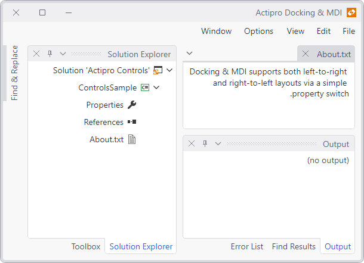

# Flow Direction

Docking & MDI supports both left-to-right and right-to-left layouts via a simple property switch.

By default, Docking & MDI will use the flow direction designated by the system.

## What is Flow Direction?

The flow direction of content typically corresponds to the innate flow direction of the language being represented.  English, German, and Russian provide examples of languages that naturally flow from left-to-right.  Hebrew and Arabic provide examples of languages that naturally flow from right-to-left.

When a right-to-left flow direction is applied to a user interface control, all contained content is essentially "flipped" over to align to the opposite side as displayed below:

*Docking & MDI with a right-to-left flow direction*
