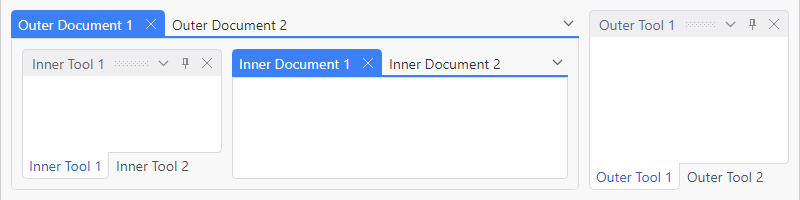

# Nested Dock Sites

Dock sites are completely self-contained and can be nested, where a child [DockSite](xref:@ActiproUIRoot.Controls.Docking.DockSite) is placed within a document window or tool window of an ancestor [DockSite](xref:@ActiproUIRoot.Controls.Docking.DockSite).



*Nested dock sites where there are tool windows in inner-fill mode within a document window of another dock site*

Many other competitive docking products don't support this feature.

## Configuration and Features

The creation of a nested dock site scenario is very easy.  Just create a root [DockSite](xref:@ActiproUIRoot.Controls.Docking.DockSite) then add some document windows.  Within the first document window, place another inner [DockSite](xref:@ActiproUIRoot.Controls.Docking.DockSite) control and add docking windows to it.  Note that you could have chosen to place the child dock site in a tool window instead.

Now, when you drag tool windows around from the dock sites, notice how they remain self-contained within their own ancestor [DockSite](xref:@ActiproUIRoot.Controls.Docking.DockSite).

Also try to float a tool window from within the inner dock site.  Then switch to the other document window.  Notice how the floating tool window automatically closes.  When you switch back to the original document window, the floated window automatically reappears.  This auto-close behavior can be disabled by setting the [DockSite](xref:@ActiproUIRoot.Controls.Docking.DockSite).[CanFloatingDockHostsHideOnDockSiteUnload](xref:@ActiproUIRoot.Controls.Docking.DockSite.CanFloatingDockHostsHideOnDockSiteUnload) property to `false`.

## A XAML Example

This sample XAML code shows how to create a nested scenario.

@if (avalonia) {
```xaml
<!-- Outer DockSite -->
<actipro:DockSite>
	<actipro:SplitContainer>
		<actipro:Workspace>
			<actipro:TabbedMdiHost>
				<actipro:TabbedMdiContainer>

					<actipro:DocumentWindow Title="Document1">
						<!-- Inner DockSite 1 -->
						<actipro:DockSite>
							<actipro:ToolWindowContainer>
								<actipro:ToolWindow Title="Inner DockSite 1-1">
									<TextBox BorderThickness="0" />
								</actipro:ToolWindow>
								<actipro:ToolWindow Title="Inner DockSite 1-2">
									<TextBox BorderThickness="0" />
								</actipro:ToolWindow>
							</actipro:ToolWindowContainer>
						</actipro:DockSite>
					</actipro:DocumentWindow>

					<actipro:DocumentWindow Title="Document2">
						<!-- Inner DockSite 2 -->
						<actipro:DockSite>
							<actipro:ToolWindowContainer>
								<actipro:ToolWindow Title="Inner DockSite 2-1">
									<TextBox BorderThickness="0" />
								</actipro:ToolWindow>
								<actipro:ToolWindow Title="Inner DockSite 2-2">
									<TextBox BorderThickness="0" />
								</actipro:ToolWindow>
							</actipro:ToolWindowContainer>
						</actipro:DockSite>
					</actipro:DocumentWindow>

				</actipro:TabbedMdiContainer>
			</actipro:TabbedMdiHost>
		</actipro:Workspace>

		<actipro:ToolWindowContainer>
			<actipro:ToolWindow Title="Outer DockSite 1">
				<TextBox BorderThickness="0" />
			</actipro:ToolWindow>
			<actipro:ToolWindow Title="Outer DockSite 2">
				<TextBox BorderThickness="0" />
			</actipro:ToolWindow>
		</actipro:ToolWindowContainer>
	</actipro:SplitContainer>
</actipro:DockSite>
```
}
@if (wpf) {
```xaml
<!-- Outer DockSite -->
<docking:DockSite>
	<docking:SplitContainer>
		<docking:Workspace>
			<docking:TabbedMdiHost>
				<docking:TabbedMdiContainer>

					<docking:DocumentWindow Title="Document1">
						<!-- Inner DockSite 1 -->
						<docking:DockSite>
							<docking:ToolWindowContainer>
								<docking:ToolWindow Title="Inner DockSite 1-1">
									<TextBox BorderThickness="0" />
								</docking:ToolWindow>
								<docking:ToolWindow Title="Inner DockSite 1-2">
									<TextBox BorderThickness="0" />
								</docking:ToolWindow>
							</docking:ToolWindowContainer>
						</docking:DockSite>
					</docking:DocumentWindow>

					<docking:DocumentWindow Title="Document2">
						<!-- Inner DockSite 2 -->
						<docking:DockSite>
							<docking:ToolWindowContainer>
								<docking:ToolWindow Title="Inner DockSite 2-1">
									<TextBox BorderThickness="0" />
								</docking:ToolWindow>
								<docking:ToolWindow Title="Inner DockSite 2-2">
									<TextBox BorderThickness="0" />
								</docking:ToolWindow>
							</docking:ToolWindowContainer>
						</docking:DockSite>
					</docking:DocumentWindow>

				</docking:TabbedMdiContainer>
			</docking:TabbedMdiHost>
		</docking:Workspace>

		<docking:ToolWindowContainer>
			<docking:ToolWindow Title="Outer DockSite 1">
				<TextBox BorderThickness="0" />
			</docking:ToolWindow>
			<docking:ToolWindow Title="Outer DockSite 2">
				<TextBox BorderThickness="0" />
			</docking:ToolWindow>
		</docking:ToolWindowContainer>
	</docking:SplitContainer>
</docking:DockSite>
```
}