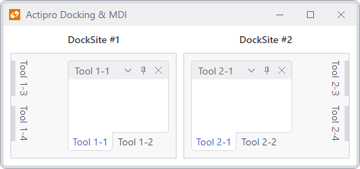

# Side-by-Side Dock Sites

Dock sites are completely self-contained, meaning that you can have two [DockSite](xref:@ActiproUIRoot.Controls.Docking.DockSite) in the same `Window` and tool windows belonging to one can't be moved into other, and vice versa.



*Two separate dock sites on the same Window*

Many other competitive docking products don't support this feature.

## Configuration and Features

When placing two separate [DockSite](xref:@ActiproUIRoot.Controls.Docking.DockSite) controls within a root container, they will automatically be independent of each other.

> [!IMPORTANT]
> Tool windows will not be able to be dragged from one dock site into the other, unless you [link the dock sites](linked-dock-sites.md).

## A XAML Example

This sample XAML code shows how to create a side-by-side scenario.

@if (avalonia) {
```xaml
<Grid RowDefinitions="Auto,*" ColumnDefinitions="*,7,*">

	<Border Grid.Row="0" Grid.Column="0" Padding="3">
		<TextBlock Text="DockSite #1" />
	</Border>

	<!-- DockSite #1 -->
	<actipro:DockSite Grid.Row="1" Grid.Column="0">
		<actipro:DockSite.AutoHideLeftContainers>
			<actipro:ToolWindowContainer>
				<actipro:ToolWindow Title="DockSite 1-3" />
				<actipro:ToolWindow Title="DockSite 1-4" />
			</actipro:ToolWindowContainer>
		</actipro:DockSite.AutoHideLeftContainers>

		<actipro:SplitContainer>
			<actipro:Workspace/>

			<actipro:ToolWindowContainer>
				<actipro:ToolWindow Title="DockSite 1-1" />
				<actipro:ToolWindow Title="DockSite 1-2" />
			</actipro:ToolWindowContainer>
		</actipro:SplitContainer>
	</actipro:DockSite>

	<Border Grid.Row="0" Grid.Column="2" Padding="3">
		<TextBlock Text="DockSite #2" />
	</Border>

	<!-- DockSite #2 -->
	<actipro:DockSite Grid.Row="1" Grid.Column="2">
		<actipro:DockSite.AutoHideRightContainers>
			<actipro:ToolWindowContainer>
				<actipro:ToolWindow Title="DockSite 2-3" />
				<actipro:ToolWindow Title="DockSite 2-4" />
			</actipro:ToolWindowContainer>
		</actipro:DockSite.AutoHideRightContainers>

		<actipro:SplitContainer>
			<actipro:ToolWindowContainer>
				<actipro:ToolWindow Title="DockSite 2-1" />
				<actipro:ToolWindow Title="DockSite 2-2" />
			</actipro:ToolWindowContainer>

			<actipro:Workspace/>
		</actipro:SplitContainer>
	</actipro:DockSite>

</Grid>
```
}
@if (wpf) {
```xaml
<Grid>
	<Grid.RowDefinitions>
		<RowDefinition Height="Auto" />
		<RowDefinition Height="*" />
	</Grid.RowDefinitions>
	<Grid.ColumnDefinitions>
		<ColumnDefinition Width="*" />
		<ColumnDefinition Width="7" />
		<ColumnDefinition Width="*" />
	</Grid.ColumnDefinitions>

	<Border Padding="3">
		<TextBlock Text="DockSite #1" />
	</Border>

	<!-- DockSite #1 -->
	<docking:DockSite Grid.Row="1">
		<docking:DockSite.AutoHideLeftContainers>
			<docking:ToolWindowContainer>
				<docking:ToolWindow Title="DockSite 1-3" />
				<docking:ToolWindow Title="DockSite 1-4" />
			</docking:ToolWindowContainer>
		</docking:DockSite.AutoHideLeftContainers>

		<docking:SplitContainer>
			<docking:Workspace/>

			<docking:ToolWindowContainer>
				<docking:ToolWindow Title="DockSite 1-1" />
				<docking:ToolWindow Title="DockSite 1-2" />
			</docking:ToolWindowContainer>
		</docking:SplitContainer>
	</docking:DockSite>

	<Border Grid.Column="2" Padding="3">
		<TextBlock Text="DockSite #2" />
	</Border>

	<!-- DockSite #2 -->
	<docking:DockSite Grid.Row="1" Grid.Column="2">
		<docking:DockSite.AutoHideRightContainers>
			<docking:ToolWindowContainer>
				<docking:ToolWindow Title="DockSite 2-3" />
				<docking:ToolWindow Title="DockSite 2-4" />
			</docking:ToolWindowContainer>
		</docking:DockSite.AutoHideRightContainers>

		<docking:SplitContainer>
			<docking:ToolWindowContainer>
				<docking:ToolWindow Title="DockSite 2-1" />
				<docking:ToolWindow Title="DockSite 2-2" />
			</docking:ToolWindowContainer>

			<docking:Workspace/>
		</docking:SplitContainer>
	</docking:DockSite>

</Grid>
```
}