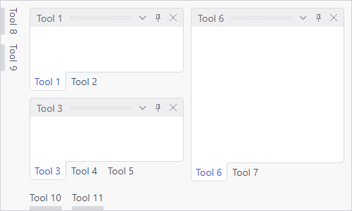

# Tool Window Inner-Fill

Actipro Docking & MDI supports tool window inner-fill mode, in which all tool windows fill the entire content area of the ancestor [DockSite](xref:@ActiproUIRoot.Controls.Docking.DockSite).



*Tool windows in inner-fill mode, where there is no MDI area*

Many other competitive docking products don't support this feature.

## Configuration and Features

Tool window inner-fill mode is achieved by omitting a [Workspace](../workspace-mdi-features/workspace.md) from within the [DockSite](xref:@ActiproUIRoot.Controls.Docking.DockSite).

By leaving out the workspace, the dock site will automatically switch to tool window inner-fill mode.  This is similar to the layout mode that is active for floating tool windows.

When in tool window inner-fill mode, no MDI is available and tool windows fill the entire content area of the dock site.  Thus, all layout sizing is done based on ratios of the initial [ToolWindow](xref:@ActiproUIRoot.Controls.Docking.ToolWindow).[ContainerDockedSize](xref:@ActiproUIRoot.Controls.Docking.DockingWindow.ContainerDockedSize) values.  For instance if two tool windows are docked next to each other, and the first has a [ContainerDockedSize](xref:@ActiproUIRoot.Controls.Docking.DockingWindow.ContainerDockedSize) width of `100`, while the second has a [ContainerDockedSize](xref:@ActiproUIRoot.Controls.Docking.DockingWindow.ContainerDockedSize) width of `200`, the second one will fill the area at twice the width of the first.  If the dock site is `600` wide, the first tool window would be `200` wide, while the second would be `400` wide in that example.

## A XAML Example

This sample XAML code shows how to create a tool window inner-fill scenario.

@if (avalonia) {
```xaml
<actipro:DockSite x:Name="dockSite">
	<actipro:DockSite.AutoHideLeftContainers>
		<actipro:ToolWindowContainer>
			<actipro:ToolWindow Title="Tool Window 8" />
			<actipro:ToolWindow Title="Tool Window 9" />
		</actipro:ToolWindowContainer>
	</actipro:DockSite.AutoHideLeftContainers>
	<actipro:DockSite.AutoHideBottomContainers>
		<actipro:ToolWindowContainer>
			<actipro:ToolWindow Title="Tool Window 10" />
			<actipro:ToolWindow Title="Tool Window 11" />
		</actipro:ToolWindowContainer>
	</actipro:DockSite.AutoHideBottomContainers>

	<actipro:SplitContainer>
		<actipro:SplitContainer Orientation="Vertical">
			<actipro:ToolWindowContainer>
				<actipro:ToolWindow Title="Tool Window 1" />
				<actipro:ToolWindow Title="Tool Window 2" />
			</actipro:ToolWindowContainer>

			<actipro:ToolWindowContainer>
				<actipro:ToolWindow Title="Tool Window 3" />
				<actipro:ToolWindow Title="Tool Window 4" />
				<actipro:ToolWindow Title="Tool Window 5" />
			</actipro:ToolWindowContainer>
		</actipro:SplitContainer>

		<actipro:ToolWindowContainer>
			<actipro:ToolWindow Title="Tool Window 6" />
			<actipro:ToolWindow Title="Tool Window 7" />
		</actipro:ToolWindowContainer>
	</actipro:SplitContainer>
</actipro:DockSite>
```
}
@if (wpf) {
```xaml
<docking:DockSite x:Name="dockSite">
	<docking:DockSite.AutoHideLeftContainers>
		<docking:ToolWindowContainer>
			<docking:ToolWindow Title="Tool Window 8" />
			<docking:ToolWindow Title="Tool Window 9" />
		</docking:ToolWindowContainer>
	</docking:DockSite.AutoHideLeftContainers>
	<docking:DockSite.AutoHideBottomContainers>
		<docking:ToolWindowContainer>
			<docking:ToolWindow Title="Tool Window 10" />
			<docking:ToolWindow Title="Tool Window 11" />
		</docking:ToolWindowContainer>
	</docking:DockSite.AutoHideBottomContainers>

	<docking:SplitContainer>
		<docking:SplitContainer Orientation="Vertical">
			<docking:ToolWindowContainer>
				<docking:ToolWindow Title="Tool Window 1" />
				<docking:ToolWindow Title="Tool Window 2" />
			</docking:ToolWindowContainer>

			<docking:ToolWindowContainer>
				<docking:ToolWindow Title="Tool Window 3" />
				<docking:ToolWindow Title="Tool Window 4" />
				<docking:ToolWindow Title="Tool Window 5" />
			</docking:ToolWindowContainer>
		</docking:SplitContainer>

		<docking:ToolWindowContainer>
			<docking:ToolWindow Title="Tool Window 6" />
			<docking:ToolWindow Title="Tool Window 7" />
		</docking:ToolWindowContainer>
	</docking:SplitContainer>
</docking:DockSite>
```
}