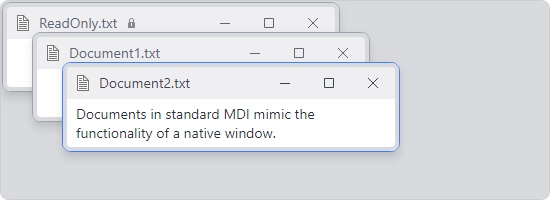

# Standard MDI

A standard (windowed) MDI option is implemented by Actipro Docking & MDI via a @if (avalonia) { [Window Control](../../fundamentals/controls/window-control.md) }@if (wpf) { [WindowControl](xref:@ActiproUIRoot.Controls.Docking.WindowControl) } that mimics the functionality of a native window with resizable borders, minimize/maximize/close buttons, etc.

A context menu is displayed whenever clicking the window icon or right-clicking the title bar.

*Standard MDI without any tool windows active*

Standard MDI is the first style of MDI found in Windows and still remains popular in certain applications.  Each document is represented as its own window and can be moved, resized, minimized, maximized, restored, and closed.

## Implementation and Hierarchy

At design-time, the MDI area can be instantiated via XAML code.  The [Control Hierarchy](../control-hierarchy.md) topic has a diagram showing the controls that are needed to implement this type of MDI from XAML.  But essentially, to have standard MDI features available in your docking layout, you must place a [StandardMdiHost](xref:@ActiproUIRoot.Controls.Docking.StandardMdiHost) control directly as the `Content` of the [Workspace](workspace.md) within the dock site.

At run-time, you can use the common document framework (shared with [tabbed MDI](tabbed-mdi.md)) to manage the documents in the MDI area.  The [Working with Documents](working-with-documents.md) topic describes how to interact with this common document framework to open and close documents along with performing other common tasks.  But before doing so, please ensure that a [StandardMdiHost](xref:@ActiproUIRoot.Controls.Docking.StandardMdiHost) control is the direct `Content` of the [Workspace](workspace.md) within the dock site.

## Allowing Windows to Maximize/Minimize

The **Maximize** and **Minimize** buttons on windows within the standard MDI area can be selectively shown or hidden using the [StandardMdiHost](xref:@ActiproUIRoot.Controls.Docking.StandardMdiHost).[CanWindowsMaximize](xref:@ActiproUIRoot.Controls.Docking.StandardMdiHost.CanWindowsMaximize) and [StandardMdiHost](xref:@ActiproUIRoot.Controls.Docking.StandardMdiHost).[CanWindowsMinimize](xref:@ActiproUIRoot.Controls.Docking.StandardMdiHost.CanWindowsMinimize) properties, respectively.

Individual windows can have its **Maximize** and **Minimize** buttons selectively shown or hidden using the [DockingWindow](xref:@ActiproUIRoot.Controls.Docking.DockingWindow).[CanStandardMdiMaximize](xref:@ActiproUIRoot.Controls.Docking.DockingWindow.CanStandardMdiMaximize) and [DockingWindow](xref:@ActiproUIRoot.Controls.Docking.DockingWindow).[CanStandardMdiMinimize](xref:@ActiproUIRoot.Controls.Docking.DockingWindow.CanStandardMdiMinimize) properties, respectively.

In addition to hiding the **Maximize** button, the `StandardMdiHost.CanWindowsMaximize` and `DockingWindow.CanStandardMdiMaximize` properties will disable the ability to double click the title bar of a window to maximize it. Windows that do not display their **Maximize** or **Minimize** buttons can still be programmatically maximized/minimized.

## Window State

The state, such as normal/minimized/maximized, of the MDI child windows can be retrieved or set using the [DockingWindow](xref:@ActiproUIRoot.Controls.Docking.DockingWindow).[StandardMdiWindowState](xref:@ActiproUIRoot.Controls.Docking.DockingWindow.StandardMdiWindowState) property.

## Restored Window Bounds

The restored window bounds can be retrieved or set using the [DockingWindow](xref:@ActiproUIRoot.Controls.Docking.DockingWindow).[StandardMdiBounds](xref:@ActiproUIRoot.Controls.Docking.DockingWindow.StandardMdiBounds) property.

## Making Windows Maximized

The [StandardMdiHost](xref:@ActiproUIRoot.Controls.Docking.StandardMdiHost).[AreWindowsMaximized](xref:@ActiproUIRoot.Controls.Docking.StandardMdiHost.AreWindowsMaximized) property gets or sets whether the windows within the standard MDI area are currently maximized.

If you wish for your windows to be opened as maximized by default, set it to `true`.

## Hiding Frames when Maximized

The [StandardMdiHost](xref:@ActiproUIRoot.Controls.Docking.StandardMdiHost).[AreMaximizedWindowFramesVisible](xref:@ActiproUIRoot.Controls.Docking.StandardMdiHost.AreMaximizedWindowFramesVisible) can be set to `false` to hide the title bar and frame of the child MDI windows when they are maximized. This gives more room to the MDI window and is typical for a standard MDI layout.

When hiding the frame, the title and minimize/restore/close buttons are typically presented by an associated ribbon, toolbar, or menu of the containing window/control.  The Sample Browser includes a "Standard MDI-Only" sample that shows how this can be accomplished.

When using external buttons to manage the windows, these [StandardMdiHost](xref:@ActiproUIRoot.Controls.Docking.StandardMdiHost) commands are available for use with the buttons: [MinimizePrimaryWindowCommand](xref:@ActiproUIRoot.Controls.Docking.StandardMdiHost.MinimizePrimaryWindowCommand), [RestorePrimaryWindowCommand](xref:@ActiproUIRoot.Controls.Docking.StandardMdiHost.RestorePrimaryWindowCommand), [MaximizePrimaryWindowCommand](xref:@ActiproUIRoot.Controls.Docking.StandardMdiHost.MaximizePrimaryWindowCommand), and [ClosePrimaryWindowCommand](xref:@ActiproUIRoot.Controls.Docking.StandardMdiHost.ClosePrimaryWindowCommand).

## Size-to-Content

If you wish for a docking window to auto-size itself to its content when opened in standard MDI, update its [DockingWindow](xref:@ActiproUIRoot.Controls.Docking.DockingWindow).[SizeToContentModes](xref:@ActiproUIRoot.Controls.Docking.DockingWindow.SizeToContentModes) property to contain the [SizeToContentModes](xref:@ActiproUIRoot.Controls.Docking.SizeToContentModes).[StandardMdi](xref:@ActiproUIRoot.Controls.Docking.SizeToContentModes.StandardMdi) flag.

## Magnetism

Magnetism allows windows within the standard MDI area to be "snapped" together when moving or resizing.  This makes it easier for the end-user to line up the windows into rows or columns.

Magnetism can be configured using [DockSite](xref:@ActiproUIRoot.Controls.Docking.DockSite).[MagnetismSnapDistance](xref:@ActiproUIRoot.Controls.Docking.DockSite.MagnetismSnapDistance) and [DockSite](xref:@ActiproUIRoot.Controls.Docking.DockSite).[MagnetismGapDistance](xref:@ActiproUIRoot.Controls.Docking.DockSite.MagnetismGapDistance).  The snap distance indicates the distance at which magnetism begins to snap windows being dragged.  The gap distance indicates the distance between windows that are snapped together via magnetism.  Magnetism can be disabled by setting the snap distance to `0`.

## Title Bar Contextual Content

Standard MDI window title bars can display any context-related content to the right of the tab title.  This content is set via the [DockingWindow](xref:@ActiproUIRoot.Controls.Docking.DockingWindow).[StandardMdiTitleBarContextContentTemplate](xref:@ActiproUIRoot.Controls.Docking.DockingWindow.StandardMdiTitleBarContextContentTemplate) property.

See the [Contextual Content](../docking-window-features/contextual-content.md) topic for some more information.

## Listing All Documents in the MDI Host

The [StandardMdiHost](xref:@ActiproUIRoot.Controls.Docking.StandardMdiHost).[GetDocuments](xref:@ActiproUIRoot.Controls.Docking.StandardMdiHost.GetDocuments*) method returns a list of all documents that are within the MDI host.

## Cascading Documents

Call the [StandardMdiHost](xref:@ActiproUIRoot.Controls.Docking.StandardMdiHost).[Cascade](xref:@ActiproUIRoot.Controls.Docking.StandardMdiHost.Cascade*) method to automatically cascade the documents as displayed in the screenshot above.

Alternatively, the [DockSite](xref:@ActiproUIRoot.Controls.Docking.DockSite).[CascadeDocuments](xref:@ActiproUIRoot.Controls.Docking.DockSite.CascadeDocuments*) method provides access to the same functionality but for all MDI hosts, including those on primary and floating dock hosts.

By default, the documents will automatically be cascaded on the initial load of the standard MDI host. This behavior can be disabled by setting the [StandardMdiHost](xref:@ActiproUIRoot.Controls.Docking.StandardMdiHost).[IsAutoCascadeEnabled](xref:@ActiproUIRoot.Controls.Docking.StandardMdiHost.IsAutoCascadeEnabled) property to `false`.

## Tiling Documents

The tiling of documents makes more efficient use of space and will position each document so that it is visible within the workspace.  The visible documents fill the entire workspace area.

Call the [StandardMdiHost](xref:@ActiproUIRoot.Controls.Docking.StandardMdiHost).[TileHorizontally](xref:@ActiproUIRoot.Controls.Docking.StandardMdiHost.TileHorizontally*) method to tile documents horizontally.  Likewise, the [StandardMdiHost](xref:@ActiproUIRoot.Controls.Docking.StandardMdiHost).[TileVertically](xref:@ActiproUIRoot.Controls.Docking.StandardMdiHost.TileVertically*) method will tile documents vertically.

Alternatively, two methods on [DockSite](xref:@ActiproUIRoot.Controls.Docking.DockSite), [TileDocumentsHorizontally](xref:@ActiproUIRoot.Controls.Docking.DockSite.TileDocumentsHorizontally*) and [TileDocumentsVertically](xref:@ActiproUIRoot.Controls.Docking.DockSite.TileDocumentsVertically*), provide access to the same functionality but for all MDI hosts, including those on primary and floating dock hosts.

## Arranging Minimized Windows

Call the [StandardMdiHost](xref:@ActiproUIRoot.Controls.Docking.StandardMdiHost).[ArrangeMinimizedWindows](xref:@ActiproUIRoot.Controls.Docking.StandardMdiHost.ArrangeMinimizedWindows*) method to automatically arrange the minimized windows at the bottom of the MDI host.

## Scrolling

By setting the [StandardMdiHost](xref:@ActiproUIRoot.Controls.Docking.StandardMdiHost).[IsScrollingEnabled](xref:@ActiproUIRoot.Controls.Docking.StandardMdiHost.IsScrollingEnabled) property to `true`, scrolling support can be enabled in the standard MDI host.  This allows MDI child windows to be dragged out of view, while still allowing the end-user to easily bring it back into view.

This setting is set to `false` by default.

## Switching to Standard MDI at Run-Time

You can easily switch to standard MDI mode at run-time by setting the [DockSite](xref:@ActiproUIRoot.Controls.Docking.DockSite).[MdiKind](xref:@ActiproUIRoot.Controls.Docking.DockSite.MdiKind) property to [Standard](xref:@ActiproUIRoot.Controls.Docking.MdiKind.Standard), as long as a [Workspace](xref:@ActiproUIRoot.Controls.Docking.Workspace) is defined in the dock site.
