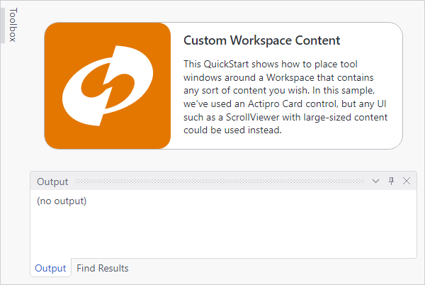

# Workspace

The workspace is the central area of a dock site hierarchy, around which tool windows are docked.  It can contain optional MDI hosts or can host any other sort of content.

*A workspace with custom content (the Actipro logo)*

## Control and Hierarchy

A workspace is implemented by the [Workspace](xref:@ActiproUIRoot.Controls.Docking.Workspace) control.  Only one [Workspace](xref:@ActiproUIRoot.Controls.Docking.Workspace) can be included within a dock host hierarchy at a time.

If no workspace is within a dock host hierarchy, [tool window inner-fill](../layout-features/tool-window-inner-fill.md) mode is activated.

See the [Control Hierarchy](../control-hierarchy.md) topic for help on which controls can be parents to a workspace.

## Workspace with Custom Content

As mentioned above, any sort of content can be placed as the child of a workspace.  Just set the custom content to the [Workspace](xref:@ActiproUIRoot.Controls.Docking.Workspace).`Content` property.

The screenshot above shows a workspace with custom content loaded.

When placing custom content in a workspace, a [TabbedMdiHost](xref:@ActiproUIRoot.Controls.Docking.TabbedMdiHost) or [StandardMdiHost](xref:@ActiproUIRoot.Controls.Docking.StandardMdiHost) can optionally be the content. If neither host is defined as the workspace content, then no MDI features will be available.

## Workspace with Tabbed MDI

If you want to have tabbed MDI features in your docking layout, you must place a [TabbedMdiHost](xref:@ActiproUIRoot.Controls.Docking.TabbedMdiHost) control directly as the `Content` of the [Workspace](xref:@ActiproUIRoot.Controls.Docking.Workspace).

The [DockSite](xref:@ActiproUIRoot.Controls.Docking.DockSite).[MdiKind](xref:@ActiproUIRoot.Controls.Docking.DockSite.MdiKind) property returns [Tabbed](xref:@ActiproUIRoot.Controls.Docking.MdiKind.Tabbed) when a tabbed MDI host is present.  Additionally, [DockSite](xref:@ActiproUIRoot.Controls.Docking.DockSite).[PrimaryDockHost](xref:@ActiproUIRoot.Controls.Docking.DockSite.PrimaryDockHost).[MdiHost](xref:@ActiproUIRoot.Controls.Docking.DockHost.MdiHost) returns the MDI host registered with the primary dock host (the one implicitly defined within the dock site).

Tabbed MDI will not function correctly if the [TabbedMdiHost](xref:@ActiproUIRoot.Controls.Docking.TabbedMdiHost) is placed elsewhere.

## Workspace with Standard MDI

If you want to have standard MDI features in your docking layout, you must place a [StandardMdiHost](xref:@ActiproUIRoot.Controls.Docking.StandardMdiHost) control directly as the `Content` of the [Workspace](xref:@ActiproUIRoot.Controls.Docking.Workspace).

The [DockSite](xref:@ActiproUIRoot.Controls.Docking.DockSite).[MdiKind](xref:@ActiproUIRoot.Controls.Docking.DockSite.MdiKind) property returns [Standard](xref:@ActiproUIRoot.Controls.Docking.MdiKind.Standard) when a standard MDI host is present.  Additionally, [DockSite](xref:@ActiproUIRoot.Controls.Docking.DockSite).[PrimaryDockHost](xref:@ActiproUIRoot.Controls.Docking.DockSite.PrimaryDockHost).[MdiHost](xref:@ActiproUIRoot.Controls.Docking.DockHost.MdiHost) returns the MDI host registered with the primary dock host (the one implicitly defined within the dock site).

Standard MDI will not function correctly if the [StandardMdiHost](xref:@ActiproUIRoot.Controls.Docking.StandardMdiHost) is placed elsewhere.

## MDI Only (No Tool Window Hierarchy)

In some scenarios you may wish to have MDI functionality but no tool windows surrounding the MDI area.

To achieve this, place the [Workspace](xref:@ActiproUIRoot.Controls.Docking.Workspace) directly as a child of the [DockSite](xref:@ActiproUIRoot.Controls.Docking.DockSite).  And use either a [TabbedMdiHost](xref:@ActiproUIRoot.Controls.Docking.TabbedMdiHost) or a [StandardMdiHost](xref:@ActiproUIRoot.Controls.Docking.StandardMdiHost) as a child of the workspace, depending on which type of MDI you wish to have.

## Switching MDI Modes at Run-Time

You can easily switch between MDI modes at run-time by setting the [DockSite](xref:@ActiproUIRoot.Controls.Docking.DockSite).[MdiKind](xref:@ActiproUIRoot.Controls.Docking.DockSite.MdiKind) property.  When switching modes, all open documents should remain open.

## Determining the Location of a Tool Window in Relation to the Workspace

The [ToolWindow](xref:@ActiproUIRoot.Controls.Docking.ToolWindow).[GetCurrentSide](xref:@ActiproUIRoot.Controls.Docking.ToolWindow.GetCurrentSide*) method can be used to determine where an open tool window is in relation to the workspace.

See the [Lifecycle and Docking Management](../docking-window-features/lifecycle-and-docking-management.md) topic for some more information.
