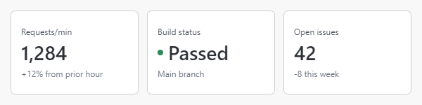

# Animated Text Presenter

The [AnimatedTextPresenter](xref:@ActiproUIRoot.Controls.AnimatedTextPresenter) control presents a single line of text and animates value changes. It is well suited for dashboard values, counters, status text, and other compact values that update in place.



## Getting Started

Set [Text](xref:@ActiproUIRoot.Controls.AnimatedTextPresenter.Text) to the final display text. When the bound value changes, the presenter transitions from the previous text to the new text.

@if (avalonia) {
```xaml
xmlns:actipro="http://schemas.actiprosoftware.com/avaloniaui"
...
<actipro:AnimatedTextPresenter Text="{Binding RequestsPerMinuteText}" />
```
}
@if (wpf) {
```xaml
xmlns:shared="http://schemas.actiprosoftware.com/winfx/xaml/shared"
...
<shared:AnimatedTextPresenter Text="{Binding RequestsPerMinuteText}" />
```
}

Use @if (avalonia) { [Foreground](xref:@ActiproUIRoot.Controls.AnimatedTextPresenter.Foreground) and the standard font properties, such as [FontFamily](xref:@ActiproUIRoot.Controls.AnimatedTextPresenter.FontFamily), [FontSize](xref:@ActiproUIRoot.Controls.AnimatedTextPresenter.FontSize), and [FontWeight](xref:@ActiproUIRoot.Controls.AnimatedTextPresenter.FontWeight), }@if (wpf) { `Foreground` and the standard WPF font properties } to style the text. The control measures and presents one line.

## Transition Modes and Scopes

The [TransitionMode](xref:@ActiproUIRoot.Controls.AnimatedTextPresenter.TransitionMode) property controls how changed content enters and leaves:

| Mode | Behavior |
|---|---|
| [Roll](xref:@ActiproUIRoot.Controls.AnimatedTextPresenterTransitionMode.Roll) | Changed content rolls vertically into place. This is the default. |
| [Fade](xref:@ActiproUIRoot.Controls.AnimatedTextPresenterTransitionMode.Fade) | Changed content fades without vertical motion. Horizontal layout changes remain animated. |

The [TransitionScope](xref:@ActiproUIRoot.Controls.AnimatedTextPresenter.TransitionScope) property controls how text is divided into transition units:

| Scope | Behavior |
|---|---|
| [Character](xref:@ActiproUIRoot.Controls.AnimatedTextPresenterTransitionScope.Character) | Changed user-perceived characters transition independently when they can be isolated safely. This is the default and enables semantic numeric digit transitions. |
| [Word](xref:@ActiproUIRoot.Controls.AnimatedTextPresenterTransitionScope.Word) | Each changed word transitions as one unit while unchanged words remain in place where possible. |
| [Line](xref:@ActiproUIRoot.Controls.AnimatedTextPresenterTransitionScope.Line) | The complete old and new text transition as one unit. This is useful for status labels and text whose shaping should remain intact. |

For example, the following presenter fades a complete status value instead of rolling individual characters:

@if (avalonia) {
```xaml
xmlns:actipro="http://schemas.actiprosoftware.com/avaloniaui"
...
<actipro:AnimatedTextPresenter
	Text="{Binding BuildStatusText}"
	TransitionMode="Fade"
	TransitionScope="Line"
	/>
```
}
@if (wpf) {
```xaml
xmlns:shared="http://schemas.actiprosoftware.com/winfx/xaml/shared"
...
<shared:AnimatedTextPresenter
	Text="{Binding BuildStatusText}"
	TransitionMode="Fade"
	TransitionScope="Line"
	/>
```
}

`Character` and `Word` are requested scopes. The presenter may use a coarser transition when independently moving smaller units could alter text shaping or bidirectional order. Changing transition options does not replay the current value; a transition begins when [Text](xref:@ActiproUIRoot.Controls.AnimatedTextPresenter.Text) changes.

## Transition Direction

The [TransitionDirection](xref:@ActiproUIRoot.Controls.AnimatedTextPresenter.TransitionDirection) property defaults to [Auto](xref:@ActiproUIRoot.Controls.AnimatedTextPresenterTransitionDirection.Auto). Each recognized numeric token follows its own value trend: increasing numbers roll up and decreasing numbers roll down. Other changed content rolls up.

Set the property to [Up](xref:@ActiproUIRoot.Controls.AnimatedTextPresenterTransitionDirection.Up) or [Down](xref:@ActiproUIRoot.Controls.AnimatedTextPresenterTransitionDirection.Down) to override every rolling unit, including recognized numbers:

@if (avalonia) {
```xaml
xmlns:actipro="http://schemas.actiprosoftware.com/avaloniaui"
...
<actipro:AnimatedTextPresenter
	Text="{Binding TemperatureText}"
	TransitionDirection="Down"
	/>
```
}
@if (wpf) {
```xaml
xmlns:shared="http://schemas.actiprosoftware.com/winfx/xaml/shared"
...
<shared:AnimatedTextPresenter
	Text="{Binding TemperatureText}"
	TransitionDirection="Down"
	/>
```
}

Direction has no effect when [TransitionMode](xref:@ActiproUIRoot.Controls.AnimatedTextPresenter.TransitionMode) is [Fade](xref:@ActiproUIRoot.Controls.AnimatedTextPresenterTransitionMode.Fade).

## Duration, Easing, and Animation Policy

@if (avalonia) {
The nullable [TransitionDuration](xref:@ActiproUIRoot.Controls.AnimatedTextPresenter.TransitionDuration) property uses [AnimationSettings.EmphasizedMoveDuration](xref:@ActiproUIRoot.Animation.AnimationSettings.EmphasizedMoveDuration) by default. Set an explicit duration when a particular presenter needs different timing. A zero duration applies changes immediately and completes an active transition; negative durations are coerced to zero.
}
@if (wpf) {
The nullable [TransitionDuration](xref:@ActiproUIRoot.Controls.AnimatedTextPresenter.TransitionDuration) property uses 500 milliseconds by default. Set an explicit duration when a particular presenter needs different timing. A zero duration applies changes immediately and completes an active transition; negative durations are coerced to zero.
}

The nullable [TransitionEasing](xref:@ActiproUIRoot.Controls.AnimatedTextPresenter.TransitionEasing) property uses the control's default easing. An explicit easing changes vertical `Roll` motion. Horizontal layout, desired-size, and opacity animation retain control-managed monotonic easing, so a bouncy roll easing does not make the surrounding layout bounce.

@if (avalonia) {
```xaml
xmlns:actipro="http://schemas.actiprosoftware.com/avaloniaui"
...
<actipro:AnimatedTextPresenter
	Text="{Binding StatusText}"
	TransitionDuration="0:0:0.5"
	TransitionEasing="{actipro:AnimationSetting StandardMoveEasing}"
	IsAnimationEnabled="{Binding AreAnimationsEnabled}"
	/>
```
}
@if (wpf) {
```xaml
xmlns:animation="clr-namespace:System.Windows.Media.Animation;assembly=PresentationCore"
xmlns:shared="http://schemas.actiprosoftware.com/winfx/xaml/shared"
...
<shared:AnimatedTextPresenter
	Text="{Binding StatusText}"
	TransitionDuration="0:0:0.5"
	IsAnimationEnabled="{Binding AreAnimationsEnabled}">
	<shared:AnimatedTextPresenter.TransitionEasing>
		<animation:CubicEase EasingMode="EaseOut" />
	</shared:AnimatedTextPresenter.TransitionEasing>
</shared:AnimatedTextPresenter>
```
}

@if (avalonia) {
Animations are enabled by default when animation support is available. Set the inherited [IsAnimationEnabled](xref:@ActiproUIRoot.Controls.Rendering.CanvasControl.IsAnimationEnabled) property to `false` to opt out locally. The shared [animation support policy](../../themes/getting-started.md) also honors supported system settings and application-level preferences. If animation is unavailable or disabled, [Text](xref:@ActiproUIRoot.Controls.AnimatedTextPresenter.Text) updates immediately.
}
@if (wpf) {
Animations are enabled by default when animation support is available. Set the inherited [IsAnimationEnabled](xref:@ActiproUIRoot.Controls.Rendering.CanvasControl.IsAnimationEnabled) property to `false` to opt out locally. WPF also honors supported system animation settings and [ThemeManager.IsAnimationSupported](xref:@ActiproUIRoot.Themes.ThemeManager.IsAnimationSupported). If animation is unavailable or disabled, [Text](xref:@ActiproUIRoot.Controls.AnimatedTextPresenter.Text) updates immediately.
}

## Numeric Transitions and Culture


At `Character` scope, the presenter recognizes compatible numeric tokens within the supplied text. Matched integer and fractional digits retain their semantic places, and all changed digits in a token use the token's overall increasing or decreasing direction. A changed digit rolls through intermediate odometer faces while still completing within the configured transition duration.

Common examples include:

| Transition | Behavior |
|---|---|
| `Value: 28` to `Value: 35` | The literal prefix remains stable, and both changed digits follow the increasing value. |
| `1,245` to `989` | Digits are matched from the units position, the thousands place and separator leave, and all matched digits follow the decreasing value. |
| `1` to `35.2` | The units place changes from `1` to `5`; the tens place, decimal separator, and fractional place enter. |
| `Step 2 of 120` to `Step 10 of 99` | The two numeric tokens are paired and animated independently through the stable surrounding text. |

Inserted and removed digits, signs, grouping and decimal separators, currency symbols, percent symbols, and related spacing preserve the exact endpoint text while fading and moving horizontally. Ordinary character replacements move directly from the old character to the new character; they do not cycle through alphabetic characters.

Numeric recognition and text layout use [Culture](xref:@ActiproUIRoot.Controls.AnimatedTextPresenter.Culture). A `null` value, which is the default, resolves to `CultureInfo.CurrentCulture` whenever a layout is created. Set an explicit culture when [Text](xref:@ActiproUIRoot.Controls.AnimatedTextPresenter.Text) was formatted with a different culture:

@if (avalonia) {
```xaml
xmlns:actipro="http://schemas.actiprosoftware.com/avaloniaui"
xmlns:globalization="clr-namespace:System.Globalization;assembly=System.Runtime"
xmlns:x="http://schemas.microsoft.com/winfx/2006/xaml"
...
<actipro:AnimatedTextPresenter
	Text="{Binding FormattedAmountText}"
	Culture="{x:Static globalization:CultureInfo.InvariantCulture}"
	/>
```
}
@if (wpf) {
```xaml
xmlns:shared="http://schemas.actiprosoftware.com/winfx/xaml/shared"
...
<shared:AnimatedTextPresenter
	Text="{Binding FormattedAmountText}"
	Culture="en-US"
	/>
```
}

The presenter never formats or normalizes [Text](xref:@ActiproUIRoot.Controls.AnimatedTextPresenter.Text). The caller remains responsible for producing the final localized string. When numeric syntax, token pairing, digit families, shaping, or bidirectional placement cannot be handled safely, the presenter preserves that string and uses a general `Character`, `Word`, `Line`, or immediate fallback. `Word` and `Line` scopes do not expand numbers into per-digit odometer units.

Set the `FlowDirection` property for right-to-left content. Static and animated text use the same complete formatted endpoints so signs, affixes, and mixed-direction glyphs remain in their expected visual order.

## Foreground Transitions

Replacing `Foreground` automatically includes the old and new brushes in the active presentation transition. A foreground-only change keeps the text stationary and does not change the presenter's desired size. When [Text](xref:@ActiproUIRoot.Controls.AnimatedTextPresenter.Text) and `Foreground` change in the same UI update, the original text and brush transition directly to the latest values regardless of property notification order.
}

@if (avalonia) {
```xaml
xmlns:actipro="http://schemas.actiprosoftware.com/avaloniaui"
...
<actipro:AnimatedTextPresenter
	Text="{Binding BuildStatusText}"
	Foreground="{Binding BuildStatusForeground}"
	TransitionScope="Line"
	/>
```
}
@if (wpf) {
```xaml
xmlns:shared="http://schemas.actiprosoftware.com/winfx/xaml/shared"
...
<shared:AnimatedTextPresenter
	Text="{Binding BuildStatusText}"
	Foreground="{Binding BuildStatusForeground}"
	TransitionScope="Line"
	/>
```
}

Foreground changes use the same effective [TransitionDuration](xref:@ActiproUIRoot.Controls.AnimatedTextPresenter.TransitionDuration) and animation policy as text changes. The foreground blend progresses through control-managed monotonic easing, independently of an explicit [TransitionEasing](xref:@ActiproUIRoot.Controls.AnimatedTextPresenter.TransitionEasing) used for vertical roll motion.

@if (avalonia) {
Supported mutable Avalonia brushes are captured as stable endpoint snapshots when a transition starts. Replace [Foreground](xref:@ActiproUIRoot.Controls.AnimatedTextPresenter.Foreground) to request a transition instead of mutating the same brush instance in place, which does not reliably produce a property change notification. Immutable brushes are retained directly. An unsupported custom brush may be retained by reference and should remain unchanged for the duration of the transition.
}
@if (wpf) {
WPF snapshots mutable and animated endpoint brushes where possible without changing caller-owned resources or bindings. Replace `Foreground` to request a transition. Mutating the same WPF `Freezable` brush instance in place does not expose its prior subproperty value, so the presenter commits to the current brush instead of inventing a historical endpoint.
}

## Temporary Transition Foregrounds

Set [TransitionForeground](xref:@ActiproUIRoot.Controls.AnimatedTextPresenter.TransitionForeground) to temporarily emphasize changed text without changing its resting `Foreground`. For recognized numeric tokens, [NumericIncreaseTransitionForeground](xref:@ActiproUIRoot.Controls.AnimatedTextPresenter.NumericIncreaseTransitionForeground) and [NumericDecreaseTransitionForeground](xref:@ActiproUIRoot.Controls.AnimatedTextPresenter.NumericDecreaseTransitionForeground) can provide caller-owned trend colors:
}

@if (avalonia) {
```xaml
xmlns:actipro="http://schemas.actiprosoftware.com/avaloniaui"
...
<actipro:AnimatedTextPresenter
	Text="{Binding QuoteText}"
	TransitionDuration="0:0:1"
	TransitionForeground="{actipro:ThemeResource ControlForegroundBrushOutlineAccent}"
	NumericIncreaseTransitionForeground="{actipro:ThemeResource ControlForegroundBrushOutlineSuccess}"
	NumericDecreaseTransitionForeground="{actipro:ThemeResource ControlForegroundBrushOutlineDanger}"
	/>
```
}
@if (wpf) {
```xaml
xmlns:shared="http://schemas.actiprosoftware.com/winfx/xaml/shared"
xmlns:themes="http://schemas.actiprosoftware.com/winfx/xaml/themes"
xmlns:x="http://schemas.microsoft.com/winfx/2006/xaml"
...
<shared:AnimatedTextPresenter
	Text="{Binding QuoteText}"
	TransitionDuration="0:0:1"
	TransitionForeground="{DynamicResource {x:Static themes:AssetResourceKeys.PrimaryAccentForegroundLowestNormalBrushKey}}"
	NumericIncreaseTransitionForeground="{DynamicResource {x:Static themes:AssetResourceKeys.ColorPaletteGreenBackgroundHighBrushKey}}"
	NumericDecreaseTransitionForeground="{DynamicResource {x:Static themes:AssetResourceKeys.ColorPaletteRedBackgroundHighBrushKey}}"
	/>
```
}

All three properties default to `null`, preserving normal endpoint-only presentation unless a caller opts in. During an animated text change, numeric increase and decrease brushes take precedence for their respective normalized token trends. A missing numeric brush falls back to [TransitionForeground](xref:@ActiproUIRoot.Controls.AnimatedTextPresenter.TransitionForeground), as does a textually changed numeric token whose normalized value is equal. Explicit [TransitionDirection](xref:@ActiproUIRoot.Controls.AnimatedTextPresenter.TransitionDirection) still controls physical roll motion and does not change the numeric trend used to select a brush.

Semantic numeric pairing requires compatible numeric tokens within unchanged surrounding literal text. If an independent label or status changes around the number, the presenter may conservatively use a general text transition and [TransitionForeground](xref:@ActiproUIRoot.Controls.AnimatedTextPresenter.TransitionForeground). Use separate presenters for independently changing content when trend-specific numeric emphasis must remain deterministic.

The resolved numeric brush applies coherently to digits, signs, sign-related parentheses, decimal separators, and grouping separators. Stable currency symbols, percent symbols, and numeric-pattern whitespace retain their normal endpoint foreground. If one of those decorations changes, it can participate through the generic [TransitionForeground](xref:@ActiproUIRoot.Controls.AnimatedTextPresenter.TransitionForeground) path. At `Character` and `Word` scope, generic emphasis is limited to changed participating units; at `Line` scope, it applies to the complete line.

Temporary emphasis fades back to the exact endpoint foreground before the transition completes. It is ignored for foreground-only transitions and uses the same effective [TransitionDuration](xref:@ActiproUIRoot.Controls.AnimatedTextPresenter.TransitionDuration) and animation policy as the text transition. Durations of at least one second generally make the temporary color easiest to perceive, although shorter durations remain supported. When animation is disabled, unavailable, or immediate, the final text and foreground still update normally without temporary emphasis.

Choose theme-aware brushes with adequate contrast in every supported theme, and do not use temporary color as the only indication of an important value change. Automation exposes the current [Text](xref:@ActiproUIRoot.Controls.AnimatedTextPresenter.Text), not the transient color. Temporary emphasis prepares additional brush-specific text resources and adds a blended drawing pass while active; it is appropriate for occasional updates, but hosts should avoid large numbers of simultaneous emphasized transitions without measuring the real layout.

@if (avalonia) {

## Style Classes

The control theme provides five size classes that set [FontSize](xref:@ActiproUIRoot.Controls.AnimatedTextPresenter.FontSize):

- `size-xs`
- `size-sm`
- `size-md`
- `size-lg`
- `size-xl`

Four semantic classes set [Foreground](xref:@ActiproUIRoot.Controls.AnimatedTextPresenter.Foreground) to the corresponding theme brush:

- `accent`
- `danger`
- `success`
- `warning`

Size and semantic classes can be combined. Foreground changes caused by adding or removing a semantic class participate in the same foreground transition behavior described above.

```xaml
xmlns:actipro="http://schemas.actiprosoftware.com/avaloniaui"
...
<actipro:AnimatedTextPresenter
	Classes="size-lg success"
	Text="Build passed"
	TransitionScope="Line"
	/>
```
}

## Layout and Interrupted Updates

When the old and new text have different measured sizes, the presenter interpolates its desired size throughout the transition. Surrounding layout can therefore adjust smoothly instead of snapping when the animation completes. Centered or right-aligned presenters make changing widths particularly easy to see. Transitions whose endpoint sizes match remain render-only.

Transition drawing is clipped to the presenter's bounds by default. The desired-size and horizontal layout animation work together so entering, leaving, and repositioning content remains contained while the control approaches its final size.

[Text](xref:@ActiproUIRoot.Controls.AnimatedTextPresenter.Text) and `Foreground` always contain the current target presentation, even while older content remains visible during a transition. Multiple changes in the same update preserve the original source and latest target. If either property changes after a transition is underway, the active transition is replaced and the previous target presentation becomes the source for the newest values.
}

No transition starts while the control is unloaded, effectively hidden, disabled by animation policy, or using a zero effective duration. When effective hiding is observed during a transition, transient animation content is discarded and the current [Text](xref:@ActiproUIRoot.Controls.AnimatedTextPresenter.Text) and `Foreground` presentation is used when it becomes visible again.
}

@if (avalonia) {
Ancestor visibility changes may be observed on the next animation frame. For immediate notification, or when a custom host changes visibility without normal layout, call [RefreshEffectiveVisibility](xref:@ActiproUIRoot.Controls.Rendering.CanvasControl.RefreshEffectiveVisibility*) on the UI thread.
}

## Accessibility and Reduced Motion

The presenter is a read-only text control for automation. Its current [Text](xref:@ActiproUIRoot.Controls.AnimatedTextPresenter.Text) is exposed as the accessible value and fallback name; transient fragments, intermediate digits, and animation progress are not exposed.

The control does not declare a live region or announce every value change. A host that needs live announcements should own that policy and choose a cadence appropriate for the importance and frequency of the updates.

Temporary transition foregrounds are visual emphasis only. Preserve the meaning in the current text or surrounding content so the final static presentation remains understandable without color or motion.

@if (avalonia) {
Use the shared [animation support policy](../../themes/getting-started.md) for application-wide reduced motion, and [IsAnimationEnabled](xref:@ActiproUIRoot.Controls.Rendering.CanvasControl.IsAnimationEnabled) for a local opt-out. When animation is disabled by either policy, text changes are applied immediately and automation continues to expose the current value.
}
@if (wpf) {
Use [ThemeManager.IsAnimationSupported](xref:@ActiproUIRoot.Themes.ThemeManager.IsAnimationSupported) for application-wide reduced motion, and [IsAnimationEnabled](xref:@ActiproUIRoot.Controls.Rendering.CanvasControl.IsAnimationEnabled) for a local opt-out. When animation is disabled by either policy, text changes are applied immediately and automation continues to expose the current value.
}

## Important Notes

- `AnimatedTextPresenter` is a focused single-line presenter, not a full `TextBlock`.
- It does not support wrapping, trimming, inline elements, rich text, selection, or multiline content.
- Callers provide the final formatted [Text](xref:@ActiproUIRoot.Controls.AnimatedTextPresenter.Text); the control does not format numeric values, currencies, or percentages.
- `Character`-level animation may conservatively fall back to `Word` or `Line` scope when needed to preserve shaping or bidirectional text correctness.
