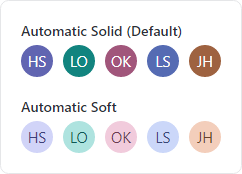

# Avatar

Avatar controls are used to represent people or objects.  They can render a full-size image, a centered glyph, a person's initials, or text.


*Avatars with generic profile glyph, text initials, and image*

@if (avalonia) {
> [!IMPORTANT]
> See the [Getting Started](../getting-started.md) topic for details on configuring themes for this control.
}

## Description

The [Description](xref:@ActiproUIRoot.Controls.Avatar.Description) property should be set to a short description of the data represented by the avatar (e.g., a person's full name).  In many scenarios, this may be the only property that needs to be populated because the [Description](xref:@ActiproUIRoot.Controls.Avatar.Description) will define the tooltip and will also auto-generate shorter text to be displayed as the [Avatar](xref:@ActiproUIRoot.Controls.Avatar) `Content`.

The following example shows how to define an [Avatar](xref:@ActiproUIRoot.Controls.Avatar) with a [Description](xref:@ActiproUIRoot.Controls.Avatar.Description):

@if (avalonia) {
```xaml
xmlns:actipro="http://schemas.actiprosoftware.com/avaloniaui"
...

<actipro:Avatar Description="Luke Skywalker" />
```
}
@if (wpf) {
```xaml
xmlns:shared="http://schemas.actiprosoftware.com/winfx/xaml/shared"
...

<shared:Avatar Description="Luke Skywalker" />
```
}

## Content

The `Content` of [Avatar](xref:@ActiproUIRoot.Controls.Avatar) can be set to any value supported by `ContentPresenter`, but the most common content will be text, an image, or a glyph.

### Automatic Initials from Description

When not explicitly set, the `Content` is automatically derived from the [Description](xref:@ActiproUIRoot.Controls.Avatar.Description) property by attempting to parse one or two initials from [Description](xref:@ActiproUIRoot.Controls.Avatar.Description).  For example, a description of `"Luke Skywalker"` will generate the initials `"LS"`.

The following rules are applied when attempting to parse the initials:
- Any characters after `@` are ignored unless it is the first character (i.e., ignores the domain portion of an e-mail address).
- Only letters or digits are eligible for initials (as defined by `Char.IsLetterOrDigit`).
- The first initial is based on the first eligible character.
- The second initial is based on the first eligible character (if any) of the last "word part" where the characters space, period (`.`), and comma (`,`) are used to split the description into multiple parts.
- If no eligible characters are found, the first character will be used.
- The final value is converted to upper-case.

The following table provides some examples (both good and bad) of initials automatically coerced from descriptions:

| Description | Initials |
| ----- | ----- |
| `"First Last"` | `"FL"` |
| `"First Middle Last"` | `"FL"` |
| `"Last, First"` | `"LF"` |
| `"Prefix First Last"` | `"PL"` |
| `"First Last Suffix"` | `"FS"` |
| `"Some Hyphenated-Name"` | `"SH"`
| `"first.last@domain.com"` | `"FL"` |
| `"name@domain.com"` | `"N"`|
| `"@username"` | `"U"` |

> [!NOTE]
> As illustrated in the table above, the automatically generated initials may not align with expectations since the [Description](xref:@ActiproUIRoot.Controls.Avatar.Description) can be any freeform text. It may be necessary for a developer to explicitly set the `Content` to the desired text if the auto-generated initials are not sufficient.

### Text Content


*Avatars at different sizes with auto-scaled font*

Since an [Avatar](xref:@ActiproUIRoot.Controls.Avatar) can be displayed at any size, the text must also adapt to the available size.  By default, any `string`-based `Content` is presented using the [AvatarTextPresenter](xref:@ActiproUIRoot.Controls.Primitives.AvatarTextPresenter) which will automatically
scale its font based on the space available but will never scale lower than a minimally legible font size.

> [!TIP]
> Since text-based content is automatically coerced from the [Description](xref:@ActiproUIRoot.Controls.Avatar.Description), setting the `Content` to a `string` is typically only necessary if the auto-generated text will not be used.

The following example demonstrates how to define an [Avatar](xref:@ActiproUIRoot.Controls.Avatar) with a [Description](xref:@ActiproUIRoot.Controls.Avatar.Description) and explicit text-based content instead of the auto-generated initials:

@if (avalonia) {
```xaml
xmlns:actipro="http://schemas.actiprosoftware.com/avaloniaui"
...

<actipro:Avatar Description="Luke Skywalker" Content="Luke" />
```
}
@if (wpf) {
```xaml
xmlns:shared="http://schemas.actiprosoftware.com/winfx/xaml/shared"
...

<shared:Avatar Description="Luke Skywalker" Content="Luke" />
```
}

### Image Content

Since an [Avatar](xref:@ActiproUIRoot.Controls.Avatar) offers little space for text, an image is often more appropriate for `Content`.

The following examples demonstrate multiple ways to use an image as the `Content`:

@if (avalonia) {
```xaml
xmlns:actipro="http://schemas.actiprosoftware.com/avaloniaui"
...

<!-- Use an Image control -->
<actipro:Avatar Description="Luke Skywalker">
	<Image Source="/Images/ProfilePhotos/Luke.png" />
</actipro:Avatar>

<!-- Bind to an IImage -->
<actipro:Avatar Description="Luke Skywalker" Content="{StaticResource ProfileImageLuke}" />
```
}
@if (wpf) {
```xaml
xmlns:shared="http://schemas.actiprosoftware.com/winfx/xaml/shared"
...

<!-- Use an Image control -->
<shared:Avatar Description="Luke Skywalker">
	<Image Source="/Images/ProfilePhotos/Luke.png" />
</shared:Avatar>

<!-- Bind to an ImageSource -->
<shared:Avatar Description="Luke Skywalker" Content="{StaticResource ProfileImageLuke}" />
```
}

> [!WARNING]
> When `Content` is set to an @if (avalonia) { `IImage` }@if (wpf) { `ImageSource` }, it is presented, by default, using the @if (avalonia) { [DynamicImage](../../shared/controls/dynamic-image.md) }@if (wpf) { [DynamicImage](dynamicimage.md) } control. If an application is configured to support dark themes and also uses photo-realistic images for avatars, those images typically should *not* be adapted to dark themes.
>
> See the [Image Provider](../../themes/image-provider.md) topic for more details on chromatic adaptation and how to prevent an image from being adapted.
> Alternatively, bypass the @if (avalonia) { [DynamicImage](../../shared/controls/dynamic-image.md) }@if (wpf) { [DynamicImage](dynamicimage.md) } control and set the `Content` to an instance of a properly configured `Image` control instead.

### Glyph Content

Like an image, the `Content` can also be set to a glyph.  By placing a glyph inside a `Viewbox`, the glyph will be allowed to scale up or down with the size of the [Avatar](xref:@ActiproUIRoot.Controls.Avatar).

The following example demonstrates how to use one of the reusable Actipro @if (avalonia) { [glyph assets](../../themes/theme-assets.md) }@if (wpf) { [glyph assets](../../themes/reusable-styles-and-templates.md) } as the `Content` of an [Avatar](xref:@ActiproUIRoot.Controls.Avatar):

@if (avalonia) {
```xaml
xmlns:actipro="http://schemas.actiprosoftware.com/avaloniaui"
...

<actipro:Avatar Description="Tech Support">
	<Viewbox>
		<ContentPresenter Margin="6" ContentTemplate="{actipro:GlyphTemplate Help16}" />
	</Viewbox>
</actipro:Avatar>
```
}
@if (wpf) {
```xaml
xmlns:shared="http://schemas.actiprosoftware.com/winfx/xaml/shared"
xmlns:themes="http://schemas.actiprosoftware.com/winfx/xaml/themes"
...

<shared:Avatar Description="Tech Support">
	<Viewbox>
		<ContentPresenter Margin="6" ContentTemplate="{DynamicResource {x:Static themes:SharedResourceKeys.WindowTitleBarButtonHelpGlyphTemplateKey}}" />
	</Viewbox>
</shared:Avatar>
```
}

> [!TIP]
> Glyphs with built-in margins in the image content can reduce the `ContentPresenter.Margin` attribute value or remove it altogether when appropriate.

### Empty Content

When the current `Content` is resolved as either `null` or an empty `string`, a generic user glyph will be displayed by default.

The [EmptyContentTemplate](xref:@ActiproUIRoot.Controls.Avatar.EmptyContentTemplate) property can be set to a custom @if (avalonia) { `IDataTemplate` }@if (wpf) { `DataTemplate` } to change the default presentation.  The following example demonstrates showing a custom image instead of the default glyph:

@if (avalonia) {
```xaml
xmlns:actipro="http://schemas.actiprosoftware.com/avaloniaui"
...

<actipro:Avatar ... >
	<DataTemplate>
		<Image Source="/Images/Icons/EmptyAvatar.png" />
	</DataTemplate>
</actipro:Avatar>
```
}
@if (wpf) {
```xaml
xmlns:shared="http://schemas.actiprosoftware.com/winfx/xaml/shared"
...

<shared:Avatar ... >
	<DataTemplate>
		<Image Source="/Images/Icons/EmptyAvatar.png" />
	</DataTemplate>
</shared:Avatar>
```
}

> [!NOTE]
> The value of the `Content` property is used to determine if an [Avatar](xref:@ActiproUIRoot.Controls.Avatar) is considered empty.  If a custom `ContentTemplate` is used to define content instead of setting the `Content` property, the [Avatar](xref:@ActiproUIRoot.Controls.Avatar) may inadvertently display the [EmptyContentTemplate](xref:@ActiproUIRoot.Controls.Avatar.EmptyContentTemplate) instead. In this scenario, set the `Content` to any arbitrary value that is neither `null` nor an empty `string` to prevent the empty content from being displayed.

## Automatic Color Brushes



*Avatars with two kinds of auto-generated foreground and background brushes*

An [Avatar](xref:@ActiproUIRoot.Controls.Avatar) is most distinctive when using image-based content, so text-based content can be harder to differentiate.

When the [TextAppearanceKind](xref:@ActiproUIRoot.Controls.Avatar.TextAppearanceKind) kind property is set to [AutomaticSolid](xref:@ActiproUIRoot.Controls.AvatarTextAppearanceKind.AutomaticSolid) (the default) or [AutomaticSoft](xref:@ActiproUIRoot.Controls.AvatarTextAppearanceKind.AutomaticSoft), the `Foreground` and `Background` brushes are automatically randomized using an algorithm based on the value of the text-based content.  While some colors combinations may still be repeated, this greatly improves the visual appeal of a text-based [Avatar](xref:@ActiproUIRoot.Controls.Avatar) by varying the colors used across control instances.

To use explicit `Foreground` and `Background` brushes, set [TextAppearanceKind](xref:@ActiproUIRoot.Controls.Avatar.TextAppearanceKind) to [Manual](xref:@ActiproUIRoot.Controls.AvatarTextAppearanceKind.Manual) and the brushes from the corresponding properties will be used instead of the automatically derived brushes.

## Using Avatar as a Button

[Avatar](xref:@ActiproUIRoot.Controls.Avatar) derives from `Button`, so it supports the same `Command` model and `Click` event as `Button`.  Unlike a `Button`, though, not all instances of [Avatar](xref:@ActiproUIRoot.Controls.Avatar) will be interactive and the control has been configured to appear non-interactive by default.

When adding a `Command` or `Click` handler to an [Avatar](xref:@ActiproUIRoot.Controls.Avatar), the following changes should also be made:
- Set the `Focusable` property to `true` to allow the control to be reached using keyboard-based navigation.
- Since there is no default hover effect for an [Avatar](xref:@ActiproUIRoot.Controls.Avatar), it is also recommended to set the `Cursor` property to `Hand` so users will understand the control can be clicked.

@if (avalonia) {

## Pseudo-classes

The following pseudo-classes are available and can be used when styling the control:

| Class | Description |
| ----- | ----- |
| `:empty` | Added when `Content` (or its coerced value) is `null` or an empty `string`. |

}

@if (avalonia) {

## Theme Resources

The following theme resources are available for customizing the appearance of the control:

| Theme Resource | Description |
| ----- | ----- |
| [AvatarBackgroundBrushSolid](xref:@ActiproUIRoot.Themes.ThemeResourceKind.AvatarBackgroundBrushSolid) | The default `Background` and `BorderBrush` when automatic colors are not used. |
| [AvatarForegroundBrushSolid](xref:@ActiproUIRoot.Themes.ThemeResourceKind.AvatarForegroundBrushSolid) | The default `Foreground` when automatic colors are not used. |

See the [Theme Assets](../../themes/theme-assets.md) topic for more details on working with theme resources.

}