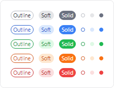

# Badge

The [Badge](xref:@ActiproUIRoot.Controls.Badge) and [NumericBadge](xref:@ActiproUIRoot.Controls.NumericBadge) controls can be used to provide contextual information for other elements or used on their own.


*Badge and NumericBadge controls displayed as adorners to an element*

## Content

The `Content` of [Badge](xref:@ActiproUIRoot.Controls.Badge) can be set to any value supported by `ContentPresenter`.

The following example demonstrates creating a [Badge](xref:@ActiproUIRoot.Controls.Badge) with the text `"NEW!"` as the content:

@if (avalonia) {
```xaml
xmlns:actipro="http://schemas.actiprosoftware.com/avaloniaui"
...
<actipro:Badge>NEW!</actipro:Badge>
```
}
@if (wpf) {
```xaml
xmlns:shared="http://schemas.actiprosoftware.com/winfx/xaml/shared"
...
<shared:Badge>NEW!</shared:Badge>
```
}

Alternatively, the `ContentTemplate` can also be used to define the content.  The following example demonstrates defining one of the @if (avalonia) { [reusable glyph theme assets](../../themes/theme-assets.md) }@if (wpf) { [reusable glyph theme assets](../../themes/reusable-assets.md) } as the `ContentTemplate`.

@if (avalonia) {
```xaml
xmlns:actipro="http://schemas.actiprosoftware.com/avaloniaui"
...
<actipro:Badge Padding="0" ContentTemplate="{actipro:GlyphTemplate SmallCheck16}" />
```
}
@if (wpf) {
```xaml
xmlns:shared="http://schemas.actiprosoftware.com/winfx/xaml/shared"
xmlns:themes="http://schemas.actiprosoftware.com/winfx/xaml/themes"
...
<shared:Badge Padding="0" ContentTemplate="{DynamicResource {x:Static themes:SharedResourceKeys.SmallMinusGlyphTemplateKey}}" />
```
}

## Showing and Hiding

The visibility of a [Badge](xref:@ActiproUIRoot.Controls.Badge) is primarily managed by the [IsActive](xref:@ActiproUIRoot.Controls.Badge.IsActive) property instead of the @if (avalonia) { `IsVisible` }@if (wpf) { `Visibility` } property. This is necessary to properly support animations when hiding the badge.  The [IsActive](xref:@ActiproUIRoot.Controls.Badge.IsActive) property defaults to `true`.

@if (avalonia) {
> [!WARNING]
> Explicitly setting `IsVisible` to `false` will prevent the badge from being displayed even when [IsActive](xref:@ActiproUIRoot.Controls.Badge.IsActive) is `true`.
}
@if (wpf) {
> [!WARNING]
> Explicitly setting `Visibility` to `Collapsed` or `Hidden` will prevent the badge from being displayed even when [IsActive](xref:@ActiproUIRoot.Controls.Badge.IsActive) is `true`.
}

### Animation

When shown ([IsActive](xref:@ActiproUIRoot.Controls.Badge.IsActive) = `true`), the badge will animate into position using a "pop" animation.  A similar but opposite animation is used when hiding ([IsActive](xref:@ActiproUIRoot.Controls.Badge.IsActive) = `false`).

@if (avalonia) {
Animations are automatically enabled. To turn off animations, set the [IsAnimationEnabled](xref:@ActiproUIRoot.Controls.Badge.IsAnimationEnabled) property to `false`.
}
@if (wpf) {
Animations are automatically disabled, as appropriate, based on system settings. To manually turn off animations, set the [IsAnimationEnabled](xref:@ActiproUIRoot.Controls.Badge.IsAnimationEnabled) property to `false`.
}

## NumericBadge

The [NumericBadge](xref:@ActiproUIRoot.Controls.NumericBadge) control derives from the [Badge](xref:@ActiproUIRoot.Controls.Badge) and is purpose-built to automatically generate content based on the current value of the [Count](xref:@ActiproUIRoot.Controls.NumericBadge.Count) property.

The following example demonstrates how to define a [NumericBadge](xref:@ActiproUIRoot.Controls.NumericBadge):

@if (avalonia) {
```xaml
xmlns:actipro="http://schemas.actiprosoftware.com/avaloniaui"
...
<actipro:NumericBadge Count="5" />
```
}
@if (wpf) {
```xaml
xmlns:shared="http://schemas.actiprosoftware.com/winfx/xaml/shared"
...
<shared:NumericBadge Count="5" />
```
}

> [!IMPORTANT]
> The [NumericBadge](xref:@ActiproUIRoot.Controls.NumericBadge) automatically manages the `Content` and `IsActive` properties, so any values explicitly assigned to either of these properties will be ignored.

### Automatically Show and Hide

By default, the [NumericBadge](xref:@ActiproUIRoot.Controls.NumericBadge) will be shown when the current [Count](xref:@ActiproUIRoot.Controls.NumericBadge.Count) property is greater than `0`.  Optionally, set the [IsActiveWhenZero](xref:@ActiproUIRoot.Controls.NumericBadge.IsActiveWhenZero) property to `true` and badge will also be shown when the count is `0`.  The badge will always be hidden when the count is negative.

### Overflow

When the current value of the [Count](xref:@ActiproUIRoot.Controls.NumericBadge.Count) property exceeds the value of the [OverflowCount](xref:@ActiproUIRoot.Controls.NumericBadge.OverflowCount) property (which defaults to `99`), the content will be displayed in an overflow format like `"99+"`.

Use the [OverflowStringFormat](xref:@ActiproUIRoot.Controls.NumericBadge.OverflowStringFormat) property to customize how overflowed counts are formatted. The default value is `"{0}+"`, where `{0}` is the placeholder for the current value of [OverflowCount](xref:@ActiproUIRoot.Controls.NumericBadge.OverflowCount).

Overflow behavior can be disabled by setting [OverflowCount](xref:@ActiproUIRoot.Controls.NumericBadge.OverflowCount) to `0`.

> [!WARNING]
> When specifying a custom [OverflowStringFormat](xref:@ActiproUIRoot.Controls.NumericBadge.OverflowStringFormat) value in XAML, prefix the actual value with `{}` to ensure the XAML parser doesn't interpret the open curly braces of the format string as a meaningful XAML delimiter.

The following example demonstrates how to define a [NumericBadge](xref:@ActiproUIRoot.Controls.NumericBadge) that overlows at `9` and uses a custom string format of `"{0}*"`:

@if (avalonia) {
```xaml
xmlns:actipro="http://schemas.actiprosoftware.com/avaloniaui"
...
<actipro:NumericBadge Count="5" OverflowCount="9" OverflowStringFormat="{}{0}*" />
```
}
@if (wpf) {
```xaml
xmlns:shared="http://schemas.actiprosoftware.com/winfx/xaml/shared"
...
<shared:NumericBadge Count="5" OverflowCount="9" OverflowStringFormat="{}{0}*" />
```
}

## Using as an adornment

A common scenario for a badge is to be used as an adornment to another element. Examples include showing availability status on a user's avatar or a count of unread messages.

Adornments are managed using attached properties of the [BadgeService](xref:@ActiproUIRoot.Controls.BadgeService) class.

### Defining

To define a badge as an adornment to an element, assign a [Badge](xref:@ActiproUIRoot.Controls.Badge) or [NumericBadge](xref:@ActiproUIRoot.Controls.NumericBadge) to the [BadgeService](xref:@ActiproUIRoot.Controls.BadgeService).[Badge](xref:@ActiproUIRoot.Controls.BadgeService.BadgeProperty) attached property.

The following example demonstrates adding a [NumericBadge](xref:@ActiproUIRoot.Controls.NumericBadge) adornment to a button to indicate a count of unread notifications:

@if (avalonia) {
```xaml
xmlns:actipro="http://schemas.actiprosoftware.com/avaloniaui"
...

<Button Content="Notifications">

	<!-- Set any Badge or NumericBadge as an adornment -->
	<actipro:BadgeService.Badge>
		<actipro:NumericBadge Count="5" />
	</actipro:BadgeService.Badge>

</Button>
```
}
@if (wpf) {
```xaml
xmlns:shared="http://schemas.actiprosoftware.com/winfx/xaml/shared"
...

<Button Content="Notifications">

	<!-- Set any Badge or NumericBadge as an adornment -->
	<shared:BadgeService.Badge>
		<shared:NumericBadge Count="5" />
	</shared:BadgeService.Badge>

</Button>
```
}

### Alignment

By default, a badge adornment is displayed with the center of the adornment over the center of the top-right edge of the adorned element.  The following attached properties on [BadgeService](xref:@ActiproUIRoot.Controls.BadgeService) can be used to configure the alignment:

| Attached Property | Description |
| ----- | ----- |
| [HorizontalAlignment](xref:@ActiproUIRoot.Controls.BadgeService.HorizontalAlignmentProperty) | Set to one of the [AdornmentHorizontalAlignment](xref:@ActiproUIRoot.Controls.AdornmentHorizontalAlignment) values to alter the horizontal alignment.  (Default = [CenterOnTargetRightEdge](xref:@ActiproUIRoot.Controls.AdornmentHorizontalAlignment.CenterOnTargetRightEdge) ) |
| [HorizontalOffset](xref:@ActiproUIRoot.Controls.BadgeService.HorizontalOffsetProperty) | An explicit offset to be applied after alignment. Positive values shift to the right while negative values shift to the left. |
| [VerticalAlignment](xref:@ActiproUIRoot.Controls.BadgeService.VerticalAlignmentProperty) | Set to one of the [AdornmentVerticalAlignment](xref:@ActiproUIRoot.Controls.AdornmentVerticalAlignment) values to alter the vertical alignment.  (Default = [CenterOnTargetTopEdge](xref:@ActiproUIRoot.Controls.AdornmentVerticalAlignment.CenterOnTargetTopEdge) ) |
| [VerticalOffset](xref:@ActiproUIRoot.Controls.BadgeService.VerticalOffsetProperty) | An explicit offset to be applied after alignment. Positive values shift down while negative values shift up. |

> [!IMPORTANT]
> When used as an adornment, a badge does not affect layout.  When setting the location of the adornment, make sure there is enough room to fully display the badge when it is active.

The following example demonstrates aligning the adornment inside the bottom right corner with an additional horizontal and vertical offset to allow space between the adornment and the adorned element's edge:

@if (avalonia) {
```xaml
xmlns:actipro="http://schemas.actiprosoftware.com/avaloniaui"
...

<Button ...
	actipro:BadgeService.HorizontalAlignment="InsideOfTargetRightEdge"
	actipro:BadgeService.VerticalAlignment="InsideOfTargetBottomEdge"
	actipro:BadgeService.HorizontalOffset="-4"
	actipro:BadgeService.VerticalOffset="-4"
	>

	<actipro:BadgeService.Badge>
		<actipro:Badge Content="Custom Alignment" />
	</actipro:BadgeService.Badge>

</Button>
```
}
@if (wpf) {
```xaml
xmlns:shared="http://schemas.actiprosoftware.com/winfx/xaml/shared"
...

<Button ...
	shared:BadgeService.HorizontalAlignment="InsideOfTargetRightEdge"
	shared:BadgeService.VerticalAlignment="InsideOfTargetBottomEdge"
	shared:BadgeService.HorizontalOffset="-4"
	shared:BadgeService.VerticalOffset="-4"
	>

	<shared:BadgeService.Badge>
		<shared:Badge Content="Custom Alignment" />
	</shared:BadgeService.Badge>

</Button>
```
}

@if (avalonia) {

### Notes on Avalonia Adorner Issues

> [!WARNING]
> The Avalonia adorner system may not properly clip adornments when the adornment is outside the bounds of the adorned element.

The Avalonia adorner system (last tested on v11.0.7) may not properly clip adornments based on the clip regions of ancestors of the adorned element.  This is an issue we are working with the Avalonia team to solve.  A symptom of this issue can sometimes be seen when a badge adornment is used on an adorned element, that adorned element is scrolled out of view within a `ScrollViewer`, and the badge adornment remains visible.

We believe our badge implementation has worked around this issue in most scenarios.  If this scenario is still encountered, one workaround is to position the adornment within the bounds of the adorned element so clipping can be enabled.  Another option is to not use [BadgeService](xref:@ActiproUIRoot.Controls.BadgeService), thereby avoiding use of the Avalonia adorner system.  Place the adorned element and the badge element in a `Panel` instead and apply the `HorizontalAlignment`, `VerticalAlignment`, and `RenderTransform` properties on the badge to position it.

```xaml
<Panel>
	<actipro:Avatar Width="64" CornerRadius="10" Description="User Name" />
	<actipro:Badge Classes="accent" Kind="Dot" DotLength="20"
		HorizontalAlignment="Right" VerticalAlignment="Bottom" RenderTransform="translate(5px, 5px)" />
</Panel>
```

}

## Badge Kind

A badge can either display its content or, alternatively, always display as a "dot" without content.

The [Dot](xref:@ActiproUIRoot.Controls.BadgeKind.Dot) kind is useful for smaller elements that do not have enough room to adequately display badge content.  It can also be useful if the mere existence of the badge is all that is needed, and content is not necessary.

The following values can be assigned to the [Kind](xref:@ActiproUIRoot.Controls.Badge.Kind) property:

| Value | Description |
| ----- | ----- |
| [Default](xref:@ActiproUIRoot.Controls.BadgeKind.Default) | If the @if (avalonia) { `Content` and `ContentTemplate` }@if (wpf) { `Content`, `ContentTemplate`, and `ContentTemplateSelector` } properties are `null`, the [Dot](xref:@ActiproUIRoot.Controls.BadgeKind.Dot) kind will be used; otherwise, the [Content](xref:@ActiproUIRoot.Controls.BadgeKind.Content) kind will be used.
| [Content](xref:@ActiproUIRoot.Controls.BadgeKind.Content) | The badge will attempt to display content and may not render ideally if content is undefined. |
| [Dot](xref:@ActiproUIRoot.Controls.BadgeKind.Dot) | The badge will always display as a dot even if content is defined. |

In the following example, both badges will appear as a "dot":

@if (avalonia) {
```xaml
xmlns:actipro="http://schemas.actiprosoftware.com/avaloniaui"
...

<!-- No content, so 'Default' kind will effectively display as a 'Dot' -->
<actipro:Badge />

<!-- Explicit 'Dot' kind even though content is available -->
<actipro:Badge Kind="Dot" Content="Ignored" />
```
}
@if (wpf) {
```xaml
xmlns:shared="http://schemas.actiprosoftware.com/winfx/xaml/shared"
...

<!-- No content, so 'Default' kind will effectively display as a 'Dot' -->
<shared:Badge />

<!-- Explicit 'Dot' kind even though content is available -->
<shared:Badge Kind="Dot" Content="Ignored" />
```
}

## Padding

By default, the `Padding` is uniformly set to `0` unless the badge is displaying `String`-based content.

@if (avalonia) {
For `String`-based content, the default control template will set the padding based on the [BadgeStringContentPadding](xref:@ActiproUIRoot.Themes.ThemeResourceKind.BadgeStringContentPadding) theme resource. This theme resource is dynamically updated based on the current [User Interface Density](../../themes/user-interface-density.md).  See the [Theme Generator](../../themes/theme-generator.md) topic for more details on customizing theme resources.
}
@if (wpf) {
For `String`-based content, a default padding will be assigned that improves the default appearance of textual content.
}

@if (avalonia) {
## Themes and Semantic Color Variants



*Badge controls in the outline, soft, and solid themes showing neutral and semantic color variants*

The badge controls support the `accent`, `success`, `warning`, and `danger` style class names for semantic variants.

The following control themes are also supported:
- [BadgeBase](xref:@ActiproUIRoot.Themes.ControlThemeKind.BadgeBase) - Base control theme used by several others.
- [BadgeOutline](xref:@ActiproUIRoot.Themes.ControlThemeKind.BadgeOutline) (`theme-outline`) - Has an outline appearance.
- [BadgeSoft](xref:@ActiproUIRoot.Themes.ControlThemeKind.BadgeSoft) (`theme-soft`) - Has a soft fill appearance.
- [BadgeSolid](xref:@ActiproUIRoot.Themes.ControlThemeKind.BadgeSolid) (`theme-solid`) - Has a solid appearance.


The following example demonstrates how to define a badge using the outline theme and danger variant:

```xaml
xmlns:actipro="http://schemas.actiprosoftware.com/avaloniaui"
...
<actipro:Badge Classes="theme-outline danger" />
```

}

## Accessibility

The [Badge](xref:@ActiproUIRoot.Controls.Badge) and [NumericBadge](xref:@ActiproUIRoot.Controls.NumericBadge) controls are non-interactive decorations and, as such, intentionally do not appear in the default user interface automation (UIA) views used by most screen readers or automation tools.

For any information displayed in a badge, developers should consider adding equivalent information to the associated element using one or more of the attached properties on the `AutomationProperties` class; e.g., `AutomationProperties.ItemStatus`.

@if (avalonia) {

## Pseudo-classes

The following pseudo-classes are available and can be used when styling the control:

| Class | Description |
| ----- | ----- |
| `:content-string` | Added when the badge `Content` is a `String`. |
| `:dot` | Added when the badge is effectively displayed as a "dot". |
| `:hide` | Added when the badge becomes inactive and can be used to trigger a hide animation. |
| `:show` | Added when the badge becomes active and can be used to trigger a show animation. |

}

@if (avalonia) {

## Theme Resources

The following theme resources are available for customizing the appearance of the control:

| Theme Resource | Description |
| ----- | ----- |
| [BadgeBorderThickness](xref:@ActiproUIRoot.Themes.ThemeResourceKind.BadgeBorderThickness) | The default `BorderThickness`. |
| [BadgeCornerRadius](xref:@ActiproUIRoot.Themes.ThemeResourceKind.BadgeCornerRadius) | The default `CornerRadius`. |
| [BadgeDotLength](xref:@ActiproUIRoot.Themes.ThemeResourceKind.BadgeDotLength) | The default [DotLength](xref:@ActiproUIRoot.Controls.Badge.DotLength) for when the badge is displayed as a "dot". |
| [BadgeStringContentPadding](xref:@ActiproUIRoot.Themes.ThemeResourceKind.BadgeStringContentPadding) | The default `Padding` applied to `String`-based content. |

See the [Theme Assets](../../themes/theme-assets.md) topic for more details on working with theme resources.

}