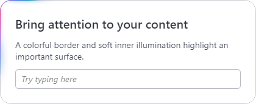

# Border Beam

[BorderBeam](xref:@ActiproUIRoot.Controls.BorderBeam) decorates content with a colorful animated border and soft inner illumination. Use it to draw attention to an input, card, or panel while preserving normal child interaction.



*Border Beam illuminating a content surface*

## Getting Started

Use `BorderBeam` in place of a `Border` when you want to add illumination around its content. The effect is active by default, with sling motion and an Ocean palette tailored to the current light or dark theme.

```xaml
xmlns:actipro="http://schemas.actiprosoftware.com/avaloniaui"
...
<actipro:BorderBeam
	Padding="24" CornerRadius="18"
	Background="{actipro:ThemeResource Container1BackgroundBrush}"
	BorderBrush="{actipro:ThemeResource Container3BorderBrush}" BorderThickness="1">
	<StackPanel Spacing="12">
		<TextBlock Text="Bring attention to your content" FontWeight="SemiBold" />
		<TextBox PlaceholderText="Try typing here" />
	</StackPanel>
</actipro:BorderBeam>
```

## Normal Border Composition

`BorderBeam` is a non-templated, single-child control with familiar `Border` properties: [Child](xref:@ActiproUIRoot.Controls.BorderBeam.Child), [Background](xref:@ActiproUIRoot.Controls.BorderBeam.Background), [BorderBrush](xref:@ActiproUIRoot.Controls.BorderBeam.BorderBrush), [BorderThickness](xref:@ActiproUIRoot.Controls.BorderBeam.BorderThickness), [Padding](xref:@ActiproUIRoot.Controls.BorderBeam.Padding), [CornerRadius](xref:@ActiproUIRoot.Controls.BorderBeam.CornerRadius), [BackgroundSizing](xref:@ActiproUIRoot.Controls.BorderBeam.BackgroundSizing), and [BoxShadow](xref:@ActiproUIRoot.Controls.BorderBeam.BoxShadow). It is not derived from `Border`, so styles or code that specifically target the `Border` type must be adjusted.

The normal background and border remain visible underneath the effect, including when [IsActive](xref:@ActiproUIRoot.Controls.BorderBeam.IsActive) is `false`. Set `Background` or `BorderBrush` to `null` or `Transparent` to omit that surface. A visible fallback border also requires a nonzero `BorderThickness`.

The animated [BeamThickness](xref:@ActiproUIRoot.Controls.BorderBeam.BeamThickness) is independent of `BorderThickness` and does not reserve extra layout space. Use `Padding` to keep content comfortably clear of the illumination. The effect does not intercept pointer input or keyboard focus intended for the child.

The animated illumination is contained within the control's bounds and rounded perimeter. It does not create outward bloom. `BoxShadow` remains an independently configured normal surface effect.

## Motion Modes

Set [Mode](xref:@ActiproUIRoot.Controls.BorderBeam.Mode) to a [BorderBeamMode](xref:@ActiproUIRoot.Controls.BorderBeamMode) value:

| Mode | Behavior | Timing |
|-----|-----|-----|
| `Sling` (default) | A traveling beam accelerates, stretches, and eases back into slower motion. | [SlingCircuitDuration](xref:@ActiproUIRoot.Controls.BorderBeam.SlingCircuitDuration), default `0:0:2`, controls one complete circuit. |
| `Uniform` | A traveling beam moves at constant speed along the perimeter. | [BeamSpeed](xref:@ActiproUIRoot.Controls.BorderBeam.BeamSpeed), default `275`, specifies DIPs per second. |
| `Pulse` | Multiple regions of the border and matching inner clouds illuminate and fade independently. | Neither traveling-mode timing property applies. |

Sling controls with the same circuit duration complete a circuit in the same amount of time, even when their perimeters differ. Uniform controls with the same speed travel the same DIP distance per second, so a larger perimeter takes longer to complete. Traveling motion is clockwise and does not reverse with `FlowDirection`.

Set `BeamSpeed` to `0` to pause uniform motion at its retained position. `SlingCircuitDuration` must be greater than zero.

## Beam and Inner Illumination

The following properties control the appearance independently of the normal background and border:

| Property | Default | Description |
|-----|-----|-----|
| [BeamLength](xref:@ActiproUIRoot.Controls.BorderBeam.BeamLength) | `180` | Base traveling-beam length in DIPs along the perimeter. Automatically constrained to fit smaller perimeters; sling motion varies the effective length. Ignored in pulse mode. |
| [BeamThickness](xref:@ActiproUIRoot.Controls.BorderBeam.BeamThickness) | `1` | Animated perimeter thickness in DIPs. |
| [InnerGlowRadius](xref:@ActiproUIRoot.Controls.BorderBeam.InnerGlowRadius) | `15` | Maximum inward illumination reach in DIPs from the animated beam's inner edge, constrained by the available interior. |
| [InnerGlowIntensity](xref:@ActiproUIRoot.Controls.BorderBeam.InnerGlowIntensity) | `0.35` | Relative cloud intensity, coerced to the range `0` through `1`. This is not an exact opacity applied to every cloud. |

Beam length, speed, thickness, and inner glow radius must be finite and nonnegative. Inner glow intensity must be finite.

Setting either `InnerGlowRadius` or `InnerGlowIntensity` to `0` skips all inner glow rendering. Setting `BeamThickness` to `0` hides only the animated perimeter; inner illumination can remain visible. Setting `BeamLength` to `0` suppresses both the traveling beam and its associated clouds, but does not affect pulse mode.

## Colors and Theme Defaults

[GradientStops](xref:@ActiproUIRoot.Controls.BorderBeam.GradientStops) supplies the ordered color stops used by both the border effect and inner clouds. Leaving this property unset, or assigning a `null` or empty collection, uses the current theme's default palette.

The built-in default uses Ocean colors tailored to each light and dark theme. It is supplied by the strongly typed [ThemeResourceKind.BorderBeamGradientStops](xref:@ActiproUIRoot.Themes.ThemeResourceKind.BorderBeamGradientStops) resource, not a string-based resource key. There is no need to assign that resource in ordinary control markup.

To explicitly reference the theme resource, use `GradientStops="{actipro:ThemeResource BorderBeamGradientStops}"`. See [Theme Assets](../../themes/theme-assets.md) for working with strongly typed resource keys and overriding theme resources.

An explicit nonempty collection uses the supplied colors literally; the control does not automatically adapt them to light or dark themes. Applications can supply their own theme-specific resources when necessary. This sunset-inspired example is an alternative palette, not a built-in preset:

```xaml
xmlns:actipro="http://schemas.actiprosoftware.com/avaloniaui"
...
<actipro:BorderBeam Mode="Pulse" Padding="24" CornerRadius="18">
	<actipro:BorderBeam.GradientStops>
		<GradientStops>
			<GradientStop Offset="0" Color="#FB7185" />
			<GradientStop Offset="0.34" Color="#FB923C" />
			<GradientStop Offset="0.66" Color="#FAE85B" />
			<GradientStop Offset="0.84" Color="#F472B6" />
			<GradientStop Offset="1" Color="#FB7185" />
		</GradientStops>
	</actipro:BorderBeam.GradientStops>
	<TextBlock Text="A custom sunset palette" />
</actipro:BorderBeam>
```

## Activation and Animation Preferences

Bind [IsActive](xref:@ActiproUIRoot.Controls.BorderBeam.IsActive) to the state that should attract attention, such as whether an operation is running. It defaults to `true`. Activation and deactivation fade both the beam and inner illumination over [ActivationDuration](xref:@ActiproUIRoot.Controls.BorderBeam.ActivationDuration), which defaults to `250` milliseconds for a full transition. Reversing a transition continues from the current intensity without a jump. A zero duration makes the transition immediate; negative values are coerced to zero.

Turning the effect off does not reset the traveling phase to its origin. The next activation continues from the retained phase after fade-out.

[IsAnimationEnabled](xref:@ActiproUIRoot.Controls.BorderBeam.IsAnimationEnabled) defaults to `true`. Setting it to `false`, or disabling animation through the shared [animation support policy](../../themes/getting-started.md), displays a representative static effect while active and makes activation changes immediate. This is different from setting `IsActive` to `false`, which hides the effect.

When the platform requests high contrast, the animated border and inner illumination are suppressed immediately. The normal background, border, and child remain available. Returning from high contrast restores the requested active state using the normal activation policy. Platform preferences are tracked through [PlatformThemeSettings](xref:@ActiproUIRoot.Themes.PlatformThemeSettings).

## Usage and Performance

Use illumination selectively for a few important surfaces rather than animating every item in a dense list. Pulse mode illuminates multiple regions and can cost more than a single traveling beam. Setting the effect inactive lets rendering settle after the fade-out, while disabling inner illumination removes its rendering work.

Animation work is suspended when the control is detached, effectively hidden, or has unusable bounds. A control covered by another window or visual is not necessarily considered hidden.

Treat the effect as decoration, not the sole indication of progress or status. Keep meaningful text, accessible names, and any required progress semantics on the content itself, so users can understand the state with animation disabled or high contrast enabled.
