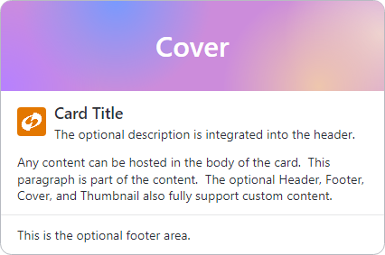
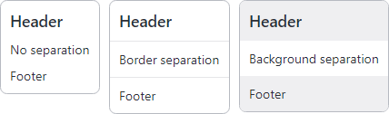

# Card

The [Card](xref:@ActiproUIRoot.Controls.Card) control is typically used to present visually grouped information for a single subject.



*Card control with optional cover, footer, thumbnail, and default header*

@if (avalonia) {
> [!IMPORTANT]
> See the [Getting Started](../getting-started.md) topic for details on configuring themes for this control.
}

## Content Areas

The [Card](xref:@ActiproUIRoot.Controls.Card) control is defined by multiple content areas:
- `Content` (Body) - The default content area of the card.
- [Cover](xref:@ActiproUIRoot.Controls.Card.Cover) - Typically used for a high-quality image which can be docked to any side of the card.
- [Header](xref:@ActiproUIRoot.Controls.Card.Header) - Displayed above the content, and typically contains a title and/or description.
- [Thumbnail](xref:@ActiproUIRoot.Controls.Card.Thumbnail) - Typically a small image or icon displayed on the left side of the header.
- [Footer](xref:@ActiproUIRoot.Controls.Card.Footer) - Displayed at the bottom of the card.

Each content area can optionally be set to any value supported by `ContentPresenter` and the layout will adjust to only show the areas where content is defined.

> [!TIP]
> In some scenarios, content may not be automatically detected. For instance, if a `DataTemplate` is used to define content without setting the corresponding content property, the card will not know that content is available.  Use the [IsCoverVisible](xref:@ActiproUIRoot.Controls.Card.IsCoverVisible), [IsHeaderVisible](xref:@ActiproUIRoot.Controls.Card.IsHeaderVisible), [IsThumbnailVisible](xref:@ActiproUIRoot.Controls.Card.IsThumbnailVisible), and [IsFooterVisible](xref:@ActiproUIRoot.Controls.Card.IsFooterVisible) properties to manually control the visibility of each content area.

### Content (Body)

[Card](xref:@ActiproUIRoot.Controls.Card) is a `ContentControl`, and the default content of the control will be displayed in the body area of the card.  The content can be set to any value supported by `ContentPresenter`.

The following example demonstrates defining the content of a [Card](xref:@ActiproUIRoot.Controls.Card):

@if (avalonia) {
```xaml
xmlns:actipro="http://schemas.actiprosoftware.com/avaloniaui"
...
<actipro:Card>
	<TextBlock Text="This is the content of the card." />
</actipro:Card>
```
}
@if (wpf) {
```xaml
xmlns:shared="http://schemas.actiprosoftware.com/winfx/xaml/shared"
...
<shared:Card>
	<TextBlock Text="This is the content of the card." />
</shared:Card>
```
}

### Cover

The [Cover](xref:@ActiproUIRoot.Controls.Card.Cover) can be docked to any side of the card using the [CoverDock](xref:@ActiproUIRoot.Controls.Card.CoverDock) property.  While a high-quality image is typically used for the [Cover](xref:@ActiproUIRoot.Controls.Card.Cover), it can be set to any value supported by `ContentPresenter`.

The following example demonstrates creating a [Card](xref:@ActiproUIRoot.Controls.Card) with a cover image docked to the left:

@if (avalonia) {
```xaml
xmlns:actipro="http://schemas.actiprosoftware.com/avaloniaui"
...
<actipro:Card CoverDock="Left">

	<actipro:Card.Cover>
		<Image Source="/Images/Cover.png" MaxWidth="150" Stretch="Uniform" />
	</actipro:Card.Cover>

	<!-- Insert Card Content Here -->

</actipro:Card>
```
}
@if (wpf) {
```xaml
xmlns:shared="http://schemas.actiprosoftware.com/winfx/xaml/shared"
...
<shared:Card CoverDock="Left">

	<shared:Card.Cover>
		<Image Source="/Images/Cover.png" MaxWidth="150" Stretch="Uniform" />
	</shared:Card.Cover>

	<!-- Insert Card Content Here -->

</shared:Card>
```
}

### Header

The [Title](xref:@ActiproUIRoot.Controls.Card.Title) and [Description](xref:@ActiproUIRoot.Controls.Card.Description) properties can be used to define a header with a default template where the [Title](xref:@ActiproUIRoot.Controls.Card.Title) is displayed with typography consistent with a heading, and the [Description](xref:@ActiproUIRoot.Controls.Card.Description), if defined, is displayed immediately below it.

@if (avalonia) {
Use the [TitleTheme](xref:@ActiproUIRoot.Controls.Card.TitleTheme) and [DescriptionTheme](xref:@ActiproUIRoot.Controls.Card.DescriptionTheme) properties to customize the appearance of each element.
}
@if (wpf) {
Use the [TitleStyle](xref:@ActiproUIRoot.Controls.Card.TitleStyle) and [DescriptionStyle](xref:@ActiproUIRoot.Controls.Card.DescriptionStyle) properties to customize the appearance of each element.
}

The following example demonstrates creating a [Card](xref:@ActiproUIRoot.Controls.Card) with both [Title](xref:@ActiproUIRoot.Controls.Card.Title) and [Description](xref:@ActiproUIRoot.Controls.Card.Description) defined:

@if (avalonia) {
```xaml
xmlns:actipro="http://schemas.actiprosoftware.com/avaloniaui"
...
<actipro:Card Title="Title Here" Description="This is a description or sub-title">
	<!-- Insert Card Content Here -->
</actipro:Card>
```
}
@if (wpf) {
```xaml
xmlns:shared="http://schemas.actiprosoftware.com/winfx/xaml/shared"
...
<shared:Card Title="Title Here" Description="This is a description or sub-title">
	<!-- Insert Card Content Here -->
</shared:Card>
```
}

Alternatively, the [Header](xref:@ActiproUIRoot.Controls.Card.Header) can be set to any value supported by `ContentPresenter`.  In this case, the explicit content will be used instead of the default template based on the [Title](xref:@ActiproUIRoot.Controls.Card.Title) and [Description](xref:@ActiproUIRoot.Controls.Card.Description) properties.

The following example demonstrates creating a [Card](xref:@ActiproUIRoot.Controls.Card) with an explicit [Header](xref:@ActiproUIRoot.Controls.Card.Header) defined:

@if (avalonia) {
```xaml
xmlns:actipro="http://schemas.actiprosoftware.com/avaloniaui"
...
<actipro:Card>

	<actipro:Card.Header>
		<TextBlock FontWeight="Bold">Title Here</TextBlock>
	</actipro:Card.Header>

	<!-- Insert Card Content Here -->

</actipro:Card>
```
}
@if (wpf) {
```xaml
xmlns:shared="http://schemas.actiprosoftware.com/winfx/xaml/shared"
...
<shared:Card>

	<shared:Card.Header>
		<TextBlock FontWeight="Bold">Title Here</TextBlock>
	</shared:Card.Header>

	<!-- Insert Card Content Here -->

</shared:Card>
```
}

### Thumbnail

The [Thumbnail](xref:@ActiproUIRoot.Controls.Card.Thumbnail) is displayed in the header area, but is separate from the [Header](xref:@ActiproUIRoot.Controls.Card.Header) content.  [Thumbnail](xref:@ActiproUIRoot.Controls.Card.Thumbnail) can be set to any value supported by `ContentPresenter` but is typically used to display a small image.

By default, the [Thumbnail](xref:@ActiproUIRoot.Controls.Card.Thumbnail) is vertically centered with a right margin to separate it from the [Header](xref:@ActiproUIRoot.Controls.Card.Header).  Use the @if (avalonia) {[ThumbnailTheme](xref:@ActiproUIRoot.Controls.Card.ThumbnailTheme)}@if (wpf) {[ThumbnailStyle](xref:@ActiproUIRoot.Controls.Card.ThumbnailStyle)} property to customize the appearance.

The following example demonstrates creating a [Card](xref:@ActiproUIRoot.Controls.Card) with top-aligned image and a custom margin:

@if (avalonia) {
```xaml
xmlns:actipro="http://schemas.actiprosoftware.com/avaloniaui"
...
<actipro:Card>

	<actipro:Card.Thumbnail>
		<Image Width="32" Height="32" Source="/Images/Icons/Actipro.ico" />
	</actipro:Card.Thumbnail>

	<actipro:Card.ThumbnailTheme>
		<ControlTheme TargetType="ContentPresenter">
			<Setter Property="VerticalAlignment" Value="Top" />
			<Setter Property="Margin" Value="0,0,10,0" />
		</ControlTheme>
	</actipro:Card.ThumbnailTheme>

	<!-- Insert Card Content Here -->

</actipro:Card>
```
}
@if (wpf) {
```xaml
xmlns:shared="http://schemas.actiprosoftware.com/winfx/xaml/shared"
...
<shared:Card>

	<shared:Card.Thumbnail>
		<Image Width="32" Height="32" Source="/Images/Icons/Actipro.ico" />
	</shared:Card.Thumbnail>

	<shared:Card.ThumbnailStyle>
		<Style TargetType="ContentPresenter">
			<Setter Property="VerticalAlignment" Value="Top" />
			<Setter Property="Margin" Value="0,0,10,0" />
		</Style>
	</shared:Card.ThumbnailStyle>

	<!-- Insert Card Content Here -->

</shared:Card>
```
}

### Footer

The [Footer](xref:@ActiproUIRoot.Controls.Card.Footer) can be set to any value supported by `ContentPresenter`.

The following example demonstrates creating a [Card](xref:@ActiproUIRoot.Controls.Card) with italicized text in the footer:

@if (avalonia) {
```xaml
xmlns:actipro="http://schemas.actiprosoftware.com/avaloniaui"
...
<actipro:Card>

	<!-- Insert Card Content Here -->

	<actipro:Card.Footer>
		<TextBlock FontStyle="Italic" Text="This is the footer" />
	</actipro:Card.Footer>

</actipro:Card>
```
}
@if (wpf) {
```xaml
xmlns:shared="http://schemas.actiprosoftware.com/winfx/xaml/shared"
...
<shared:Card>

	<!-- Insert Card Content Here -->

	<actipro:Card.Footer>
		<TextBlock FontStyle="Italic" Text="This is the footer" />
	</actipro:Card.Footer>

</shared:Card>
```
}

## Appearance

The appearance of the control can be fully customized.

### Brushes

The following brush properties are available:

| Property | Description |
| ----- | ----- |
| `Foreground` | The default foreground for all areas. |
| `Background` | The default background for all areas. |
| `BorderBrush` | The brush for the outer border. |
| [HeaderForeground](xref:@ActiproUIRoot.Controls.Card.HeaderForeground) | The foreground for the header area, overriding the default foreground. |
| [HeaderBackground](xref:@ActiproUIRoot.Controls.Card.HeaderBackground) | The background for the header area, overriding the default background. |
| [HeaderBorderBrush](xref:@ActiproUIRoot.Controls.Card.HeaderBorderBrush) | The brush for the bottom border of the header.
| [FooterForeground](xref:@ActiproUIRoot.Controls.Card.FooterForeground) | The foreground for the footer area, overriding the default foreground. |
| [FooterBackground](xref:@ActiproUIRoot.Controls.Card.FooterBackground) | The background for the footer area, overriding the default background. |
| [FooterBorderBrush](xref:@ActiproUIRoot.Controls.Card.FooterBorderBrush) | The brush for the top border of the footer. |

### Header and Footer Borders

Use the [HeaderBorderThickness](xref:@ActiproUIRoot.Controls.Card.HeaderBorderThickness) and [FooterBorderThickness](xref:@ActiproUIRoot.Controls.Card.FooterBorderThickness) properties to insert a border below the header or above the footer.  In the event header and footer both define a border when no content is defined between them, only the header border will be displayed.

> [!IMPORTANT]
> When setting the border thickness, only `Thickness.Bottom` is used by the header and `Thickness.Top` is used by the footer.

### Padding



*Card controls with the same padding shown with and without separation between then content and the header/footer*

By default, the `Padding` is consistently applied around the header, content, and footer areas instead of having separate values for each area.  When there is visual separation between the content and the header/footer (either by a border or an explicit background color), the padding will be consistently applied to both sides of the separation.

> [!NOTE]
> The [Cover](xref:@ActiproUIRoot.Controls.Card.Cover) area does not have any default padding applied so the content can be displayed edge-to-edge.

## Using Card as a Button

[Card](xref:@ActiproUIRoot.Controls.Card) derives from `Button`, so it supports the same `Command` model and `Click` event as `Button`.  Unlike a `Button`, though, not all instances of [Card](xref:@ActiproUIRoot.Controls.Card) will be interactive and the control has been configured to appear non-interactive by default.

Set the [IsClickEnabled](xref:@ActiproUIRoot.Controls.Card.IsClickEnabled) property to `true` to enable clicking the card.  The `Click` event will not be raised if this property is `false`.

> [!TIP]
> If the `Command` property is assigned a non-`null` value, the [IsClickEnabled](xref:@ActiproUIRoot.Controls.Card.IsClickEnabled) property is automatically coerced to `true`, so no additional configuration is necessary.

> [!NOTE]
> Setting the [IsClickEnabled](xref:@ActiproUIRoot.Controls.Card.IsClickEnabled) property to `true` will also trigger hover effects to emphasize the control is actionable.

@if (wpf) {
## Badge Adornment

[Card](xref:@ActiproUIRoot.Controls.Card) includes built-in support for adding a [Badge](badge.md) adornment.  Refer to the [Badge](badge.md) documentation for details on working with a badge.

The following properties are available for configuring the badge, which correspond to attached properties on [BadgeService](xref:@ActiproUIRoot.Controls.BadgeService):

| Property | Description |
| ----- | ----- |
| [Badge](xref:@ActiproUIRoot.Controls.Card.Badge) | Set to an instance of a [Badge](badge.md). |
| [BadgeHorizontalAlignment](xref:@ActiproUIRoot.Controls.Card.BadgeHorizontalAlignment) | Set to one of the [AdornmentHorizontalAlignment](xref:@ActiproUIRoot.Controls.AdornmentHorizontalAlignment) values to alter the horizontal alignment.  (Default = [CenterOnTargetRightEdge](xref:@ActiproUIRoot.Controls.AdornmentHorizontalAlignment.CenterOnTargetRightEdge) ) |
| [BadgeHorizontalOffset](xref:@ActiproUIRoot.Controls.Card.BadgeHorizontalOffset) | An explicit offset to be applied after alignment. Positive values shift to the right while negative values shift to the left. |
| [BadgeVerticalAlignment](xref:@ActiproUIRoot.Controls.Card.BadgeVerticalAlignment) | Set to one of the [AdornmentVerticalAlignment](xref:@ActiproUIRoot.Controls.AdornmentVerticalAlignment) values to alter the vertical alignment.  (Default = [CenterOnTargetTopEdge](xref:@ActiproUIRoot.Controls.AdornmentVerticalAlignment.CenterOnTargetTopEdge) ) |
| [BadgeVerticalOffset](xref:@ActiproUIRoot.Controls.Card.BadgeVerticalOffset) | An explicit offset to be applied after alignment. Positive values shift down while negative values shift up. |

}


@if (avalonia) {
## Themes


*Card control in the outline, solid, soft, and elevated themes*

The following control themes are supported:
- [CardBase](xref:@ActiproUIRoot.Themes.ControlThemeKind.CardBase) - Base control theme used by several others.
- [CardElevated](xref:@ActiproUIRoot.Themes.ControlThemeKind.CardElevated) (`theme-elevated`) - Has an elevated appearance with a shadow.
- [CardOutline](xref:@ActiproUIRoot.Themes.ControlThemeKind.CardOutline) (`theme-outline`) - Has an outline appearance.
- [CardSoft](xref:@ActiproUIRoot.Themes.ControlThemeKind.CardSoft) (`theme-soft`) - Has a soft fill appearance.
- [CardSolid](xref:@ActiproUIRoot.Themes.ControlThemeKind.CardSolid) (`theme-solid`) - Has a solid appearance.


The following example demonstrates how to define a card using the elevated theme:

```xaml
xmlns:actipro="http://schemas.actiprosoftware.com/avaloniaui"
...
<actipro:Card Classes="theme-elevated" ... />
```

### Elevated Button Animation

When used as a `Button` and the elevated theme is applied (`theme-elevated` style class name), an animation is applied when the pointer is over the [Card](xref:@ActiproUIRoot.Controls.Card) that slides the control up while raising the elevation of the shadow.

Animations are automatically enabled. To turn off animations, set the [IsAnimationEnabled](xref:@ActiproUIRoot.Controls.Card.IsAnimationEnabled) property to `false`.
}
@if (wpf) {
## Elevated Appearance

By default, the [IsShadowEnabled](xref:@ActiproUIRoot.Controls.Card.IsShadowEnabled) property is set to `true` and gives the [Card](xref:@ActiproUIRoot.Controls.Card) an elevated appearance.

When also used as a `Button`, an animation is applied when the mouse is over the [Card](xref:@ActiproUIRoot.Controls.Card) that slides the control up while raising the elevation of the shadow.

Animations are automatically disabled, as appropriate, based on system settings. To manually turn off animations, set the [IsAnimationEnabled](xref:@ActiproUIRoot.Controls.Card.IsAnimationEnabled) property to `false`.
}

@if (avalonia) {

## Theme Resources

The following theme resources are available for customizing the appearance of the control:

| Theme Resource | Description |
| ----- | ----- |
| [CardBorderThickness](xref:@ActiproUIRoot.Themes.ThemeResourceKind.CardBorderThickness) | The default `BorderThickness`. |
| [CardCornerRadius](xref:@ActiproUIRoot.Themes.ThemeResourceKind.CardCornerRadius) | The default `CornerRadius`. |
| [CardPadding](xref:@ActiproUIRoot.Themes.ThemeResourceKind.CardPadding) | The default `Padding`. |

}