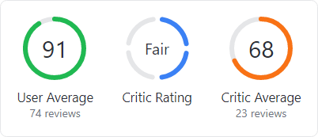

# Circular Progressbar

[CircularProgressBar](xref:@ActiproUIRoot.Controls.CircularProgressBar) displays a ranged progress value using fluent animations.  It is similar to a native linear `ProgressBar`, except that it renders the progress in a ring shape.



*Circular progressbars can be an integral part of a dashboard display*

@if (avalonia) {
> [!IMPORTANT]
> See the [Getting Started](../getting-started.md) topic for details on configuring themes for this control.
}

## Values

The [CircularProgressBar](xref:@ActiproUIRoot.Controls.CircularProgressBar) control inherits `RangeBase`, which provides these essential properties:

| Property | Description |
| ----- | ----- |
| `Value` | The progress value between `Minimum` and `Maximum`. |
| `Minimum` | The minimum possible value. |
| `Maximum` | The maximum possible value. |

The resolved progress complete percentage is calculated with this formula:

```
Percentage = (Value - Minimum) / (Maximum - Minimum)
```

As the percentage changes, the progress indicator animates to the new value.

The following example demonstrates creating a [CircularProgressBar](xref:@ActiproUIRoot.Controls.CircularProgressBar) with a range from `0` to `100` and a current value of `65`:

@if (avalonia) {
```xaml
xmlns:actipro="http://schemas.actiprosoftware.com/avaloniaui"
...
<actipro:CircularProgressBar Width="50" Height="50" Minimum="0" Maximum="100" Value="65" />
```
}
@if (wpf) {
```xaml
xmlns:shared="http://schemas.actiprosoftware.com/winfx/xaml/shared"
...
<shared:CircularProgressBar Width="50" Height="50" Minimum="0" Maximum="100" Value="65" />
```
}

## Indeterminate State

The progressbar can be placed in an indeterminate state when no specific progress value can yet be determined.  This can be the case when first determining the number of steps that will be executed as part of an overall operation.


*Circular progressbar spinning in an indeterminate state*

Set the [IsIndeterminate](xref:@ActiproUIRoot.Controls.CircularProgressBar.IsIndeterminate) property to `true` to enter indeterminate state, and later back to `false` to exit it.

While in an indeterminate state, the progressbar will spin a small indicator around the ring, and no progress text will be displayed.

The following example demonstrates creating a [CircularProgressBar](xref:@ActiproUIRoot.Controls.CircularProgressBar) in the indeterminate state:

@if (avalonia) {
```xaml
xmlns:actipro="http://schemas.actiprosoftware.com/avaloniaui"
...
<actipro:CircularProgressBar Width="50" Height="50" IsIndeterminate="True" />
```
}
@if (wpf) {
```xaml
xmlns:shared="http://schemas.actiprosoftware.com/winfx/xaml/shared"
...
<shared:CircularProgressBar Width="50" Height="50" IsIndeterminate="True" />
```
}

Subtle animations occur when the control transitions in and out of an indeterminate state.

## Progress Text

Progress text can be displayed in the center of the ring when not in an indeterminate state.  This text will be the percentage complete by default.

### Hiding Progress Text

The progress text can be hidden by setting the [IsProgressTextAllowed](xref:@ActiproUIRoot.Controls.CircularProgressBar.IsProgressTextAllowed) property to `false`.

### Formatting Progress Text

A format string value in the [ProgressTextFormat](xref:@ActiproUIRoot.Controls.CircularProgressBar.ProgressTextFormat) property is used to determinate what is displayed as progress text.  This property defaults to the current culture's display format for percentages, resulting in a value such as `"85%"`.

The format string is passed these values, which can be accessed via their zero-based indices:

| Index | Description |
| ----- | ----- |
| 0 | `Value` property value. |
| 1 | Percentage value in the range `0`..`100`. |
| 2 | `Minimum` property value. |
| 3 | `Maximum` property value. |

A [ProgressTextFormat](xref:@ActiproUIRoot.Controls.CircularProgressBar.ProgressTextFormat) value of `"{0:0} of {3:0}"` would result in the progress text `"[Value] of [Maximum]"`, with all decimals rounded.

> [!WARNING]
> When specifying a custom [ProgressTextFormat](xref:@ActiproUIRoot.Controls.CircularProgressBar.ProgressTextFormat) value in XAML, prefix the actual value with `{}` to ensure the XAML parser doesn't interpret the open curly braces of the format string as a meaningful XAML delimiter.

The following example demonstrates creating a [CircularProgressBar](xref:@ActiproUIRoot.Controls.CircularProgressBar) with custom progress text:

@if (avalonia) {
```xaml
xmlns:actipro="http://schemas.actiprosoftware.com/avaloniaui"
...
<actipro:CircularProgressBar Width="100" Height="100"
	Minimum="0" Maximum="10" Value="4" ProgressTextFormat="{}{0:0} of {3:0}" />
```
}
@if (wpf) {
```xaml
xmlns:shared="http://schemas.actiprosoftware.com/winfx/xaml/shared"
...
<shared:CircularProgressBar Width="100" Height="100"
	Minimum="0" Maximum="10" Value="4" ProgressTextFormat="{}{0:0} of {3:0}" />
```
}

## Appearance

The appearance of the control can be fully customized.

@if (avalonia) {

### Semantic Color Variants

The control supports the `accent`, `success`, `warning`, and `danger` style class names for semantic variants.  The semantic colors are applied to the progressbar's indicator.

The following example demonstrates how to apply the `accent` semantic color variant:

```xaml
xmlns:actipro="http://schemas.actiprosoftware.com/avaloniaui"
...
<actipro:CircularProgressBar Classes="accent" Width="50" Height="50" />
```

}

### Brush Properties

The following brush properties are available:

| Property | Description |
| ----- | ----- |
| `Foreground` | The progress text foreground. |
| `Background` | The background of the ring's interior, which defaults to `Transparent`. |
| [IndicatorBrush](xref:@ActiproUIRoot.Controls.CircularProgressBar.IndicatorBrush) | The progressbar's indicator fill. |
| [TrackBrush](xref:@ActiproUIRoot.Controls.CircularProgressBar.TrackBrush) | The progressbar's track fill. |

### Line

The following line-related properties are available to adjust the indicator and track appearance:

| Property | Description |
| ----- | ----- |
| [LineCap](xref:@ActiproUIRoot.Controls.CircularProgressBar.LineCap) | The indicator line's end caps, which defaults to `Round`. |
| [LineDashArray](xref:@ActiproUIRoot.Controls.CircularProgressBar.LineDashArray) | The optional indicator line's dash array when dotted or dashed lines are desired. |
| [LineDashOffset](xref:@ActiproUIRoot.Controls.CircularProgressBar.LineDashOffset) | The optional indicator line's dash offset, when a dash array is used. |
| [LineThickness](xref:@ActiproUIRoot.Controls.CircularProgressBar.LineThickness) | The thickness of the indicator and track lines, which defaults to `4`. |

> [!NOTE]
> Implementing dashed lines requires some fine tuning based on the control's size and line thickness.  Ideally, the dash array is configured so that a desired number of segments all have the same length.  Then the dash offset is used to rotate the start and end gap space, so it aligns to the top of the control.

### Font

All the standard font properties (e.g., `FontFamily`, `FontSize`, `FontWeight`) can be used to customize the appearance of the progress text.

## Animation

Fluent animation in the control is enabled by default but can be disabled by setting the [IsAnimationEnabled](xref:@ActiproUIRoot.Controls.CircularProgressBar.IsAnimationEnabled) property to `false`.

@if (avalonia) {

## Pseudo-classes

The following pseudo-classes are available and can be used when styling the control:

| Class | Description |
| ----- | ----- |
| `:determinate` | Added when the [IsIndeterminate](xref:@ActiproUIRoot.Controls.CircularProgressBar.IsIndeterminate) property is `false`. |
| `:has-progress-text` | Added when progress text should be displayed. |
| `:indeterminate` | Added when the [IsIndeterminate](xref:@ActiproUIRoot.Controls.CircularProgressBar.IsIndeterminate) property is `true`. |
| `:no-progress-text` | Added when progress text should not be displayed, which occurs when the [IsIndeterminate](xref:@ActiproUIRoot.Controls.CircularProgressBar.IsIndeterminate) property is `true` or the [IsProgressTextAllowed](xref:@ActiproUIRoot.Controls.CircularProgressBar.IsProgressTextAllowed) property is `false`. |

}
