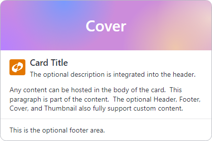
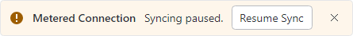

# Overview

The Fundamentals product contains various using interface controls that may be used in your applications.

## Avatar

[Avatar](avatar.md) controls are used to represent people or objects.  They can render a full-size image, a centered glyph, a person's initials, or text.

## Avatar Group

[Avatar Group](avatar-group.md) renders multiple [Avatar](avatar.md) controls.

## Badge

[Badge](badge.md) provides contextual information for other elements or can be used stand-alone.

## Card

[Card](card.md) controls are typically used to present visually grouped information for a single subject.

## Circular Progressbar

[CircularProgressBar](circular-progressbar.md) displays a ranged progress value using fluent animations.  It is similar to a native linear `ProgressBar`, except that it renders the progress in a ring shape.

## Info Bar

[Info Bar](info-bar.md) can be used to display essential information to a user without disrupting the user flow.

## Segmented Bar

[Segmented Bar](segmented-bar.md) allows a user to select a single item with support for fluent animations when changing selection.

## Settings Controls

The [SettingsCard](settings-card.md), [SettingsExpander](settings-expander.md), and [SettingsGroup](settings-group.md) controls are used together to organize and present configurable settings.

## Progress Spinners

[Progress Spinners](progress-spinners.md) are used when some form of processing is occurring to tell the end user that something is happening.
