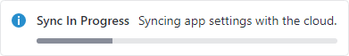

# InfoBar

An [InfoBar](xref:@ActiproUIRoot.Controls.InfoBar) can be used to display essential information to a user without disrupting the user flow.


*InfoBar with default severity showing a title and message*

@if (avalonia) {
> [!IMPORTANT]
> See the [Getting Started](../getting-started.md) topic for details on configuring themes for this control.
}

## Title and Message

The [Title](xref:@ActiproUIRoot.Controls.InfoBar.Title) property is typically set to short text that categorizes the message being displayed while the [Message](xref:@ActiproUIRoot.Controls.InfoBar.Message) property is set to text that provides additional detail.

The following demonstrates how to create an info bar with a title and message:

@if (avalonia) {
```xaml
xmlns:actipro="http://schemas.actiprosoftware.com/avaloniaui"
...
<actipro:InfoBar Title="Title" Message="An essential application message for the user." />
```
}
@if (wpf) {
```xaml
xmlns:shared="http://schemas.actiprosoftware.com/winfx/xaml/shared"
...
<shared:InfoBar Title="Title" Message="An essential application message for the user." />
```
}

## Severity


*InfoBar with Information, Success, Warning, and Error severities*

By default, an [InfoBar](xref:@ActiproUIRoot.Controls.InfoBar) is displayed with [Information](xref:@ActiproUIRoot.Controls.InfoBarSeverity.Information) severity, but the [Severity](xref:@ActiproUIRoot.Controls.InfoBar.Severity) property can be set to any one of the [InfoBarSeverity](xref:@ActiproUIRoot.Controls.InfoBarSeverity) values.  Each severity automatically applies a default[Icon](xref:@ActiproUIRoot.Controls.InfoBar.Icon) and `Background` brush to visually distinguish one severity from another.

## Action


*InfoBar with action button*

The [Action](xref:@ActiproUIRoot.Controls.InfoBar.Action) can be set to any value supported by `ContentPresenter`, but is typically used to show a button or hyperlink the user can act upon to respond to the message.

The following demonstrates how to create an info bar with a button for an action:

@if (avalonia) {
```xaml
xmlns:actipro="http://schemas.actiprosoftware.com/avaloniaui"
...
<actipro:InfoBar Title="Metered Connection" Message="Syncing paused." Severity="Warning">
	<actipro:InfoBar.Action>
		<Button Content="Resume Sync" />
	</actipro:InfoBar.Action>
</actipro:InfoBar>
```
}
@if (wpf) {
```xaml
xmlns:shared="http://schemas.actiprosoftware.com/winfx/xaml/shared"
...
<shared:InfoBar Title="Metered Connection" Message="Syncing paused." Severity="Warning">
	<shared:InfoBar.Action>
		<Button Content="Resume Sync" />
	</shared:InfoBar.Action>
</shared:InfoBar>
```
}

## Icon

By default, info bar will display an icon that corresponds to the value of the [Severity](xref:@ActiproUIRoot.Controls.InfoBar.Severity) property.  To hide the icon, set the [IsIconVisible](xref:@ActiproUIRoot.Controls.InfoBar.IsIconVisible) property to `false`.

To customize the icon, assign the desired object to the [Icon](xref:@ActiproUIRoot.Controls.InfoBar.Icon) property.

@if (avalonia) {
The following sample demonstrates using an `Image` for the icon, but any content supported by [Icon Presenter](../../themes/icon-presenter.md) can be used (like `IImage` data, `PathIcon` control, or [DynamicImage](../../shared/controls/dynamic-image.md) control):

```xaml
xmlns:actipro="http://schemas.actiprosoftware.com/avaloniaui"
...
<actipro:InfoBar Title="Title" Message="An essential application message for the user.">
	<actipro:InfoBar.Icon>
		<Image Source="/Images/Icons/Help16.png" />
	</actipro:InfoBar.Icon>
</actipro:InfoBar>
```
}
@if (wpf) {
The following sample demonstrates using an `Image` for the icon, but any content supported by `ContentPresenter` can be used (like [DynamicImage](xref:@ActiproUIRoot.Controls.DynamicImage)):

```xaml
xmlns:shared="http://schemas.actiprosoftware.com/winfx/xaml/shared"
...
<shared:InfoBar Title="Title" Message="An essential application message for the user.">
	<shared:InfoBar.Icon>
		<Image Source="/Images/Icons/Help16.png" />
	</shared:InfoBar.Icon>
</shared:InfoBar
```
}

> [!NOTE]
> [InfoBar](xref:@ActiproUIRoot.Controls.InfoBar) is designed for use with 16x16 icons.  See the @if (avalonia) { "Theme Resources" }@if (wpf) { "Theme Assets" } section below for more information on customizing the icon size.

## Custom Content



*InfoBar with a progressbar as content*

While not typically necessary, any content supported by `ContentPresenter` can be defined as the `Content` of the info bar.  When defined, the `Content` is always displayed below the other UI elements.

The following sample demonstrates including a progressbar as content:

@if (avalonia) {
```xaml
xmlns:actipro="http://schemas.actiprosoftware.com/avaloniaui"
...
<actipro:InfoBar Title="Sync In Progress" Message="Syncing app settings with the cloud.">
	<ProgressBar />
</actipro:InfoBar>
```
}
@if (wpf) {
```xaml
xmlns:shared="http://schemas.actiprosoftware.com/winfx/xaml/shared"
...
<shared:InfoBar Title="Sync In Progress" Message="Syncing app settings with the cloud.">
	<ProgressBar Height="5" />
</shared:InfoBar>
```
}

## Opening and Closing

The [IsOpen](xref:@ActiproUIRoot.Controls.InfoBar.IsOpen) property is used to open and close the info bar programmatically.

By default, a **Close Button** is also displayed that the user can click to close the info bar.  Set the [CanClose](xref:@ActiproUIRoot.Controls.InfoBar.CanClose) property to `false` to hide the **Close Button**.

> [!WARNING]
> Do not use the @if (avalonia) { `IsVisible` }@if (wpf) { `Visibility` } property to open and close the info bar.

By default, clicking the **Close Button** will set the [IsOpen](xref:@ActiproUIRoot.Controls.InfoBar.IsOpen) property to `false` when it is clicked.  Alternatively, a [CloseButtonClick](xref:@ActiproUIRoot.Controls.InfoBar.CloseButtonClick) event handler or custom [CloseButtonCommand](xref:@ActiproUIRoot.Controls.InfoBar.CloseButtonCommand) can replace the default behavior.

> [!IMPORTANT]
> If the [CloseButtonClick](xref:@ActiproUIRoot.Controls.InfoBar.CloseButtonClick) event handler sets `RoutedEventArgs.Handled` to `true` or the [CloseButtonCommand](xref:@ActiproUIRoot.Controls.InfoBar.CloseButtonCommand) property is assigned, the info bar *will not* close by default when it is clicked.  The respective event handler or command is responsible for setting the [IsOpen](xref:@ActiproUIRoot.Controls.InfoBar.IsOpen) property to `false` to close the info bar.

### Cancel Close

When the [IsOpen](xref:@ActiproUIRoot.Controls.InfoBar.IsOpen) property is set to `false`, the [Closing](xref:@ActiproUIRoot.Controls.InfoBar.Closing) event is raised with [InfoBarClosingEventArgs](xref:@ActiproUIRoot.Controls.InfoBarClosingEventArgs) passed to the event handler.  Set the `Cancel` property to `true` to cancel the close request.

If necessary, inspect the [Reason](xref:@ActiproUIRoot.Controls.InfoBarClosingEventArgs.Reason) property to determine if the reason for the close was due to the [CloseButton](xref:@ActiproUIRoot.Controls.InfoBarCloseReason) being clicked or if it was a [Programmatic](xref:@ActiproUIRoot.Controls.InfoBarCloseReason.Programmatic) close.

## Wrapping


*InfoBar displayed in the unwrapped and wrapped states*

If enough space is available, all UI elements (except `Content`) are displayed on a single line.  Otherwise, the [Title](xref:@ActiproUIRoot.Controls.InfoBar.Title), [Message](xref:@ActiproUIRoot.Controls.InfoBar.Message), [Action](xref:@ActiproUIRoot.Controls.InfoBar.Action), and `Content` are stacked vertically in the middle.  When wrapped, the read-only [IsWrapped](xref:@ActiproUIRoot.Controls.InfoBar.IsWrappedProperty) property will be set to `true`.

## Animation

Fluent animation in the control is enabled by default but can be disabled by setting the [IsAnimationEnabled](xref:@ActiproUIRoot.Controls.InfoBar.IsAnimationEnabled) property to `false`.

@if (avalonia) {

## Pseudo-classes

The following pseudo-classes are available and can be used when styling the control:

| Class | Description |
| ----- | ----- |
| `:error` | Added when the [Severity](xref:@ActiproUIRoot.Controls.InfoBar.Severity) is set to [Error](xref:@ActiproUIRoot.Controls.InfoBarSeverity.Error). |
| `:information` | Added when the [Severity](xref:@ActiproUIRoot.Controls.InfoBar.Severity) is set to [Information](xref:@ActiproUIRoot.Controls.InfoBarSeverity.Information). |
| `:success` | Added when the [Severity](xref:@ActiproUIRoot.Controls.InfoBar.Severity) is set to [Success](xref:@ActiproUIRoot.Controls.InfoBarSeverity.Success). |
| `:warning` | Added when the [Severity](xref:@ActiproUIRoot.Controls.InfoBar.Severity) is set to [Warning](xref:@ActiproUIRoot.Controls.InfoBarSeverity.Warning). |
| `:wrapped` | Added when there is not enough room to display the primary controls (excluding `Content`) on a single row. |

}

@if (avalonia) {
## Theme Resources

The following theme resources are available for customizing the appearance of the control:

| Theme Resource | Description |
| ----- | ----- |
| [ButtonForegroundBrush](xref:@ActiproUIRoot.Themes.ThemeResourceKind.ButtonForegroundBrush) | The default `Foreground` of the **Close Button**. |
| [ButtonForegroundBrushDisabled](xref:@ActiproUIRoot.Themes.ThemeResourceKind.ButtonForegroundBrushDisabled) | The default `Foreground` of the **Close Button** when it is disabled. |
| [Container1BorderBrush](xref:@ActiproUIRoot.Themes.ThemeResourceKind.Container1BorderBrush) | The default `BorderBrush`. |
| [InfoBarBackgroundBrushError](xref:@ActiproUIRoot.Themes.ThemeResourceKind.InfoBarBackgroundBrushError) | The default `Background` when the [Severity](xref:@ActiproUIRoot.Controls.InfoBar.Severity) is [Error](xref:@ActiproUIRoot.Controls.InfoBarSeverity.Error). |
| [InfoBarBackgroundBrushInformation](xref:@ActiproUIRoot.Themes.ThemeResourceKind.InfoBarBackgroundBrushInformation) | The default `Background` when the [Severity](xref:@ActiproUIRoot.Controls.InfoBar.Severity) is [Information](xref:@ActiproUIRoot.Controls.InfoBarSeverity.Information). |
| [InfoBarBackgroundBrushSuccess](xref:@ActiproUIRoot.Themes.ThemeResourceKind.InfoBarBackgroundBrushSuccess) | The default `Background` when the [Severity](xref:@ActiproUIRoot.Controls.InfoBar.Severity) is [Success](xref:@ActiproUIRoot.Controls.InfoBarSeverity.Success). |
| [InfoBarBackgroundBrushWarning](xref:@ActiproUIRoot.Themes.ThemeResourceKind.InfoBarBackgroundBrushWarning) | The default `Background` when the [Severity](xref:@ActiproUIRoot.Controls.InfoBar.Severity) is [Warning](xref:@ActiproUIRoot.Controls.InfoBarSeverity.Warning). |
| [InfoBarBorderThickness](xref:@ActiproUIRoot.Themes.ThemeResourceKind.InfoBarBorderThickness) | The default `BorderThickness`. |
| [InfoBarCloseButtonLength](xref:@ActiproUIRoot.Themes.ThemeResourceKind.InfoBarCloseButtonLength) | The default `Width` and `Height` of the **Close Button**. |
| [InfoBarCornerRadius](xref:@ActiproUIRoot.Themes.ThemeResourceKind.InfoBarCornerRadius) | The default `CornerRadius`. |
| [InfoBarIconLength](xref:@ActiproUIRoot.Themes.ThemeResourceKind.InfoBarIconLength) | The default `Width` and `Height` of the [Icon](xref:@ActiproUIRoot.Controls.InfoBar.Icon). |
| [InfoBarPadding](xref:@ActiproUIRoot.Themes.ThemeResourceKind.InfoBarPadding) | The default `Padding`. |

See the [Theme Assets](../../themes/theme-assets.md) topic for more details on working with theme resources.
}
@if (wpf) {
## Theme Assets

See the [Theme Reusable Assets](../../themes/reusable-assets.md) topic for more details on using and customizing theme assets.  The following reusable assets are used by [InfoBar](xref:@ActiproUIRoot.Controls.InfoBar):

| Asset Resource Key | Description |
|-----|-----|
| [ButtonBorderNormalCornerRadiusKey](xref:@ActiproUIRoot.Themes.AssetResourceKeys.ButtonBorderNormalCornerRadiusKey) | The default `CornerRadius` of the **Close Button**. |
| [ContainerBorderLowerBrushKey](xref:@ActiproUIRoot.Themes.AssetResourceKeys.ContainerBorderLowerBrushKey) | The default `BorderBrush`. |
| [ContainerForegroundLowestNormalBrushKey](xref:@ActiproUIRoot.Themes.AssetResourceKeys.ContainerForegroundLowestNormalBrushKey) | The default `Foreground` of the info bar and **Close Button**. |
| [ContainerForegroundLowestDisabledBrushKey](xref:@ActiproUIRoot.Themes.AssetResourceKeys.ContainerForegroundLowestDisabledBrushKey) | The default `Foreground` of the **Close Button** when it is disabled. |
| [InfoBarBackgroundErrorBrushKey](xref:@ActiproUIRoot.Themes.AssetResourceKeys.InfoBarBackgroundErrorBrushKey) | The default `Background` when the [Severity](xref:@ActiproUIRoot.Controls.InfoBar.Severity) is [Error](xref:@ActiproUIRoot.Controls.InfoBarSeverity.Error). |
| [InfoBarBackgroundInformationBrushKey](xref:@ActiproUIRoot.Themes.AssetResourceKeys.InfoBarBackgroundInformationBrushKey) | The default `Background` when the [Severity](xref:@ActiproUIRoot.Controls.InfoBar.Severity) is [Information](xref:@ActiproUIRoot.Controls.InfoBarSeverity.Information). |
| [InfoBarBackgroundSuccessBrushKey](xref:@ActiproUIRoot.Themes.AssetResourceKeys.InfoBarBackgroundSuccessBrushKey) | The default `Background` when the [Severity](xref:@ActiproUIRoot.Controls.InfoBar.Severity) is [Success](xref:@ActiproUIRoot.Controls.InfoBarSeverity.Success). |
| [InfoBarBackgroundWarningBrushKey](xref:@ActiproUIRoot.Themes.AssetResourceKeys.InfoBarBackgroundWarningBrushKey) | The default `Background` when the [Severity](xref:@ActiproUIRoot.Controls.InfoBar.Severity) is [Warning](xref:@ActiproUIRoot.Controls.InfoBarSeverity.Warning). |
| [InfoBarBorderNormalCornerRadiusKey](xref:@ActiproUIRoot.Themes.AssetResourceKeys.InfoBarBorderNormalCornerRadiusKey) | The default [CornerRadius](xref:@ActiproUIRoot.Controls.InfoBar.CornerRadius). |
| [InfoBarBorderNormalThicknessKey](xref:@ActiproUIRoot.Themes.AssetResourceKeys.InfoBarBorderNormalThicknessKey) | The default `BorderThickness`. |
| [InfoBarCloseButtonLengthDoubleKey](xref:@ActiproUIRoot.Themes.AssetResourceKeys.InfoBarCloseButtonLengthDoubleKey) | The default `Width` and `Height` of the **Close Button**. |
| [InfoBarIconLengthDoubleKey](xref:@ActiproUIRoot.Themes.AssetResourceKeys.InfoBarIconLengthDoubleKey) | The default `Width` and `Height` of the **Icon**. |
| [InfoBarPaddingNormalThicknessKey](xref:@ActiproUIRoot.Themes.AssetResourceKeys.InfoBarPaddingNormalThicknessKey) | The default `Padding`. |
}

## Customize String Resources

The following string resources are available to localize or customize built-in strings:

@if (avalonia) {
| Resource key | Description |
|-----|-----|
| [UIButtonCloseDisplayName](xref:ActiproSoftware.Properties.Shared.SRName.UIButtonCloseDisplayName) | The tooltip of the **Close Button**. The default value is `"Close"`. |

The following sample demonstrates how to set custom values for string resources:

```csharp
ActiproSoftware.Properties.Shared.SR.SetCustomString(ActiproSoftware.Properties.Shared.SRName.UIButtonCloseDisplayName, "Hide");
```

See the [Customizing String Resources](../../customizing-string-resources.md) topic for additional details.
}
@if (wpf) {
| Resource key | Description |
|-----|-----|
| `UICloseButtonToolTip` | The tooltip of the **Close Button**. The default value is `"Close"`. |

The following sample demonstrates how to set custom values for string resources:

```csharp
ActiproSoftware.Products.Shared.SR.SetCustomString(ActiproSoftware.Products.Shared.SRName.UICloseButtonToolTip.ToString(), "Hide");
```

See the [Customizing String Resources](../../customizing-string-resources.md) topic for additional details.
}