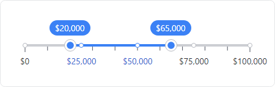
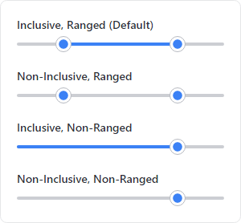
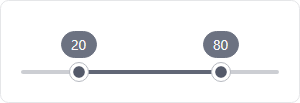
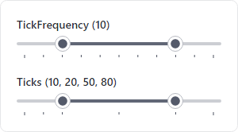
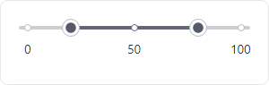
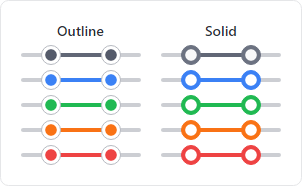
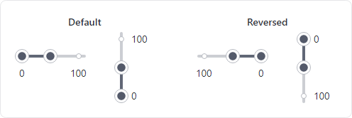
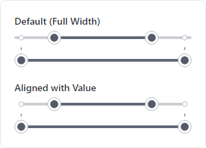

# RangeSlider

A [RangeSlider](xref:@ActiproUIRoot.Controls.RangeSlider) can be used to select one or more values within a pre-defined range of available values.



*RangeSlider with custom marks, tickbar, and value badges*

@if (avalonia) {
> [!IMPORTANT]
> See the [Getting Started](../getting-started.md) topic for details on configuring themes for this control.
}

## Range

The [RangeSlider](xref:@ActiproUIRoot.Controls.RangeSlider) control represents a range that is defined by the [RangeStart](xref:@ActiproUIRoot.Controls.RangeSlider.RangeStart) and [RangeEnd](xref:@ActiproUIRoot.Controls.RangeSlider.RangeEnd) properties (where [RangeStart](xref:@ActiproUIRoot.Controls.RangeSlider.RangeStart) is always the lesser of the two values).  Each value has a thumb control that the end user can drag to change the value.  Use the [Minimum](xref:@ActiproUIRoot.Controls.RangeSlider.Minimum) and [Maximum](xref:@ActiproUIRoot.Controls.RangeSlider.Maximum) properties to define the limits of the available range.



*RangeSlider showing visual states for IsRanged and IsInclusive property value combinations*

When the [IsInclusive](xref:@ActiproUIRoot.Controls.RangeSlider.IsInclusive) property is set to `true` (the default), the [RangeSlider](xref:@ActiproUIRoot.Controls.RangeSlider) will show an indicator between the [RangeStart](xref:@ActiproUIRoot.Controls.RangeSlider.RangeStart) and [RangeEnd](xref:@ActiproUIRoot.Controls.RangeSlider.RangeEnd) values to help visualize that the range includes all values in between.  If the [IsRangeDragEnabled](xref:@ActiproUIRoot.Controls.RangeSlider.IsRangeDragEnabled) property is set to `true` (the default value is `false`), the user can drag the indicator to move all thumbs at the same time.  Set the [IsInclusive](xref:@ActiproUIRoot.Controls.RangeSlider.IsInclusive) property to `false` to hide the indicator.

If a range of values should always start at the [Minimum](xref:@ActiproUIRoot.Controls.RangeSlider.Minimum), set the [IsRanged](xref:@ActiproUIRoot.Controls.RangeSlider.IsRanged) property to `false` (the default value is `true`).  When `false`, the [RangeStart](xref:@ActiproUIRoot.Controls.RangeSlider.RangeStart) is locked to the same value as [Minimum](xref:@ActiproUIRoot.Controls.RangeSlider.Minimum) and a thumb control will not be displayed.

## Step Frequency

The values defined by a [RangeSlider](xref:@ActiproUIRoot.Controls.RangeSlider) are represented by the `Double` value type and can be any fractional value between [Minimum](xref:@ActiproUIRoot.Controls.RangeSlider.Minimum) and [Maximum](xref:@ActiproUIRoot.Controls.RangeSlider.Maximum).  However, most uses cases will want to limit the precision of values by setting the [StepFrequency](xref:@ActiproUIRoot.Controls.RangeSlider.StepFrequency) property to the smallest unit of change between two adjacent values on the slider.

### Examples

For whole numbers, setting [StepFrequency](xref:@ActiproUIRoot.Controls.RangeSlider.StepFrequency) to `1.0` will adjust values to the nearest whole number while dragging.

For a non-fractional percentage (as a value from `0.00` to `1.00`), set the [StepFrequency](xref:@ActiproUIRoot.Controls.RangeSlider.StepFrequency) to `0.01` so that each value, after being converted to a percentage, will represent a whole number (e.g., `0.25` becomes `25%`).

For a range of very large numbers, it might be desirable to prevent selecting values that are too small.  For example, if a slider control is being used to define the range of prices when searching for an expensive item like an automobile or house, it typically provides a better experience to adjust the value in larger intervals like `100`, `1000`, or even `10000` depending on the range of values.

## Thumbs

An editable value on the slider is represented by a thumb control of type [RangeSliderThumb](xref:@ActiproUIRoot.Controls.Primitives.RangeSliderThumb).



*RangeSlider showing with two thumbs showing a value badge*

The user can drag the thumb to change the value.  When the thumb has keyboard focus, the arrow keys will change the value by the [SmallChange](xref:@ActiproUIRoot.Controls.RangeSlider.SmallChange) amount, and the <kbd>PgDn</kbd>/<kbd>PgDn</kbd> keys will change the value by the [LargeChange](xref:@ActiproUIRoot.Controls.RangeSlider.LargeChange) amount.

@if (avalonia) {
> [!IMPORTANT]
> Each [RangeSliderThumb](xref:@ActiproUIRoot.Controls.Primitives.RangeSliderThumb) is a separate control that can be independently configured.
>
> Unless a convenience property is defined on [RangeSlider](xref:@ActiproUIRoot.Controls.RangeSlider) that is automatically bound to a corresponding property on [RangeSliderThumb](xref:@ActiproUIRoot.Controls.Primitives.RangeSliderThumb), use the [RangeSlider](xref:@ActiproUIRoot.Controls.RangeSlider).[ThumbTheme](xref:@ActiproUIRoot.Controls.RangeSlider.ThumbTheme) property to define a `ControlTheme` which customizes the properties of each [RangeSliderThumb](xref:@ActiproUIRoot.Controls.Primitives.RangeSliderThumb).
}
@if (wpf) {
> [!IMPORTANT]
> Each [RangeSliderThumb](xref:@ActiproUIRoot.Controls.Editors.Primitives.RangeSliderThumb) is a separate control that can be independently configured, if desired.
>
> Unless a convenience property is defined on [RangeSlider](xref:@ActiproUIRoot.Controls.Editors.RangeSlider) that is automatically bound to a corresponding property on [RangeSliderThumb](xref:@ActiproUIRoot.Controls.Editors.Primitives.RangeSliderThumb), use the [RangeSlider](xref:@ActiproUIRoot.Controls.Editors.RangeSlider).[ThumbStyle](xref:@ActiproUIRoot.Controls.Editors.RangeSlider.ThumbStyle) property to define a `Style` which customizes the properties of each [RangeSliderThumb](xref:@ActiproUIRoot.Controls.Editors.Primitives.RangeSliderThumb).
}

### Value Badge

Each thumb can display a value badge to help the user select the correct value.

The value badge is typically shown when the user is interacting with the thumb.  The [RangeSliderThumb](xref:@ActiproUIRoot.Controls.Primitives.RangeSliderThumb).[ValueBadgeDisplayKinds](xref:@ActiproUIRoot.Controls.Primitives.RangeSliderThumb.ValueBadgeDisplayKinds) property (which is a flags enumeration) can be set to one or more of the following values to control when the badge is displayed:
- [Always](xref:@ActiproUIRoot.Controls.RangeSliderValueBadgeDisplayKinds.Always) - The value badge is always displayed.
- [None](xref:@ActiproUIRoot.Controls.RangeSliderValueBadgeDisplayKinds.None) - The value badge is never displayed.
- [Dragging](xref:@ActiproUIRoot.Controls.RangeSliderValueBadgeDisplayKinds.Dragging) - The value badge is shown when dragging the thumb.
- [KeyboardFocused](xref:@ActiproUIRoot.Controls.RangeSliderValueBadgeDisplayKinds.KeyboardFocused) - The value badge is shown when the thumb has keyboard focus.
- [PointerOver](xref:@ActiproUIRoot.Controls.RangeSliderValueBadgeDisplayKinds.PointerOver) - The value badge is shown when the pointer is over the thumb.
- [Interacting](xref:@ActiproUIRoot.Controls.RangeSliderValueBadgeDisplayKinds.Interacting) - (Default) A combination of [Dragging](xref:@ActiproUIRoot.Controls.RangeSliderValueBadgeDisplayKinds.Dragging), [KeyboardFocused](xref:@ActiproUIRoot.Controls.RangeSliderValueBadgeDisplayKinds.KeyboardFocused), and [PointerOver](xref:@ActiproUIRoot.Controls.RangeSliderValueBadgeDisplayKinds.PointerOver). This is the default value.

> [!TIP]
> For convenience, the [RangeSlider](xref:@ActiproUIRoot.Controls.RangeSlider).[ThumbValueBadgeDisplayKinds](xref:@ActiproUIRoot.Controls.RangeSlider.ThumbValueBadgeDisplayKinds) property is automatically bound to the corresponding [RangeSliderThumb](xref:@ActiproUIRoot.Controls.Primitives.RangeSliderThumb).[ValueBadgeDisplayKinds](xref:@ActiproUIRoot.Controls.Primitives.RangeSliderThumb.ValueBadgeDisplayKinds) property of each thumb to easily customize all thumbs to the same value.

The [RangeSliderThumb](xref:@ActiproUIRoot.Controls.Primitives.RangeSliderThumb).[ValueBadgePlacement](xref:@ActiproUIRoot.Controls.Primitives.RangeSliderThumb.ValueBadgePlacement) property is used to define the location of the @if (avalonia) { [Badge](badge.md) }@if (wpf) { [Badge](../../shared/windows-controls/badge.md) } relative to the thumb and can be set to one of the following values:
- [TopLeft](xref:@ActiproUIRoot.Controls.Primitives.RangeSliderPlacement.TopLeft) - (Default) The badge is shown above the thumb when the slider is horizontally oriented and to the left of the thumb when the slider is vertically oriented.  This is the default value.
- [BottomRight](xref:@ActiproUIRoot.Controls.Primitives.RangeSliderPlacement.BottomRight) - The badge is shown below the thumb when the slider is horizontally oriented and to the right of the thumb when the slider is vertically oriented.

> [!TIP]
> For convenience, the [RangeSlider](xref:@ActiproUIRoot.Controls.RangeSlider).[ThumbValueBadgePlacement](xref:@ActiproUIRoot.Controls.RangeSlider.ThumbValueBadgePlacement) property is automatically bound to the corresponding [RangeSliderThumb](xref:@ActiproUIRoot.Controls.Primitives.RangeSliderThumb).[ValueBadgePlacement](xref:@ActiproUIRoot.Controls.Primitives.RangeSliderThumb.ValueBadgePlacement) property of each thumb to easily customize all thumbs to the same value.

### Overlap

The [OverlapKind](xref:@ActiproUIRoot.Controls.RangeSlider.OverlapKind) property can be used to define the behavior when one thumb is dragged into another thumb.  The following options are available:
- [Overlap](xref:@ActiproUIRoot.Controls.RangeSliderOverlapKind.Overlap) - (Default) Each thumb is allowed to overlap with other thumbs and can be dragged to any position on the slider.  This is the default behavior.
- [None](xref:@ActiproUIRoot.Controls.RangeSliderOverlapKind.None) - A thumb cannot overlap another thumb.  If one thumb is dragged into another thumb, dragging will be stopped at the position of the other thumb.
- [Push](xref:@ActiproUIRoot.Controls.RangeSliderOverlapKind.Push) - A thumb cannot overlap another thumb.  If one thumb is dragged into another thumb, the other thumb will be pushed in the same direction of the drag.

When [OverlapKind](xref:@ActiproUIRoot.Controls.RangeSlider.OverlapKind) is set to [None](xref:@ActiproUIRoot.Controls.RangeSliderOverlapKind.None) or [Push](xref:@ActiproUIRoot.Controls.RangeSliderOverlapKind.Push), it may be desirable to prevent the thumbs from having the same value.  To limit how close one thumb may be dragged to another, set the [MinimumStepsBetweenThumbs](xref:@ActiproUIRoot.Controls.RangeSlider.MinimumStepsBetweenThumbs) property to a value greater than `0`.  This property determines how many "steps" are between each thumb, and a "step" is defined by the [StepFrequency](xref:@ActiproUIRoot.Controls.RangeSlider.StepFrequency) property.  For example, if a range slider is configured with [MinimumStepsBetweenThumbs](xref:@ActiproUIRoot.Controls.RangeSlider.MinimumStepsBetweenThumbs) of `2` and a [StepFrequency](xref:@ActiproUIRoot.Controls.RangeSlider.StepFrequency) of `10`, the values associated with the two thumbs cannot be closer than `20` (`2 * 10 = 20`).

### Customizing

@if (avalonia) {
The [RangeSlider](xref:@ActiproUIRoot.Controls.RangeSlider).[ThumbTheme](xref:@ActiproUIRoot.Controls.RangeSlider.ThumbTheme) property defines the `ControlTheme` which is applied to each [RangeSliderThumb](xref:@ActiproUIRoot.Controls.Primitives.RangeSliderThumb).  Similarly, the [RangeSliderThumb](xref:@ActiproUIRoot.Controls.Primitives.RangeSliderThumb).[ValueBadgeTheme](xref:@ActiproUIRoot.Controls.Primitives.RangeSliderThumb.ValueBadgeTheme) property defines the `ControlTheme` which is applied to each [Badge](badge.md) displayed by the thumb for the current value.
}
@if (wpf) {
The [RangeSlider](xref:@ActiproUIRoot.Controls.Editors.RangeSlider).[ThumbStyle](xref:@ActiproUIRoot.Controls.Editors.RangeSlider.ThumbStyle) property defines the `Style` which is applied to each [RangeSliderThumb](xref:@ActiproUIRoot.Controls.Editors.Primitives.RangeSliderThumb).  Similarly, the [RangeSliderThumb](xref:@ActiproUIRoot.Controls.Editors.Primitives.RangeSliderThumb).[ValueBadgeStyle](xref:@ActiproUIRoot.Controls.Editors.Primitives.RangeSliderThumb.ValueBadgeStyle) property defines the `Style` which is applied to each [Badge](../../shared/windows-controls/badge.md) displayed by the thumb for the current value.
}

See the "Customizing Appearance" section below for examples of how to customize the @if (avalonia) { `ControlTheme` }@if (wpf) { `Style` } of [RangeSliderThumb](xref:@ActiproUIRoot.Controls.Primitives.RangeSliderThumb) in order to assign a custom @if (avalonia) { `ControlTheme` for the value [Badge](badge.md). }@if (wpf) { `Style` for the value [Badge](../../shared/windows-controls/badge.md). }

## Ticks

Ticks indicate specific, meaningful values within the range of the slider, helping users understand the scale and select appropriate values.

Use the [TickPlacement](xref:@ActiproUIRoot.Controls.RangeSlider.TickPlacement) property to specify if a `TickBar` should be displayed before and/or after the slider to provide visual guidance to the user about the specific tick values.

Ticks are defined using either the [TickFrequency](xref:@ActiproUIRoot.Controls.RangeSlider.TickFrequency) property or [Ticks](xref:@ActiproUIRoot.Controls.RangeSlider.Ticks) property.  If the [Ticks](xref:@ActiproUIRoot.Controls.RangeSlider.Ticks) property is defined, the [TickFrequency](xref:@ActiproUIRoot.Controls.RangeSlider.TickFrequency) property is ignored.



*RangeSlider with minimum-maximum range of 0-100 showing two different techniques for ticks*

### TickFrequency

The [TickFrequency](xref:@ActiproUIRoot.Controls.RangeSlider.TickFrequency) property is used to define intervals within the slider's minimum-maximum range where ticks will be placed.  The first tick will be implied from the [Minimum](xref:@ActiproUIRoot.Controls.RangeSlider.Minimum) value.  Then a tick will be placed at every interval defined by [TickFrequency](xref:@ActiproUIRoot.Controls.RangeSlider.TickFrequency) until the last tick which, is implied from the [Maximum](xref:@ActiproUIRoot.Controls.RangeSlider.Maximum) value.

In the following example, a slider is defined with a minimum-maximum range of `0-100` and a tick interval of `25`, so ticks will be placed at `0`, `25`, `50`, `75` and `100`:

@if (avalonia) {
```xaml
xmlns:actipro="http://schemas.actiprosoftware.com/avaloniaui"
...
<actipro:RangeSlider Minimum="0" Maximum="100" TickFrequency="25" ... />
```
}
@if (wpf) {
```xaml
xmlns:editors="http://schemas.actiprosoftware.com/winfx/xaml/editors"
...
<editors:RangeSlider Minimum="0" Maximum="100" TickFrequency="25" ... />
```
}

### Ticks Collection

The [Ticks](xref:@ActiproUIRoot.Controls.RangeSlider.Ticks) collection property can be used to define ticks that do not appear at fixed intervals.  The first and last tick will be implied from the [Minimum](xref:@ActiproUIRoot.Controls.RangeSlider.Minimum) and [Maximum](xref:@ActiproUIRoot.Controls.RangeSlider.Maximum) values, respectively.  The remaining ticks will correspond to the values explicitly defined in the collection.

In the following example, a slider is defined with a minimum-maximum range of `0-100` and explicit ticks at `20` and `80`, so ticks will be placed at `0`, `20`, `80`, and `100`:

@if (avalonia) {
```xaml
xmlns:actipro="http://schemas.actiprosoftware.com/avaloniaui"
...
<actipro:RangeSlider Minimum="0" Maximum="100" Ticks="20, 80" ... />
```
}
@if (wpf) {
```xaml
xmlns:editors="http://schemas.actiprosoftware.com/winfx/xaml/editors"
...
<editors:RangeSlider Minimum="0" Maximum="100" Ticks="20, 80" ... />
```
}

## Marks



*RangeSlider with minimum-maximum range of 0-100 showing marks at 0, 50, and 100*

A mark, defined by [RangeSliderMark](xref:@ActiproUIRoot.Controls.Primitives.RangeSliderMark), is similar to a tick since it is used to define a specific, meaningful value within the range of the slider.  Unlike ticks, however, each mark has its own decoration on the slider's track and can include adjacent content (like a label or glyph) to help further define the significance of the value.

Marks are defined using either the [Marks](xref:@ActiproUIRoot.Controls.RangeSlider.Marks) property or [MarkElements](xref:@ActiproUIRoot.Controls.RangeSlider.MarkElements) property.  If the [MarkElements](xref:@ActiproUIRoot.Controls.RangeSlider.MarkElements) property is defined, the [Marks](xref:@ActiproUIRoot.Controls.RangeSlider.Marks) property is ignored.

### Marks Collection

The [Marks](xref:@ActiproUIRoot.Controls.RangeSlider.Marks) collection property is used to define explicit values for one or more marks and is preferred when each mark can be displayed using default properties.  Each value will be represented by an individual [RangeSliderMark](xref:@ActiproUIRoot.Controls.Primitives.RangeSliderMark) element whose [Value](xref:@ActiproUIRoot.Controls.Primitives.RangeSliderMark.Value) corresponds to the defined value.

In the following example for a temperature range based on the Celsius scale, ticks are placed every `10` degrees and marks are placed at `0` and `100` to denote the freezing and boiling points of water:

@if (avalonia) {
```xaml
xmlns:actipro="http://schemas.actiprosoftware.com/avaloniaui"
...
<actipro:RangeSlider Minimum="-50" Maximum="200" StepFrequency="1" TickFrequency="10" Marks="0, 100" ... />
```
}
@if (wpf) {
```xaml
xmlns:editors="http://schemas.actiprosoftware.com/winfx/xaml/editors"
...
<editors:RangeSlider Minimum="-50" Maximum="200" StepFrequency="1" TickFrequency="10" Marks="0, 100" ... />
```
}

### MarkElements Collection

The [MarkElements](xref:@ActiproUIRoot.Controls.RangeSlider.MarkElements) collection property is used to define one or more [RangeSliderMark](xref:@ActiproUIRoot.Controls.Primitives.RangeSliderMark) elements that will be displayed on the slider.  This method is used when the individual elements require additional configuration beyond just the [Value](xref:@ActiproUIRoot.Controls.Primitives.RangeSliderMark.Value) property.

Some important properties of [RangeSliderMark](xref:@ActiproUIRoot.Controls.Primitives.RangeSliderMark) include:

| Property | Description |
| ----- | ----- |
| `Background` | The `Brush` used as the background of the track decoration. |
| `BorderBrush` | The `Brush` used as the border of the track decoration. |
| `BorderThickness` | The `Thickness` of the track decoration border. |
| `Content` | An object used to describe the mark (e.g., a `string` value used as a label).  By default, the [Value](xref:@ActiproUIRoot.Controls.Primitives.RangeSliderMark.Value) is used as the `Content` and formatted based on [ValueFormat](xref:@ActiproUIRoot.Controls.Primitives.RangeSliderMark.ValueFormat). |
| [ContentPlacement](xref:@ActiproUIRoot.Controls.Primitives.RangeSliderMark.ContentPlacement) | A [RangeSliderPlacement](xref:@ActiproUIRoot.Controls.Primitives.RangeSliderPlacement) value indicate the placement of the `Content` relative to the slider. |
| `Foreground` | The `Brush` used as the default foreground for `Content`. |
| [IsContentVisible](xref:@ActiproUIRoot.Controls.Primitives.RangeSliderMark.IsContentVisible) | Toggles if the `Content` of the mark is visible. |
| [IsTrackDecorationVisible](xref:@ActiproUIRoot.Controls.Primitives.RangeSliderMark.IsTrackDecorationVisible) | Toggles if the mark decoration on the slider track is visible. |
| [Value](xref:@ActiproUIRoot.Controls.Primitives.RangeSliderMark.Value) | Defines the location of the mark within the minimum-maximum range of the slider. |
| [ValueFormat](xref:@ActiproUIRoot.Controls.Primitives.RangeSliderMark.ValueFormat) | A string format applied to [Value](xref:@ActiproUIRoot.Controls.Primitives.RangeSliderMark.Value) when it is displayed as `Content`. |

In the following example for a temperature range based on the Celsius scale, ticks are placed every `10` degrees and marks are placed at `0` and `100` to denote the freezing and boiling points of water with custom content and colors for each mark:

@if (avalonia) {
```xaml
xmlns:actipro="http://schemas.actiprosoftware.com/avaloniaui"
xmlns:actiproPrimitives="using:ActiproSoftware.UI.Avalonia.Controls.Primitives"
...
<actipro:RangeSlider Minimum="-50" Maximum="200" StepFrequency="1" TickFrequency="10" ... >
	<actipro:RangeSlider.MarkElements>
		<actiproPrimitives:RangeSliderMark Value="0" Content="0&#176;C (Freezing)" Foreground="Blue" BorderBrush="Blue" />
		<actiproPrimitives:RangeSliderMark Value="100" Content="100&#176;C (Boiling)" Foreground="Red" BorderBrush="Red" />
	</actipro:RangeSlider.MarkElements>
</actipro:RangeSlider>
```
}
@if (wpf) {
```xaml
xmlns:editors="http://schemas.actiprosoftware.com/winfx/xaml/editors"
...
<editors:RangeSlider Minimum="-50" Maximum="200" StepFrequency="1" TickFrequency="10" ... >
	<editors:RangeSlider.MarkElements>
		<editors:RangeSliderMark Value="0" Content="0&#176;C (Freezing)" Foreground="Blue" BorderBrush="Blue" />
		<editors:RangeSliderMark Value="100" Content="100&#176;C (Boiling)" Foreground="Red" BorderBrush="Red" />
	</editors:RangeSlider.MarkElements>
</editors:RangeSlider>
```
}

## Snapping Values

Snapping is a feature that alters the value of a thumb to the nearest snap point while it is being moved.  At the most basic level, snapping is enabled by setting the [StepFrequency](xref:@ActiproUIRoot.Controls.RangeSlider.StepFrequency) to a value greater than `0`.  For example, setting the [StepFrequency](xref:@ActiproUIRoot.Controls.RangeSlider.StepFrequency) to `1` will ensure that the value of the thumb is always moved to the nearest whole number.

When ticks are defined (see "Ticks" section above), setting [IsSnapToTickEnabled](xref:@ActiproUIRoot.Controls.RangeSlider.IsSnapToTickEnabled) will snap the thumb to the nearest tick.  Snapping to ticks will override snapping to [StepFrequency](xref:@ActiproUIRoot.Controls.RangeSlider.StepFrequency).

### Snapping to Marks
One or more marks (see "Marks" section above) can also be configured as a snap point, and they operate independently from the other snap settings.  Set the [RangeSliderMark](xref:@ActiproUIRoot.Controls.Primitives.RangeSliderMark).[SnapDistance](xref:@ActiproUIRoot.Controls.Primitives.RangeSliderMark.SnapDistance) to a value greater than `0` to enable snapping to the mark.  If the non-inclusive differential of the thumb value and the mark value is within the snap distance, the thumb will be snapped to the mark.  This can be used to "pull" the thumb to the mark when it gets close and can help the user select significant values.

For example, consider a slider whose [StepFrequency](xref:@ActiproUIRoot.Controls.RangeSlider.StepFrequency) is `1` that also has a [RangeSliderMark](xref:@ActiproUIRoot.Controls.Primitives.RangeSliderMark) whose [Value](xref:@ActiproUIRoot.Controls.Primitives.RangeSliderMark.Value) is `5` and whose [SnapDistance](xref:@ActiproUIRoot.Controls.Primitives.RangeSliderMark.SnapDistance) is `2`.  The [StepFrequency](xref:@ActiproUIRoot.Controls.RangeSlider.StepFrequency) of `1` indicates that as a thumb moves it is snapped to the nearest whole number.  If the thumb is dragged from `0` it will snap to `1`, `2`, and `3` before jumping to `5`.  Since the mark has a value of `5` and a snap distance of `2`, that means any value greater than `3` and less than `7` will snap to the mark value of `5`.

> [!IMPORTANT]
> Since snapping to marks makes it impossible for the user to select the values within the snap range (e.g., `4` and `6` in the example above), the feature should only be used if the values being excluded by the range are insignificant.

> [!TIP]
> Each [RangeSliderMark](xref:@ActiproUIRoot.Controls.Primitives.RangeSliderMark) can be configured individually, but the [RangeSlider](xref:@ActiproUIRoot.Controls.RangeSlider).[MarkSnapDistance](xref:@ActiproUIRoot.Controls.RangeSlider.MarkSnapDistance) property can be used to set the default snap distance for all marks.

## Multiple Values


*RangeSlider with three values*

A range slider typically defines just two values, each defined by the [RangeStart](xref:@ActiproUIRoot.Controls.RangeSlider.RangeStart) and [RangeEnd](xref:@ActiproUIRoot.Controls.RangeSlider.RangeEnd) properties.  When more values are desired, the [Values](xref:@ActiproUIRoot.Controls.RangeSlider.Values) collection property can be used to define zero or more values.  A thumb will be added for each value, and values can be added/removed from the collection at any time.

When [IsRangeEditEnabled](xref:@ActiproUIRoot.Controls.RangeSlider.IsRangeEditEnabled) is set to `true`, the user will be able to add or remove values at runtime by holding the <kbd>Ctrl</kbd> key when clicking on the control.  If the user clicks on an existing thumb, the thumb and its value will be removed.  If the user clicks on an area where there is no thumb, a new thumb and value will be added that correspond to the click point.  The <kbd>Ins</kbd> and <kbd>Del</kbd> keys can also be used to add or remove thumbs, respectively.  Use the [RangeEditMinimumValueCount](xref:@ActiproUIRoot.Controls.RangeSlider.RangeEditMinimumValueCount) and [RangeEditMaximumValueCount](xref:@ActiproUIRoot.Controls.RangeSlider.RangeEditMaximumValueCount) properties to limit how many values the user can add/remove.

When using the [Values](xref:@ActiproUIRoot.Controls.RangeSlider.Values) collection, the [RangeStart](xref:@ActiproUIRoot.Controls.RangeSlider.RangeStart) and [RangeEnd](xref:@ActiproUIRoot.Controls.RangeSlider.RangeEnd) properties will still reflect the smallest and largest values in the collection, respectively.  If [RangeStart](xref:@ActiproUIRoot.Controls.RangeSlider.RangeStart) is assigned a new value, every value in the collection that is less than the new value will be increased to the new start value.  Similarly, if [RangeEnd](xref:@ActiproUIRoot.Controls.RangeSlider.RangeEnd) is assigned a new value, every value in the collection that is greater than the new value will be decreased to the new end value.  Since this can result in multiple thumbs having the same value, it is recommended to treat [RangeStart](xref:@ActiproUIRoot.Controls.RangeSlider.RangeStart) and [RangeEnd](xref:@ActiproUIRoot.Controls.RangeSlider.RangeEnd) as read-only properties (and use `OneWay` bindings) when working with multiple values.

The following example shows a range slider that is bound to a collection of `Double` values defined on the default `DataContext` and is configured to allow the user to define between `1` and `5` values.

@if (avalonia) {
```xaml
xmlns:actipro="http://schemas.actiprosoftware.com/avaloniaui"
...
<actipro:RangeSlider
	IsRangeEditEnabled="True"
	RangeEditMinimumValueCount="1"
	RangeEditMaximumValueCount="5"
	Values="{Binding SomeProperty}"
	...
	/>
```
}
@if (wpf) {
```xaml
xmlns:editors="http://schemas.actiprosoftware.com/winfx/xaml/editors"
...
<editors:RangeSlider
	IsRangeEditEnabled="True"
	RangeEditMinimumValueCount="1"
	RangeEditMaximumValueCount="5"
	Values="{Binding SomeProperty}"
	...
	/>
```
}


@if (avalonia) {
## Themes and Semantic Color Variants



*RangeSlider in the outline and solid themes showing neutral and semantic color variants*

The range slider control supports the `accent`, `success`, `warning`, and `danger` style class names for semantic variants.

The following control themes are also supported:
- [RangeSliderBase](xref:@ActiproUIRoot.Themes.ControlThemeKind.RangeSliderBase) - Base control theme used by several others.
- [RangeSliderOutline](xref:@ActiproUIRoot.Themes.ControlThemeKind.RangeSliderOutline) (`theme-outline`) - Has an outline appearance.
- [RangeSliderSolid](xref:@ActiproUIRoot.Themes.ControlThemeKind.RangeSliderSolid) (`theme-solid`) - Has a solid appearance.

The following example demonstrates how to define a range slider using the outline theme and accent variant:

```xaml
xmlns:actipro="http://schemas.actiprosoftware.com/avaloniaui"
...
<actipro:RangeSlider Classes="theme-outline accent" />
```

}

## String Formatting

Value badges and marks can display their corresponding value.  The [ValueFormat](xref:@ActiproUIRoot.Controls.RangeSlider.ValueFormat) property can be used to specify any valid numeric or composite string format for the values.

[Standard .NET numeric formats](https://docs.microsoft.com/en-us/dotnet/standard/base-types/standard-numeric-format-strings) are supported.  The following are some examples of string formatting (based on `en-us` culture):

| Value | Format | Result |
| ----- | ----- | ----- |
| `12.43` | `"N0"` or `"{0:N0}"` | `12` |
| `0.678` | `"P1"` or `"{0:P1}"` | `67.8%` |
| `9999` | `"C"` or `"{0:C}"` | `$9,999.00` |
| `24.52` | `"0.0°C"` or `"{0:N1}°C"` | `24.5°C` |

> [!IMPORTANT]
> When entering format strings in XAML, it is recommended to use the numeric format style (e.g., `ValueFormat="N2"`) because any attribute value that starts with `{` must be prefixed by `{}` to avoid ambiguity with bindings. Otherwise, a composite format like `"{0:N2}"` must be entered in XAML as `ValueFormat="{}{0:N2}"`.

> [!TIP]
> The [RangeSliderThumb](xref:@ActiproUIRoot.Controls.Primitives.RangeSliderThumb).[ValueFormat](xref:@ActiproUIRoot.Controls.Primitives.RangeSliderThumb.ValueFormat) and [RangeSliderMark](xref:@ActiproUIRoot.Controls.Primitives.RangeSliderMark).[ValueFormat](xref:@ActiproUIRoot.Controls.Primitives.RangeSliderMark.ValueFormat) properties default to the same value as [RangeSlider](xref:@ActiproUIRoot.Controls.RangeSlider).[ValueFormat](xref:@ActiproUIRoot.Controls.RangeSlider.ValueFormat), but can be independently configured if desired.

## Reverse Direction



*RangeSlider with a minimum-maximum range of 0-100 in multiple orientations showing default and reversed directions with a selected range of 0 to 50*

By default, a horizontal slider increases values from left-to-right, and a vertical slider increases values from bottom-to-top.

Set the [IsDirectionReversed](xref:@ActiproUIRoot.Controls.RangeSlider.IsDirectionReversed) property to `true` to reverse the direction.  When reversed, a horizontal slider increases values from right-to-left, and a vertical slider increases values from top-to-bottom.

## Track Edge Alignment



*RangeSlider with visible ticks and marks showing different track edge alignments*

By default, the slider track is stretched to fill the available space.  When a thumb is positioned at the minimum or maximum value on the track, the outside edge of the thumb will align with the outside edge of the track.  This helps maintain consistent visual margins but does mean the edges of the track won't align with the same position as the minimum or maximum value.  If ticks or marks are not displayed at the edges, this difference is imperceptible.

When ticks or marks are also displayed, it becomes obvious that the track edges extend beyond the position of the minimum and maximum values.  If this look is undesirable, set [IsTrackEdgeAlignedWithValue](xref:@ActiproUIRoot.Controls.RangeSlider.IsTrackEdgeAlignedWithValue) to `true` and the edges of the track will align with the position of the value at the edge, including any ticks or marks with the same value.

## Customize Appearance

The @if (avalonia) { `ControlTheme` }@if (wpf) { `Style` } of the [RangeSliderMark](xref:@ActiproUIRoot.Controls.Primitives.RangeSliderMark), [RangeSliderThumb](xref:@ActiproUIRoot.Controls.Primitives.RangeSliderThumb) (including the value @if (avalonia) { [Badge](badge.md) }@if (wpf) { [Badge](../../shared/windows-controls/badge.md) }), and `TickBar` can be updated to customize the appearance of the respective element.

### RangeSliderMark

@if (avalonia) {
The [RangeSlider](xref:@ActiproUIRoot.Controls.RangeSlider).[MarkTheme](xref:@ActiproUIRoot.Controls.RangeSlider.MarkTheme) property is used to assign the default `ControlTheme` applied to all [RangeSliderMark](xref:@ActiproUIRoot.Controls.Primitives.RangeSliderMark) elements.

The following default control themes are available:
- [RangeSliderMarkBase](xref:@ActiproUIRoot.Themes.ControlThemeKind.RangeSliderMarkBase) - Base control theme used by several others.
- [RangeSliderMarkOutline](xref:@ActiproUIRoot.Themes.ControlThemeKind.RangeSliderMarkOutline) (`theme-outline`) - Has an outline appearance.
- [RangeSliderMarkSolid](xref:@ActiproUIRoot.Themes.ControlThemeKind.RangeSliderMarkSolid) (`theme-solid`) - Has a solid appearance.

The default `ControlTheme` for [RangeSlider](xref:@ActiproUIRoot.Controls.RangeSlider) will automatically update the [MarkTheme](xref:@ActiproUIRoot.Controls.RangeSlider.MarkTheme) property to correspond to the appearance of the slider (e.g., the [RangeSliderOutline](xref:@ActiproUIRoot.Themes.ControlThemeKind.RangeSliderOutline) theme will use the [RangeSliderMarkOutline](xref:@ActiproUIRoot.Themes.ControlThemeKind.RangeSliderMarkOutline) theme).

If a specific theme is desired, set the [MarkTheme](xref:@ActiproUIRoot.Controls.RangeSlider.MarkTheme) to the desired `ControlTheme`.  The following example shows how a `ControlTheme` for a solid appearance mark can be used on a slider with an outline appearance:

```xaml
xmlns:actipro="http://schemas.actiprosoftware.com/avaloniaui"
...
<actipro:RangeSlider Classes="theme-outline" MarkTheme="{actipro:ControlTheme RangeSliderMarkSolid}" ... />
```

The following example extends the previous example to include setting additional properties:

```xaml
xmlns:actipro="http://schemas.actiprosoftware.com/avaloniaui"
xmlns:actiproPrimitives="using:ActiproSoftware.UI.Avalonia.Controls.Primitives"
...

<actipro:RangeSlider Classes="theme-outline" ... >
	<actipro:RangeSlider.MarkTheme>
		<ControlTheme TargetType="actiproPrimitives:RangeSliderMark" BasedOn="{actipro:ControlTheme RangeSliderMarkSolid}">
			<Setter Property="Background" Value="White" />
			<Setter Property="Padding" Value="12" />
		</ControlTheme>
	</actipro:RangeSlider.MarkTheme>
</actipro:RangeSlider>
```

If the [MarkTheme](xref:@ActiproUIRoot.Controls.RangeSlider.MarkTheme) property is explicitly assigned like in the previous examples, the theme is no longer synchronized with the theme of the slider.  To customize the theme without replacing the `ControlTheme`, a `Style` can be used instead.  The following example shows how to use a `Style` to change the padding of all marks and the foreground color of active marks:

```xaml
xmlns:actipro="http://schemas.actiprosoftware.com/avaloniaui"
xmlns:actiproPrimitives="using:ActiproSoftware.UI.Avalonia.Controls.Primitives"
...

<actipro:RangeSlider Classes="theme-outline" ... >
	<actipro:RangeSlider.Styles>
		<Style Selector="actiproPrimitives|RangeSliderMark">
			<Setter Property="Padding" Value="12" />
			<Style Selector="^:active">
				<Setter Property="Foreground" Value="Green" />
			</Style>
		</Style>
	</actipro:RangeSlider.Styles>
</actipro:RangeSlider>
```
}
@if (wpf) {
The [RangeSlider](xref:@ActiproUIRoot.Controls.Editors.RangeSlider).[MarkStyle](xref:@ActiproUIRoot.Controls.Editors.RangeSlider.MarkStyle) property is used to assign the default `Style` applied to all [RangeSliderMark](xref:@ActiproUIRoot.Controls.Editors.Primitives.RangeSliderMark) elements.

If a specific theme is desired, set the [MarkStyle](xref:@ActiproUIRoot.Controls.Editors.RangeSlider.MarkStyle) to the desired `Style`.  The following example shows how to use a `Style` to change the padding of all marks and the foreground color of active marks:

```xaml
xmlns:editors="http://schemas.actiprosoftware.com/winfx/xaml/editors"
...
<editors:RangeSlider Marks="10,20,30" ... >
	<editors:RangeSlider.MarkStyle>
		<Style TargetType="editors:RangeSliderMark">
			<Setter Property="Padding" Value="12" />
			<Style.Triggers>
				<Trigger Property="IsActive" Value="True">
					<Setter Property="Foreground" Value="Green" />
				</Trigger>
			</Style.Triggers>
		</Style>
	</editors:RangeSlider.MarkStyle>
</editors:RangeSlider>
```
}

### RangeSliderThumb and Value Badge

@if (avalonia) {
The [RangeSlider](xref:@ActiproUIRoot.Controls.RangeSlider).[ThumbTheme](xref:@ActiproUIRoot.Controls.RangeSlider.ThumbTheme) property is used to assign the default `ControlTheme` applied to all [RangeSliderThumb](xref:@ActiproUIRoot.Controls.Primitives.RangeSliderThumb) elements.

The following default control themes are available:
- [RangeSliderThumbBase](xref:@ActiproUIRoot.Themes.ControlThemeKind.RangeSliderThumbBase) - Base control theme used by several others.
- [RangeSliderThumbOutline](xref:@ActiproUIRoot.Themes.ControlThemeKind.RangeSliderThumbOutline) (`theme-outline`) - Has an outline appearance.
- [RangeSliderThumbSolid](xref:@ActiproUIRoot.Themes.ControlThemeKind.RangeSliderThumbSolid) (`theme-solid`) - Has a solid appearance.

The default `ControlTheme` for [RangeSlider](xref:@ActiproUIRoot.Controls.RangeSlider) will automatically update the [ThumbTheme](xref:@ActiproUIRoot.Controls.RangeSlider.ThumbTheme) property to correspond to the appearance of the slider (e.g., the [RangeSliderOutline](xref:@ActiproUIRoot.Themes.ControlThemeKind.RangeSliderOutline) theme will use the [RangeSliderThumbOutline](xref:@ActiproUIRoot.Themes.ControlThemeKind.RangeSliderThumbOutline) theme).

If a specific theme is desired, set the [MarkTheme](xref:@ActiproUIRoot.Controls.RangeSlider.MarkTheme) to the desired `ControlTheme`.  The following example shows how a `ControlTheme` for a solid appearance thumb can be used on a slider with an outline appearance:

```xaml
xmlns:actipro="http://schemas.actiprosoftware.com/avaloniaui"
...
<actipro:RangeSlider Classes="theme-outline" ThumbTheme="{actipro:ControlTheme RangeSliderThumbSolid}" ... />
```

The following example extends the previous example to include setting additional properties:

```xaml
xmlns:actipro="http://schemas.actiprosoftware.com/avaloniaui"
xmlns:actiproPrimitives="using:ActiproSoftware.UI.Avalonia.Controls.Primitives"
...

<actipro:RangeSlider Classes="theme-outline" ... >
	<actipro:RangeSlider.ThumbTheme>
		<ControlTheme TargetType="actiproPrimitives:RangeSliderThumb" BasedOn="{actipro:ControlTheme RangeSliderThumbSolid}">
			<Setter Property="Background" Value="Orange" />
		</ControlTheme>
	</actipro:RangeSlider.ThumbTheme>
</actipro:RangeSlider>
```

If the [ThumbTheme](xref:@ActiproUIRoot.Controls.RangeSlider.ThumbTheme) property is explicitly assigned like in the previous examples, the theme is no longer synchronized with the theme of the slider.  To customize the theme without replacing the `ControlTheme`, a `Style` can be used instead.  The following example shows how to change the background color of thumb using a `Style`:

```xaml
xmlns:actipro="http://schemas.actiprosoftware.com/avaloniaui"
xmlns:actiproPrimitives="using:ActiproSoftware.UI.Avalonia.Controls.Primitives"
...

<actipro:RangeSlider Classes="theme-outline" ... >
	<actipro:RangeSlider.Styles>
		<Style Selector="actiproPrimitives|RangeSliderThumb">
			<Setter Property="Foreground" Value="Green" />
		</Style>
	</actipro:RangeSlider.Styles>
</actipro:RangeSlider>
```

The `ControlTheme` of a value badge is specified by [RangeSliderThumb](xref:@ActiproUIRoot.Controls.Primitives.RangeSliderThumb).[ValueBadgeTheme](xref:@ActiproUIRoot.Controls.Primitives.RangeSliderThumb.ValueBadgeTheme).  Using either a `ControlTheme` or a `Style`, the [Badge](badge.md) used to show the thumb value can be customized.

The following example uses a `Style` to customize the [Badge](badge.md):

```xaml
xmlns:actipro="http://schemas.actiprosoftware.com/avaloniaui"
xmlns:actiproPrimitives="using:ActiproSoftware.UI.Avalonia.Controls.Primitives"
...

<actipro:RangeSlider Classes="theme-outline" ... >
	<actipro:RangeSlider.Styles>
		<Style Selector="actiproPrimitives|RangeSliderThumb">
			<Setter Property="ValueBadgeTheme">
				<ControlTheme TargetType="actipro:Badge" BasedOn="{actipro:ControlTheme BadgeSolid}">
					<Setter Property="FontSize" Value="{actipro:ThemeResource DefaultFontSizeMedium}" />
					<Setter Property="Padding" Value="5,2" />
					<Setter Property="BorderThickness" Value="0" />
					<Setter Property="Foreground" Value="{actipro:ThemeResource ControlForegroundBrushSolidAccent}" />
					<Setter Property="Background" Value="{actipro:ThemeResource ControlBackgroundBrushSolidAccent}" />
				</ControlTheme>
			</Setter>
		</Style>
	</actipro:RangeSlider.Styles>
</actipro:RangeSlider>
```
}
@if (wpf) {
The [RangeSlider](xref:@ActiproUIRoot.Controls.Editors.RangeSlider).[ThumbStyle](xref:@ActiproUIRoot.Controls.Editors.RangeSlider.ThumbStyle) property is used to assign the default `Style` applied to all [RangeSliderThumb](xref:@ActiproUIRoot.Controls.Editors.Primitives.RangeSliderThumb) elements.

Several thumb styles are available and accessible using the following resource keys:

| Key | Description |
| ----- | ----- |
| [RangeSliderThumbHorizontalStyleKey](xref:@ActiproUIRoot.Themes.EditorsResourceKeys.RangeSliderThumbHorizontalStyleKey) | For general use on horizontal sliders. |
| [RangeSliderThumbHorizontalDownStyleKey](xref:@ActiproUIRoot.Themes.EditorsResourceKeys.RangeSliderThumbHorizontalDownStyleKey) | For use on horizontal sliders where the thumb points down and is typically used when a tickbar is below the slider. |
| [RangeSliderThumbHorizontalUpStyleKey](xref:@ActiproUIRoot.Themes.EditorsResourceKeys.RangeSliderThumbHorizontalUpStyleKey) | For use on horizontal sliders where the thumb points up and is typically used when a tickbar is above the slider. |
| [RangeSliderThumbVerticalStyleKey](xref:@ActiproUIRoot.Themes.EditorsResourceKeys.RangeSliderThumbVerticalStyleKey) | For general use on vertical sliders. |
| [RangeSliderThumbVerticalLeftStyleKey](xref:@ActiproUIRoot.Themes.EditorsResourceKeys.RangeSliderThumbVerticalLeftStyleKey) | For use on vertical sliders where the thumb points left and is typically used when a tickbar is to the left of the slider. |
| [RangeSliderThumbVerticalRightStyleKey](xref:@ActiproUIRoot.Themes.EditorsResourceKeys.RangeSliderThumbVerticalRightStyleKey) | For use on vertical sliders where the thumb points right and is typically used when a tickbar is to the right of the slider. |

By default, the [RangeSlider](xref:@ActiproUIRoot.Controls.Editors.RangeSlider) will automatically select a corresponding `Style` for the thumb based on the orientation and tickbar placement (e.g., a horizontal slider with a tickbar below the slider will use a thumb that points down).  The following example shows how a horizontal slider could be forced to use the generic non-pointing thumb even when a tickbar is displayed:

```xaml
xmlns:editors="http://schemas.actiprosoftware.com/winfx/xaml/editors"
...
<editors:RangeSlider Orientation="Horizontal" TickPlacement="BottomRight" ...
	ThumbStyle="{StaticResource {x:Static themes:EditorsResourceKeys.RangeSliderThumbHorizontalStyleKey}}"
	/>
```

The following example shows how to configure a custom thumb `Style` for a horizontal slider based on one of the existing styles:

```xaml
xmlns:editors="http://schemas.actiprosoftware.com/winfx/xaml/editors"
...
<editors:RangeSlider Orientation="Horizontal" ... >
	<editors:RangeSlider.ThumbStyle>
		<Style TargetType="editors:RangeSliderThumb" BasedOn="{StaticResource {x:Static themes:EditorsResourceKeys.RangeSliderThumbHorizontalStyleKey}}">
			<Setter Property="Width" Value="20" />
		</Style>
	</editors:RangeSlider.ThumbStyle>
</editors:RangeSlider>
```

The `Style` of a value badge is specified by [RangeSliderThumb](xref:@ActiproUIRoot.Controls.Editors.Primitives.RangeSliderThumb).[ValueBadgeStyle](xref:@ActiproUIRoot.Controls.Editors.Primitives.RangeSliderThumb.ValueBadgeStyle).  The following example uses a `Style` to customize the [Badge](../../shared/windows-controls/badge.md):

```xaml
xmlns:editors="http://schemas.actiprosoftware.com/winfx/xaml/editors"
...
<editors:RangeSlider Orientation="Horizontal" ... >
	<editors:RangeSlider.ThumbStyle>
		<Style TargetType="editors:RangeSliderThumb" BasedOn="{StaticResource {x:Static themes:EditorsResourceKeys.RangeSliderThumbHorizontalStyleKey}}">
			<Setter Property="ValueBadgeStyle">
				<Setter.Value>
					<Style TargetType="shared:Badge" BasedOn="{StaticResource {x:Static themes:EditorsResourceKeys.RangeSliderThumbValueBadgeStyleKey}}">
						<Setter Property="BorderThickness" Value="0" />
						<Setter Property="Background" Value="Blue" />
						<Setter Property="Foreground" Value="Blue" />
					</Style>
				</Setter.Value>
			</Setter>
		</Style>
	</editors:RangeSlider.ThumbStyle>
</editors:RangeSlider>
```

}

### TickBar

@if (avalonia) {
The [RangeSlider](xref:@ActiproUIRoot.Controls.RangeSlider).[TickBarTheme](xref:@ActiproUIRoot.Controls.RangeSlider.TickBarTheme) property is used to assign the `ControlTheme` applied to the `TickBar` elements used by the slider.  The [RangeSlider](xref:@ActiproUIRoot.Controls.RangeSlider).[TickPlacement](xref:@ActiproUIRoot.Controls.RangeSlider.TickPlacement) property will update the `TickBar.Placement` property, as appropriate, and this property can be used to determine the position of the tickbar.
}
@if (wpf) {
The [RangeSlider](xref:@ActiproUIRoot.Controls.Editors.RangeSlider).[TickBarStyle](xref:@ActiproUIRoot.Controls.Editors.RangeSlider.TickBarStyle) property is used to assign the `Style` applied to the `TickBar` elements used by the slider.  The [RangeSlider](xref:@ActiproUIRoot.Controls.Editors.RangeSlider).[TickPlacement](xref:@ActiproUIRoot.Controls.Editors.RangeSlider.TickPlacement) property will update the `TickBar.Placement` property, as appropriate, and this property can be used to determine the position of the tickbar.
}

| Orientation | RangeSlider.TickPlacement | TickBar.Placement |
|-----|-----|-----|
| `Horizontal` | `TopLeft` | `Top` |
| `Horizontal` | `BottomRight` | `Bottom` |
| `Vertical` | `TopLeft` | `Left` |
| `Vertical` | `BottomRight` | `Right` |

@if (avalonia) {
The following example demonstrates a custom `ControlTheme` for `TickBar`:

```xaml
xmlns:actipro="http://schemas.actiprosoftware.com/avaloniaui"
...
<actipro:RangeSlider Orientation="Horizontal" TickPlacement="TopLeft" ... >
	<actipro:RangeSlider.TickBarTheme>
		<ControlTheme TargetType="TickBar" BasedOn="{actipro:ControlTheme RangeSliderTickBar}">
			<Style Selector="^[Placement=Top]">
				<Setter Property="Margin" Value="0,0,0,-10" />
				<Setter Property="Height" Value="15" />
			</Style>
			<Style Selector="^[Placement=Bottom]">
				<Setter Property="Margin" Value="0,-10,0,0" />
				<Setter Property="Height" Value="15" />
			</Style>
			<Style Selector="^[Placement=Left]">
				<Setter Property="Margin" Value="0,0,-10,0" />
				<Setter Property="Width" Value="15" />
			</Style>
			<Style Selector="^[Placement=Right]">
				<Setter Property="Margin" Value="-10,0,0,0" />
				<Setter Property="Width" Value="15" />
			</Style>
		</ControlTheme>
	</actipro:RangeSlider.TickBarTheme>
</actipro:RangeSlider>
```

> [!IMPORTANT]
> When using a theme based on the [RangeSliderTickBar](xref:@ActiproUIRoot.Themes.ControlThemeKind.RangeSliderTickBar) `ControlTheme`, it is important to use a `Style` based on the `Placement` property for any property that might vary based on placement (e.g., `Width`, `Height`) to ensure the setter overrides the base theme.
}
@if (wpf) {
The following example demonstrates a custom `Style` for `TickBar`:

```xaml
xmlns:editors="http://schemas.actiprosoftware.com/winfx/xaml/editors"
...
<editors:RangeSlider Orientation="Horizontal" TickPlacement="BottomRight" ... >
	<editors:RangeSlider.TickBarStyle>
		<Style TargetType="TickBar" BasedOn="{StaticResource {x:Static themes:EditorsResourceKeys.RangeSliderTickBarStyleKey}}">
			<Style.Triggers>
				<Trigger Property="Placement" Value="Top">
					<Setter Property="Margin" Value="0,0,0,-10" />
					<Setter Property="Height" Value="15" />
				</Trigger>
				<Trigger Property="Placement" Value="Bottom">
					<Setter Property="Margin" Value="0,-10,0,0" />
					<Setter Property="Height" Value="15" />
				</Trigger>
				<Trigger Property="Placement" Value="Left">
					<Setter Property="Margin" Value="0,0,-10,0" />
					<Setter Property="Width" Value="15" />
				</Trigger>
				<Trigger Property="Placement" Value="Right">
					<Setter Property="Margin" Value="-10,0,0,0" />
					<Setter Property="Width" Value="15" />
				</Trigger>
			</Style.Triggers>
		</Style>
	</editors:RangeSlider.TickBarStyle>
</editors:RangeSlider>
```
}

@if (avalonia) {

## Pseudo-classes

The following pseudo-classes are available for [RangeSlider](xref:@ActiproUIRoot.Controls.RangeSlider) and can be used when styling the control:

| Class | Description |
| ----- | ----- |
| `:horizontal` | Added when the [Orientation](xref:@ActiproUIRoot.Controls.RangeSlider.Orientation) is set to `Horizontal`. |
| `:vertical` | Added when the [Orientation](xref:@ActiproUIRoot.Controls.RangeSlider.Orientation) is set to `Vertical`. |

The following pseudo-classes are available for [RangeSliderMark](xref:@ActiproUIRoot.Controls.Primitives.RangeSliderMark) and can be used when styling the control:

| Class | Description |
| ----- | ----- |
| `:horizontal` | Added when the [Orientation](xref:@ActiproUIRoot.Controls.Primitives.RangeSliderMark.Orientation) is set to `Horizontal` (which corresponds to the slider control orientation). |
| `:vertical` | Added when the [Orientation](xref:@ActiproUIRoot.Controls.Primitives.RangeSliderMark.Orientation) is set to `Vertical` (which corresponds to the slider control orientation). |
| `:active` | Added when the [Value](xref:@ActiproUIRoot.Controls.Primitives.RangeSliderMark.Value) of the mark is included by the active range of the slider. |
| `:top` | Added when the [Orientation](xref:@ActiproUIRoot.Controls.Primitives.RangeSliderMark.Orientation) is set to `Horizontal` and the [ContentPlacement](xref:@ActiproUIRoot.Controls.Primitives.RangeSliderMark.ContentPlacement) is set to [TopLeft](xref:@ActiproUIRoot.Controls.Primitives.RangeSliderPlacement.TopLeft). |
| `:bottom` | Added when the [Orientation](xref:@ActiproUIRoot.Controls.Primitives.RangeSliderMark.Orientation) is set to `Horizontal` and the [ContentPlacement](xref:@ActiproUIRoot.Controls.Primitives.RangeSliderMark.ContentPlacement) is set to [BottomRight](xref:@ActiproUIRoot.Controls.Primitives.RangeSliderPlacement.BottomRight). |
| `:left` | Added when the [Orientation](xref:@ActiproUIRoot.Controls.Primitives.RangeSliderMark.Orientation) is set to `Vertical` and the [ContentPlacement](xref:@ActiproUIRoot.Controls.Primitives.RangeSliderMark.ContentPlacement) is set to [TopLeft](xref:@ActiproUIRoot.Controls.Primitives.RangeSliderPlacement.TopLeft). |
| `:right` | Added when the [Orientation](xref:@ActiproUIRoot.Controls.Primitives.RangeSliderMark.Orientation) is set to `Vertical` and the [ContentPlacement](xref:@ActiproUIRoot.Controls.Primitives.RangeSliderMark.ContentPlacement) is set to [BottomRight](xref:@ActiproUIRoot.Controls.Primitives.RangeSliderPlacement.BottomRight). |

The following pseudo-classes are available for [RangeSliderThumb](xref:@ActiproUIRoot.Controls.Primitives.RangeSliderThumb) and can be used when styling the control:

| Class | Description |
| ----- | ----- |
| `:horizontal` | Added when the [Orientation](xref:@ActiproUIRoot.Controls.Primitives.RangeSliderThumb.Orientation) is set to `Horizontal` (which corresponds to the slider control orientation). |
| `:vertical` | Added when the [Orientation](xref:@ActiproUIRoot.Controls.Primitives.RangeSliderThumb.Orientation) is set to `Vertical` (which corresponds to the slider control orientation). |
| `:top` | Added when the [Orientation](xref:@ActiproUIRoot.Controls.Primitives.RangeSliderThumb.Orientation) is set to `Horizontal` and the [ValueBadgePlacement](xref:@ActiproUIRoot.Controls.Primitives.RangeSliderThumb.ValueBadgePlacement) is set to [TopLeft](xref:@ActiproUIRoot.Controls.Primitives.RangeSliderPlacement.TopLeft). |
| `:bottom` | Added when the [Orientation](xref:@ActiproUIRoot.Controls.Primitives.RangeSliderThumb.Orientation) is set to `Horizontal` and the [ValueBadgePlacement](xref:@ActiproUIRoot.Controls.Primitives.RangeSliderThumb.ValueBadgePlacement) is set to [BottomRight](xref:@ActiproUIRoot.Controls.Primitives.RangeSliderPlacement.BottomRight). |
| `:left` | Added when the [Orientation](xref:@ActiproUIRoot.Controls.Primitives.RangeSliderThumb.Orientation) is set to `Vertical` and the [ValueBadgePlacement](xref:@ActiproUIRoot.Controls.Primitives.RangeSliderThumb.ValueBadgePlacement) is set to [TopLeft](xref:@ActiproUIRoot.Controls.Primitives.RangeSliderPlacement.TopLeft). |
| `:right` | Added when the [Orientation](xref:@ActiproUIRoot.Controls.Primitives.RangeSliderThumb.Orientation) is set to `Vertical` and the [ValueBadgePlacement](xref:@ActiproUIRoot.Controls.Primitives.RangeSliderThumb.ValueBadgePlacement) is set to [BottomRight](xref:@ActiproUIRoot.Controls.Primitives.RangeSliderPlacement.BottomRight). |

}
@if (wpf) {
## Theme Assets

See the [Theme Reusable Assets](../../themes/reusable-assets.md) topic for more details on using and customizing theme assets.

The following reusable assets are used by [RangeSlider](xref:@ActiproUIRoot.Controls.Editors.RangeSlider) and [RangeSliderMark](xref:@ActiproUIRoot.Controls.Editors.Primitives.RangeSliderMark):

| Asset Resource Key | Description |
|-----|-----|
| [SliderBorderNormalThicknessKey](xref:@ActiproUIRoot.Themes.AssetResourceKeys.SliderBorderNormalThicknessKey) | The default `BorderThickness` for the active (included) and inactive (excluded) range of the slider track and all marks. |
| [SliderForegroundNormalBrushKey](xref:@ActiproUIRoot.Themes.AssetResourceKeys.SliderForegroundNormalBrushKey) | The default `Fill` color for ticks and `Foreground` for mark content. |
| [SliderSelectionBackgroundNormalBrushKey](xref:@ActiproUIRoot.Themes.AssetResourceKeys.SliderSelectionBackgroundNormalBrushKey) | The default `Background` for the active (included) range of the slider track and active marks. |
| [SliderSelectionBorderNormalBrushKey](xref:@ActiproUIRoot.Themes.AssetResourceKeys.SliderSelectionBorderNormalBrushKey) | The default `BorderBrush` for the active (included) range of the slider track and active marks. |
| [SliderTrackHorizontalBackgroundNormalBrushKey](xref:@ActiproUIRoot.Themes.AssetResourceKeys.SliderTrackHorizontalBackgroundNormalBrushKey) | The default `Background` for the inactive (excluded) range of the slider track in horizontal orientation and inactive marks. |
| [SliderTrackHorizontalBorderNormalBrushKey](xref:@ActiproUIRoot.Themes.AssetResourceKeys.SliderTrackHorizontalBorderNormalBrushKey) | The default `BorderBrush` for the inactive (excluded) range of the slider track in horizontal orientation and inactive marks. |
| [SliderTrackVerticalBackgroundNormalBrushKey](xref:@ActiproUIRoot.Themes.AssetResourceKeys.SliderTrackVerticalBackgroundNormalBrushKey) | The default `Background` for the inactive (excluded) range of the slider track in vertical orientation and inactive marks. |
| [SliderTrackVerticalBorderNormalBrushKey](xref:@ActiproUIRoot.Themes.AssetResourceKeys.SliderTrackVerticalBorderNormalBrushKey) | The default `BorderBrush` for the inactive (excluded) range of the slider track in vertical orientation and inactive marks. |


The following reusable assets are used by [RangeSliderThumb](xref:@ActiproUIRoot.Controls.Editors.Primitives.RangeSliderThumb) (along with similarly-named assets for "Hover", "Focused", "Pressed", and "Disabled" visual states):

| Asset Resource Key | Description |
|-----|-----|
| [SliderThumbHorizontalBackgroundNormalBrushKey](xref:@ActiproUIRoot.Themes.AssetResourceKeys.SliderThumbHorizontalBackgroundNormalBrushKey) | The default `Background` for a thumb intended for use on a slider with horizontal orientation. |
| [SliderThumbHorizontalBorderNormalBrushKey](xref:@ActiproUIRoot.Themes.AssetResourceKeys.SliderThumbHorizontalBorderNormalBrushKey) | The default `BorderBrush` for the border of a thumb intended for use on a slider with horizontal orientation. |
| [SliderThumbVerticalBackgroundNormalBrushKey](xref:@ActiproUIRoot.Themes.AssetResourceKeys.SliderThumbVerticalBackgroundNormalBrushKey) | The default `Background` for a thumb intended for use on a slider with vertical orientation. |
| [SliderThumbVerticalBorderNormalBrushKey](xref:@ActiproUIRoot.Themes.AssetResourceKeys.SliderThumbVerticalBorderNormalBrushKey) | The default `BorderBrush` for the border of a thumb intended for use on a slider with vertical orientation. |

}