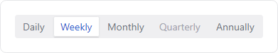
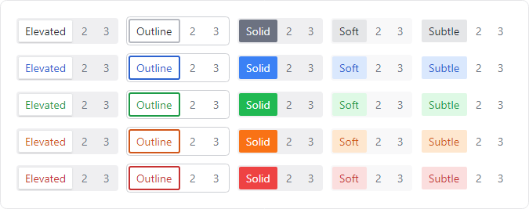

# SegmentedBar

A [SegmentedBar](xref:@ActiproUIRoot.Controls.SegmentedBar) allows a user to select a single item with support for fluent animations when changing selection.



*SegmentedBar with elevated theme and accent semantic color variant*

## Important Members

The [SegmentedBar](xref:@ActiproUIRoot.Controls.SegmentedBar) class has these important members:

| Member | Description |
|-----|-----|
| [Orientation](xref:@ActiproUIRoot.Controls.SegmentedBar.Orientation) Property | An `Orientation` value that indicates the direction in which items are arranged.  The default value is `Horizontal`. |
| [Spacing](xref:@ActiproUIRoot.Controls.SegmentedBar.Spacing) Property | The amount of space that appears between items. |

## Configuring Items

The [SegmentedBar](xref:@ActiproUIRoot.Controls.SegmentedBar) is a `SelectingItemsControl` for [SegmentedBarItem](xref:@ActiproUIRoot.Controls.SegmentedBarItem) controls.

Individual instances of [SegmentedBarItem](xref:@ActiproUIRoot.Controls.SegmentedBarItem) can be directly defined as the `ItemsSource` as shown below:

@if (avalonia) {
```xaml
xmlns:actipro="http://schemas.actiprosoftware.com/avaloniaui"
...

<actipro:SegmentedBar ... >
	<actipro:SegmentedBarItem>Daily</actipro:SegmentedBarItem>
	<actipro:SegmentedBarItem>Weekly</actipro:SegmentedBarItem>
	<actipro:SegmentedBarItem>Monthly</actipro:SegmentedBarItem>
	<actipro:SegmentedBarItem IsEnabled="False">Quarterly</actipro:SegmentedBarItem>
	<actipro:SegmentedBarItem>Annually</actipro:SegmentedBarItem>
	...
</actipro:SegmentedBar>
```
}

The `ItemsSource` can also be defined as non-[SegmentedBarItem](xref:@ActiproUIRoot.Controls.SegmentedBarItem) items.  In this scenario, each item is automatically wrapped in a [SegmentedBarItem](xref:@ActiproUIRoot.Controls.SegmentedBarItem) container with the original item as the `DataContext`.

## Themes and Semantic Color Variants



*SegmentedBar in the elevated, outline, solid, soft, and subtle themes showing neutral and semantic color variants*

The segmented bar control supports the `accent`, `success`, `warning`, and `danger` style class names for semantic variants.

The following control themes are also supported:
- [SegmentedBarBase](xref:@ActiproUIRoot.Themes.ControlThemeKind.SegmentedBarBase) - Base control theme used by several others.
- [SegmentedBarElevated](xref:@ActiproUIRoot.Themes.ControlThemeKind.SegmentedBarElevated) (`theme-elevated`) - Has an elevated appearance.
- [SegmentedBarOutline](xref:@ActiproUIRoot.Themes.ControlThemeKind.SegmentedBarOutline) (`theme-outline`) - Has an outline appearance.
- [SegmentedBarSoft](xref:@ActiproUIRoot.Themes.ControlThemeKind.SegmentedBarSoft) (`theme-soft`) - Has a soft fill appearance.
- [SegmentedBarSolid](xref:@ActiproUIRoot.Themes.ControlThemeKind.SegmentedBarSolid) (`theme-solid`) - Has a solid appearance.
- [SegmentedBarSubtle](xref:@ActiproUIRoot.Themes.ControlThemeKind.SegmentedBarSubtle) (`theme-subtle`) - Has a subtle appearance.

The following example demonstrates how to define a segmented bar using the outline theme and accent variant:

```xaml
xmlns:actipro="http://schemas.actiprosoftware.com/avaloniaui"
...
<actipro:SegmentedBar Classes="theme-outline accent" />
```

## Overflow Scrolling


*SegmentedBar with overflow scrolling active and scroll offsets at the beginning, middle, and end*

If there is not enough room to fully display a segmented bar, scroll buttons will automatically appear on the control's left/right sides (horizontal orientation) or the top/bottom sides (vertical orientation).

## Customize Appearance


*SegmentedBar with custom appearance showing pointer over effect*

Use standard properties like `CornerRadius`, `Padding`, `BorderThickness`, etc. to customize the basic appearance of the segmented bar.  For more advanced customizations, it may be necessary to modify the [SelectionTemplate](xref:@ActiproUIRoot.Controls.SegmentedBar.SelectionTemplate),
`ItemContainerTheme`, and/or [ScrollButtonTheme](xref:@ActiproUIRoot.Controls.SegmentedBar.ScrollButtonTheme).

The [SegmentedBar](xref:@ActiproUIRoot.Controls.SegmentedBar) control is responsible for rendering the **Track**, **Selection**, and **Scroll Buttons**.  The [SegmentedBarItem](xref:@ActiproUIRoot.Controls.SegmentedBarItem) controls are responsible for rendering the individual items on the track.

### Selection Element Template

When an item is selected, the **Selection** element is moved along the **Track** to the same size and location of the selected item, using fluent animations when enabled.  The **Selection** element is primarily responsible for rendering the selection background.

To customize the appearance of the **Selection** element, set the [SegmentedBar](xref:@ActiproUIRoot.Controls.SegmentedBar).[SelectionTemplate](xref:@ActiproUIRoot.Controls.SegmentedBar.SelectionTemplate) property to any `IDataTemplate`.

Any element can be used within the `IDataTemplate`, but a `Border` is commonly used.  The following example demonstrates how to render a colorful line below the selected item:

```xaml
xmlns:actipro="http://schemas.actiprosoftware.com/avaloniaui"
...
<actipro:SegmentedBar>

	<actipro.SegmentedBar.SelectionTemplate>
		<DataTemplate>

			<!-- This element will appear behind the selected item -->
			<Border
				Background="{actipro:ThemeResource ActiproBrandBrush}"
				CornerRadius="1"
				Height="{actipro:ScaledDouble 0.5}"
				Width="{actipro:ScaledDouble 3}"
				HorizontalAlignment="Center"
				VerticalAlignment="Bottom"
				/>

		</DataTemplate>
	</actipro.SegmentedBar.SelectionTemplate>

	...

</actipro:SegmentedBar>
```

### SegmentedBarItem Theme

The `ItemContainerTheme` can be set to any `ControlTheme` to customize the appearance of [SegmentedBarItem](xref:@ActiproUIRoot.Controls.SegmentedBarItem)
items within the [SegmentedBar](xref:@ActiproUIRoot.Controls.SegmentedBar).  Since the **Selection** element is primarily used to emphasize the selected item, a custom `ItemContainerTheme` is typically only used to provide pointer over effects or to alter the foreground of the selected item.

> [!IMPORTANT]
> The **Selection** element that highlights the current selection appears *behind* the selected [SegmentedBarItem](xref:@ActiproUIRoot.Controls.SegmentedBarItem), so it is important to use transparent backgrounds on selected items to allow the **Selection** element to be visible.

The following sample demonstrates how to define a custom theme for [SegmentedBarItem](xref:@ActiproUIRoot.Controls.SegmentedBarItem) which renders a neutral color line below unselected items on pointer over:

```xaml
xmlns:actipro="http://schemas.actiprosoftware.com/avaloniaui"
...
<actipro:SegmentedBar>

	<actipro:SegmentedBar.ItemContainerTheme>
		<ControlTheme TargetType="actipro:SegmentedBarItem" BasedOn="{actipro:ControlTheme SegmentedBarItemBase}">
			<Setter Property="Template">
				<ControlTemplate>
					<Panel>

						<!-- Primary control presentation (replicates default presentation) -->
						<Border
							Background="{TemplateBinding Background}"
							BorderBrush="{TemplateBinding BorderBrush}"
							BorderThickness="{TemplateBinding BorderThickness}"
							CornerRadius="{TemplateBinding CornerRadius}"
							Padding="{TemplateBinding Padding}"
							>
							<Panel actipro:BorderChildClipConverter.ClipToContainingBorder="True">
								<ContentPresenter x:Name="PART_ContentPresenter"
									Content="{TemplateBinding Content}"
									ContentTemplate="{TemplateBinding ContentTemplate}"
									HorizontalContentAlignment="{TemplateBinding HorizontalContentAlignment}"
									VerticalContentAlignment="{TemplateBinding VerticalContentAlignment}"
									/>
							</Panel>
						</Border>

						<!-- Custom indicator for pointer over (initially hidden) -->
						<Border x:Name="hoverBorder"
							Background="{actipro:ThemeResource Container5BorderBrush}"
							CornerRadius="1"
							Height="3"
							Width="16"
							HorizontalAlignment="Center"
							VerticalAlignment="Bottom"
							IsVisible="False"
							/>

					</Panel>
				</ControlTemplate>
			</Setter>

			<!-- Show indicator on pointer over for unselected items only -->
			<Style Selector="^:pointerover:not(:selected) /template/ Border#hoverBorder">
				<Setter Property="IsVisible" Value="True" />
			</Style>

		</ControlTheme>
	</actipro:SegmentedBar.ItemContainerTheme>

	...

</actipro:SegmentedBar>
```

### Scroll Button Theme

When overflow scrolling is required, **Scroll Buttons** appear on the edges of the control to allow scrolling in that direction.  The appearance of these buttons can be customized by setting the [SegmentedBar](xref:@ActiproUIRoot.Controls.SegmentedBar).[ScrollButtonTheme](xref:@ActiproUIRoot.Controls.SegmentedBar.ScrollButtonTheme) to a custom `ControlTheme`.

See the [ScrollableOverflowPresenter](../../shared/controls/scrollable-overflow-presenter.md) topic for important details on customizing the theme of the scroll buttons.

## Animation

Fluent animation in the control is enabled by default but can be disabled by setting the [IsAnimationEnabled](xref:@ActiproUIRoot.Controls.SegmentedBar.IsAnimationEnabled) property to `false`.

## Pseudo-classes

The following pseudo-classes are available and can be used when styling the controls:

### SegmentedBar

| Class | Description |
| ----- | ----- |
| `:horizontal` | Added when [Orientation](xref:@ActiproUIRoot.Controls.SegmentedBar.Orientation) is set to `Horizontal`. |
| `:vertical` | Added when [Orientation](xref:@ActiproUIRoot.Controls.SegmentedBar.Orientation) is set to `Vertical`. |

### SegmentedBarItem

| Class | Description |
| ----- | ----- |
| `:selected` | Added when [IsSelected](xref:@ActiproUIRoot.Controls.SegmentedBarItem.IsSelected) is set to `true`. |

## Theme Resources

The following theme resources are specifically available for customizing the appearance of the controls:

| Theme Resource | Description |
| ----- | ----- |
| [SegmentedBarItemCornerRadius](xref:@ActiproUIRoot.Themes.ThemeResourceKind.SegmentedBarItemCornerRadius) | The default `CornerRadius` for [SegmentedBarItem](xref:@ActiproUIRoot.Controls.SegmentedBarItem) and the [SegmentedBar](xref:@ActiproUIRoot.Controls.SegmentedBar).[SelectionTemplate](xref:@ActiproUIRoot.Controls.SegmentedBar.SelectionTemplate).
| [SegmentedBarItemPadding](xref:@ActiproUIRoot.Themes.ThemeResourceKind.SegmentedBarItemPadding) | The default [SegmentedBarItem](xref:@ActiproUIRoot.Controls.SegmentedBarItem).`Padding`. |
| [SegmentedBarCornerRadius](xref:@ActiproUIRoot.Themes.ThemeResourceKind.SegmentedBarCornerRadius) | The default [SegmentedBar](xref:@ActiproUIRoot.Controls.SegmentedBar).`CornerRadius`. |
| [SegmentedBarPadding](xref:@ActiproUIRoot.Themes.ThemeResourceKind.SegmentedBarPadding) | The default [SegmentedBar](xref:@ActiproUIRoot.Controls.SegmentedBar).`Padding`. |
| [SegmentedBarSpacing](xref:@ActiproUIRoot.Themes.ThemeResourceKind.SegmentedBarSpacing) | The default [SegmentedBar](xref:@ActiproUIRoot.Controls.SegmentedBar).[Spacing](xref:@ActiproUIRoot.Controls.SegmentedBar.Spacing).

[SegmentedBar](xref:@ActiproUIRoot.Controls.SegmentedBar) and [SegmentedBarItem](xref:@ActiproUIRoot.Controls.SegmentedBarItem) also use additional common theme resources consistent with the current control theme and semantic color variant (e.g., [Container1BackgroundBrush](xref:@ActiproUIRoot.Themes.ThemeResourceKind.Container1BackgroundBrush), [ButtonBackgroundBrushSoft](xref:@ActiproUIRoot.Themes.ThemeResourceKind.ButtonBackgroundBrushSoft), [ControlForegroundBrushOutlineAccent](xref:@ActiproUIRoot.Themes.ThemeResourceKind.ControlForegroundBrushOutlineAccent), and many more.)

See the [Theme Assets](../../themes/theme-assets.md) topic for more details on working with theme resources.